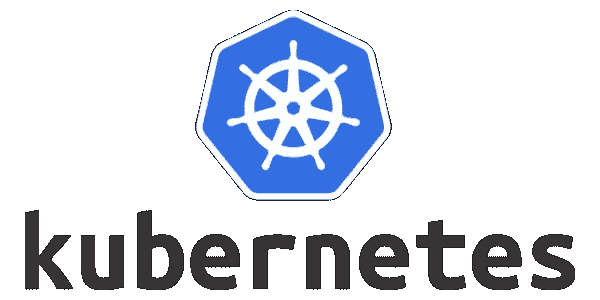
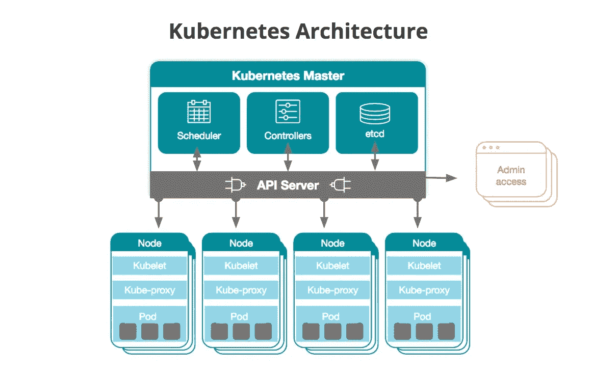
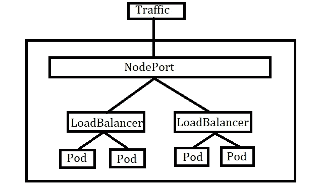

# Kubernetes 基础 5 分钟

> 原文：<https://blog.devgenius.io/kubernetes-basics-in-5-minutes-491a6d67448d?source=collection_archive---------7----------------------->

进入 kubernetes 的简单指南



# 什么是 Kubernetes

Kubernetes 是容器编排引擎。kubernetes 的主要目的是管理容器部署。目前，所有应用都在采用微服务架构，而不是整体架构。实现微服务架构的一种方法是通过容器化技术。众所周知，Docker 革新了容器技术。所有的开发者都使用容器来构建他们的应用程序。因此，为了大规模管理这些容器，我们使用 kubernetes。

Kubernetes 最初由谷歌设计，现在由云原生计算基金会维护。

# Kubernetes 的主要工作

1.  扩展部署
2.  负载平衡
3.  监视
4.  自动化推出和回滚

# 练习 Kubernetes 的方法

1.  在云，GKE(谷歌 Kubernetes 引擎)在谷歌云。
2.  Minikube :-要安装 [*点击这里*](https://kubernetes.io/docs/tasks/tools/install-minikube/)
3.  和 Kubernetes 一起玩

我在用 Minikube。在你的笔记本电脑上安装 minikube 很容易。

# Kubernetes 的结构

Kubernetes 创造了一个集群。集群包含两种类型的组件:-

1.  主网点
2.  工作节点

我们在工作者节点中部署我们的应用程序。工作节点中的部署由主节点控制。

# **kubectl 命令**

这是一个用于控制集群的 CLI 命令。我们可以使用这个命令与集群进行交互。

# 什么是节点和 pod？

节点只不过是计算实例。这些计算实例包含 pod。

**Pods** 被认为是 kubernetes 集群中的基本执行单元。pod 包含运行应用程序的容器。一个节点可以有多个单元，一个单元可以有多个容器。但是我们通常在一个 pod 中只运行一个容器。

所以基本上，kubernetes 的工作是管理豆荚。我们可以用 kubectl 命令控制豆荚。

## 创建窗格

在 kubernetes 中有两种方法可以创建任何东西。它们是通过使用 kubectl 命令和 yaml 文件实现的。

例如，要使用 kubectl 创建一个运行 httpd 容器的 pod，命令是

```
kubectl run <podname> --image=httpd
```

对 YAML 文件也可以这样做

```
apiVersion: v1
kind: Pod
metadata:
  name: mypod1
spec:
  containers:
  - name: httpd
    image: httpd
```

用任何名称保存文件。在这里，我将它保存为 pod.yaml

```
kubectl create -f pod.yaml
```

这样，我们就可以创建一个在其中运行 httpd 容器的 pod。

现在我们来谈谈**主节点**的配置。

> **注**:主节点通常称为主节点，其他节点称为工作节点或简称节点。

# 主网点

主节点由许多组件组成。主节点也称为控制平面。他们是

1.  kube-API-服务器
2.  kube 控制器
3.  kube-调度程序
4.  etcd
5.  云控制器

## **kube-api-server**

它是主节点中的主要组件。此组件连接到主控形状中的其他组件。kube-api-server 监听 kubectl 命令，然后将其传递给所需的组件。

## kube-调度程序

该组件负责部署 pod。它计划节点中的 pod 部署。

## kube 控制器

它的基本功能是监控吊舱。其中有许多控制器，如控制节点数量的节点控制器、维护所需 pod 副本的复制控制器。

## etcd

这是一项存储服务。它包含集群的所有元数据。它可以充当集群数据的备份存储。

## 云控制器

它与云交互并继承它们的特定功能。云控制器管理器允许您将集群链接到云提供商的 API，并允许您从云管理集群。

# 工作节点组件

1.  库伯莱
2.  kube 代理

## 库伯莱

要运行一个 pod，我们需要在一个节点中安装 kubelet。kubelet 在一个节点中启动和维护 pod。

## kube 代理

它负责一个节点中各单元之间的联网。它的主要功能是为 pod 提供负载平衡



库伯内特建筑

因为我们知道主节点和工作节点的细节，所以我们了解部署在节点上的对象的类型。

# Kubernetes 对象

kubernetes 对象的类型

1.  复制控制器
2.  复制集
3.  部署
4.  状态集
5.  达蒙塞特
6.  乔布斯

## 复制控制器

它管理一个节点中的单元数量。如果一个单元出现故障，复制控制器会创建另一个单元。它用标签来检测豆荚。他们不再是首选。相反，使用复制集。

## 复制集

它们是复制控制器的修改版本。它们使用设置属性来选择 pod，而复制控制器使用相等属性。我们可以使用集合属性来编写表达式，这样更加灵活和方便。所以使用了复制集。

## 部署

部署使用副本集。除此之外，它还有许多其他功能。他们负责推出和回滚。他们维护版本控制系统。

## 状态集

如果需要部署维护本地状态的应用程序，StatefulSet 是更好的选择。StatefulSet 具有唯一的持久身份，具有稳定的网络身份和持久的磁盘存储。

## 达蒙塞特

如果您需要在集群中的所有节点或一组节点上运行某些 pod，请使用 DaemonSet。DaemonSet 确保特定的 Pod 始终在所有节点或部分节点上运行。

## 乔布斯

作业控制器创建运行任务所需的一个或多个窗格。任务完成后，Job 将终止所有这些 pod。此外，我们还有一个 CronJob，它根据时间表运行 Pods。

在所有对象中，使用最多的是部署对象。下面是一个简单的部署对象的 YAML 文件。

```
apiVersion: apps/v1
kind: Deploymentmetadata:
  name: httpd
  labels:
    dc: IN
    env: devspec:
  replicas: 3
  selector:
    matchLabels:
      env: dev
  template:
    metadata:
      name: pod1
      labels:
        env: dev
    spec:
      containers:
      - name: mycon1
        image: httpd
        ports:
        - containerPort: 80
```

让我们把它保存为 **web.yaml** 。要创建文件，我们使用命令

```
kubectl apply -f web.yaml
```

1.  kubectl create = >创建一个 pod
2.  kubectl apply = >如果不存在，则创建一个 pod，如果已经创建，则更新一个 pod。

这些是 kubernetes 对象，用于在节点上部署 pod。

# kubernetes 的服务

我们在 kubernetes 使用网络服务。有三种类型的服务。他们是

1.  ClusterIp
2.  节点端口
3.  负载平衡器

## 负载平衡器

这是一种用于连接节点内所有单元的服务。它在节点中的 pod 之间分配流量。它选择带有标签的豆荚。因此，如果我们添加一个具有相同标签的新 pod，它会自动归入负载平衡器服务。

## ClusterIP

这是默认的 kubernetes 服务。我们使用该服务来连接集群中的所有单元。可以使用 kube-proxy 访问它。

## 节点端口

该服务向外部客户端开放节点。它为一个节点打开一个特定的端口，并将所有流量发送给该节点中的服务(负载平衡器)。您只能使用 30000–32767 端口。

您可以使用 file 或 kubectl expose 命令创建服务。



# kubectl 常见命令

1.  kubectl get
2.  kubectl 创建
3.  kubectl 描述

**例子**

```
kubectl get pods
kubectl get deployments
kubectl get serviceskubectl describe pods <podname> -o=wide
kubectl get pods <podname> -o=yaml
kubectl describe services 
```

[**点击此处**](https://kubernetes.io/docs/reference/kubectl/cheatsheet/) 查看 kubectl cheatsheet。

如果你喜欢我的文章，请分享。💖