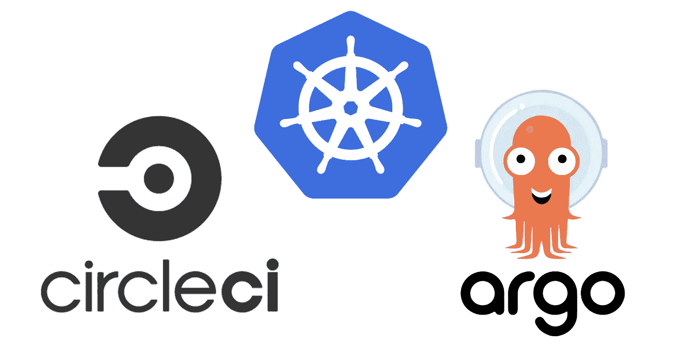
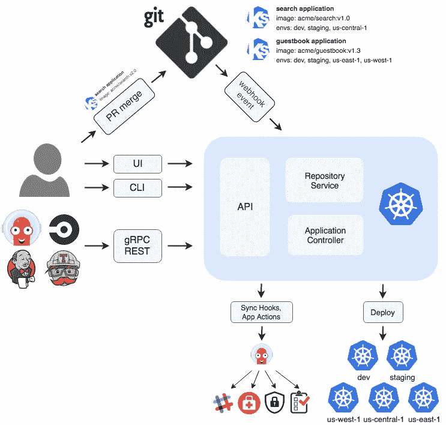
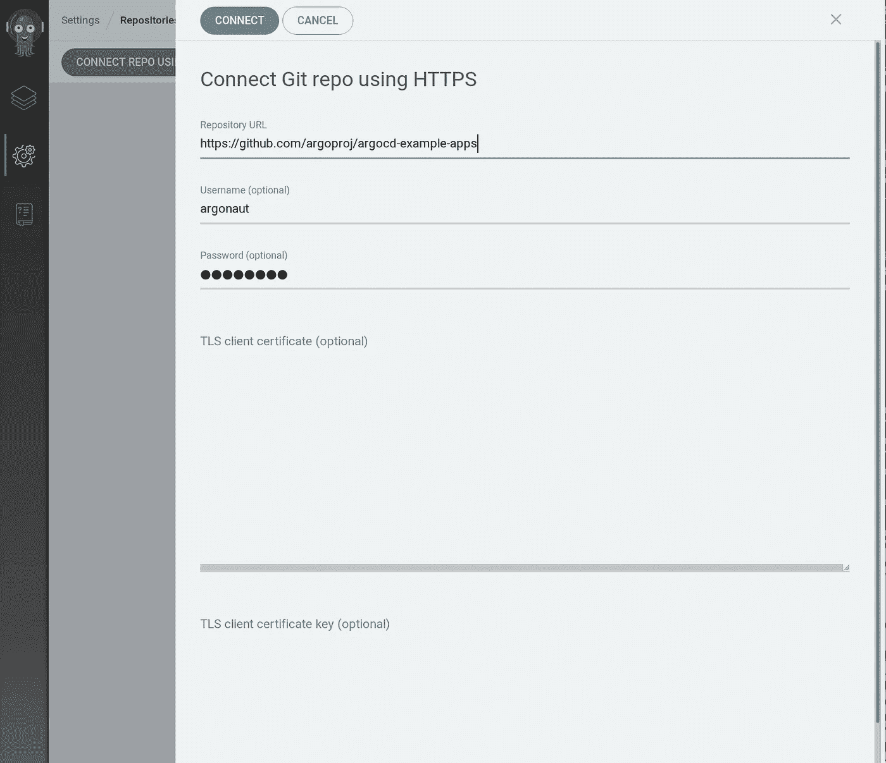
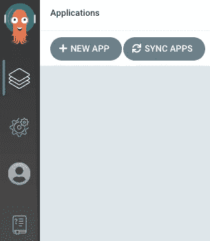
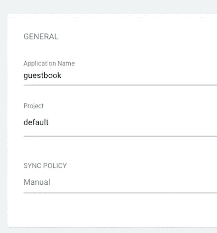
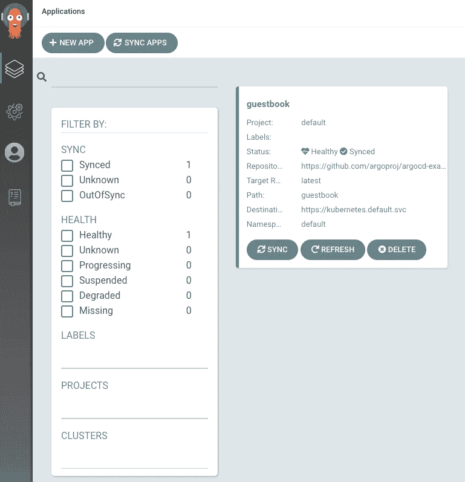
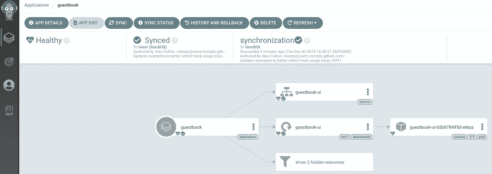

# 带有 CircleCI 和 ArgoCD 的 Kubernetes CI/CD

> 原文：<https://blog.devgenius.io/kubernetes-ci-cd-with-circleci-and-argocd-6473b0acdc1a?source=collection_archive---------0----------------------->

一个端到端的设置，使用 GitOps 原则将应用程序声明性地部署到 Kubernetes。



近年来，DevOps 的一个主要趋势是在 Kubernetes 上采用 GitOps 来管理基础设施代码(IaC)和云原生应用程序。GitOps 最初是由 [WeaveWorks](https://www.weave.works/) 引入的，作为一种通过 Git 声明性地配置和管理基础设施和应用程序的方式。虽然 GitOps 是一种自以为是的 CI/CD 流程方法，但 IaC 背后的基本思想和 Kubernetes 的融合特性与 GitOps 非常契合。在本帖中，我们将查看端到端 CI/CD 管道的演示设置，并根据您的团队规模、角色和需求讨论一些重要的考虑事项。

*注:本指南使用 CircleCI 和 ArgoCD，但工具可以互换，以建立 GitOps 驱动的 CI/CD 管道(如 JenkinsX、Spinnaker)*

[](https://www.weave.works/technologies/gitops/) [## GitOps 您需要知道的内容

### GitOps 是 Kubernetes 集群管理和应用交付的一种方式。它通过使用 Git 作为单一来源来工作…

www.weave.works](https://www.weave.works/technologies/gitops/) 

# 端到端 CI/CD 体系结构

总体而言，CI/CD 渠道将涵盖以下步骤:

1.  开发人员将代码提交给 Git repo(例如 Github/Bitbucket/Gitlab)。
2.  CircleCI 贯穿 CI 工作流程的各个步骤(即安全审计、林挺、测试等)。
3.  Docker 容器被创建并被推送到容器注册处(例如，GCR 的 Docker Hub，ECR)。
4.  Kubernetes 清单被生成并提交给 ArgoCD 监视的一个单独的 repo。
5.  ArgoCD 检测变化，并向已配置的 Kubernetes 集群部署新的应用程序/基础设施。



图片来源: [ArgoCD](https://argoproj.github.io/argo-cd/operator-manual/architecture/)

# CI 注意事项

为了使本指南适用于其他 CI 工具，而不是关注特定于 CircleCI 的语法，我将为 CI 管道提供一些重要的考虑因素，以适应 GitOps CD 操作。使用 CircleCI 的具体例子，可以跟着这个[优秀指南](https://www.virtualthoughts.co.uk/2020/06/24/end-to-end-automation-with-circleci-and-argocd-part-2-circleci-configuration/)作者 [David-VTUK](https://github.com/David-VTUK/) 。

您的 CI 管道首先要考虑的是如何分离源代码/应用程序代码和基础设施。ArgoCD 建议保留两个独立的 repos :一个用于应用程序代码，另一个用于清单。使用单独的 Git 存储库的好处是:

1.  应用程序和配置代码之间有明确的分离。当您希望仅修改清单(例如，添加新的 env 变量或更改配置映射)时，这可以防止整个 CI 构建运行，这可能需要很长时间。
2.  如果您有一个单独的生产工程/SRE 团队负责部署，您可以分离访问权限，并拥有一个更清晰的审核日志。
3.  有些应用程序可能作为一个单元部署，或者具有独立的组件(例如 ELK stack、Prometheus + Grafana)。独立的配置回购允许多个应用程序回购独立地推送更改，但允许 CD 工具监控单个回购并同时部署所有组件。

然而，确切的分离点取决于您的团队的组成和用于打包 Kubernetes 清单的工具(例如 Helm、Kustomize、Ksonnet 等)。在 Leverege，我们没有专门的 SRE 团队负责部署。每个开发人员负责使用内部工具创建 Helm 模板，以基于本地配置文件引导清单。在我们的例子中，CircleCI 构建 Docker 映像，打包 Helm 文件，并将其推送到我们的私有 ChartMuseum 实例。另一个 mono-repo 存储每个环境/集群的`values.yaml`文件，并触发部署过程。拥有专用 sre 的大型团队可以选择在每个团队或产品的专用存储库中跟踪配置文件，Helm 文件也在该存储库中。

最后，尽管 GitOps 的目标之一是不变性，但为必要的更改留一些自由也是很重要的。在 Kubernetes 上，这通常与动态值有关(即水平自动缩放或资源请求的副本数量)。例如，如果您依赖垂直 Pod Autoscaler 来动态更改 CPU/内存请求和限制，请不要通过 Git 跟踪这些字段，否则应用程序将会持续不同步。这类似于在 Terraform 中忽略所需的节点数，以允许集群自动伸缩来响应 Kubernetes 工作负载。

# 设置 ArgoCD

ArgoCD 是一个流行的云原生 CD 工具，被 Intuit、New Relic、NVIDIA 和更多的 T2 使用。随着去年来自 WeaveWorks 的 Flux CD 与 ArgoCD 的联手，ArgoCD 成为不需要 Spinnaker 所有健壮功能的用户的一个很好的工具。

## 装置

安装 ArgoCD 非常简单。使用 Github 上的[清单或者社区维护的](https://raw.githubusercontent.com/argoproj/argo-cd/stable/manifests/install.yaml)[舵图](https://github.com/argoproj/argo-helm/tree/master/charts/argo-cd):

```
$ kubectl create namespace argocd 
$ kubectl apply -n argocd -f https://raw.githubusercontent.com/argoproj/argo-cd/stable/manifests/install.yaml
```

在 GKE 上，需要一个额外的管理员角色来创建新的集群角色:

```
$ kubectl create clusterrolebinding cluster-admin-binding --clusterrole=cluster-admin --user="$(gcloud config get-value account)"
```

要与 ArgoCD 服务器交互，您需要首先下载 CLI(使用`brew`或[直接从 GitHub](https://github.com/argoproj/argo-cd/releases) 下载):

```
$ brew install argocd
```

## 初始设置

ArgoCD 服务器公开 gRPC(用于 CLI)和 HTTPS(用于 UI)。要访问服务器，您可以通过入口端口转发或配置 ArgoCD:

```
$ kubectl port-forward svc/argocd-server -n argocd 8080:443
```

由于我们将 Traefik 与 Cert Manager 一起使用，因此我们部署了以下 IngressRoute，并在`argocd-server`部署中添加了`insecure`标志(*重要提示:如果您使用 Traefik，请在更新部署之前记录 argocd-server 的初始 pod 名称，因为这是默认密码*):

```
apiVersion: traefik.containo.us/v1alpha1
kind: IngressRoute
metadata:
  name: argocd-server
  namespace: argocd
spec:
  entryPoints:
    - websecure
  routes:
    - kind: Rule
      match: Host(`argocd.example.com`)
      priority: 10
      services:
        - name: argocd-server
          port: 80
    - kind: Rule
      match: Host(`argocd.example.com`) && Headers(`Content-Type`, `application/grpc`)
      priority: 11
      services:
        - name: argocd-server
          port: 80
          scheme: h2c
  tls:
    secretName: <my-wildcard-cert>
```

*注:ArgoCD 还支持*[*ingress-nginx*](https://argoproj.github.io/argo-cd/operator-manual/ingress/#kubernetesingress-nginx)*和*[*AWS ALB/ELB*](https://argoproj.github.io/argo-cd/operator-manual/ingress/#aws-application-load-balancers-albs-and-classic-elb-http-mode)

一旦服务器通过入口暴露或转发到本地主机，获取自动生成的密码:

```
$ kubectl get pods -n argocd -l app.kubernetes.io/name=argocd-server -o name | cut -d'/' -f 2
```

并使用用户名`admin`登录(如果你的 ingress 不支持 HTTPS/gRPC，添加以下标志`--grpc-web`):

```
$ argocd login <server>
```

最后，通过以下方式更新默认密码:

```
$ argocd account update-password
```

## 添加集群

由于 ArgoCD 很可能安装在一个实用集群上(在 Leverege，它运行在托管 Vault、Chart Museum 和 Prometheus/Grafana 的同一个集群上)，ArgoCD 首先需要访问外部集群。ArgoCD 将服务帐户(`argocd-manager`)安装到`kube-system`名称空间中，并绑定到管理集群角色:

```
$ argocd cluster add <context-name> 
```

对于内部集群，Kubernetes API 服务器地址可以设置为`[https://kubernetes.default.svc](https://kubernetes.default.svc)`，而不必绑定服务帐户。通过重复此步骤，您可以添加 ArgoCD 有权部署的所有集群。目前，多集群部署(即将同一应用部署到一个管道中的多个集群)尚未得到支持，但正在 [ApplicationSet CRD](https://github.com/argoproj-labs/applicationset) 的积极开发中。

## 连接到 Git Repo

除非包含清单的存储库是公共的，否则 ArgoCD 需要首先向私有存储库进行身份验证。

为您的 Git 托管服务生成令牌:

*   [Github](https://help.github.com/en/articles/creating-a-personal-access-token-for-the-command-line)
*   [Gitlab](https://docs.gitlab.com/ee/user/project/deploy_tokens/)
*   [比特桶](https://confluence.atlassian.com/bitbucketserver/personal-access-tokens-939515499.html)

然后通过 CLI 添加回购:

```
$ argocd repo add https://github.com/argoproj/argocd-example-apps --username <username> --password <token>
```

或者通过 UI: `Settings/Repositories > Connect Repo using HTTPS`



图片来源: [ArgoCD](https://argoproj.github.io/argo-cd/user-guide/private-repositories/)

## 创建 ArgoCD 应用程序

最后，我们可以部署我们的应用程序。如果您没有准备好测试的应用程序或 Git repo，您可以从 ArgoCD 的示例应用程序中进行选择:

*   [平原 YAML](https://github.com/argoproj/argocd-example-apps/blob/master/guestbook)
*   [Ksonnet](https://github.com/argoproj/argocd-example-apps/blob/master/ksonnet-guestbook)
*   [舵](https://github.com/argoproj/argocd-example-apps/blob/master/helm-guestbook)
*   [Jsonnet](https://github.com/argoproj/argocd-example-apps/blob/master/jsonnet-guestbook)
*   [草泽](https://github.com/argoproj/argocd-example-apps/blob/master/kustomize-guestbook)

首先，从用户界面点击`New App`:



图片来源: [ArgoCD](https://argoproj.github.io/argo-cd/getting_started/)

给应用命名，选择`Default`项目，并选择同步策略(自动或手动)。对于生产集群，您还可以创建一个单独的项目(通过`Settings > Projects`)来限制对集群资源和名称空间的访问。



图片来源: [ArgoCD](https://argoproj.github.io/argo-cd/getting_started/)

接下来，用 Git 存储库 URL 和路径配置`Source`,以及选择要部署到的集群和名称空间的`Destination`。

一旦配置了应用程序，就可以同步(部署)应用程序了。在用户界面中，点击`Sync`，ArgoCD 会将更改应用到集群中。



图片来源: [ArgoCD](https://argoproj.github.io/argo-cd/getting_started/)

当同步成功时，应用程序会将其状态从`OutOfSync`更改为`Healthy`:



图片来源: [ArgoCD](https://argoproj.github.io/argo-cd/getting_started/)

如果您喜欢视频演示，您可以观看 10 分钟的快速演示(在 1:04 到 9:57 之间):

# 其他考虑

尽管 CircleCI 和 ArgoCD 为您的 CI/CD 管道提供了大量功能，但与任何软件一样，随着使用量的增加，还有一些其他考虑事项需要与您的团队讨论:

1.  不要依靠部署失败来验证清单。至少，在 CI 过程中使用林挺工具(例如`helm lint`)测试配置代码。开发人员也可以使用`helm template`等工具手动验证正确的值。
2.  当涉及到 GitOps 时，秘密管理是棘手的。ArgoCD 与最流行的解决方案(例如 [Bitnami Sealed Secrets](https://github.com/bitnami-labs/sealed-secrets) 、[go daddy Kubernetes External Secrets](https://github.com/godaddy/kubernetes-external-secrets)、 [External Secrets Operator](https://github.com/ContainerSolutions/externalsecret-operator) 、 [Hashicorp Vault](https://www.vaultproject.io/) 、 [Banzai Cloud Bank-Vaults](https://github.com/banzaicloud/bank-vaults) 、 [Helm Secrets](https://github.com/futuresimple/helm-secrets) 、[Kustomize secret generator plugins](https://github.com/kubernetes-sigs/kustomize/blob/fd7a353df6cece4629b8e8ad56b71e30636f38fc/examples/kvSourceGoPlugin.md#secret-values-from-anywhere)、 [aws-secret-operator](https://github.com/mumoshu/aws-secret-operator) 、 [KSOPS](https://github.com/viaduct-ai/kustomize-sops#argo-cd-integration) )一起工作
3.  随着应用数量的增长，引导新集群成为一项挑战。ArgoCD 通过应用模式 的 [**应用提供解决方案，其中一个 ArgoCD 应用包含子应用。如果有一个逻辑分组，这种模式非常有效。否则，在支持多集群部署之前，您必须编写一些脚本来通过 CLI 以编程方式创建管道。**](https://argoproj.github.io/argo-cd/operator-manual/cluster-bootstrapping/)
4.  最后，别忘了备份 ArgoCD 数据。即使所有的配置都被登记到 Git 中，如果 ArgoCD 关闭，从备份导入然后运行所有管道来重新创建会更容易。