# Kubernetes —创建和部署容器化的应用程序

> 原文：<https://blog.devgenius.io/kubernetes-creating-and-deploying-a-containerized-app-c991448f1ba8?source=collection_archive---------6----------------------->

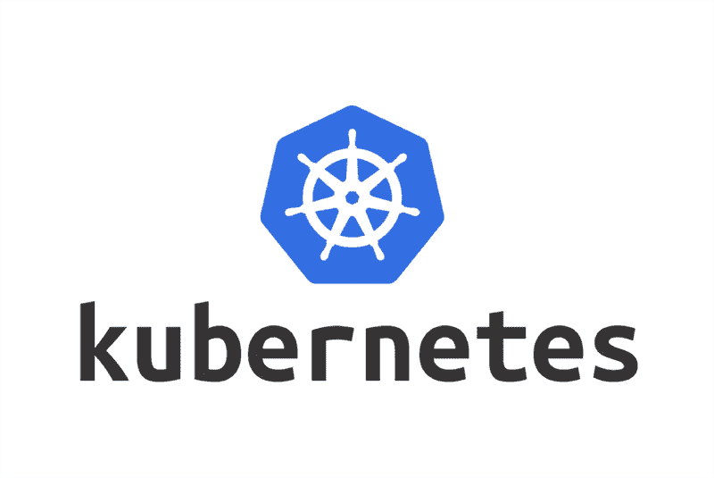

许多开发人员听到“谷歌云平台”时会感到困惑，就像我第一次听说*时一样。这并不意外，因为即使你参观了 cloud.google.com 的，你也无法完全理解这个平台的海量内容和能力。一方面，这凸显了云计算服务的*潜力*，但这也使得新手在没有帮助的情况下几乎不可能开始使用该平台。*

*那么，为什么不今天就和我一起开始你的旅程呢？我们将共同努力阐明所有的步骤和程序，到本系列结束时，您将对自己的云计算技能更有信心，谁知道呢，您甚至可以开始指导像您一样的其他迷失的灵魂！*

*在本教程中，我们将创建一个容器化的 web 应用程序，在本地测试它，然后将其部署到 Google Kubernetes 引擎(GKE)集群。所以，拿起一杯咖啡，为编码会议做好准备吧！*

## *什么是 Kubernetes？我们为什么需要它？*

*Kubernetes 是谷歌在 2014 年推出的。你们中的许多人可能对 Kubernetes 这个名字的来源感到好奇，它也被称为 ***K8s*** ，这是一个源于字母“K”和“s”之间的八个字母的首字母缩写词，它源于一个希腊词，意思是“*飞行员*或“*管弦乐手*”——现在它的标志已经有意义了。根据[官方定义](https://kubernetes.io/docs/concepts/overview/what-is-kubernetes/)，*“Kubernetes 是一个可移植的、可扩展的、开源的平台，用于管理容器化的工作负载和服务，方便了声明式配置和自动化”*。换句话说，它允许我们管理 ***集群****容器化应用*和*服务*。*

****云原生应用*** 是独立的轻量级容器，可以根据需求快速扩展。我们可以通过将所有内容封装在一个 ***容器*** (比如 Docker 容器)中，将应用程序及其依赖项与底层基础设施隔离开来。这允许我们在任何安装了容器运行时引擎的环境中运行容器化的应用程序。这就是 Kubernetes 发挥作用的地方。Kubernetes 中的 ***容器编排*** 非常重要，因为它们控制着容器的生命周期。这就是为什么在处理云原生应用时，Kubernetes 如此重要和有价值。*

## *创建 Web 应用程序*

*要遵循这个指南，你首先需要一个谷歌云账户。幸运的是，谷歌云提供了 90 天的免费试用期*，以及 300 美元的免费云计费信用，以探索和评估其产品和服务。谁还能要求更多呢？继续创建一个新帐户，然后返回到此页面继续学习。**

**对于本教程，我们将使用 ***云壳编辑器*** 作为我们的开发环境。Cloud Shell 是一个免费的预加载在线环境，通过命令行访问来管理您的基础架构，并提供一个用于云开发的在线代码编辑器。**

**使用默认的云外壳体验，在启动时会创建一个预配置的计算引擎虚拟机，该虚拟机具有基于 Debian 的 Linux 操作系统。您工作的环境是一个运行在虚拟机上的 ***Docker 容器*** 。当您的云 Shell 会话处于活动状态时，实例会持续存在；一小时不活动后，您的会话将被终止，虚拟机将被丢弃。**

**打开云壳，点击**页面右上方的 ***激活云壳*** 按钮。**当您首次使用云壳执行 Google Cloud API 请求或使用需要凭据的命令行工具时，云壳会通过***‘授权云壳’***对话框提示您。要授权该工具使用您的凭据拨打电话，请单击*授权*。**

**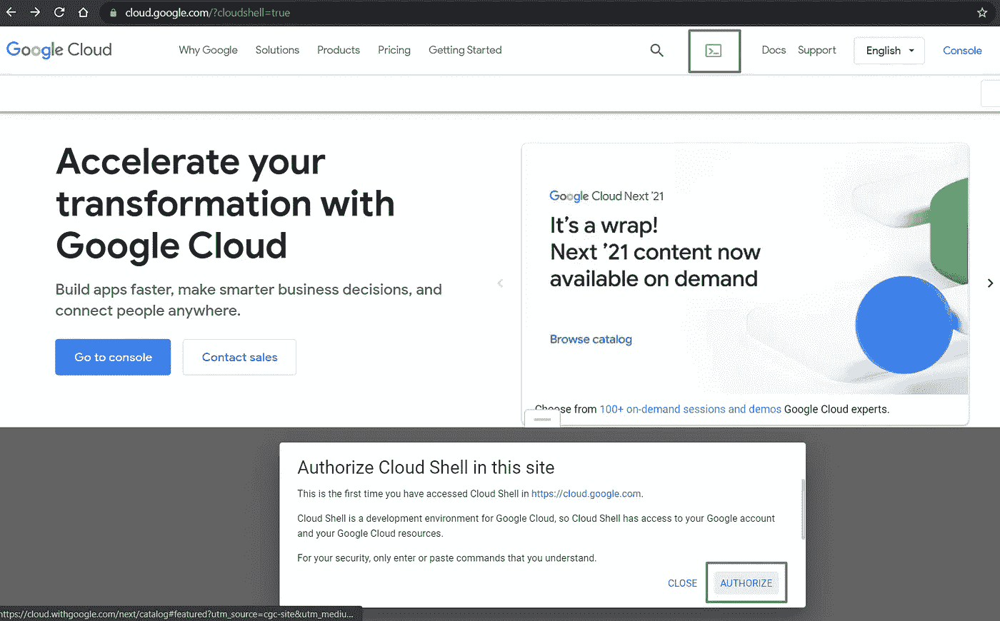**

**激活和授权云外壳**

**点击 ***打开编辑器*** 打开云壳编辑器。**

**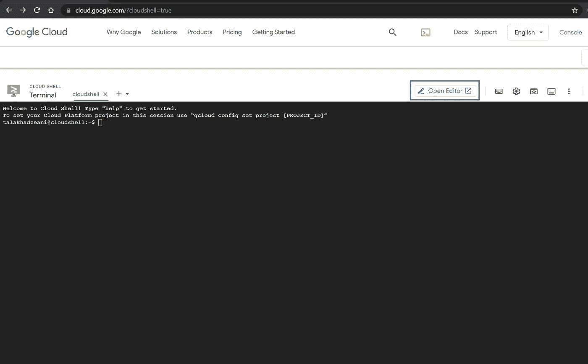**

**打开云壳编辑器**

**从状态栏启动 ***云代码菜单*** ，选择 ***新应用*** 。**

**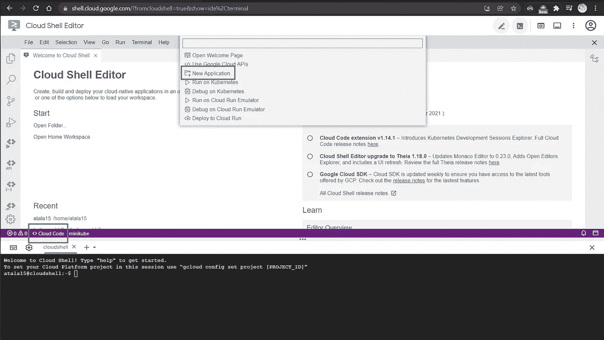**

**从云代码菜单启动新应用程序**

**选择 ***Kubernetes 应用*** 选项作为样本 app 的类型。从示例 Kubernetes 应用程序列表中，选择***Java:Hello World***选项，最后，为您的应用程序位置选择一个文件夹，然后单击 ***创建新应用程序*** 。**

**云壳编辑器为你的程序创建一个新的工作空间。通过*浏览器视图*，你可以在应用重新加载后访问它。“Hello World”项目的结构相对简单，只有一个主类。它由单个 ***部署*** 及其关联的 ***服务*** 。部署中包含一个 ***web 服务器*** ，呈现一个 ***基础网页*** 。您可以看一下这些类及其基本功能，但是，详细探究它们超出了本教程的范围。**

**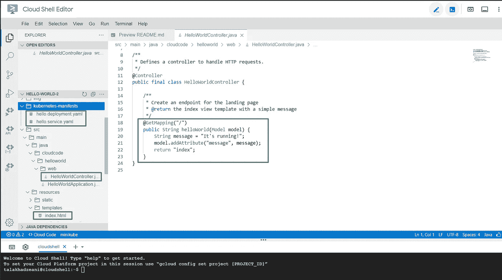**

**“Hello World”项目的结构**

## **构建和测试应用程序**

**现在我们已经创建了我们的应用程序，我们可以在*的 ***本地 Kubernetes 集群*** 中运行它。在您的终端中，运行以下命令启动本地 minikube 集群:***

```
**minikube start**
```

**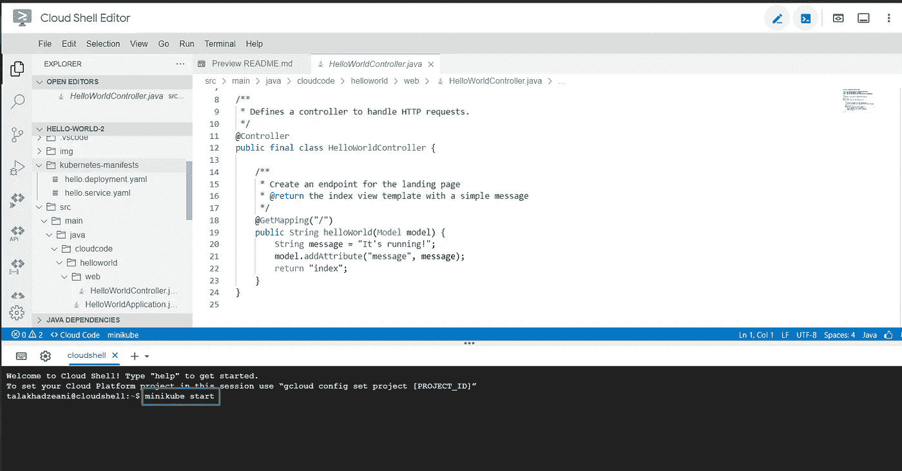**

**启动本地 Kubernetes 集群**

**设置集群后，将显示以下消息:**

**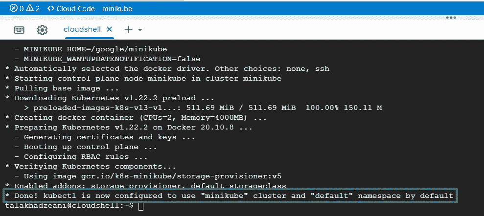**

**成功设置集群**

**接下来，我们将构建并运行这个应用程序。从状态栏启动 ***云代码菜单*** ，选择 ***在 Kubernetes*** 上运行，然后确认要使用 ***minikube 上下文*** 。**

**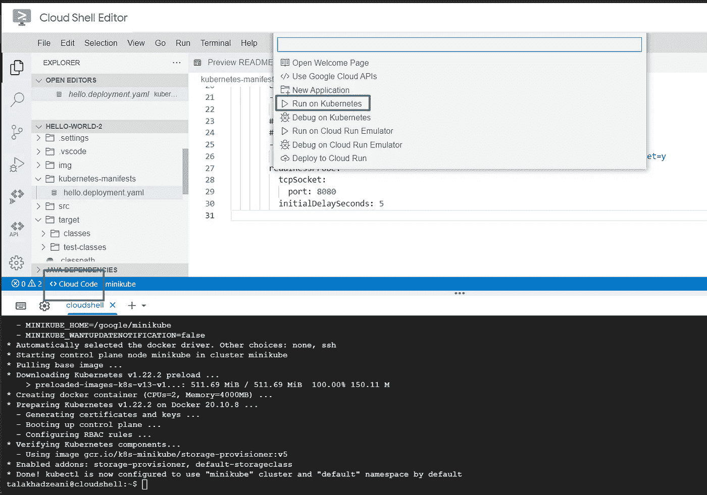**

**在 minikube 环境中运行 Kubernetes 上的应用程序**

*****输出面板*** 显示应用构建和部署的进度:**

**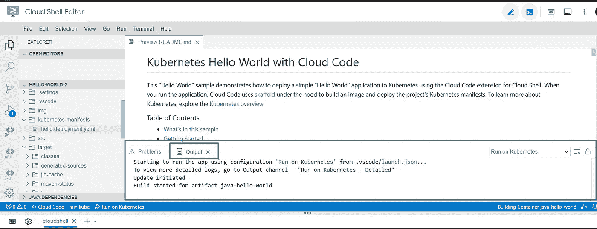**

**输出面板**

**你的应用程序构建完成后，这需要几分钟的时间，你可以使用显示在输出面板中的 ***链接*** 来启动它。**

**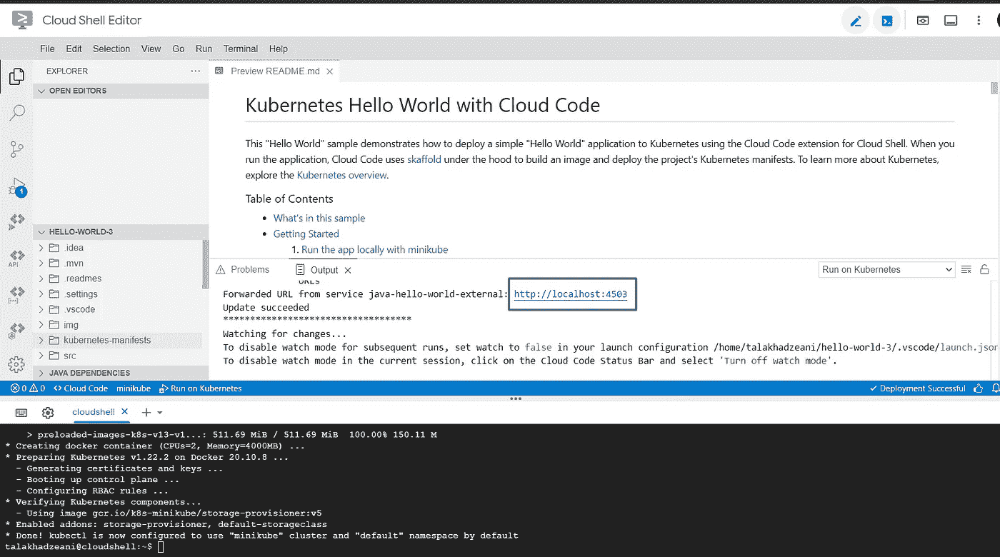**

**启动应用程序的链接**

**恭喜你！你刚刚使用*云代码*在 *Kubernetes* 上运行了你的 ***第一个应用*** 。**

## **修改应用程序**

**要查看 *Hello World* app 的组成，请参考其 ***readme.md*** 文件中的图表。概括地说，它包括:**

*   **一个基本的***hello world controller***web 应用程序，返回一个模板化的“它正在运行！”回复所有收到的请求。**

**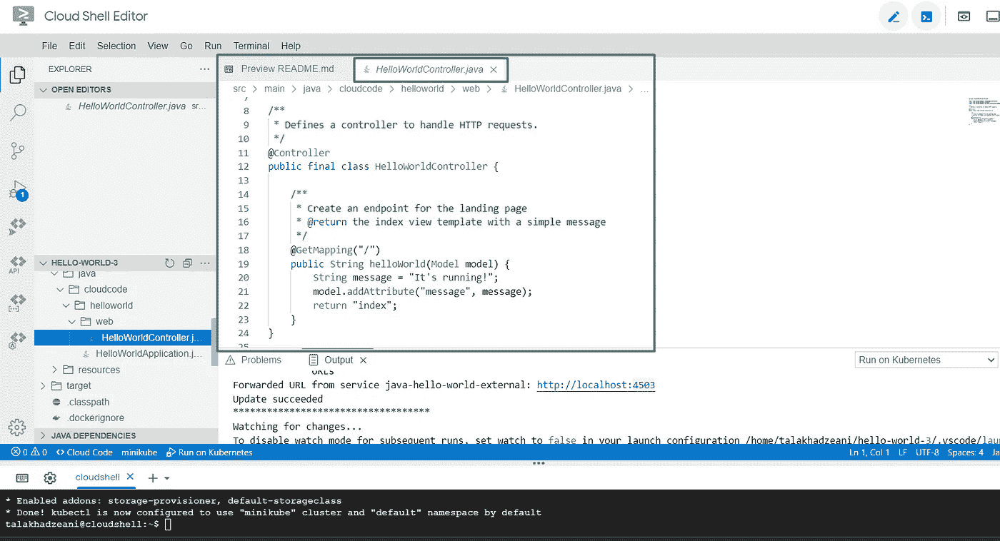**

**HelloWorlController 类**

*   **一个负载平衡器服务***hello . Service . YAML***，通过描述一个 Kubernetes 服务来公开应用。**

**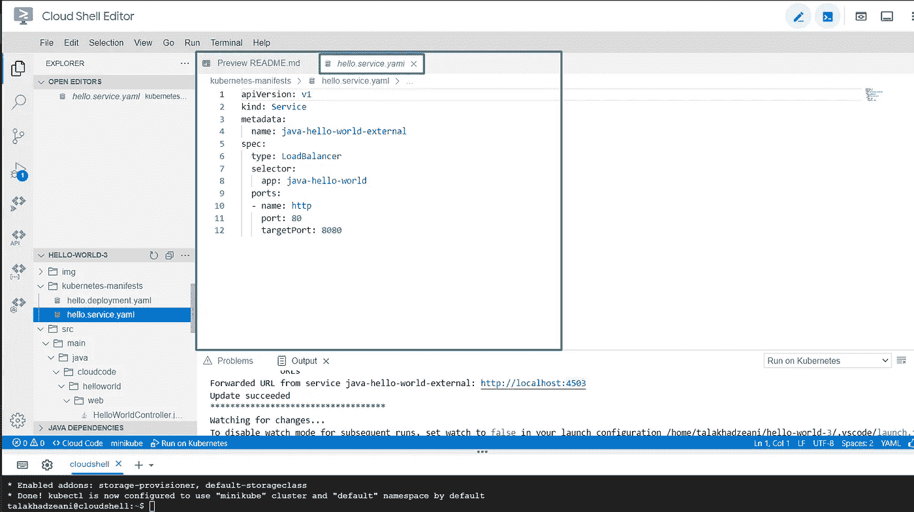**

**hello.service.yaml 文件**

**我们可以修改我们的 HelloWorldController 来打印“它被重新部署了！”。文件自动保存*。***

***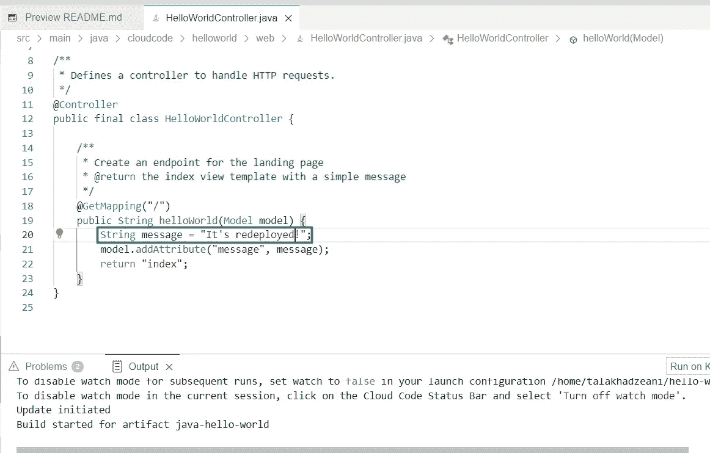***

***修改 HelloWorldController***

***使用“输出”面板，您可以在应用程序重建时监控其进度。应用程序完成构建和部署后，通过单击输出面板中的链接或刷新打开应用程序的选项卡来启动应用程序。***

## ***查看应用程序日志***

***有一个非常方便的功能叫做 ***日志查看器*** 来监控你的应用程序运行时的日志。你可以通过打开 ***命令面板*** *(Ctrl + Shift + P)* 然后输入 ***云代码:查看日志*** 来启动它。***

**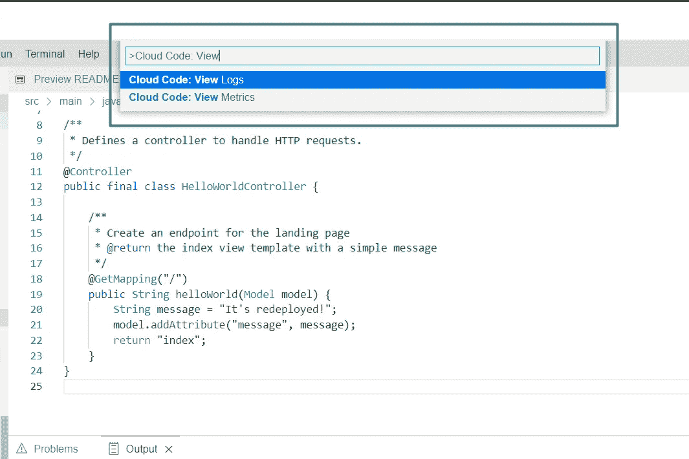**

**从命令面板启动应用程序日志**

**指定 ***部署*** 或 ***Pod*** 过滤器来查看我们的应用程序 *java-hello-world* 的日志:**

**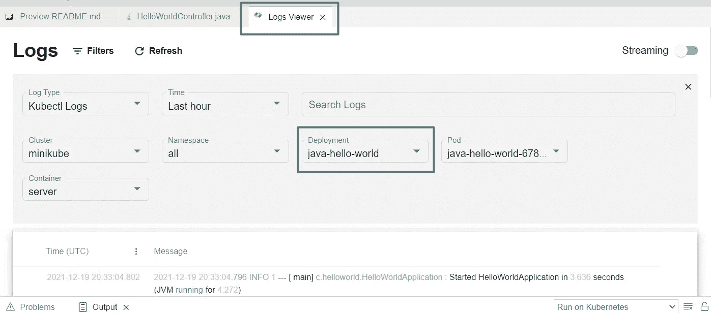**

**配置日志查看器**

**在浏览器中刷新应用程序。要在日志查看器中查看新生成的日志，单击 ***日志刷新*** 按钮。**

## **创建 Google Kubernetes 引擎集群**

**到目前为止，我们一直在本地运行我们的应用程序。是时候将我们的应用程序部署到一个 ***远程集群*** 了！**

*****项目*** 是 Google Cloud 对相关资源进行分组的一种方式。在创建 GKE 集群之前，我们必须先创建一个项目。您可以选择一个现有的项目，但是为了本教程，让我们创建一个新的项目。**

**打开 ***导航菜单*** 然后点击 ***Kubernetes 引擎*** 。点击 ***创建*** ，点击*标准集群*下的 ***配置*** 。**

**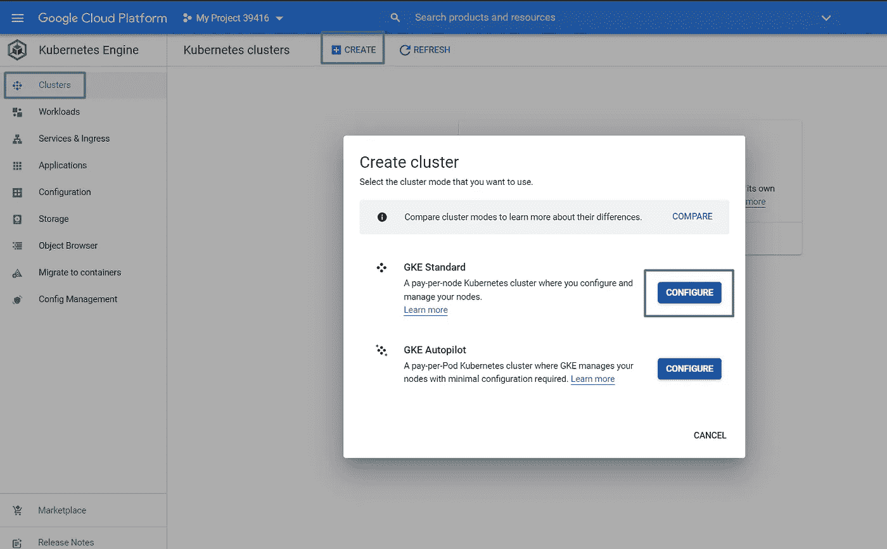**

**打造全新的 Kubernetes 引擎**

**在群集基本信息中，为群集输入一个 ***名称*** 和 ***区域*** 。要创建集群，单击 ***创建*** 。群集配置需要几分钟时间。**

**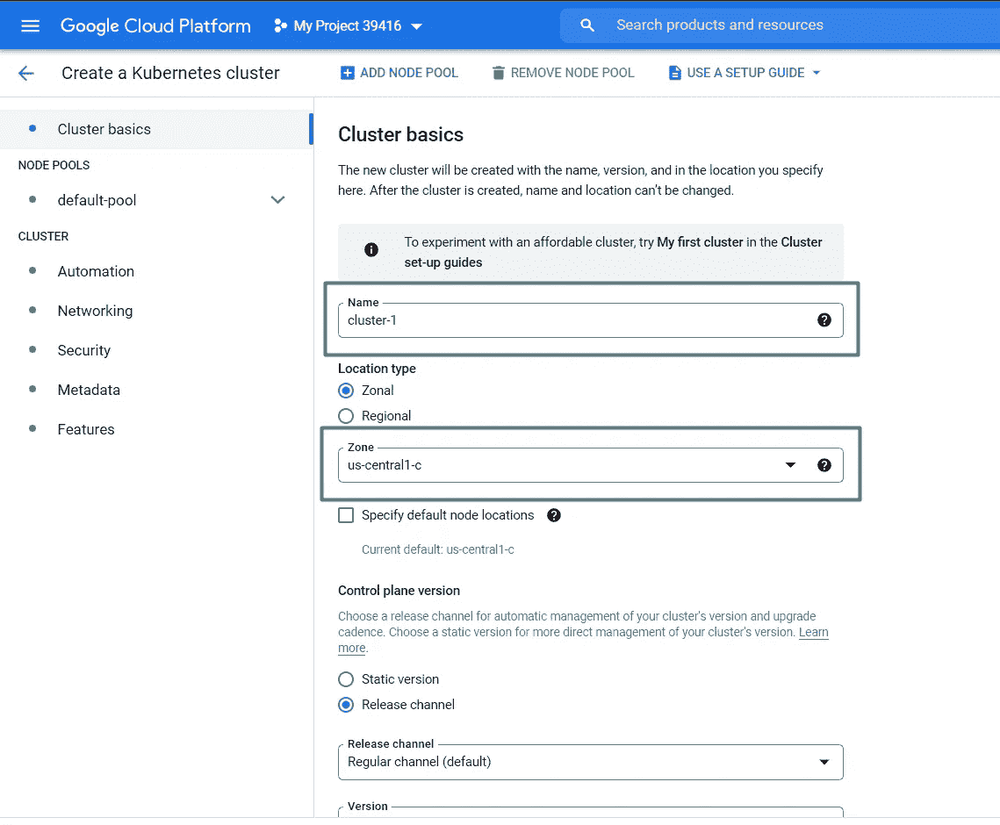**

**配置 Kubernetes 引擎**

**点击导航栏中的 ***云代码— Kubernetes*** 图标。将鼠标悬停在***Kubernetes Explorer***上，然后点击 ***+将集群添加到 KubeConfig*** 。**

**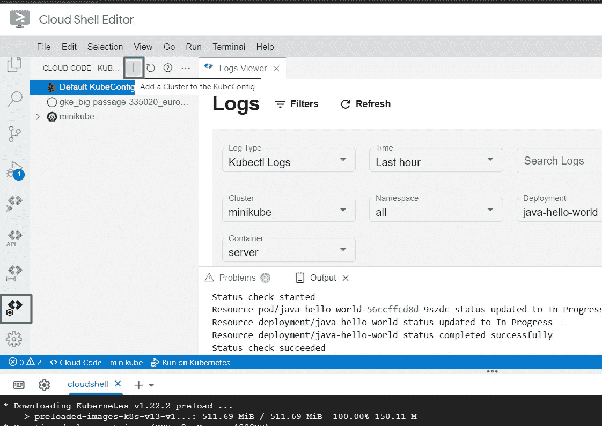**

**将集群添加到 KubeConfig**

**选择 ***Google Kubernetes 引擎*** 。从列表中选择您最近创建的 ***集群*** 。**

## **将我们的应用部署到 GKE 集群**

**最后，让我们将应用程序部署到新的集群中。从 ***云代码菜单*** ，使用状态栏访问，选择 ***在 Kubernetes*** 上运行。确认您新创建的集群作为您的应用程序的*上下文。确认 ***图像注册表*** 的默认选项。***

*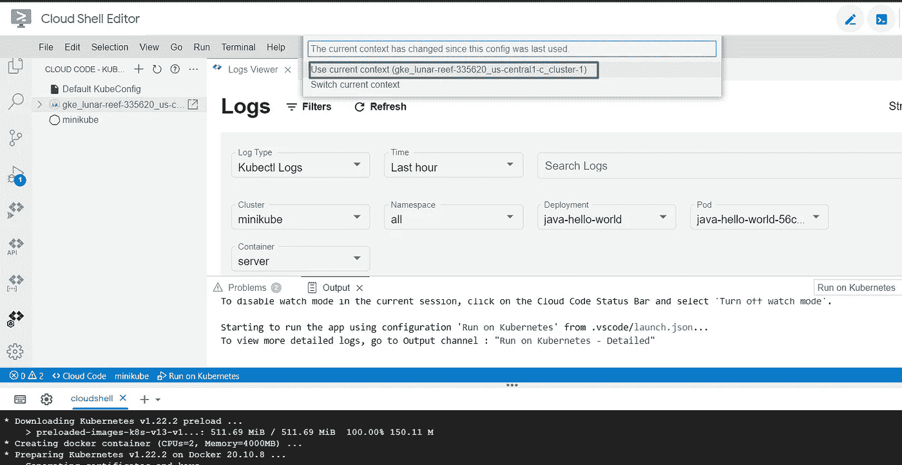*

*使用默认的映像注册表在远程 Kubernetes 集群上运行应用程序*

*成功部署应用程序后，您可以使用输出窗格中显示的链接来启动它。*

*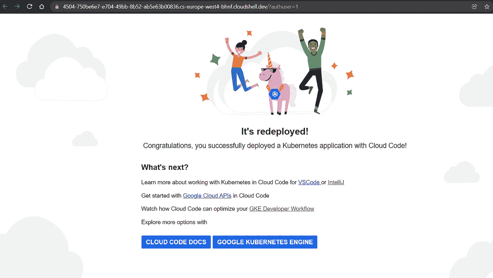*

*成功部署应用程序后的页面*

*在本简短教程结束时，您已经知道如何创建一个示例 Kubernetes 应用程序，如何在本地 Kubernetes 集群上构建/测试/编辑该应用程序，如何查看和导航应用程序的日志，如何创建 GKE 集群以及如何将应用程序部署到 GKE。令人印象深刻，不是吗？*

*关于谷歌云平台还有很多要学习的，所以请继续关注，不要错过我的下一篇博客！*