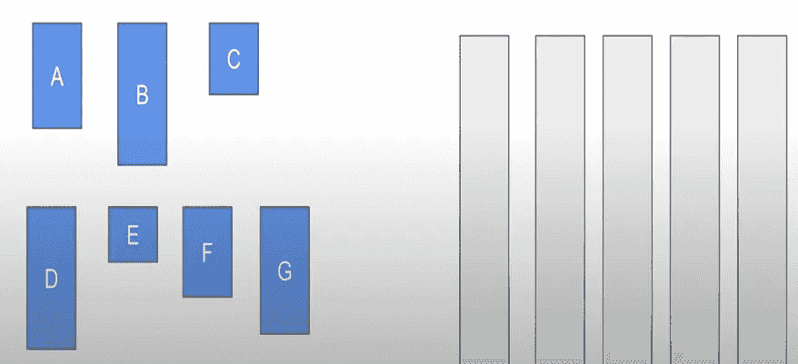
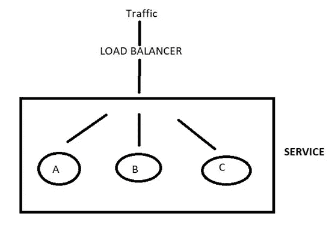
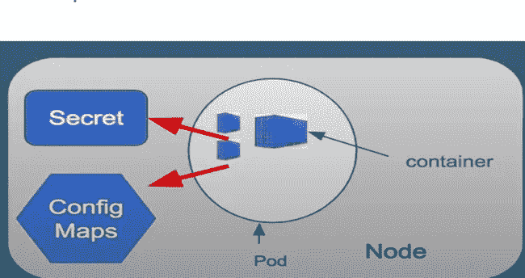
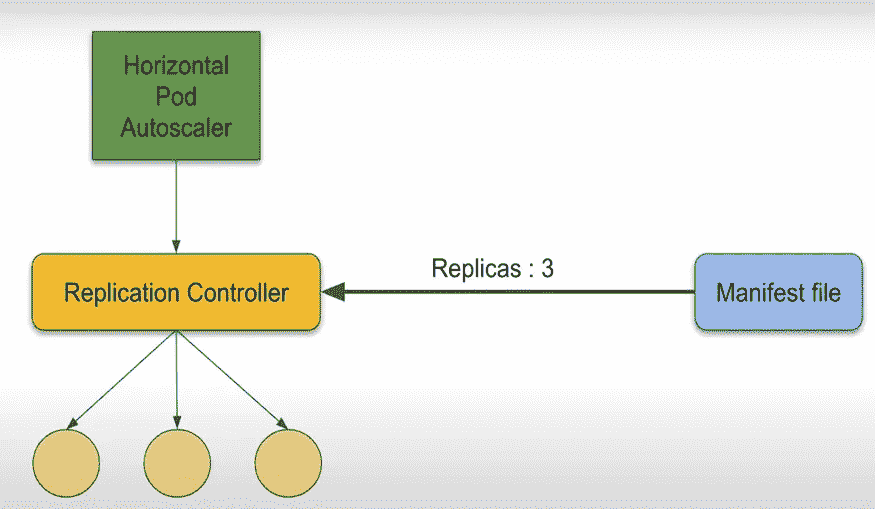
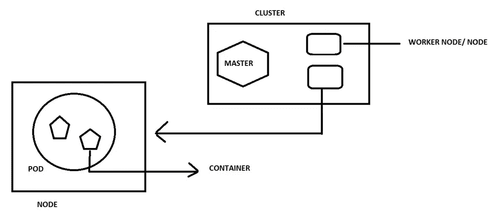
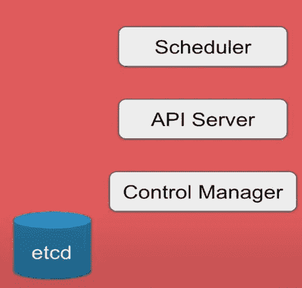
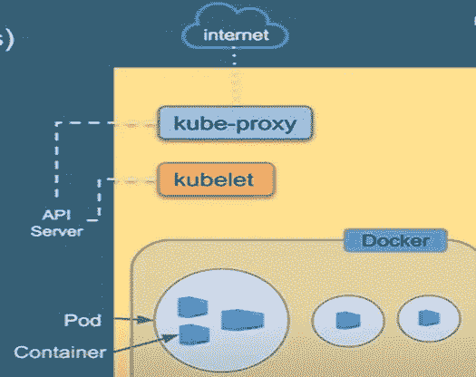

# 库伯内特斯

> 原文：<https://blog.devgenius.io/kubernetes-d51c3ba54ce1?source=collection_archive---------8----------------------->

假设我们有一个程序运行在我们的机器 X 上，带有所有的依赖项、配置等。现在想象一下，我们通过 github/将程序/代码转移到一台配置相同的朋友机器 Y 上，但是相同的程序无法在机器 Y 上运行/工作，那么会出现什么问题呢？代码不可能是错的，因为我们刚刚写了它。所以也许 Y 机会有问题？？？？？？？

好吧，这是个问题，但解决方案是什么呢？如果我们将你的机器 X 直接发送给你的朋友，而他只是在他的机器 y 上运行你的机器，这看起来公平又愚蠢，但如果你仔细想想，这可能是一个非常好的主意，不是吗？这个想法是码头工人的核心概念，这种机器被称为**集装箱**。

[伊恩·泰勒](https://unsplash.com/@carrier_lost?utm_source=medium&utm_medium=referral)在 [Unsplash](https://unsplash.com?utm_source=medium&utm_medium=referral) 上拍照

容器化的应用程序是那些在特定环境(或容器)中运行的程序，这些程序随后会与它的依赖项或需求一起被运送到其他系统上。在现实世界中，可能有成吨的容器用于运行一个程序/平台。此外，还有负载平衡、可用性、伸缩、回滚、调度等任务。由于这些都是乏味的过程，他们需要一个管理工具来为开发者处理同样的事情，这样就出现了一个叫做 **Kubernetes** 的容器管理工具。

Kubernetes 也称为 k8，是一个容器管理/编排工具，用于在一组服务器上自动化、部署和管理容器化的应用程序。具体来说，它用于部署、调度、扩展、负载平衡、批处理执行、回滚和监控。Kubernetes 的使用量很大，尽管 Kubernetes 的替代产品包括 docker swarn、Apache mesos 等。

Docker 创建容器，Kubernetes 管理它。潜入 Kubernetes 的功能，我们有:-

1.  **自动装箱** : —装箱是一项功能，Kubernetes 引擎根据每个容器的内存、资源需求自动将容器包装在服务器内部，以便于它们运行。例如:-我们有 5 个容器，比如 a、b、c、d、e。因此 Kubernetes 引擎会自动将这些容器放入**服务器(bin)**中，无需人工干预。

2 **。服务发现和负载平衡** : —现在 Kubernetes 不直接运行容器。他们将这些容器放入**容器**(与存储单元和唯一 IP 包装在一起的容器集合)和**节点**(容器集合)。不同的豆荚可以组合在一起，放在一个大包装下，这个包装可以作为所有豆荚的共同点。现在这项服务在受到外部 IP 攻击时，可以提供负载均衡和发现功能。

3.**存储编排** : —在 Pod 内运行的容器可能需要存储或 RAM 等。因此，我们可以在一个 Pod 内的多个容器之间共享一个存储空间，或者每个容器都有自己的存储空间。此外，我们可以进行数据库集成，如 AWS 存储或 NFs 存储。

4.**自我修复** : — Kubernetes 倾向于维护我们部署的容器。如果发生故障或失败，它会自动多次重新运行容器。此外，它还执行定期健康检查等。总结自我修复，Kubernetes 做了:-

如果容器出现故障:-它会自行重启容器。

如果节点失效:—在另一个节点上复制和调度容器

如果容器不响应手动或自动健康检查:—关闭容器

5.**自动推出和回滚** : — Kubernetes 在出现错误等情况下自动执行回滚。类似地，编排工具还会自动处理新功能等的推出，同时确保应用程序不会停机。

6.**秘密和配置管理** : —在 Kubernetes 中，我们有两个对象，秘密和配置映射。Secret 存储密码等数据，而 config 存储配置文件等。这两个管理对象都位于 Pod 外部。这些值存储在名为 **ETCD 的键值数据存储中，最大大小为 1MB** (用于秘密存储)。

7.**批处理执行** : —批处理作业需要运行一个可执行文件/进程来完成。在 Kubernetes 中，从运行到完成的作业主要用于批处理。每个作业创建一个或多个 pod。在作业执行过程中，如果任何容器或箱出现故障，作业控制器将在另一个节点上重新调度该容器、箱。可以并行运行多个单元，并且可以根据需要纵向扩展。作业完成后，单元将从运行状态变为关闭状态。

8.**水平缩放** : — Kubernetes 内置了对容器缩放的支持。这可以通过命令或 UI 来完成。Kubernetes 中有三个工具:-

复制控制器:缩写为 RC，它允许创建多个 pod，并且在 pod 崩溃的情况下，RC 会自动替换相同的 pod。它从清单文件中获取所有关于要运行的 pod 数量等信息。

舱单文件:存储关于运输舱数量、运输舱负载等信息。

水平机架自动缩放器:-这是一种用于监控 CPU 利用率的工具，复制容器基于此设置机架数量，即缩放。自动缩放器每 15 秒运行一次，以查看 CPU 利用率。

# 库伯内特斯的建筑

Kubernetes 的核心组件是主节点和工作节点。它们一起形成一个团队或集群。群集是工作节点和主节点的集合，每个群集至少应该有一个主节点和一个群集节点。每个节点由 Pod 组成，而 Pod 又由容器、存储单元和 IP 组成。

在建立 Kubernetes 时，我们得到一个集群。主节点负责管理工作节点以及这些节点中的 pod。Kubernetes master 包括:-

API 服务器

调度程序

控制器管理器

ETCD

o API 服务器:API 允许应用程序相互通信。API 服务器是 Kubernetes 控制平面的前端。它为几乎每个操作公开 API。用户、管理设备和命令行界面(针对用户)等都与 API 服务器进行对话，以便与 Kubernetes 集群进行交互。用户可以使用 Kubectl 与 Kubernetes API 进行交互。

o 调度器:它跨多个节点调度 pod。主服务器上的组件监视新创建的没有分配节点的 pod，并为它们选择一个运行节点。调度程序通过 API 服务器从 etc 获得集群中每个工作节点的资源使用数据。**调度程序从配置文件**中获取所有信息。

o 控制管理器:它是主服务器上运行控制器的组件。该组件有两种类型的控制器，Kube 控制器管理器和云控制器管理器。

ETCD:这是一个开源的分布式键值数据库。它用于管理键值对并存储它们。只有 **API 服务器**可以与 etcd 数据存储通信。

如前所述，集群由主节点和工作节点组成。母版的构成如上所述。然而，工人要简单得多，可描述如下:-

库伯莱

Kube 代理

容器运行时

v Kubelet: — kubelet 是运行在每个节点上的代理。它与主节点的组件通信，并确保容器在 pod 中运行。kubelet 接受一组通过各种机制提供的 Pod 规范，并确保这些 Pod 规范中描述的容器运行正常。如果任何 pod 出现任何问题，kubelet 会尝试在同一节点或不同节点上重新启动 pod。

v Kube-Proxy:-它是节点中的核心网络组件。在每个节点上运行的网络代理，负责维护网络配置和规则。它向外界公开服务，并处理 Kubernetes 中的核心网络组件。所有工作节点都运行一个名为 kube-proxy 的守护进程，它监视主节点上的 API 服务器添加和删除服务和端点

容器运行时:— Kubernetes 没有能力直接处理容器。为了运行和管理容器的生命周期，Kubernetes 需要在计划 Pod 及其容器的节点上运行容器运行时。几个运行时引擎包括 Docker、Contained、Cri-o、Rklet 等。

这基本上就是库伯内特斯的风格。**感谢阅读，希望你喜欢这篇文章。通过订阅我的邮件列表或关注我**:)，期待更多这样的文章