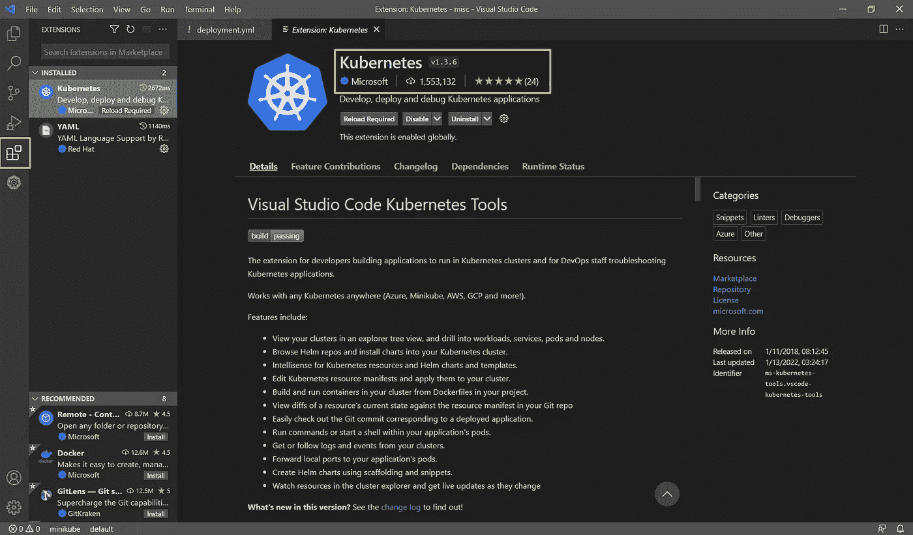
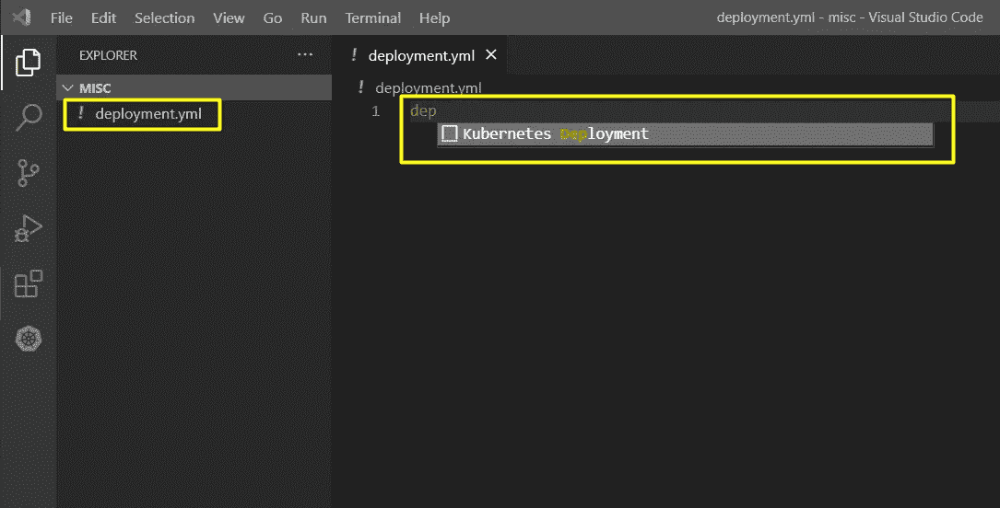
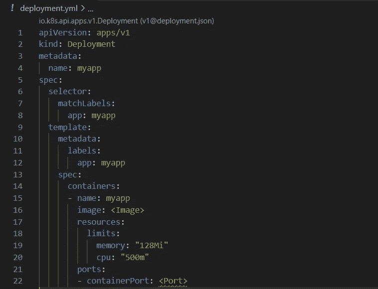
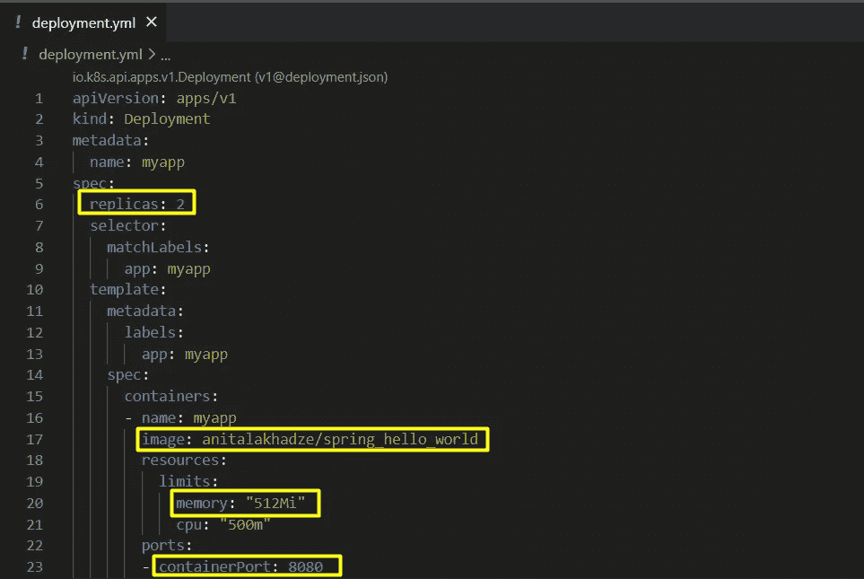
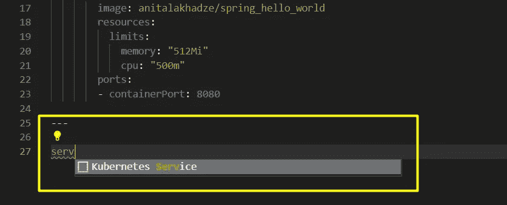
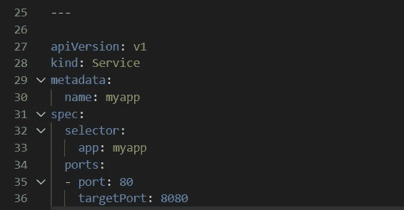
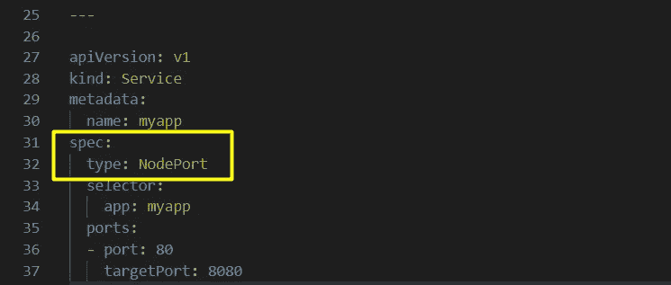
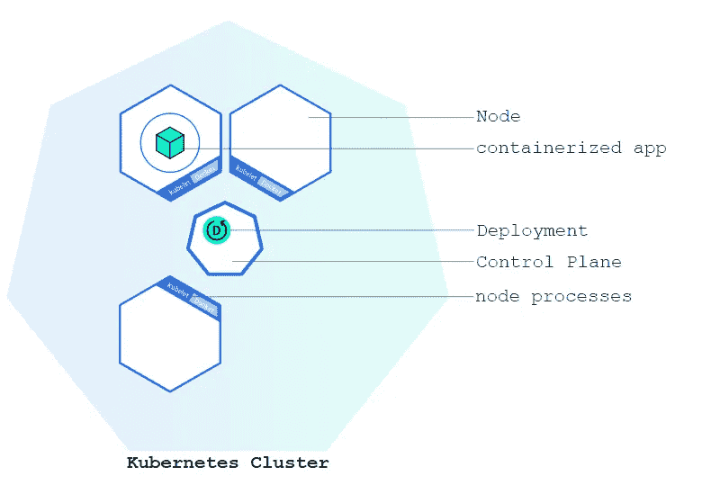
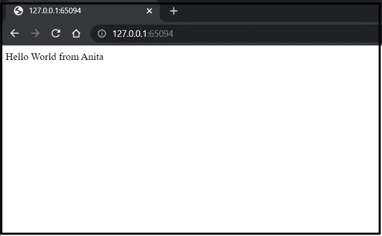
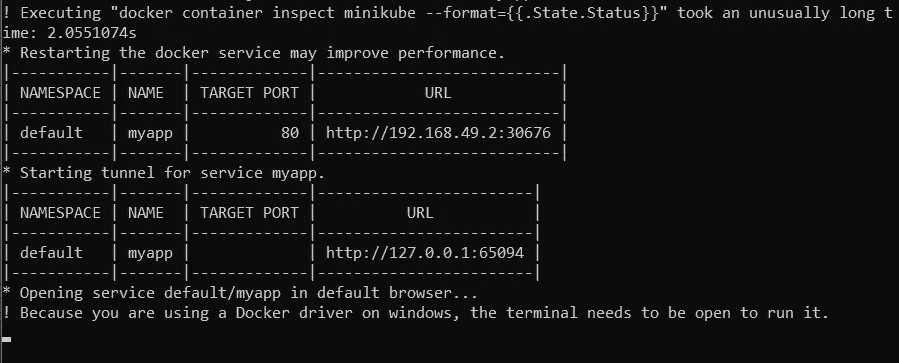

# Kubernetes —将 Docker 映像部署到本地集群

> 原文：<https://blog.devgenius.io/kubernetes-deploying-a-docker-image-to-a-local-cluster-31b46934cd71?source=collection_archive---------4----------------------->

在本教程中，我想向您展示如何从您的计算机直接将****docker 镜像*** 部署到 ***本地 Kubernetes 集群*** 。这将极大地增加你的编码信心。所以抓住你喜欢的零食，保持节奏！*

## *设置环境*

*我们需要[***Docker***](https://docs.docker.com/get-started/overview/)*将我们的应用程序打包到一个容器中，并在 K8s 集群上运行。**

**要开始设置本地 K8s 集群，我们可以使用[***Minikube***](https://minikube.sigs.k8s.io/docs/)，这是一个轻量级 K8s 实现，它在我们的本地机器上创建一个 VM，并部署一个只包含一个节点的简单集群。**

**Minikube 是你工具包中的一个很好的工具。它适用于所有操作系统，Minikube CLI 提供基本的有用操作，包括启动、停止、删除集群或检查状态。**

**安装 Docker 和 Minikube 之后，您就可以开始了。**

## **设置本地集群**

**让我们进入正题，用下面的命令启动 ***2 个节点*** :**

```
**minikube start --nodes=2**
```

**这需要一些时间。你会看到它 ***拉一个基础镜像*** 并配置其他操作。以下内容将作为成功消息显示在末尾:**

```
**Done! kubectl is now configured to use "minikube" cluster and "default" namespace by default**
```

**我们可以使用以下命令检查 ***minikube 状态*** :**

```
**minikube status**
```

**我们会看到这样的情况:**

```
**minikube
type: Control Plane
host: Running
kubelet: Running
apiserver: Running
kubeconfig: Configuredminikube-m02
type: Worker
host: Running
kubelet: Running**
```

**第一个，minikube，是*控制平面* — ***主节点*** ，它支持主机、kubelet API 和 Kube 配置。第二个是 ***职工节点*** 。**

**如果我们通过检查 ***docker 流程*****

```
**docker ps**
```

**我们将看到我们有两个容器*——一个用于主节点，一个用于工作者节点:***

```
***CONTAINER ID   IMAGE                                 COMMAND                  CREATED         STATUS         PORTS                                                                                                                                  NAMES
9db0a1b4ceab   gcr.io/k8s-minikube/kicbase:v0.0.28   "/usr/local/bin/entr…"   2 minutes ago   Up 2 minutes   127.0.0.1:64998->22/tcp, 127.0.0.1:64994->2376/tcp, 127.0.0.1:64996->5000/tcp, 127.0.0.1:64997->8443/tcp, 127.0.0.1:64995->32443/tcp   minikube-m02
4a010f289ac7   gcr.io/k8s-minikube/kicbase:v0.0.28   "/usr/local/bin/entr…"   4 minutes ago   Up 4 minutes   127.0.0.1:64967->22/tcp, 127.0.0.1:64968->2376/tcp, 127.0.0.1:64965->5000/tcp, 127.0.0.1:64966->8443/tcp, 127.0.0.1:64964->32443/tcp   minikube***
```

## ***与集群交互***

***当涉及到从本地机器与集群交互时，Kubernetes 命令行工具 ***kubectl*** 将会派上用场。它使用 K8s API 与集群进行交互。我们可以利用它来部署应用程序、检查和更改资源、调试和查看日志，等等。***

**如果要 ***与集群*** 交互，请键入:**

```
**kubectl get nodes**
```

**你会看到我们有 ***两个节点*** :**

```
**NAME           STATUS   ROLES                  AGE   VERSION
minikube       Ready    control-plane,master   28m   v1.22.3
minikube-m02   Ready    <none>                 27m   v1.22.3**
```

## **创建 Kubernetes 部署配置**

**因此，我们已经有一个 Kubernetes 集群在运行。最重要的是，我们现在可以部署我们的容器化应用程序。为此，我们需要创建一个 ***Kubernetes 部署*** 配置，告诉 K8s 如何生成和更新应用程序实例。一旦我们创建了集群，K8s 控制平面将安排该部署中包含的应用程序实例在集群中的特定节点上运行。**

**部署可以增加副本单元的数量，允许新代码的受控发布，或者在必要时回滚到以前的部署版本。 ***部署控制器*** 持续监控创建的实例，如果一个实例关闭或被破坏，它将被集群中另一个节点上的另一个实例替换。这解决了机器故障或维护的问题。**

**您可以使用您选择的任何编辑器来创建部署。为此我将使用 ***Visual Studio 代码*** 。您可以轻松地设置它，然后安装 ***Kubernetes 扩展*** ，它将在为 Kubernetes 创建部署时提供自动完成功能。**

****

**Visual Studio 代码的 Kubernetes 扩展**

**继续在文件系统中的某个地方创建***deployment . yml***。接下来，我们将设置一个基本配置。键入“dep”并让它自动完成:**

****

**部署. yml 文件**

**它看起来会像这样:**

****

**Kubernetes 部署配置**

**我们将插入副本数量的配置，修改内存规格、容器端口，并用我的 Docker 注册表中的公共映像替换该映像—***anitalakhadze/spring _ hello _ world***:**

****

**修改 Kubernetes 部署**

**现在我们要做的是创建一个 ***服务*** ，它将允许我们访问 pod。您可以将此服务视为负载平衡器。不要忘记三个破折号并键入“serv”:**

****

**Kubernetes 服务配置**

**它将如下所示:**

****

**8080 端口是容器将要监听的端口，80 是服务的端口。因此，这个选择器“myapp”将匹配在其模板元数据标签中具有相同名称的 pod。**

**现在，最后一件事是稍微更改一下规范，在两个节点上公开随机端口。**

****

**暴露两个节点上的随机端口**

**你可以在这里 阅读更多关于 Kubernetes [***的组网模式。***](https://kubernetes.io/docs/concepts/services-networking/connect-applications-service/)**

## **应用 Kubernetes 部署**

**现在，让我们看看集群中所有可用的 pod(所有名称空间中的所有 pod):**

```
**kubectl get pods -A**
```

**您将看到控制面板由以下部分组成:**

```
**NAMESPACE     NAME                               READY   STATUS    RESTARTS        AGE
kube-system   coredns-78fcd69978-cdxkm           1/1     Running   1 (16m ago)     7d16h
kube-system   etcd-minikube                      1/1     Running   1 (16m ago)     7d16h
kube-system   kindnet-4n24p                      1/1     Running   28 (16m ago)    7d16h
kube-system   kindnet-6q689                      1/1     Running   206 (16m ago)   7d16h
kube-system   kube-apiserver-minikube            1/1     Running   1 (16m ago)     7d16h
kube-system   kube-controller-manager-minikube   1/1     Running   1 (16m ago)     7d16h
kube-system   kube-proxy-4lvh2                   1/1     Running   1 (16m ago)     7d16h
kube-system   kube-proxy-mbpj2                   1/1     Running   1 (16m ago)     7d16h
kube-system   kube-scheduler-minikube            1/1     Running   1 (16m ago)     7d16h
kube-system   storage-provisioner                1/1     Running   2 (7m57s ago)   7d16h**
```

**如果你跑了**

```
**kubectl get pods**
```

**您将收到以下消息:**

```
**No resources found in default namespace.**
```

**这是因为尽管我们已经创建了部署配置，但是我们还没有应用它。要应用我们的 deployment.yml 配置，我们必须提供以下命令:**

```
**kubectl apply -f deployment.yml**
```

**当我们用上面的命令应用部署时，K8s 创建了一个 Pod 来托管我们的应用程序实例。之后，您将看到以下消息:**

```
**deployment.apps/myapp created
service/myapp created**
```

****

**图片来自 [Kubernetes](https://d33wubrfki0l68.cloudfront.net/8700a7f5f0008913aa6c25a1b26c08461e4947c7/cfc2c/docs/tutorials/kubernetes-basics/public/images/module_02_first_app.svg) 教程**

**现在，如果您再次检查 pod，这次您将看到两个正在运行的 pod:**

```
**NAME                    READY   STATUS    RESTARTS   AGE
myapp-8d8d79856-ml2jh   1/1     Running   0          3m5s
myapp-8d8d79856-vx7gs   1/1     Running   0          2m15s**
```

## **访问我们的应用程序**

**为了访问我们的应用程序，让我们键入:**

```
**kubectl get svc**
```

**我们将看到，我们有一个 NodePort 类型的服务 myapp，它将随机分配的端口转发到 80，80 将根据我们在文件中编写的规范，将请求转发到我们的容器的端口 8080。**

```
**NAME         TYPE        CLUSTER-IP     EXTERNAL-IP   PORT(S)        AGE
kubernetes   ClusterIP   10.96.0.1      <none>        443/TCP        4m2s
myapp        NodePort    10.96.114.46   <none>        80:30676/TCP   7s**
```

**要访问该服务，我们键入:**

```
**minikube service myapp**
```

**稍等片刻，它将打开一个包含您的应用程序的 web 浏览器窗口:**

****

**您可以在终端中查看详细信息:**

****

**就是这样！我们已经在本地 Kubernetes 集群上启动并运行了我们的 Spring Boot 应用程序。多酷啊。**

**如果你对*Kubernetes 的核心基础设施感兴趣，可以看看我之前的文章 [***这里***](https://medium.com/@atala15/kubernetes-an-overview-6b800672a893) 。***

**此外，如果你有兴趣阅读更多关于 ***云原生开发*** 和从 ***谷歌云平台*** 在 Kubernetes 上部署一个容器化的应用程序，你可以继续阅读我的另一篇文章 [***这里***](/kubernetes-creating-and-deploying-a-containerized-app-c991448f1ba8) ***。*****

**不要错过未来的博客，了解更多关于 Kubernetes 和其他有趣的东西。敬请期待！**