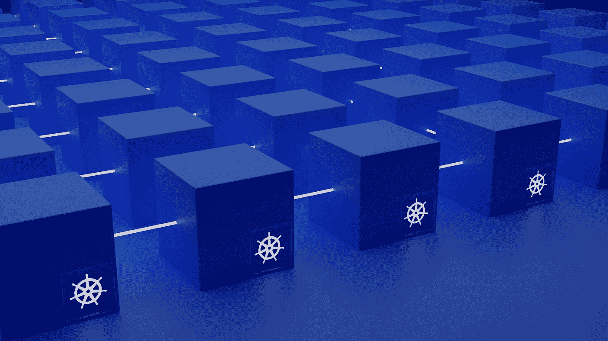

# Kubernetes 部署策略解释

> 原文：<https://blog.devgenius.io/kubernetes-deployment-strategy-explained-bf27fea088e1?source=collection_archive---------11----------------------->



照片由[格罗提卡](https://growtika.com/)拍摄

ubernetes 部署是一种创建 pod 和副本集的声明式方法。您可以在部署 YAML 中定义期望的状态，Kubernetes 控制器会将实际状态与期望的状态相匹配。

部署策略控制如何创建复制集和单元。在 Kubernetes 部署文件中，您主要可以指定两种策略。

## **2 种策略类型**

1.  **再造**


使用重新创建部署 YAML

在创建新的 pod 之前，所有现有的 pod 都将被终止。这种策略可能会导致应用程序停机，因为在删除所有旧的 pod 之前，不会创建新版本的 pod。


我们可以看到，当我们更新部署时，旧版本的所有 3 个 pod 在新版本部署之前首先终止**。**

**2。RollingUpdate(默认)**


使用滚动更新部署 YAML

此策略将执行滚动更新，这将逐步用新版本替换旧版本的 pod。滚动更新不会给应用程序造成停机时间。

准备就绪探测用于确保在终止旧 pod 之前，新版本的 pod 已准备就绪。

[](https://guyzsarun.medium.com/kubernetes-liveness-readiness-probe-explained-352691dcccf1) [## Kubernetes 活跃度，准备探测解释

### 在 Kubernetes 中，除了 restartPolicy 之外，默认情况下，当 pod 出现故障时，restart policy 会重新启动 pod。有活跃度和…

guyzsarun.medium.com](https://guyzsarun.medium.com/kubernetes-liveness-readiness-probe-explained-352691dcccf1) 

当我们使用 RollingUpdate 应用新版本的部署时。首先，创建新的 pod ( `application-9f6f449b5-xm649`)。并且，当 Pod 状态为运行时，它会终止旧的 pod ( `application-6946b895c8-j4lcq`)。重复该过程，直到所有窗格都被更新。

## 滚动更新参数

*   **最大浪涌**

该字段指定在更新期间可以创建的超过所需数量的单元数量。该值可以是 pod 的绝对数量，也可以是向上舍入的百分比(例如 10%)。

默认值为 **25%**


例如，在上面的 YAML 中，我们设置 **maxSurge = 3**


我们目前有 3 个单元在集群中运行。


当我们更新部署时，3 个新的吊舱`application-69bf477c75`同时被创建。

转出时集群上的总 pod 为 **6** ( **副本数量** + **最大浪涌**)

*   **最大不可用**

在滚动更新过程中不可用的单元的最大数量。该值可以是 pod 的绝对数量，也可以是向下舍入的百分比(例如 10%)。

默认值为 **25%**


例如，在上面的 YAML 中，我们设置 **maxUnavailable = 2**


当我们更新部署时，会同时创建 3 个新的 pod`application-69bf477c75`。此外，2 个旧吊舱`application-bf88b965f`被终止。

总运行 pod 为 1 ( **副本数量** — **最大不可用数量**)

## 组合 maxSurge 和 maxUnavailable

当我们结合 maxSurge 和 maxUnavailable 参数时，可以创建不同的部署策略

**这里有几个例子**

*   **渐变**——一次一个实例地缓慢推出新版本。

```
 strategy:
    type: RollingUpdate
    rollingUpdate:
      maxSurge: 1          # Add 1 pod at a time
      maxUnavailable: 0    # Ensure the new pod is running before terminating old version
```

*   **蓝/绿—** 发布新版本和旧版本，然后使用服务、入口或服务网格交换流量。
*   **Canary —** 在全面推广之前，向少量用户发布新版本，以测试新版本的功能。

部署策略的更多示例可在本 [GitHub repo](https://github.com/ContainerSolutions/k8s-deployment-strategies\) 中找到

[](https://github.com/ContainerSolutions/k8s-deployment-strategies) [## GitHub-container solutions/k8s-deployment-strategies:Kubernetes 部署策略解释

### 在 Kubernetes 中，发布应用程序有几种不同的方式，你必须仔细选择正确的策略…

github.com](https://github.com/ContainerSolutions/k8s-deployment-strategies)