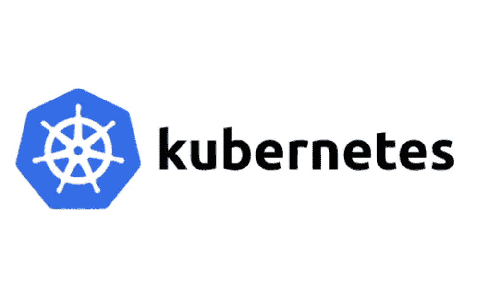
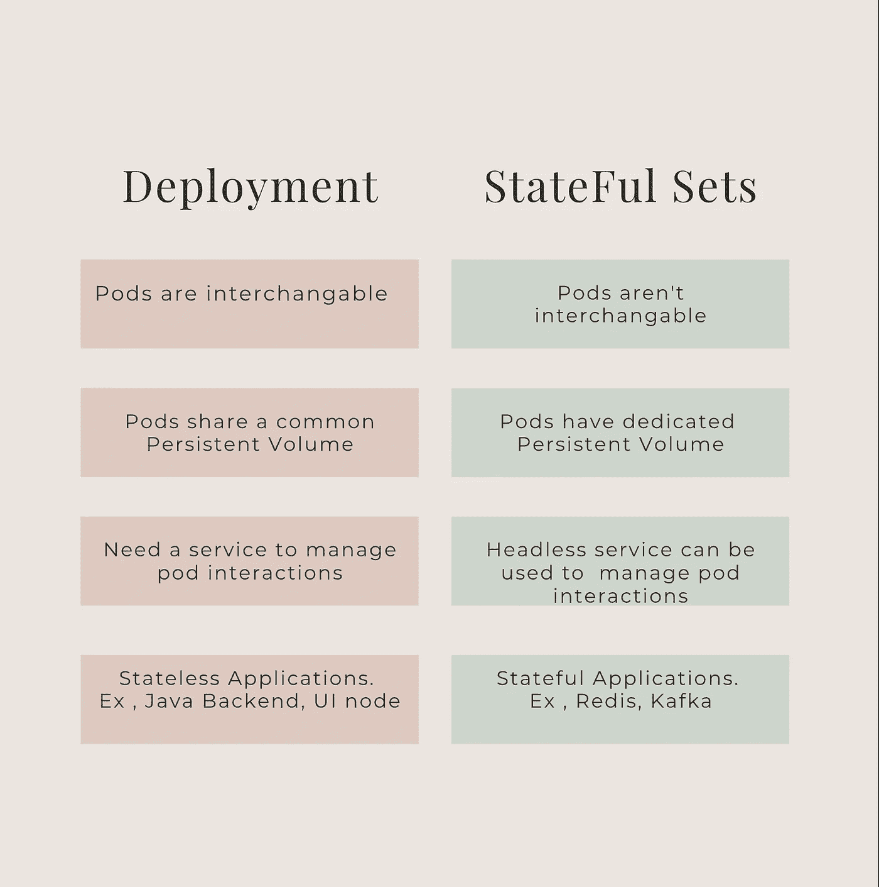

# Kubernetes 部署:101

> 原文：<https://blog.devgenius.io/kubernetes-deployments-101-46ec865de12d?source=collection_archive---------14----------------------->

这篇博客是我们从零开始讨论 101 个概念的系列文章的一部分，读者的入门知识有限。这篇文章属于 ***中级*** 系列，因为它涉及到理解 **Kubernetes 编排平台**中的不同部署类型以及它们根据业务应用需求的用法。

101 系列中的一些早期博客如下:

[**数据库复制 101**](/database-replication-101-d148514598a7) [**数据库分片 101**](/database-sharding-101-4ef36046c29c) [**缓存策略 101**](/caching-strategy-101-3bc974d2a6cd)[**断路器 101**](/circuit-breaker-pattern-101-be2d7fdb656) [**异步通信 101**](/async-communication-101-b04d5c95333a)[**数据库设计**](/database-design-101-7c019d69b97f)



# **Kubernetes 部署对象**

**Kubernetes 部署对象**是一个清单文件，用于自动化 pods 实例的端到端生命周期管理。它的主要目标是减少聚合到包含基本信息的单个定义中的多个命令的开销，这些基本信息包括使用的***容器图像、pod 的数量以及更新它们的方式*** *。*

虽然**副本集**直接与 pods 交互，但是使用部署对象可以通过内部管理多个**副本集**来帮助部署新版本的 pods。这些对象主要用于**同构部署**，即所有 pod 都是相似的，没有任何数据存储在永久存储器上。因此，它们是托管无状态微服务的基本块。

## 示例应用程序

## 清单定义

1.  ***容器*** 段命名为*sample-app**并从 dockerhub 位置***Amit 894/sample-app-1:1 . 0 . 0***拉取图像*
2.  *规范中的 ***选择器*** 寻找标签匹配为***sample-app****的应用。**
3.  **规格*中的 ***副本*** 创建一个吊舱副本。*
4.  ****种类*** 用于指定对象类型为*。**

## **命令**

**可以使用以下命令部署上面的示例部署**

```
**kubectl apply -f sample-deployment.yml**
```

**可以使用以下命令检查部署状态**

```
**kubectl get deployments**
```

# **Kubernetes StatefulSets 对象**

**有状态集合对象有一个类似的清单文件来管理容器、窗格和图像位置。然而，它们支持部署的基本单元本质上是**异构的**的用例，即在固定的有序集合中管理 pod。**

**顾名思义，它们用于部署在 **pod 边界**内的持久位置维护状态的应用程序。k8 上的 **Redis、Kafka** 等应用程序利用有状态集来确保在 pod 扩大/缩小事件中的数据弹性。**

## **示例应用程序**

## **清单定义**

1.  ***容器*部分命名为*sample-app**并从 dockerhub 位置*Amit 894/sample-app-1:1 . 0 . 0*提取图像***
2.  **规范中的*选择器*寻找带有匹配标签的应用程序作为*样本应用程序。***
3.  ***规格*中的*复制品*创建了*样本 app* **的 3 个有序组。****
4.  **服务*示例服务*用于控制带有标签的匹配 pod 的整体状态集。**
5.  ***种类*用于将对象类型指定为 *StatefulSet。***
6.  ***volumeClaimTemplate* 用于定义存储数据的永久位置。**

## **命令**

**可以使用以下命令部署上面的示例部署**

```
**kubectl apply -f sample-replica-set.yml**
```

**可以使用下面的命令检查副本集的状态**

```
**kubectl get rs**
```

# ****部署与**有状态集**

****

# **摘要**

**Kubernetes 主要用于在 **VCore** 和**内存**大小方面运行轻量级 pod 的用例，以帮助根据自动扩展规则和配置动态扩展资源。因此，部署对象构成了最终客户的大部分自动化配置管道。然而，最近在部署拓扑中使用 **StatefulSets** 已经成为一种不断发展的模式，以支持生产中的**数据库、缓存集群和消息代理**的有状态情况。**

***如需反馈，请留言至****Amit[dot]894[at]Gmail[dot]com****或联系*[*https://about.me/amit_raj*](https://about.me/amit_raj)*的任何链接。***