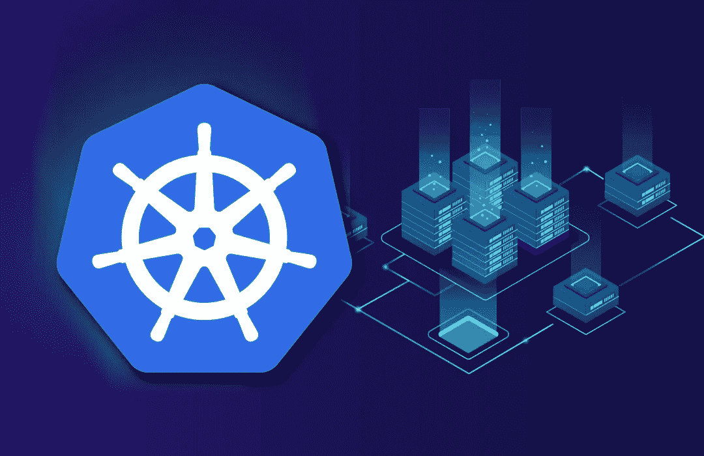
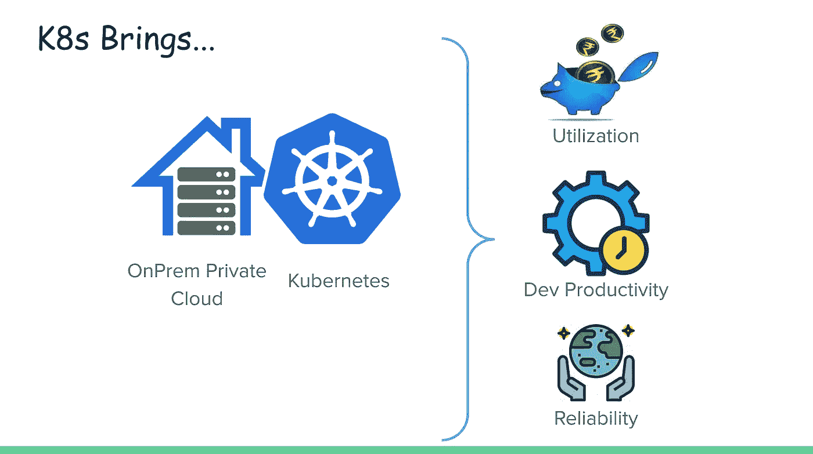
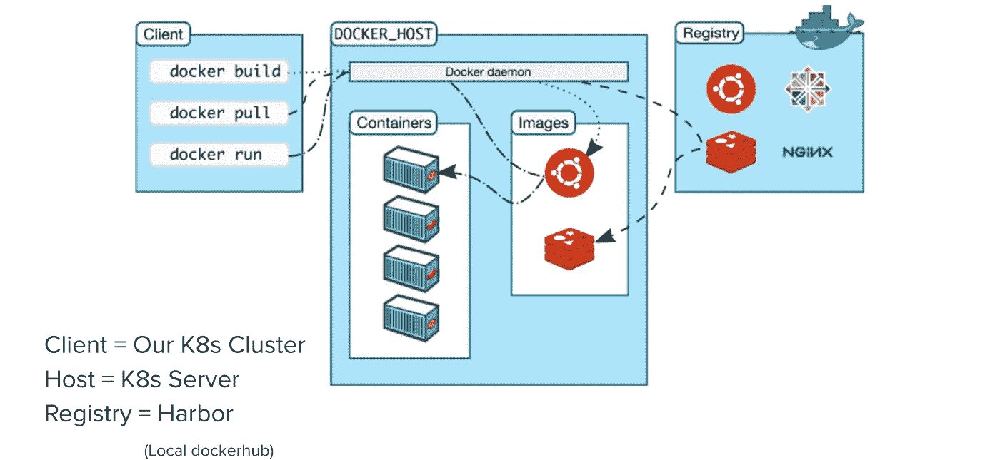
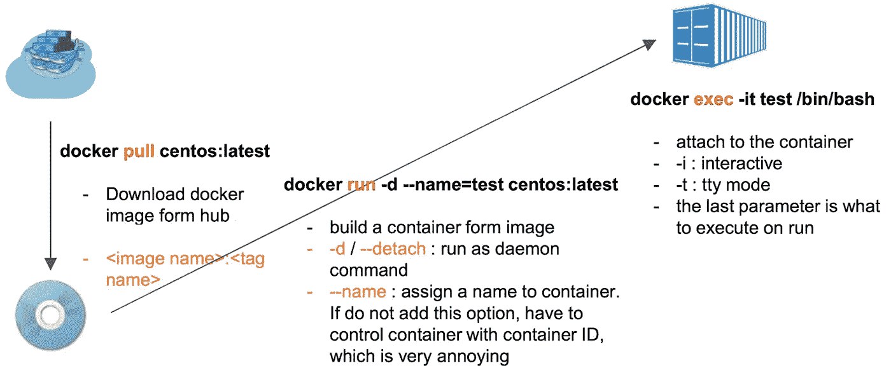
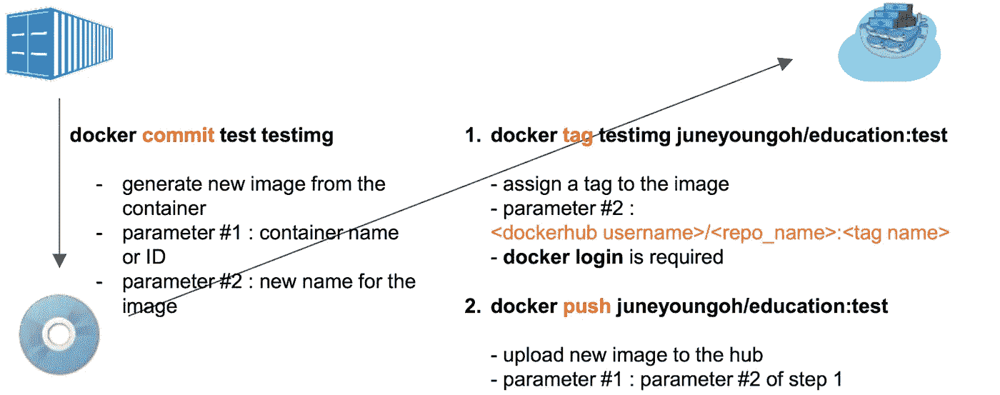
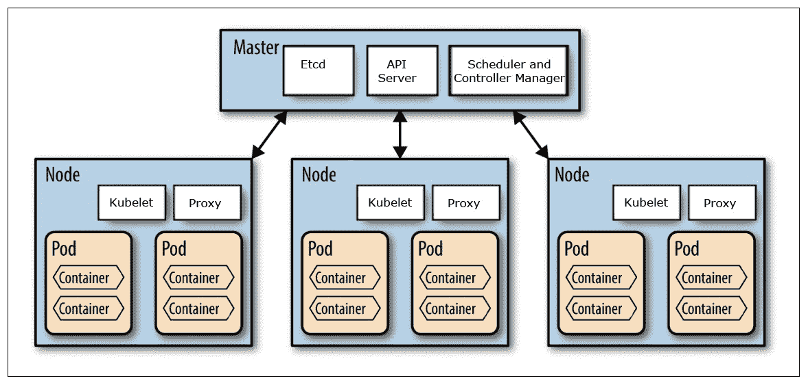

# Kubernetes & Docker 101

> 原文：<https://blog.devgenius.io/kubernetes-docker-101-6acb969f37b9?source=collection_archive---------4----------------------->

容器化应用程序协调器…



[Kubernetes](https://kubernetes.io/docs/concepts/overview/what-is-kubernetes/) (K8s)是一个开源(由 google 创建)系统，用于**自动化部署**、**扩展**、&管理**容器化应用**

# 为什么是 Kubernetes？



*   标准化的关键模式
*   简化的应用架构和降低的复杂性
*   隔离硬件故障
*   应用程序端的零基础架构管理开销
*   轻松实现混合或多 dc
*   专为高度可扩展性而设计


现在，因为 Kubernetes 致力于容器化组件，所以让我们了解一下最流行的容器化工具 Docker 的一些基础知识

# 码头工人

Docker 是一个开发、发布和运行应用程序的开放平台。Docker 使您能够将应用程序从基础设施中分离出来



等等，集装箱是什么？和图像有什么不同？

## 容器

它是**可变的**组件，主要用于开发。这是一个短暂的作品，一旦所有编辑完成，它需要导出为图像。容器是不可发布的实体。

## 图像

顾名思义，这是容器的不可变版本。就像我们的备份快照映像一样，这些都是可发布的元素。Docker 图片通常发布在普通注册表上，如 [Dockerhub](https://hub.docker.com/)

## 流动



常用的 Docker 命令

```
List local docker images: **docker images** List local docker containers: **docker ps** Copy a file to docker container from host system: **docker cp <Host file location> <Docker container ID>:<Path inside of the container>** Stop/Start the container: **docker stop/start <Container ID>** Remove the container: **docker rm <Container ID>** Remove the image: **docker rmi <Image ID>** [Debugging] Logs: **docker logs <Container ID>**
```

# 库伯内特建筑



**API 服务器:**验证器，单个接口
**调度器:**找到放置 pod 的位置并调度设置执行(触发 kubelet)
**控制器管理器:**检测集群状态与预期状态
**Etcd(集群大脑):** KV 存储应用状态

Node = ` n ` application pods
Node b/g processes = Container Runtime(docker)+kube let(pod manager)+Proxy(智能路由器)

# kubectl(CLI):K8s 的命令

```
[C] kubectl create <component>
[R] kubectl get <component>
[U] kubectl edit <component>
[D] kubectl delete
kubectl apply -f <yaml-component-spec>
kubectl describe <component>
kubectl get <component> -o yaml
kubectl config use-context <context-name>
[HELP] kubectl explain <component>
```

# 组件的规格结构

```
apiVersion: <k8s-api-version>kind: <component-type>metadata: <component-details>spec: <component-spec>status: <auto-generated-by-k8s>
```