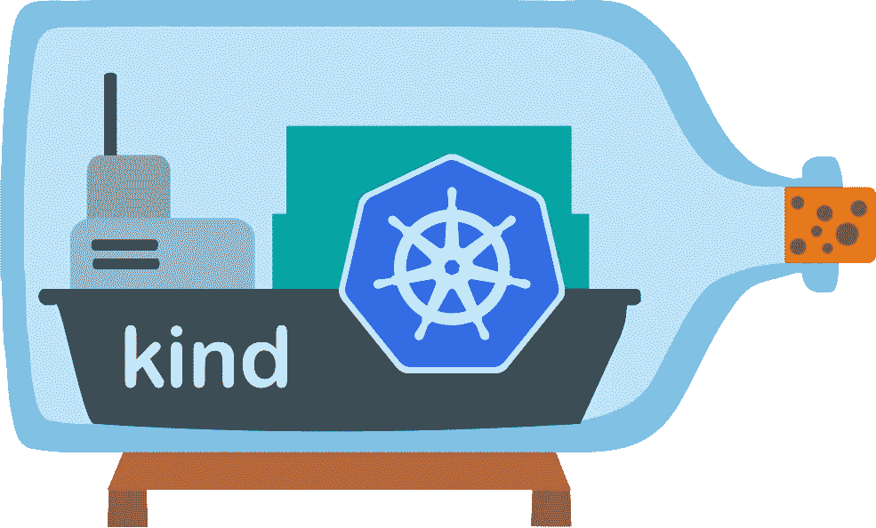
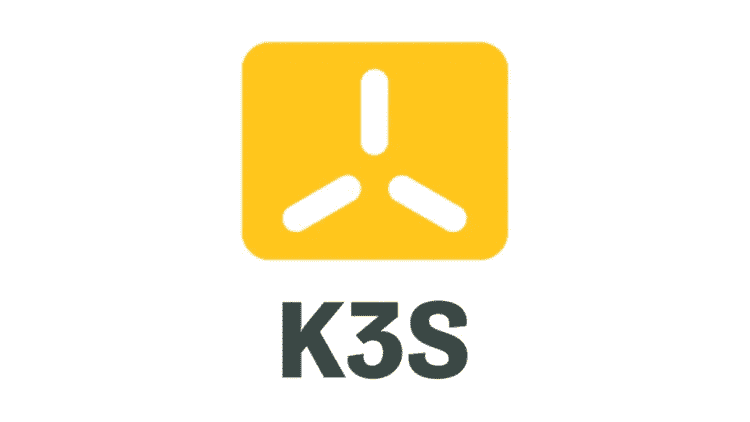
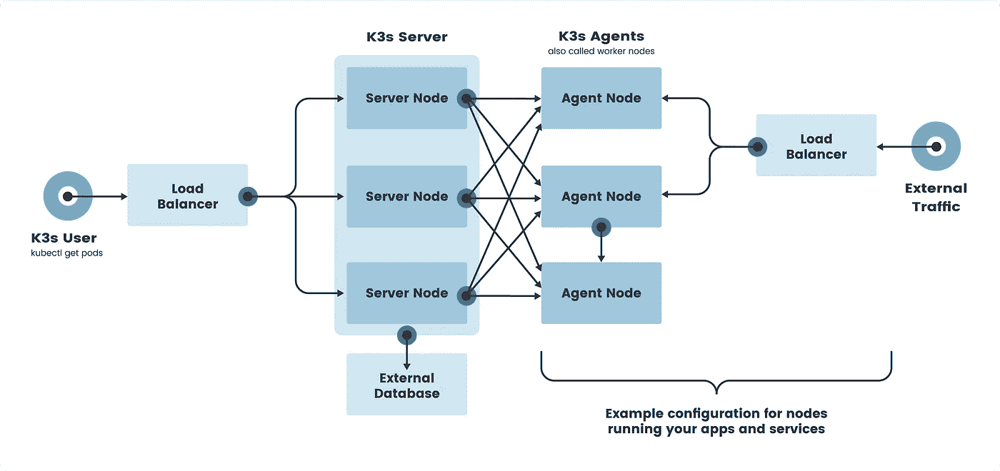

# Kubernetes 促进地方发展组织

> 原文：<https://blog.devgenius.io/kubernetes-for-local-development-a6ac19f1d1b2?source=collection_archive---------0----------------------->

Docker 桌面 vs. Minikube vs. Kind vs. K3s 等等


由[卢卡·布拉沃](https://unsplash.com/@lucabravo?utm_source=medium&utm_medium=referral)在 [Unsplash](https://unsplash.com?utm_source=medium&utm_medium=referral) 上拍摄

2019 年 11 月， [Mirantis 从 Docker 收购了 Docker 企业平台](https://www.mirantis.com/blog/mirantis-acquires-docker-enterprise-platform-business/)业务，并宣布放弃对 Docker Swarm 的支持，转而支持 Kubernetes。虽然 Docker Swarm 在社区版中仍然受支持，但不可否认的是，Kubernetes 在这一点上已经赢得了容器编排市场。

在过去，我曾[写过关于生产级 Kubernetes 部署的各种 Kubernetes 即服务选项](https://medium.com/swlh/state-of-managed-kubernetes-2020-4be006643360)。虽然很容易在云上启动测试集群并在不使用时删除资源(特别是在 GKE 上，通过将节点扩展到 0)，但对于快速本地测试或在 CI 环境中，轻量级解决方案是首选。在本文中，我将比较几个受欢迎的本地 Kubernetes 装置。

# Docker 桌面


如果您为 Mac 或 Windows 安装了 Docker Desktop，那么在 Preferences 菜单下启用 Kubernetes 后，您可以利用原生的 Kubernetes 集成来部署工作负载。这将启动安装了`kubectl`和`docker-for-desktop`上下文的单节点集群。


Docker 桌面是一个用户友好的解决方案，如果您的工作流程与 Docker CLI 紧密相关，它会非常好用。如果启用了 Hyper-V 虚拟机管理程序，并且没有其他虚拟机管理程序正在运行(即 VirtualBox、vagger)，它还支持运行 Windows 容器。

使用 Docker Desktop 的主要优势在于，假设已经为现有的 Docker 工作流安装了 Docker Desktop，则不需要其他工具。然而，与列表中的其他选项相比，该功能集相对有限(例如，没有安装 Kubernetes 仪表板，缺少附加组件，仅支持 LTS Kubernetes 版本)。

*   **优点**:一键安装
*   **缺点**:功能集有限

# 迷你库贝


Minikube 是 2016 年 5 月开始的 Kubernetes SIG 项目，拥有成熟的生态系统。使用软件包管理器安装 minikube 很简单:

```
# Mac
brew install minikube# Windows
choco install minikube
```

minikube 最大的优势是跨平台支持。Minikube 在 Linux、macOS 和 Windows 上运行，支持 Docker、Hyperkit、KVM、Parallels、Podman、VirtualBox 和 VMWare 驱动程序。通过发出`minikube start`，创建了一个单节点 Kubernetes 集群，它具有现成的 Kubernetes 仪表板和负载平衡器支持。

您可以配置 minikube 运行:

*   多个集群
*   不同的 Kubernetes 版本(+6 个以前的次要版本)
*   不同的容器运行时(Docker、containerd、CRI-O)
*   部署为虚拟机、容器或裸机

还有各种插件(例如入口控制器、metrics-server、helm)来简化 Kubernetes 实用程序的安装。minikube 的另一个好处是，许多文档和教程都是用 minikube 编写的，因为它是最古老的工具。

对于大多数有经验的 Kubernetes 用户来说，minikube 可能是在没有其他选择的情况下最受欢迎、最可靠的工具。如果我不得不提到一个缺点，那就是 minikube 在作为 VM 部署时可能会很慢(3-5 分钟)。

*   **优点**:强大的功能集
*   **缺点**:初始启动时间慢

# 种类



Kind 是另一个 Kubernetes SIG 项目，在 Docker 内部代表 Kubernetes。它最初是为了测试 Kubernetes 本身而设计的，但也可以用于本地开发或 CI 环境中。在引擎盖下，kind 使用 kubeadm 在 Docker 中引导 Kubernetes。

Kind 可以通过 Go 或从软件包管理器安装:

```
# Mac
brew install kind# Windows
choco install kind 
```

既然 minikube 支持使用 Docker 驱动程序进行部署，使用 kind 可能就不那么吸引人了，尤其是 kind 还没有达到 1.0 的里程碑。但是，使用 kind 的一大优势是它支持多节点(包括 HA)集群。如果您需要测试运行 HA 的应用程序，或者想要运行灾难恢复场景，kind 可能是在云资源上花钱的一个很好的替代方案。

```
# an example cluster with 3 control-plane nodes and 3 workers
kind: Cluster
apiVersion: kind.x-k8s.io/v1alpha4
nodes:
- role: control-plane
- role: control-plane
- role: control-plane
- role: worker
- role: worker
- role: worker
```

*   **优点**:支持多节点集群
*   **缺点:**功能集比 minikube 小

# K3s



K3s 是由 Rancher Labs 为物联网和边缘应用开发的轻量级 Kubernetes 发行版。K3s 去掉了许多遗留的特性/插件，并用 Kubernetes 组件替代了轻量级组件(sqlite vs. etcd ),以实现大约 60MB 的二进制大小。这也意味着启动时间以秒而不是分钟为单位。

K3s 可以配置为单节点运行或在 HA 中运行(k3 调用主节点`server`和工作节点`agents`)。除非你设计的应用运行在边缘/嵌入式设备上，否则你可以使用[k3d](https://github.com/rancher/k3d)(Docker 中的 k3)来复制 kind 的行为。最后，尽管占地面积很小，k3s 是一个完全符合 Kubernetes 的发行版，内置了 CNI(法兰绒)、入口控制器(Traefik)和头盔控制器。



图片来源:[牧场主实验室](https://rancher.com/docs/k3s/latest/en/architecture/)

*   优点:极其轻便
*   **缺点**:可能需要一些定制来运行重负载

# 结论

“完美的”本地 Kubernetes 安装可能会因您的用例而异。如果你是 Kubernetes 的新手，想要一个温和的介绍，Docker 桌面将是一个很好的第一步。如果你想要一个安全的选择，minikube 是最长的，有很多文档。最后，如果多节点设置至关重要，或者如果需要较小的占用空间，请使用 kind 或 k3s/k3d。就个人而言，我一直在使用 minikube，但希望在 CI 管道中尝试 k3d。

如果这些工具都不符合您的需求，下面是一些可供选择的工具:

*   [MicroK8s](https://microk8s.io/)
*   [项目类型](https://github.com/dotnet/tye)(以前为 Micronetes)
*   [倾斜](https://docs.tilt.dev/)