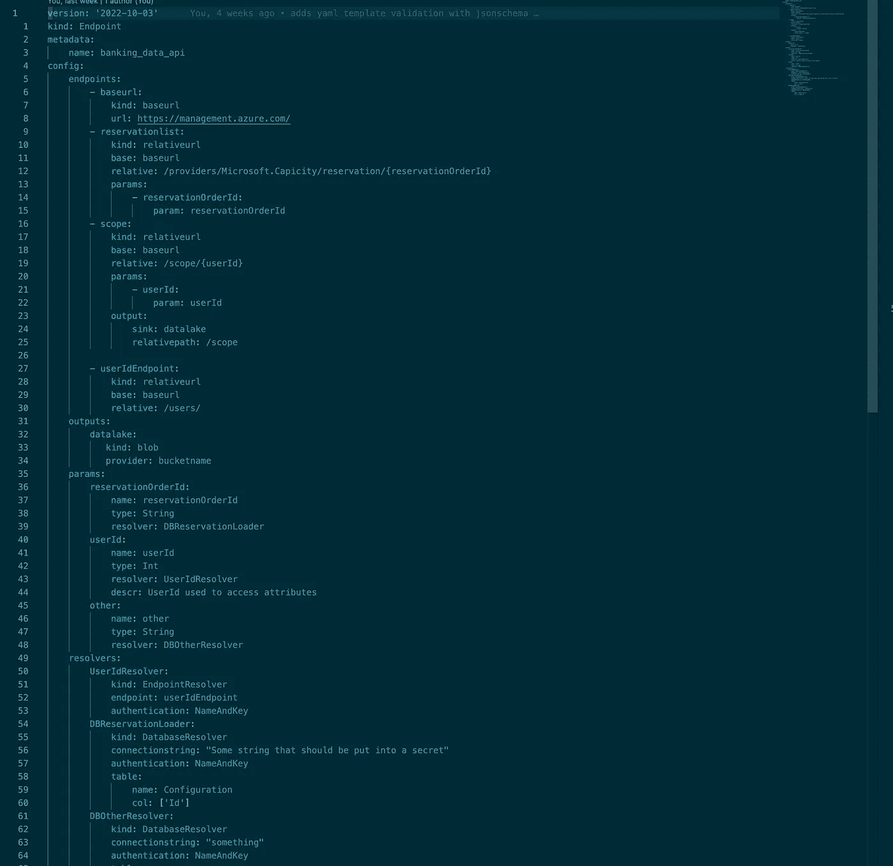

# 一次声明，随处部署:管理 REST API 与 IngestLess 集成的无服务器方法

> 原文：<https://blog.devgenius.io/kubernetes-for-rest-integration-c916dcafe769?source=collection_archive---------20----------------------->

照片由[卢卡·布拉沃](https://unsplash.com/@lucabravo?utm_source=medium&utm_medium=referral)在 [Unsplash](https://unsplash.com?utm_source=medium&utm_medium=referral) 上拍摄

如果您可以将复杂的 REST API 集成的业务逻辑定义为一个 YAML 文件并完成它，这不是很好吗？

为什么我们必须在 REST API 文档中挖掘，并编写一个管道来解析一些参数，将它们存储到一些元数据表中，只是为了再次迭代这些条目来解析我们实际想要查询的端点？

在 GraphQL 只有一个端点的时代，管理这些 REST 集成对您来说不也是一种不必要的痛苦吗？对我来说的确如此。

## 我们将在这个系列中做些什么

在下面的文章中，我将描述第一个`IngestLess`框架的 PoC 实现，它使用 YAML 格式的 Kubernetes 风格的配置文件来描述一组要摄取的依赖 REST API 端点。

该架构建立在语义抽象层之上，该层定义了跨越`functions`、`tables`、`queues`和`topics`的交互，将所需的编排逻辑放到本机后端。是的，这可以是任何无服务器的后端(AWS，Azure，K8s 等等)。)

一个基于 ServiceBus 功能构建的示例 Orchestrator 将展示如何使用事件触发器、消息传递、用于数据传递的中间存储队列以及扇出数据解析主题(针对多个函数需要解析来自上游解析器的相同数据的情况)对跨函数的交互进行本机建模。

该项目是我正在构建的即将到来的人工智能交易平台系统所需的数据摄取层的概念验证，欢迎所有反馈和功能请求。

## 一次声明，随处部署

**做梦…… **

您深入研究您最喜欢的数据集成服务的 REST API 文档，并检查您需要访问哪些端点，然后定义您需要在端点 URL 上动态设置的参数，定义查询参数和身份验证类型，并配置一组解析器函数来为您获取这些参数(可能是从模板、本地或 S3 上的文件，也可能是从 DB 表？？).

您在目标无服务器后端提供者(如 AWS)上初始化您的应用程序，并规划您的模板。一旦您的模板检查了正确性(意味着所有服务都被正确定义)，您就可以计划您的应用程序并为您的 AWS 部署取回 IaC 代码。

最棒的是，您需要编写的所有无服务器函数都自动为您编译好了，这些函数用于访问您的端点、进行身份验证、解析响应体、将其转换为目标格式并将其写入您的目标接收器。

从一个函数返回的数据需要作为另一个函数的输入(例如解析 REST 端点中的动态参数),这些数据在无服务器队列中的函数之间自动传递。并且由多个用户使用的数据会自动分散到主题中。

根据您在端点配置中指定的刷新需求，自动安排您的所有业务流程。

您检查正确性并点击部署。您的堆栈得到部署，并根据函数和配置的触发器之间的依赖关系自动编排函数的执行。

您的数据流入，所有功能都被跟踪，您可以使用本机日志记录和监控工具来保持一切正常。

你看着你的账单，你看到的只是无服务器执行、事件触发器、BLOB、存储队列、主题、服务总线和无服务器表消费。

等等？没有 3 倍冗余集群管理器来协调您的摄取集群？没有完全开启的工作节点来执行您的接收？等等，没有两分钟的启动时间，只是为了执行 REST API 调用。哦..您最喜欢的(:)编排框架也没有许可成本。

只是没有服务器…嗯。

！！醒来

哦，天啊，哪里能找到这个？嗯…

我们可以一起建这个吗？在路上，我确信我们可以学到一些关于如何使用无服务器开发一个稍微复杂一点的系统，如何在你的后端基础设施上创建一个合适的抽象，如果你将来需要从第三方获取一些数据，让你的生活变得更容易(更便宜)。

# Kubernetes 无服务器休息摄入

让我们从目标配置界面开始。

我们希望拥有:

*   端点逻辑的纯函数声明，没有管道，没有请求函数。不要！也没有 UI。天啊，我讨厌你们…
*   我们运行的每个端点接收作业只有一个模板文件
*   我们希望能够设置动态解析的参数，就像我们使用的 REST API 文档中描述的那样
*   我们希望能够从另一个 REST 端点、本地文件、SQL/NoSQL 表中获取/解析这些参数
*   我们希望使用 DRY 来设置一个`BaseEndpoint`，它可以被我们的摄取作业中的许多`Endpoints`重用。
*   我们希望将数据存储在不同的`Sinks`中，比如 BLOB 存储、数据库、临时队列、主题
*   我们希望根据目标模式对输入进行验证
*   我们希望解析响应体的元素，以将导入的数据分成子集
*   我们希望将输出格式化为优化的格式(而不是让 JSON/XML 的混乱淹没我们的湖泊)
*   还有更多…..

## 模板结构

因此，让我们将这些需求映射到我们的模板结构中。

*   我们需要为我们想要执行请求的每个端点 url 定义`Endpoints`
*   我们需要为我们在`Endpoint` url 中使用的每个动态变量定义一个`Parameter`
*   我们需要为我们定义的每个`Parameter`定义`Resolver`函数，以获取数据并返回给我们一个迭代器来传递给`Endpoint`执行
*   我们需要定义`Output`位置来参数化来自`Endpoint`执行的响应的接收目的地

这可能看起来像这样(端点完全是虚构的)

# 如何做到这一点？

让我们抽象出一些东西来更清楚地了解我们在这里所面临的情况。

查看我们的流程结构，我们可以将其分解为一组主要参与者，我们需要在这里集成这些参与者:

1.  我们需要一个`TemplateParser`，我们可以把我们的模板，这将使其他人可以访问配置。如果我们缺少某些东西，或者某些东西没有正确配置，它就会向我们抱怨。
2.  一个`Resolver`，它采用由`TemplateParser`概述和验证的配置，并解析我们的配置中组件之间的依赖关系/链接。这将确保所有需要`abc_param`的端点最终都指向同一个`Resolver`来接收这个参数。而且分辨率明显提高了很多…
3.  一个`Orchestrator`检查依赖项需要以什么样的顺序执行，以便当到达那些 REST 端点时，这里的每个人都以正确的数据结束！所以我们在这里期待一些解析树遍历。
4.  此外，拥有一个`Compiler`可以获取所有这些编排好的元素，并在我们的目标后端为我们创建一组可部署的、因此可执行的元素，这将非常方便。这是我们不写任何 IaC 模板，也不编码任何东西的地方。
    我最喜欢的部分:)
5.  有了这些编译好的结构，我们现在需要在后端`Schedule`它们。以便每个函数在正确的时间表或事件上触发，将触发传递给下一个函数，如此等等。
    也是我不喜欢手动写的东西。不知道你怎么样

是的，我想这可以让我们继续前进

# 下一个

今天，我们在高层次上介绍了`IngestLess`框架的概念，并研究了我们希望如何与我们的系统进行交互。我们定义了我们不想再手工做的事情，并为我们的主要参与者设置了一个责任结构。

在下一篇文章中，我们将看到一个选项来实现将接收我们的文件的`TemplateParser`,应用模式验证步骤来检查正确性，并将 YAML 配置解析为一组具有已定义接口的类，这些接口将允许所有下游服务愉快地解析、编排、编译和部署它到我们正在寻找的最终 IaC 输出。

我们将利用 JSONSchema 进行验证，并用 Python 设计我们的 ParseGraph 来保存每个指定模板实体的配置。

如果您想直接跳到当前 PoC 的混乱状态，请查看这个项目的 [GitHub repo，网址为:](https://github.com/data-native/ingestless/restmap)

【https://github.com/data-native/ingestless 

这是一个爱好项目，如果你喜欢这个想法，你可以用几个