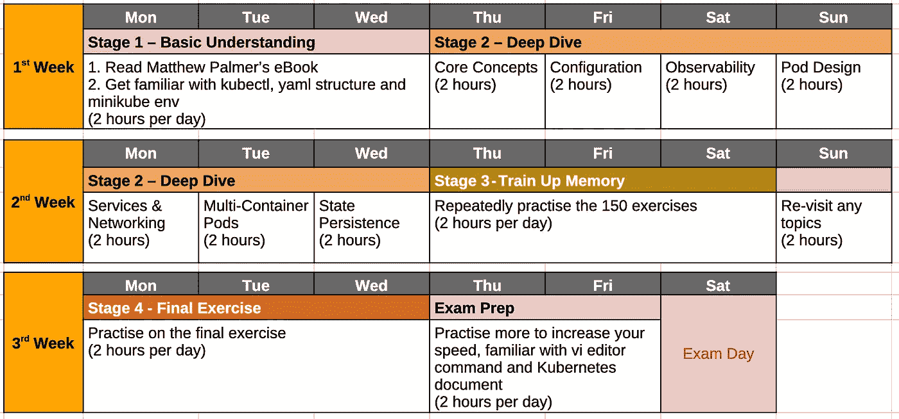
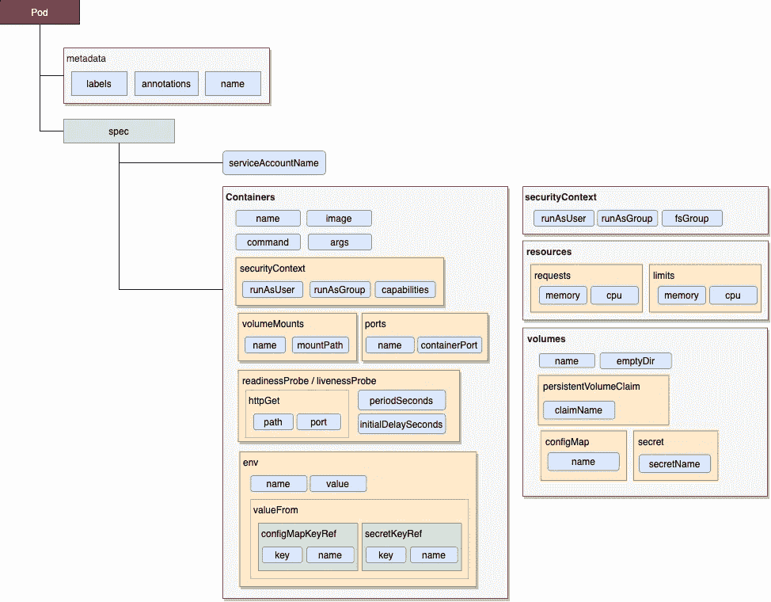

# kubernetes——如何在 3 周内掌握现代应用程序开发的基本技能

> 原文：<https://blog.devgenius.io/kubernetes-how-to-acquire-the-essential-skills-of-modern-application-development-in-3-weeks-f62acf3b7d83?source=collection_archive---------2----------------------->

获得认证 Kubernetes 应用程序开发人员(CKAD)的权威指南


布拉登·科拉姆在 [Unsplash](https://unsplash.com?utm_source=medium&utm_medium=referral) 拍摄的照片

你绝对可以在 3 周甚至更短的时间内获得 Kubernetes 的技能，并获得证明你的知识的认证。

在软件开发领域，每个人都渴望在技术飞速发展的快节奏环境中拥有多种技能。 **Kubernetes** 近年来迅速崛起，已经成为应用服务平台的通用标准。掌握 Kubenetes 无疑是增强您的竞争优势和提升您在 DevOps 和微服务开发领域的技能组合的一种方式。

我最近获得了这一关键技能，并获得了 Kubernetes 应用程序开发人员的认证。当然，参加考试是掌握新技能的有效方法，因为考试范围和学习者要达到的目标是合理的。因此，在这篇文章中，我将分享我的经验——实际的分步准备，建议的学习计划，有用的资源以及考试技巧。

## 什么是 Kubernetes？

Kubernetes (aka k8s)不是一个英文单词，几年后我第一次看到它时很奇怪。这是一个强大的自动化平台，它将应用程序编排为 docker 映像，如部署、扩展、操作等。如今，许多企业和初创公司已经在生产中提供了这个平台。

## 关于认证 Kubernetes 应用程序开发人员(CKAD)

CKAD 是云不可知的，它专注于 Kubernetes 的技术，这意味着该技术适用于 AWS EKS、谷歌 GKE 等云提供商。您可以专注于核心知识，而不会被供应商产品的特定功能分散注意力。掌握了核心概念之后，您就可以很容易地理解这些供应商的特性了。

一旦您获得认证，您就可以应用新获得的技能，并受益于实践培训，立即为您的团队做出贡献。

# 关于 CKAD 考试

这是一个 100%的实践考试，你将完成在 Kubernetes 上为每个问题设置和解决问题的任务。考试包括总共 19 个问题，时间为 2 小时。涵盖了广泛的主题，下面按分数权重列出了这些主题，包括设计、设置、部署、监控以及故障排除。

*   **Pod 设计(20%)** —使用标签、Pod 选择器等
*   **配置(18%)** —配置图，秘密
*   **可观察性(18%)** —活性探测、就绪探测、记录、监控
*   **核心概念(13%)** — Pod、部署、扩展、服务帐户、配额、作业、cron 作业
*   **服务&联网(13%)** —网络政策和服务组件
*   **多容器吊舱(10%)** —侧车、大使、适配器
*   **状态持久性(8%)** —持久性卷设置

## 先决条件

在我们进一步深入之前，假设您已经掌握了以下各项的基本知识。

*   **Docker** —一般概念和基本操作
*   **Shell 脚本**—if-else、while loop、for loop 等基本命令和逻辑流程。

# 3 周准备计划

这个计划帮助我通过了考试。这个想法是以一种渐进的方式积累知识，从基本概述、特定主题的深入探讨、巩固和最后的模拟测试。如果你可以每天分配更多的时间，或者你已经有了在 Kubernetes 的工作经验，那么你可以将整个计划压缩到一个更短的时间框架内。比如我把计划浓缩了，2 周内领证。

成功的关键是承诺和自律，根据计划每天留出时间学习。



CKAD 研究计划

## **第一阶段——基本理解**

理解 Kubernetes 的概念是帮助你建立重要基础的第一步。你可以直接去 Kubernetes 官方文档([https://kubernetes.io/docs/home/](https://kubernetes.io/docs/home/))阅读所有文档。然而，对于初学者来说，消化一大堆文档是很困难的，而且很容易迷路。

幸运的是，有一种更简单的方法来获得整体概念。我发现 matthewpalmer.net 的电子书非常有用。它写得很好，有清晰的图表说明。在研究开始时，我购买了电子书+练习包，并将它作为准备工作的主要资源之一。

当您阅读电子书时，请在您的 PC 上设置一个本地 Kubernetes 环境(minikube ),以便您探索和玩 Kubernetes。

[](https://matthewpalmer.net/kubernetes-app-developer/articles/ckad-practice-exam.html) [## 模拟考试—认证 Kubernetes 应用程序开发人员(CKAD)课程

### 这篇文章给你五个 CNCF 认证 Kubernetes 应用程序开发员(CKAD)考试的免费练习题…

matthewpalmer.net](https://matthewpalmer.net/kubernetes-app-developer/articles/ckad-practice-exam.html) 

## **第二阶段——深入探讨每个主题**

有了基本的了解，是时候深入每个主题的细节了。从实践中学习是获取知识的有效途径。Ben Muschko 的 GitHub 提供了演示练习，让我知道如何应用这些概念。如果问题对你来说很难，建议在这个阶段进行两次练习。

在做练习时，您可以进入[https://kubernetes.io/docs/concepts/](https://kubernetes.io/docs/concepts/)中的相关文档，以便更深入地理解每个主题。

[](https://github.com/bmuschko/ckad-prep/blob/master/2-configuration.md#configuring-a-pod-to-use-a-configmap) [## bmuschko/ckad-prep

### 创建一个名为 config.txt 的新文件，每行使用以下环境变量作为键/值对。创建一个…

github.com](https://github.com/bmuschko/ckad-prep/blob/master/2-configuration.md#configuring-a-pod-to-use-a-configmap) 

视觉化是一种强大的技术，可以在图片或图表中呈现复杂的概念，这是消化和记忆复杂概念的更容易的方法，而不是把定义塞进我的大脑。以下是 pod 定义中最常用项目的简化版本的一些示例。你可以创造你自己的。



Kubernetes Pod 规格(简化版)

## **第三阶段——训练你的记忆力**

由于这是一次 100%动手操作的考试，您应该花 50%以上的时间来练习命令行，并确保快速完成，而不必频繁地在参考文档中查找信息。 [Bhargav Bachina](https://medium.com/@bhargavbachina?source=post_page-----2f42d1228552----------------------) 的 150 个问题是极好的资源。虽然这些问题很简单，但我反复练习了它们，并针对各种用例在命令行和 YAML 结构上训练了我的肌肉记忆。

[](https://medium.com/bb-tutorials-and-thoughts/practice-enough-with-these-questions-for-the-ckad-exam-2f42d1228552) [## 用这 150 个问题为 CKAD 考试做足够的练习

### 练习帮助您为认证 Kubernetes 应用程序开发人员考试做好准备

medium.com](https://medium.com/bb-tutorials-and-thoughts/practice-enough-with-these-questions-for-the-ckad-exam-2f42d1228552) 

## 第 4 阶段—最终练习

由于你已经掌握了这些概念，现在是时候测试你的知识，看看你是否准备好了考试。我用了 matthewpalmer.net**的练习题。因此，我强烈建议购买电子书+练习的捆绑包。记住记录你在每个问题上的表现。真题考试时间有限，时间紧张。你最好花不到 4 分钟来回答这些简单明了的问题。**

# 考试准备和提示

## 节省重复输入命令的时间

在时间关键的性能基础考试中，找出避免重复击键的方法是节省更多时间的关键技术之一。最常用的命令是 **kubeclt** 。因此，在考试开始时设置下面的命令快捷方式将有助于您更快地键入命令行。

```
alias setup k=’kubeclt’
```

## 让你的编辑对 YAML 友好

您需要编辑 YAML 文件来创建 Kubernetes 对象，以便完成大多数考试问题。由于粗心的缩进错误，许多人浪费时间在解决 YAML 文件的问题上，因此在编辑器上启用行号和自动缩进可以避免格式错误，并帮助您用更少的时间完成问题。

VI 是终端环境中默认的文件编辑器。你可能需要一些时间来熟悉它，因为考试只提供终端命令提示符，而不是 GUI 桌面。或者，您可以选择其他基于终端的编辑器，如 emacs。请务必在考试前熟悉复制和粘贴、重做/撤消、导航等用法。

这里是 YAML 文件编辑的建议 vi 配置，因此您可以在考试开始时设置配置。

```
vi ~/.vimrc# then add these two lines to the fileset number
set shiftwidth=2
set autoindent
set smartindent
syntax on
filetype plugin indent on
colorscheme desert
```

## 并行处理多个终端

很多人在网上分享这个小技巧。 **tmux** 是一个在单个终端命令提示符下创建多个虚拟终端甚至分屏的工具。由于考试中只提供了一个命令提示符，因此如果您可以在多个终端上并行工作，这将是一个优势。例如，对象删除命令可能需要一些时间才能完成，因为 Kubernetes 允许在宽限期内终止 pod。然后，在删除仍在进行时，您可以切换到另一个终端继续其他工作。

我确实在考试中使用了虚拟终端，但它对我没有太大帮助。事实上，一个命令提示符足以处理所有考试问题。

如果你想了解更多，可以参考这篇文章。

[](https://medium.com/@jeongwhanchoi/install-tmux-on-osx-and-basics-commands-for-beginners-be22520fd95e) [## 在 OSX 上安装 tmux 和初学者的基本命令

### tmux 是一个终端多路复用器。

medium.com](https://medium.com/@jeongwhanchoi/install-tmux-on-osx-and-basics-commands-for-beginners-be22520fd95e) 

## 熟悉 Kubernetes.io 文档结构

这是一次开卷考试。您可以在 Kubernetes 文档(https://kubernetes.io)上保留一个浏览器标签，以供考试期间参考。为了加快信息查找的速度，熟悉文档结构是必须的，否则，你将浪费大量时间在网站上导航页面而没有任何结果。以下是一些有用的提示供你参考:

*   **API 参考—** 没有必要记住所有的 YAML 定义，我只记得最常用用例的定义。您可以在 API 参考中找到所有 YAML 文件的定义。例如，您可以快速查找答案，以防忘记如何将秘密与 pod 关联。([https://kubernetes . io/docs/reference/kubernetes-API/API-index/](https://kubernetes.io/docs/reference/kubernetes-api/api-index/))
*   **任务** —您可以找到场景列表和相应的 YAML 定义示例。你会在文档中找到许多有用的例子，这样你就可以复制&粘贴 YAML 文件并进一步编辑。([https://kubernetes.io/docs/tasks/](https://kubernetes.io/docs/tasks/))
*   **搜索** —如果您不知道目标信息在参考资料中的位置，这是一种查找信息的便捷方式

## 设置一个私人房间和 USB 网络摄像头

您将在家参加考试，监考人员将远程监控您。请清理你的房间和书桌，确保那里没有其他的书或文件。Proctor 会要求您移动您的摄像机，以 360 度和桌子显示您的整个房间，因此需要 USB 网络摄像头，因为笔记本电脑内置的摄像头很难做到这一点。

## 时间管理

这种通用技术适用于所有考试，请首先完成这些简单的问题以确保您的分数。在这些问题上做个标记，如果需要花时间看的话就跳过它们，这样你就可以回头再做。

## 为每个问题设置上下文配置

每个问题都将向您展示如何设置上下文配置的命令行。记住在处理每个问题之前运行命令。这是我得到的教训，我浪费了宝贵的时间重新做了一些问题，因为我发现我用错误的上下文回答了问题

# 最后的想法

备考之旅是一次收获颇丰的经历，我不仅进一步掌握了知识，还将我的动手实践技能提升到了一个新的水平，使我能够在 Kubernetes 中使用终端命令更快地管理应用程序，而无需依赖 GUI 管理控制台。此外，在家进行远程考试节省了我的差旅费，特别是在疫情期间，并且允许在灵活的时间段安排考试(例如，我周六晚上 9 点参加考试)。如果你对掌握这些知识感兴趣，那么获得证书是实现你目标的有效途径。