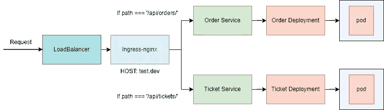
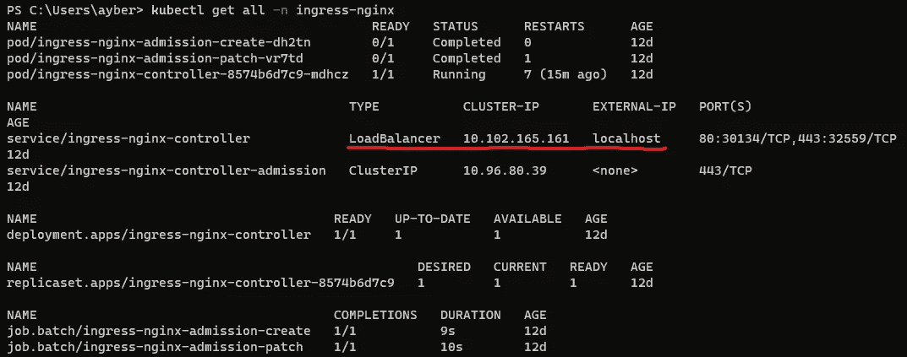
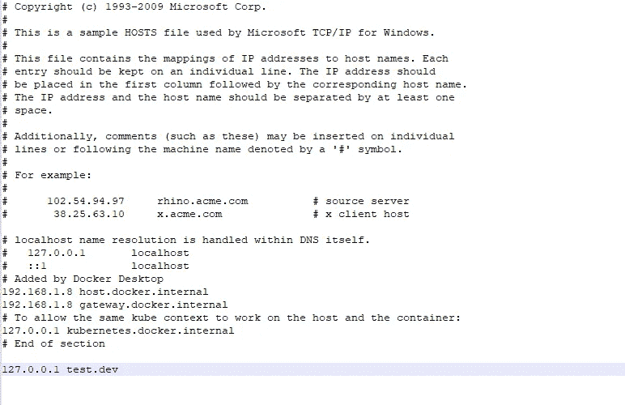

# 使用 Nginx 的 Kubernetes 入口

> 原文：<https://blog.devgenius.io/kubernetes-ingress-with-nginx-975e6867c617?source=collection_archive---------7----------------------->



基础建筑

你好，在这篇文章中，我们将看看 kubernetes 入口 nginx 控制器。

Ingress 是一个解决方案，它使我们能够将外部流量定向到集群中的 kubernetes 服务。

入口 nginx 控制器工作在第 7 层，这意味着它给我们一个机会来做基于路径的路由选择。如果不使用 ingress，我们需要为每个应用使用单独的 loadbalancer，这很难管理，这也是 ingress 漂亮的另一部分。

**想知道 ingress 是怎么工作的，可以查:**[https://kubernetes . io/docs/concepts/services-networking/ingress/](https://kubernetes.io/docs/concepts/services-networking/ingress/)

**要安装 nginx 控制器，请点击这里:**[https://kubernetes.github.io/ingress-nginx/deploy/](https://kubernetes.github.io/ingress-nginx/deploy/)

当您安装 ingress-nginx 时，它会创建一个名称空间来存放由它创建的对象。Nginx 实际上是一个应该在集群中运行的应用程序。这就是它部署部署对象的原因。



由 ingress-nginx 创建的对象

正如您所看到的，ingress-nginx-controller 创建了一个监听本地主机 80 和 443 端口的负载平衡器服务。

如果您已经安装了 nginx 入口控制器，让我们开始。如果我们看上面的示例架构，我们需要首先创建部署和服务。

**注意:容器的映像只是监听端口 3000 的 express 应用程序，这没什么大不了的。**票务应用程序已获取 **"/api/tickets/"** 的路由器，订单应用程序已获取 **"/api/orders/"** 的路由器，并且两者均以简单的“hello from < app-name >”响应。

为票证和订单应用程序创建部署和服务对象；

```
kubectl apply -f depl.yaml
```

创建入口；

```
kubectl apply -f ingress-srv.yaml
```

rules 部分中的主机很重要，因为您可以在一个 kubernetes 集群中托管多个域。这就是这个主机属性的全部内容。

由于文件中的特定域属性，我们不能仅通过在浏览器上键入 localhost 来访问应用程序。要访问它们，我们将使用一个技巧。换句话说，每当我们试图连接 test.dev 时，它将连接到本地主机，而不是真正的 test.dev 域，由于我们的技巧，它可能存在于互联网上的某个地方。

为了应用这个技巧，我们将更改机器内部的主机配置文件。

主机配置文件的位置取决于操作系统；

```
Windows: C:\Windows\System32\Drivers\hosts
Mac&Linux: /etc/hosts
```



添加绑定到本地主机 ip 的 test.dev 的定义

**快速注意:**如果您正在使用 minikube，您应该使用您的 minikube ip 而不是 127.0.0.1(要了解您的 minikube ip，只需在您的终端上键入‘minikube IP ’)

所以让我们试试，打开浏览器，试着去 test.dev/api/tickets 和 test.dev/api/orders

如果你看到**不安全**页面。只要在浏览器的某个地方输入“thisisunsafe”就行了。

我希望它有用。感谢您宝贵的时间。下期文章再见:)