# 使用 Kubeadm 在 Openstack 虚拟机上安装 Kubernetes

> 原文：<https://blog.devgenius.io/kubernetes-installation-on-openstack-vms-with-kubeadm-fec5d96b1db8?source=collection_archive---------3----------------------->

这篇文章演示了使用 kubeadm 在 Openstack 托管的 VM 上安装 kubernetes。

我们假设为此安装创建一个空白的 Openstack 项目。

Debian 11 被用作虚拟机的操作系统。

# **步骤 1:创建专用网络**

点击“网络->网络”菜单后的“创建网络”按钮。

写一个适合你个人喜好的网络名称。

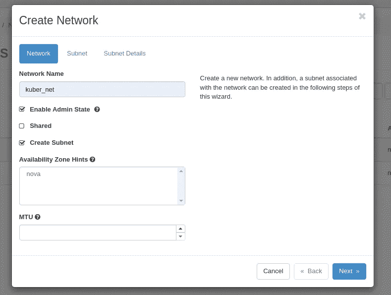

命名网络

我们应该为实例(未来的 Kubernetes 节点)的 IP 分配创建一个子网。

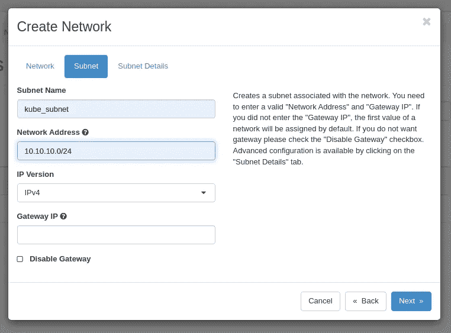

确定网络的子网

单击“下一步”并完成向导。

# **第二步:创建路由器**

为了从互联网访问实例，我们需要通过路由器将实例连接到公共网络。

沿着“网络->路由器”路径，点击“创建路由器”按钮。

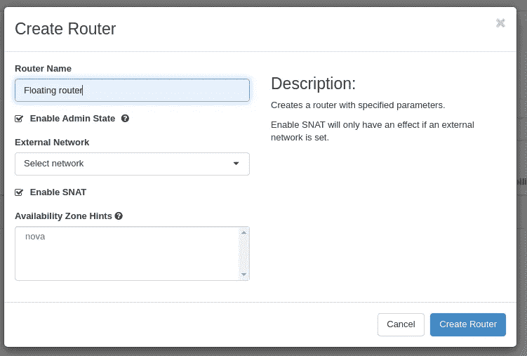

创建路由器

命名路由器并从“外部网络”列表中选择公共网络，然后完成向导。

创建路由器后，单击路由器名称。

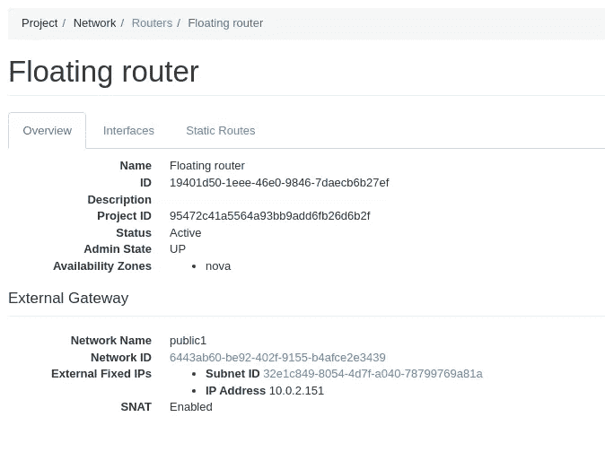

路由器详细信息

单击“接口”选项卡，然后在打开的页面上单击“添加接口”按钮。

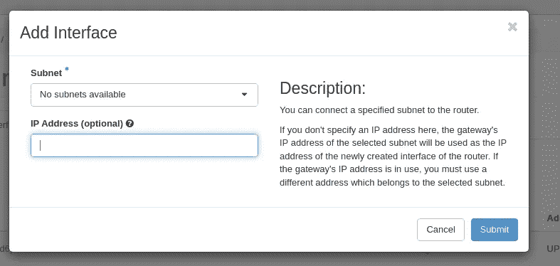

向路由器添加接口

选择我们的实例使用的合适的专用子网，然后完成向导。

在此过程之后，您应该会看到如下所示的路由器菜单。

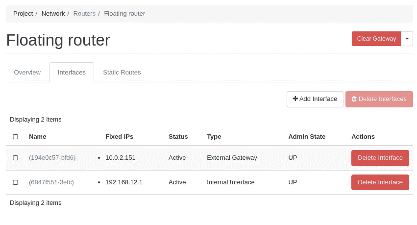

路由器菜单

# **第三步:创建实例**

我们准备创建实例。

打开“实例”菜单，然后单击“启动实例”按钮。

在开始屏幕上命名实例。

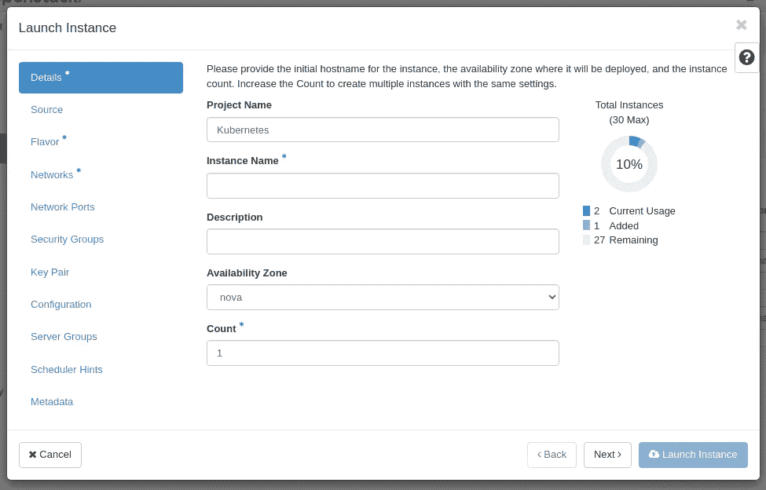

启动实例屏幕

选择口味。您应该选择一个具有超过 2g 内存的版本(Kubernetes 主节点推荐 4GB)。

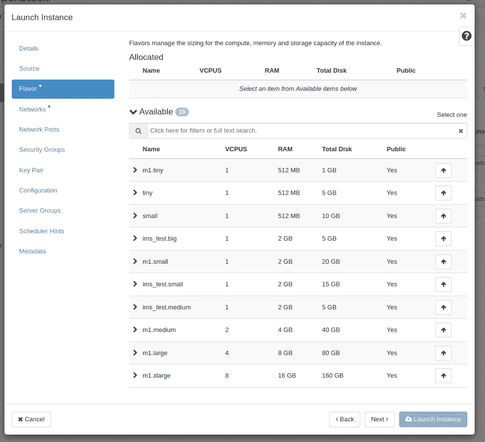

选择口味

选择您创建的用作内部网络的网络。

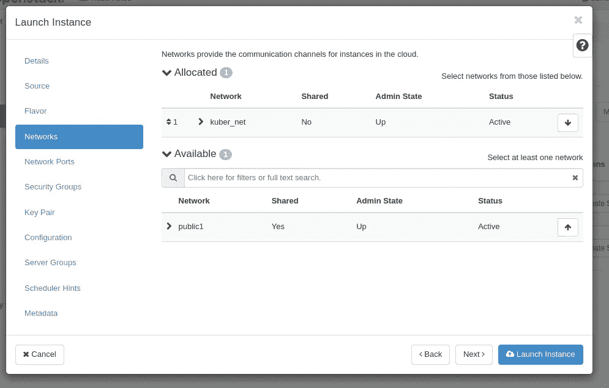

选择网络

为连接实例附加密钥对。(你自己看吧)

如果您计划单独安装主节点和工作节点，请分两次执行此过程。

# **第四步:分配和关联浮动 IP**

我们需要为我们的实例分配和关联浮动 ip 地址，以便从网络外部访问它们。

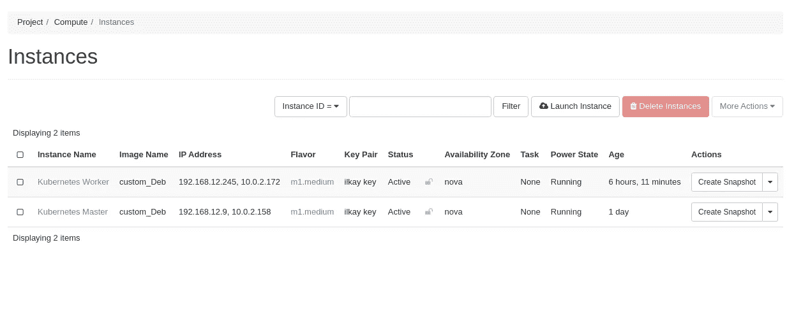

实例屏幕

单击位于实例右侧的下拉列表，然后选择“关联浮动 IP”

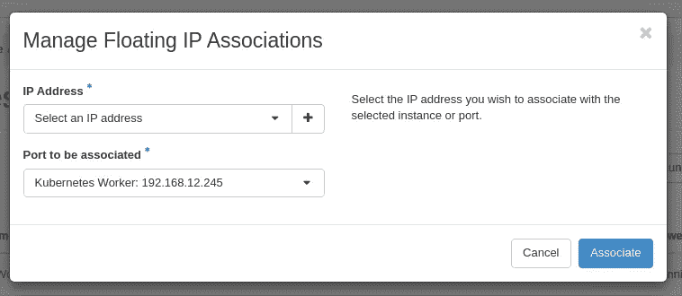

关联浮动 IP

如果您之前创建了浮动 IP 地址，则可以选择一个现有地址并将其与选定的实例相关联。如果您没有任何浮动 IP，向导将帮助您创建一个浮动 IP，毕竟，您可以将此浮动 IP 关联到实例。

完成这个过程后，您应该会看到如下所示的屏幕。

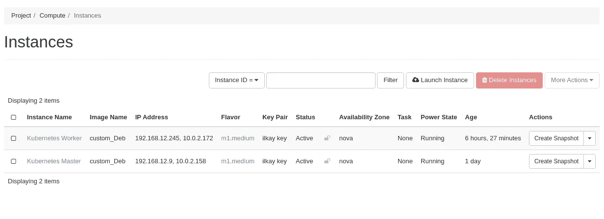

浮动 IP 关联实例

# **步骤 5:修改安全组**

我们必须允许 ssh 流量通过使用安全组从外部访问实例。

沿着“Network->Security Groups”路径，然后单击与我们的实例相关联的安全组上的“Manage Rules”按钮(如果您在它可能被命名为“default”之前没有进行任何更改)。

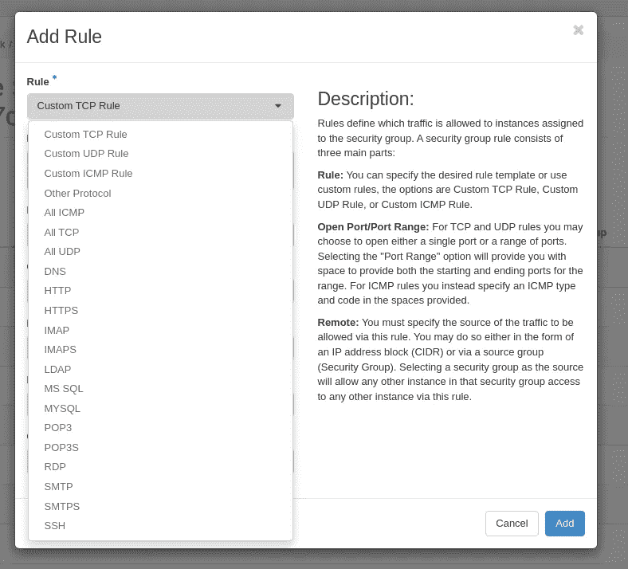

安全组规则列表

从列表中选择 SSH 并完成向导。

# **步骤 6:连接并准备实例**

我们需要为 Kubernetes 安装准备创建的实例。

**1)** 为了让 iptables 看到桥接的流量，我们必须加载“ *br-netfilter* 模块。这可以通过执行`sudo modprobe br_netfilter`来完成

成功安装模块后，您必须通过执行以下命令来添加参数，以正确查看桥接的流量。

```
$ cat <<EOF | sudo tee /etc/modules-load.d/k8s.conf
br_netfilter
EOF

$ cat <<EOF | sudo tee /etc/sysctl.d/k8s.conf
net.bridge.bridge-nf-call-ip6tables = 1
net.bridge.bridge-nf-call-iptables = 1
EOF$ sudo sysctl --system
```

**2)** 为了 Docker 的兼容性，在系统上禁用 cgroup 支持

我们必须在实例上禁用 cgroup 支持，因为它们可能会产生兼容性错误。

您必须将以下内核命令行参数添加到***"/etc/default/grub "***文件中

```
systemd.unified_cgroup_hierarchy=0systemd.legacy_systemd_cgroup_controller=0
```

以下是 grub 文件示例。不建议换成你的。你应该手工添加这些参数。

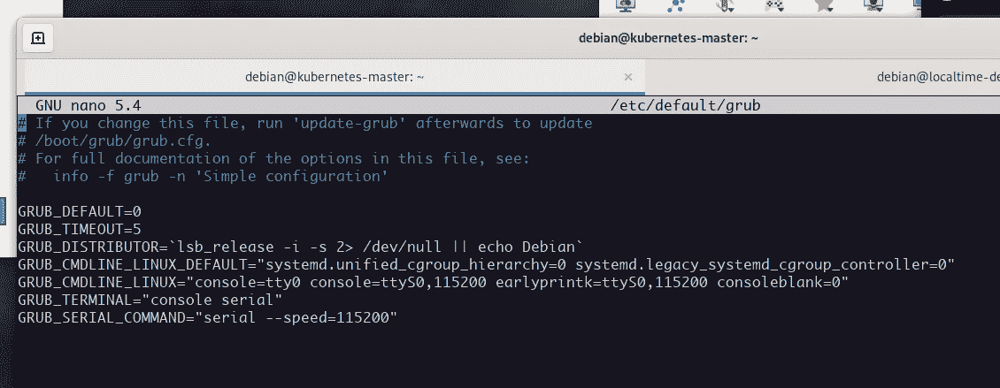

Grub 文件示例

在这一步之后，您必须使用以下命令来更新 grub。

```
$ sudo update-grub
```

然后重新启动实例。

**重要提示:您必须为您的所有实例进行这种配置。**

我们需要安装 Docker 环境作为将被 Kubernetes 使用的容器运行时。

a)安装要求:

```
$ sudo apt-get update

$ sudo apt-get install \
    ca-certificates \
    curl \
    gnupg \
    lsb-release
```

b)获取并添加 Docker 存储库的 GPG 键:

```
$ curl -fsSL [https://download.docker.com/linux/debian/gpg](https://download.docker.com/linux/debian/gpg) | sudo gpg --dearmor -o /usr/share/keyrings/docker-archive-keyring.gpg
```

c)添加 Docker 存储库:

```
$ echo \
  "deb [arch=$(dpkg --print-architecture) signed-by=/usr/share/keyrings/docker-archive-keyring.gpg] https://download.docker.com/linux/debian \
  $(lsb_release -cs) stable" | sudo tee /etc/apt/sources.list.d/docker.list > /dev/null
```

d)安装 Docker 环境:

```
$ sudo apt-get update
$ sudo apt-get install docker-ce docker-ce-cli containerd.io
```

# **第七步:安装 Kubernetes**

如果在这一步之前您没有得到任何错误，那么您已经准备好安装 Kubernetes 了。

**1)** 安装要求:

```
$ sudo apt-get update
$ sudo apt-get install -y apt-transport-https ca-certificates curl
```

**2)** 获取并添加谷歌云仓库的 GPG 密钥:

```
$ sudo curl -fsSLo /usr/share/keyrings/kubernetes-archive-keyring.gpg https://packages.cloud.google.com/apt/doc/apt-key.gpg
```

**3)** 添加 Kubernetes `apt`库:

```
$ echo "deb [signed-by=/usr/share/keyrings/kubernetes-archive-keyring.gpg] [https://apt.kubernetes.io/](https://apt.kubernetes.io/) kubernetes-xenial main" | sudo tee /etc/apt/sources.list.d/kubernetes.list
```

**4)** 安装 kubelet、kubeadm 和 kubectl:

```
$ sudo apt-get update
$ sudo apt-get install -y kubelet kubeadm kubectl
$ sudo apt-mark hold kubelet kubeadm kubectl
```

重要提示:你必须在你的所有实例上做同样的过程。

**5)** 创建 kubeadm-config.yaml:

我们将使用 kubeadm-config.yaml 来配置我们的 Kubernetes 集群。您可以使用以下命令创建和编辑该文件。

```
$ sudo nano kubeadm-config.yaml
```

下面是我们的 kubeadm-config.yaml 文件的内容。

```
# kubeadm-config.yamlkind: ClusterConfigurationapiVersion: kubeadm.k8s.io/v1beta3kubernetesVersion: v1.23.1networking:podSubnet: "10.244.0.0/16" # --pod-network-cidr for using with flannel---kind: KubeletConfigurationapiVersion: kubelet.config.k8s.io/v1beta1cgroupDriver: cgroupfs
```

将更改写入文件并关闭编辑器。(按 F3->回车->F2)

**6)** 应用 kubeadm-config.yaml:

我们准备配置 Kubernetes 主节点。您可以通过以下命令开始配置。

```
$ kubeadm init --config kubeadm-config.yaml
```

成功执行该命令后，kubeadm 工具将提示您一个如下所示的输出:


Kubeadm 输出

下面是 kubeadm 命令的输出模式示例:

```
Your Kubernetes control-plane has initialized successfully!

To start using your cluster, you need to run the following as a regular user:

  mkdir -p $HOME/.kube
  sudo cp -i /etc/kubernetes/admin.conf $HOME/.kube/config
  sudo chown $(id -u):$(id -g) $HOME/.kube/config

You should now deploy a Pod network to the cluster.
Run "kubectl apply -f [podnetwork].yaml" with one of the options listed at:
  /docs/concepts/cluster-administration/addons/

You can now join any number of machines by running the following on each node
as root:

  kubeadm join <control-plane-host>:<control-plane-port> --token <token> --discovery-token-ca-cert-hash sha256:<hash>
```

您必须存储该输出的最后一行，以便向集群添加工作节点。

```
kubeadm join <control-plane-host>:<control-plane-port> --token <token> --discovery-token-ca-cert-hash sha256:<hash>
```

**7)** 创建 Pod 网络:

Kubernetes 需要附加组件来确保 pod 之间的连接。这个附件被命名为 CNI 工具。我们打算用法兰绒做 CNI 工具。您可以使用以下命令将该工具添加到您的集群中:

```
$ kubectl apply -f https://raw.githubusercontent.com/flannel-io/flannel/master/Documentation/kube-flannel.yml
```

**8)** 向集群添加工作节点:

如果您想将 worker 节点添加到您的集群中，您可以使用 worker nodes 命令，该命令建议存储在步骤 6 中。

```
kubeadm join <control-plane-host>:<control-plane-port> --token <token> --discovery-token-ca-cert-hash sha256:<hash>
```

以下是该命令的输出示例:

```
root@kubernetes-worker:/home/debian# kubeadm join 192.168.12.9:6443 --token ######## \
        --discovery-token-ca-cert-hash sha256:##########
[preflight] Running pre-flight checks
[preflight] Reading configuration from the cluster...
[preflight] FYI: You can look at this config file with 'kubectl -n kube-system get cm kubeadm-config -o yaml'
[kubelet-start] Writing kubelet configuration to file "/var/lib/kubelet/config.yaml"
[kubelet-start] Writing kubelet environment file with flags to file "/var/lib/kubelet/kubeadm-flags.env"
[kubelet-start] Starting the kubelet
[kubelet-start] Waiting for the kubelet to perform the TLS Bootstrap...This node has joined the cluster:
* Certificate signing request was sent to apiserver and a response was received.
* The Kubelet was informed of the new secure connection details.Run 'kubectl get nodes' on the control-plane to see this node join the cluster.
```

下面是“kubectl get nodes”的示例输出:

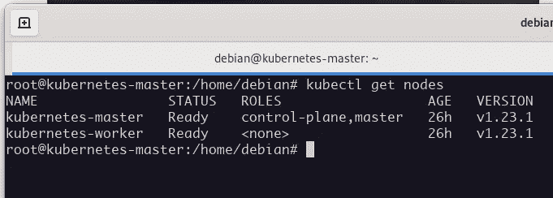

get 节点的示例输出

您可以使用以下命令查看 kube-system 窗格:

```
$ kubectl get pods --all-namespaces
```

以下是示例输出:

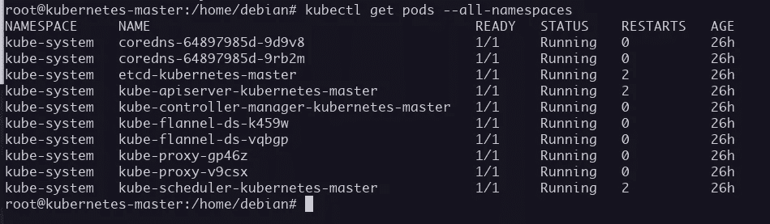

Kubernetes 豆荚

**9)** 为普通用户复制 Kubernetes 配置:

```
$  mkdir -p $HOME/.kube
$  sudo cp -i /etc/kubernetes/admin.conf $HOME/.kube/config
$  sudo chown $(id -u):$(id -g) $HOME/.kube/config
```

如果您想从不同的位置访问和修改您的 Kubernetes 集群，您可以使用在您的控制面板计算机上创建的配置文件。

# **恭喜**

您在由 Openstack 托管的虚拟机上安装了 Kubernetes。您现在可以尽情享受您的集群了:)