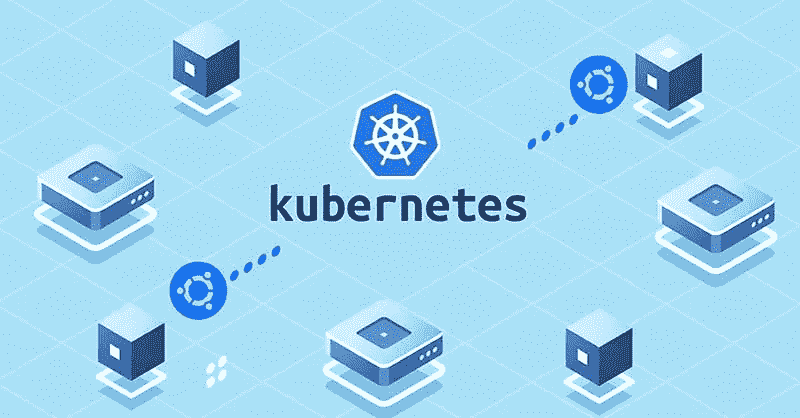
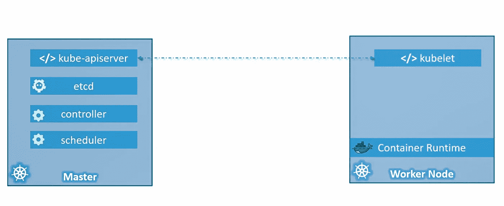

# Kubernetes(k8)高级概述

> 原文：<https://blog.devgenius.io/kubernetes-k8-high-level-overview-d4e8ef59de00?source=collection_archive---------2----------------------->

在开始之前，你需要知道两件事。

*   码头工人
*   容器编排

对于绝对初学者的帖子，我在 [docker 上简单谈了一下 Docker。](https://yonatan-merkebu.medium.com/docker-for-the-absolute-beginner-8c6dbcd71e4b)

**容器编排**

我们学习了容器，假设我们现在将应用程序打包在 docker 容器中。但是，我们如何在生产中运行容器呢？如果我们的应用程序依赖于 d/t 容器，如数据库或其他后端服务，会怎么样？如果用户数量增加，您需要扩展应用程序，该怎么办？当负载减少时，您如何缩减规模？

为了实现这些功能，您需要一个具有一组资源和功能的底层平台。该平台需要协调容器之间的连接，并根据负载自动扩大或缩小规模。自动部署和管理容器的整个过程称为编排。

容器编排有多种优势

*   您的应用程序将是高度可用的，因为硬件故障不会使您的应用程序停机。
*   用户流量在各个节点之间实现负载平衡。
*   当需求增加时，可以在几秒钟内无缝部署更多应用实例。
*   当您用完硬件资源时，可以在不关闭应用程序的情况下增加或减少节点数量。

通过一组声明性对象配置文件，您可以轻松地完成这些工作。

这就是 Kubernetes。一种容器编排技术，用于编排集群中成千上万个容器的部署和管理。

# **Kubernetes(k8)概念车**

**节点(爪牙)**

*   是安装了 Kubernetes 的机器(物理的或虚拟的)。
*   是工人机器，这里是集装箱将被发射的地方。

**集群**

*   是一组组合在一起的节点。这样，即使一个节点出现故障，其他节点仍然可以访问该应用程序。
*   拥有更多节点也有助于分担负载。

**主人**

*   是另一个安装了 k8 并配置为主节点的节点。
*   主节点监视集群中的节点，并负责协调工作节点上的容器。
*   存储有关集群成员的信息。

当您在系统上安装 Kubernetes 时，您也安装了以下内容。

**API 服务器**

API 服务器充当 Kubernetes 的前端。所有用户、托管服务和 CLI 都与 API 服务器通信，以便与 k8 集群进行交互。

**ETCD 密钥库**

ETCD 密钥库是一个分布式的可靠密钥库，k8 使用它来存储用于管理集群的所有数据。信息以分布式方式存储在所有节点上。

**调度器**

调度器负责将容器上的工作分布到多个节点上。它寻找新创建的容器并将它们分配给节点。

**控制器**

当集装箱下降时，控制器负责处理和响应。在这种情况下，他们还会带来新的容器。

**容器运行时**

容器运行时是用于运行容器的底层软件。比如 Docker。

**库布利特**

Kublet 是在集群上的每个节点上运行的代理。它负责确保容器按预期在节点上运行。

# 主节点与工作节点

**工人节点**

工作节点是容器的宿主。这意味着他们已经安装了容器运行时。

工作节点有一个 kublet 引擎，负责与主节点交互，提供工作节点的健康信息，并执行主节点所需的操作。

**主节点**

主节点有一个 kub-apiserver，这就是它成为主节点的原因。

收集的所有信息都存储在主服务器(ETCD)上的键值存储中。

主节点还有一个控制管理器(控制器)和调度程序。

我猜这让你对 Kubernetes 有了深入的了解。有关 DevOps 的更多主题，请关注我。