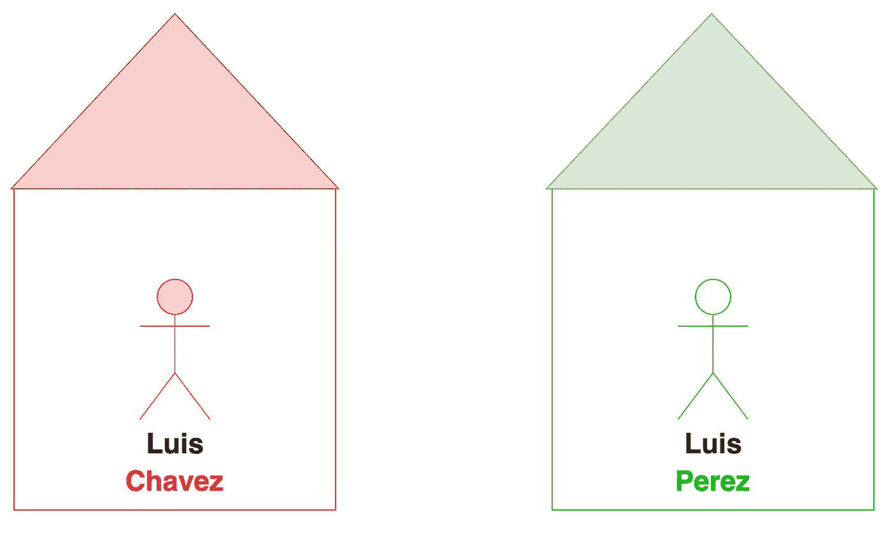
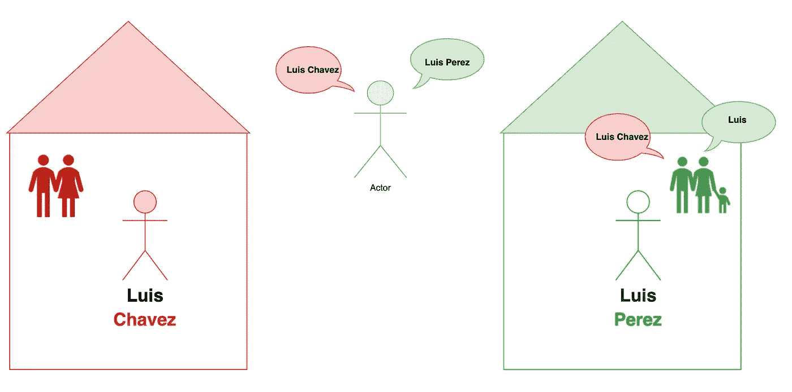
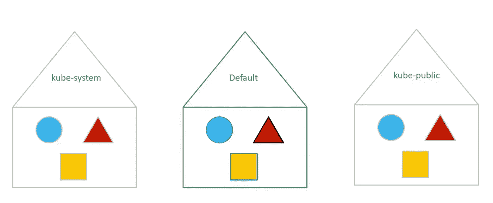
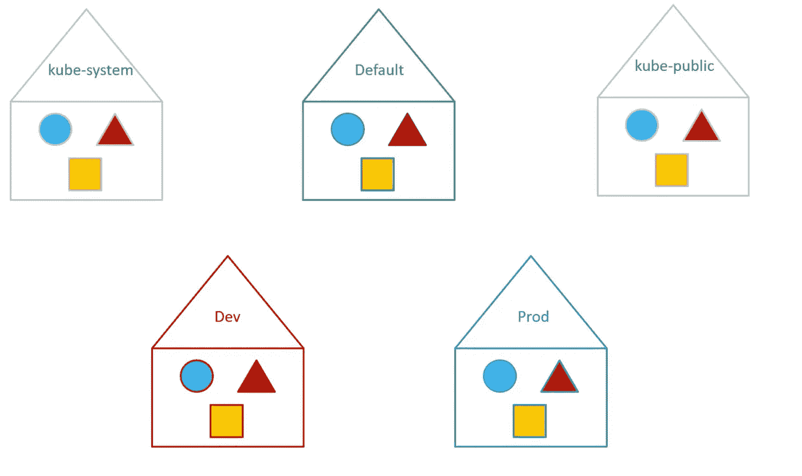
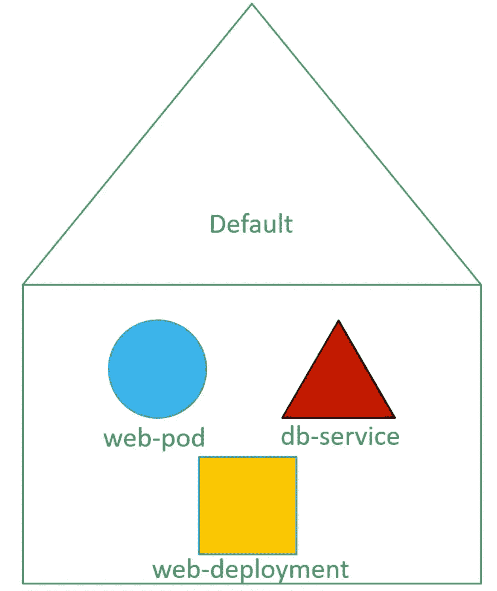
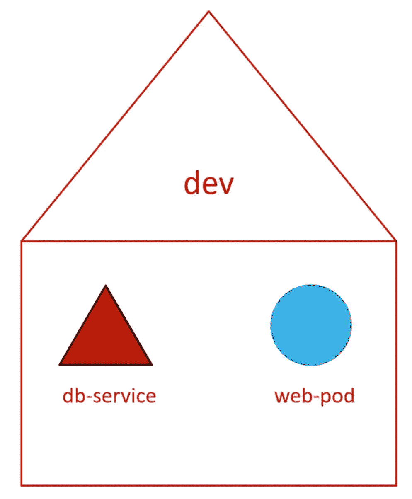
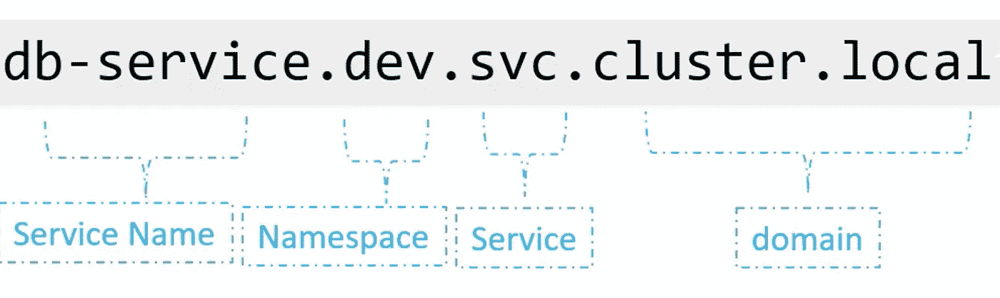

# Kubernetes 名称空间:核心概念

> 原文：<https://blog.devgenius.io/kubernetes-namespaces-core-concepts-488bb473aaee?source=collection_archive---------5----------------------->

读完这篇文章后，你会:

1.  对 kubernetes 中的名称空间有较高的理解。
2.  了解与名称空间相关的基本 kubectl 命令。


让我们后退一步，从一个简单的类比开始，这将有助于建立一些直觉。

想象有两个男孩，都叫路易斯。


为了区分他们，我们用他们的姓来称呼他们:佩雷斯和查韦斯。

他们来自不同的家族:查韦斯家族和佩雷斯家族。



房子里还有其他成员，这些人只是以他们的名字相互称呼。



例如，父亲称路易斯为“路易斯”。

然而，如果父亲希望从另一个房子称呼路易斯，他会使用他的全名。

同样，房子外面的人也会用全名来称呼房子里的男孩或任何人。

每个宫位都有自己的一套**规则**来定义每个人的职责。同样，这些房子有一套他们可以消费的**资源**。

# 回到 Kubernetes

正如您可能已经猜到的，房子对应于 kubernetes 中的名称空间。

每当您在没有指定名称空间的情况下创建一个 kubernetes 对象时，该对象就被放在**“默认”**名称空间中。

第一次设置集群时，kubernetes 为其内部管理创建了一组 pods 和服务，例如:

*   ETCD 服务器
*   调度程序
*   API 服务器
*   控制器管理器

这些在 kubernetes 中被称为**控制平面组件**。

为了将这些服务与用户隔离开来，并防止您意外删除或修改这些服务，kubernetes 在集群启动时创建的另一个名为 **kube-system** 的名称空间下创建它们。

kubernetes 自动创建的另一个名称空间叫做 **kube-public** 名称空间。这是创建所有用户都可以使用的资源的地方。



如果您的环境很小，您实际上不必担心名称空间，您可以继续使用默认的名称空间。

但是，当您出于企业或生产目的发展和使用 kubernetes 集群时，您可能希望考虑使用名称空间。

例如，如果您希望将同一个集群用于开发和生产环境，但同时隔离它们之间的资源，那么您可以为它们分别创建不同的名称空间。

这样，当在开发环境中工作时，您不会意外地修改生产环境中的资源。



这些名字空间中每一个都可以有自己的一组策略和权限。

您还可以为每个名称空间分配一个资源配额，这样每个名称空间就不会使用过多的资源。

## 默认命名空间

就像一个房子里的成员如何称呼彼此的名字一样。名称空间中的资源可以简单地通过它们的名称相互引用。

让我们看一个例子来说明:



如前所述，由于这些 kubernetes 对象在同一个名称空间中，如果需要，web app POD 可以通过简单地使用主机名 ***db-service*** 来访问 db 服务。

```
mysql.connect("db-service");
```

如果资源希望与位于不同名字空间的资源通信。您必须将命名空间的名称附加到服务的名称之后。



例如，对于要连接到 dev 名称空间中的数据库的默认名称空间中的 web pod:

```
mysql.connect("db-service.dev.svc.cluster.local");
```

您之所以能够这样做，是因为当创建服务时，会以这种格式自动添加一个 DNS 条目。



# 相关命令

以下命令用于列出除*之外的所有窗格，它只列出默认名称空间*中的窗格:

```
kubectl get pods
```

要在另一个名称空间中列出窗格:

```
kubectl get pods --namespace=[NAMESPACE_NAME]
```

# 例子

这里我有一个 pod 定义文件:

pod-definition.yaml:

要创建 POD 对象，请执行以下操作:

```
kubectl create -f pod-definition.yaml
```

当您使用这个文件创建一个 pod 时，因为没有指定名称空间，所以 pod 是在**默认名称空间**中创建的。

要在另一个名称空间中创建 pod，请使用 **—名称空间**选项。

```
kubectl create -f pod-definition.yaml --namespace=dev
```

如果您想确保在 dev 环境中创建这个 POD，而不添加 **—名称空间**选项。在元数据下添加名称空间选项，如下所示:

这是确保您的资源总是在相同的名称空间中创建的好方法。

# 创建名称空间

有几种方法可以在 kubernetes 中创建名称空间。

*   使用名称空间定义文件:

在命名空间-dev.yaml 中:

```
kubectl create -f namespace-dev.yaml
```

*   如果没有 YAML 定义文件:

```
kubectl create namespace dev
```

如果您希望从默认命名空间切换，请运行以下命令:

```
kubectl config set-context $(kubectl config current-context) --namespace=dev
```

前面的命令通过修改 kubeconfig 文件来切换当前的名称空间。

最后，要查看所有名称空间中窗格:

```
kubectl get pods --all-namespaces
```

这将列出所有名称空间中的所有窗格。

# 限制命名空间资源

限制命名空间中的资源。

创建资源配额定义文件，并指定要为其创建配额的命名空间:

在 compute-quota.yaml 中:

当然，您可以根据自己的需要更改这些规格。

最后，创建配额对象:

```
kubectl create -f compute-quota.yaml
```

*最初发布于*[*https://luispreciado . blog*](https://luispreciado.blog/posts/kubernetes/core-concepts/namespaces)*。*