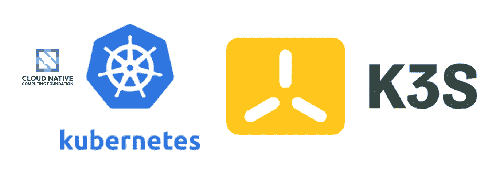

# 本地机器上的 Kubernetes

> 原文：<https://blog.devgenius.io/kubernetes-on-local-machine-e061a30a2bbe?source=collection_archive---------9----------------------->



Kubernetes 已经成为容器编排事实上的标准。所有主要的云提供商都有一个 Kubernetes 平台，团队可以使用它来托管他们的应用程序。根据一个人对容器开发和操作环境的熟悉程度，学习 Kubernetes 可能是在公园散步或爬一座陡峭的小山。

我个人喜欢 GKE(谷歌 Kubernetes 引擎)，因为它有许多安全性，可观察性和开箱即用的扩展功能。然而，对于日常开发来说，使用它可能会更昂贵。

有许多 Kubernetes 产品可以安装在本地开发者机器上，例如 Minikube、Kind、MicroK8s、K3s 等。在本文中，我将记录使用 K3s 创建 Kubernetes 集群所需的步骤。

[K3s](https://k3s.io) 是一款面向物联网和边缘电脑的轻量级 Kubernetes 发行版。它也可以安装在基于 ARM 的机器上(例如 raspberry pi)。

除非您已经有了一组 Raspberry Pis 来在您的网络中创建 Kubernetes 集群，否则您将在您的个人工作站上创建它。人们可以使用各种虚拟机技术来创建一组虚拟机，例如 VirtualBox、Qemu 等。然而，在本文中，我将使用[多通道](https://multipass.run)。通过 Multipass，用户可以在任何工作站上按需获得 Ubuntu 虚拟机。

对于本文，我假设您使用的是 Linux 或 Mac 机器。

# 安装多通道

位于 [https://multipass.run](https://multipass.run) 的站点有关于在各种机器上安装 multipass 的说明。

在基于 Ubuntu 的机器上执行下面的命令来安装 multipass。

```
sudo snap install multipass
```

# 为 K8s 集群创建节点

我们将使用两个节点构建我们的集群。其中一个节点将充当主平面或控制平面。另一个将充当辅助节点或代理节点。可以将多个代理节点添加到集群中。

创建控制平面:

```
multipass launch --name k3s-nd1 --cpus 2 --mem 4096M --disk 10G 21.10
```

上面的命令将创建一个具有 2 个 CPU、4GB 内存和 10G 空间的虚拟机。虚拟机中使用的操作系统将是`Ubuntu 21.10`。您可以执行`multipass find`来查看 VM 可用的其他映像。

创建代理节点:

```
multipass launch --name k3s-nd2 --cpus 2 --mem 4096M --disk 10G 21.10
```

通过执行命令`multipass list`，检查所有虚拟机是否准备就绪。您应该会看到如下内容。

```
Name            State             IPv4             Image
k3s-nd1         Running           192.168.64.22    Ubuntu 21.10
k3s-nd2         Running           192.168.64.23    Ubuntu 21.10
```

# 在控制面板上安装 K3s

登录控制面板。

```
multipass shell k3s-nd1
```

我们需要在这个节点上安装 k3s，并使它成为“控制平面”节点。

```
curl -sfL [https://get.k3s.io](https://get.k3s.io) | INSTALL_K3S_CHANNEL=<<channel>> INSTALL_K3S_VERSION=<<version>> INSTALL_K3S_EXEC="server" sh -s -
```

频道可能是`stable`或`latest`。

该版本应该是 https://github.com/k3s-io/k3s/releases[的发布版本之一](https://github.com/k3s-io/k3s/releases)

一个示例命令是:

```
curl -sfL [https://get.k3s.io](https://get.k3s.io) | INSTALL_K3S_CHANNEL=stable INSTALL_K3S_VERSION=v1.21.8+k3s1 INSTALL_K3S_EXEC="server" sh -s -
```

如果一切顺利，您可以通过在`k3s-nd1`中执行下面的命令来验证 Kubernetes 正在运行。

```
sudo kubectl get node -o wide
```

它应该显示如下内容:

```
NAME      STATUS   ROLES                  AGE   VERSION
k3s-nd1   Ready    control-plane,master   69s   v1.21.8+k3s1
```

很好，控制飞机已经启动并运行了。现在，我们已经运行了控制面板，我们可以创建代理节点并添加群集。

# 在代理节点上安装 K3s

在您机器的终端中执行以下命令，从`k3s-nd1`节点获取令牌:

```
multipass exec k3s-nd1 -- sudo cat /var/lib/rancher/k3s/server/node-token
```

您应该得到如下所示的令牌:

```
K10700a2d30d94e34c12f3a43cb7bea731d787a213fce3ace5913ec3c043ce896ae::server:1dfe37384fa47c28b1cc4a319f5dadf5
```

保存该令牌，因为创建代理节点时需要它。

现在，通过执行以下命令，登录到代理节点`k3s-nd2`:

```
multipass shell k3s-nd2
```

执行以下命令在代理节点上安装 K3s:

```
curl -sfL [https://get.k3s.io](https://get.k3s.io) | INSTALL_K3S_CHANNEL=<<channel>> INSTALL_K3S_VERSION=<<version>> INSTALL_K3S_EXEC="agent" K3S_URL=https://<<ip_address_of_k3s-nd1>>:6443 K3S_TOKEN=<<token from k3s-nd1>> sh -s -
```

请注意，该命令类似于控制平面节点中的安装，但需要控制平面 URL 和令牌的其他值来加入群集。通过执行命令`multipass list`可以看到控制平面的 IP 地址。

代理节点`k3s-nd2`的示例命令是:

```
curl -sfL [https://get.k3s.io](https://get.k3s.io) | INSTALL_K3S_CHANNEL=stable INSTALL_K3S_VERSION=v1.21.8+k3s1 K3S_URL=https://192.168.64.22:6443 INSTALL_K3S_EXEC="agent" K3S_TOKEN=K10700a2d30d94e34c12f3a43cb7bea731d787a213fce3ace5913ec3c043ce896ae::server:1dfe37384fa47c28b1cc4a319f5dadf5 sh -s -
```

通过在您的机器上的`k3s-nd2`之外执行命令，验证代理节点是否已经成功加入 Kubernetes 集群:

```
multipass exec k3s-nd1 -- sudo kubectl get nodes
```

您应该会看到类似下面的内容:

```
NAME      STATUS   ROLES                  AGE    VERSION
k3s-nd1   Ready    control-plane,master   12m    v1.21.8+k3s1
k3s-nd2   Ready    <none>                 100s   v1.21.8+k3s1
```

恭喜你！您的机器上有一个 Kubernetes 集群。

# 更新集群

鉴于这是本地群集，即非生产群集，用户可以删除并使用更新的二进制文件创建一个新群集。然而，有些情况下你不想这么做。也许你正在把它当作你家庭网络中的国内生产集群。或者实际上您已经进一步更新了您的集群，并使其达到了生产级别。

## 更新控制平面

通过执行以下命令登录到节点`k3s-nd1`。

```
multipass shell k3s-nd1
```

执行以下命令来安装所需版本的 k3s。

```
curl -sfL [https://get.k3s.io](https://get.k3s.io) | INSTALL_K3S_CHANNEL=<<channel>> INSTALL_K3S_VERSION=<<version>> sh
```

您可能已经注意到安装和更新的命令是相同的。这是因为`k3s`是单个二进制，更新就像更新二进制文件一样简单。

作为更新命令的示例，k3s 更新到版本“v1.22.5+k3s1”的情况是:

```
curl -sfL https://get.k3s.io | INSTALL_K3S_CHANNEL=stable INSTALL_K3S_VERSION=v1.22.5+k3s1 sh
```

现在，执行命令来验证所使用的 k3s 版本:

```
sudo kubectl get nodes
```

您应该会看到类似下面的内容:

```
NAME      STATUS   ROLES                  AGE   VERSION
k3s-nd2   Ready    <none>                 10m   v1.21.8+k3s1
k3s-nd1   Ready    control-plane,master   21m   v1.22.5+k3s1
```

您将看到控制平面更新为“v1.22.5+k3s1”。

现在，让我们更新代理节点。

## 更新代理节点

更新代理节点的步骤类似于安装新的代理节点。

登录到代理节点`k3s-nd2`

```
multipass shell k3s-nd2
```

执行以下命令，将代理节点上的 K3s 更新到所需版本:

```
curl -sfL [https://get.k3s.io](https://get.k3s.io) | INSTALL_K3S_CHANNEL=<<channel>> INSTALL_K3S_VERSION=<<version>> K3S_URL=https://<<ip_address_of_k3s-nd1>>:6443 K3S_TOKEN=<<token from k3s-nd1>> sh
```

非常重要的是要注意必须传递`K3S_URL`和`K3S_TOKEN`，否则脚本将在节点中有一个新的控制平面，而不是更新代理节点。

用于将代理节点更新到与主节点相同的版本，即“v1.22.5+k3s1”的示例命令将是:

```
curl -sfL [https://get.k3s.io](https://get.k3s.io) | INSTALL_K3S_CHANNEL=stable INSTALL_K3S_VERSION=v1.22.5+k3s1 K3S_URL=https://192.168.64.22:6443 K3S_TOKEN=K10700a2d30d94e34c12f3a43cb7bea731d787a213fce3ace5913ec3c043ce896ae::server:1dfe37384fa47c28b1cc4a319f5dadf5 sh
```

通过执行以下命令验证更新是否成功:

```
multipass exec k3s-nd1 -- sudo kubectl get nodes
```

您应该会看到类似下面的内容:

```
NAME      STATUS   ROLES                  AGE   VERSION
k3s-nd1   Ready    control-plane,master   27m   v1.22.5+k3s1
k3s-nd2   Ready    <none>                 16m   v1.22.5+k3s1
```

# 访问`k3s` Kubernetes 集群

虽然群集是在机器上创建的，但用户必须登录到承载控制面板的节点才能访问群集。对开发者不友好。

我们想通过简单地在终端上发出`kubectl`命令来访问集群。

基于 K3s 的集群会将 Kubernetes 的配置保存在一个文件中，该文件位于承载控制平面的节点中的“/etc/rancher/k3s/k3s.yaml”位置。

从我们的控制平面节点`k3s-nd1`执行下面的命令来显示它的内容。

```
multipass exec k3s-nd1 -- sudo cat /etc/rancher/k3s/k3s.yaml
```

该文件的内容类似于下面的内容:

```
apiVersion: v1
clusters:
- cluster:
    certificate-authority-data: LS0tLS1CRUdJTiBDRVJUSUZJQ0FURS0tLS0tCk1JSUJkakNDQVIyZ0F3SUJBZ0lCQURBS0JnZ3Foa2pPUFFRREFqQWpNU0V3SHdZRFZRUUREQmhyTTNNdGMyVnkKZG1WeUxXTmhRREUyTkRFek1EZzVPVEl3SGhjTk1qSXdNVEEwTVRVd09UVXlXaGNOTXpJd01UQXlNVFV3T1RVeQpXakFqTVNFd0h3WURWUVFEREJock0zTXRjMlZ5ZG1WeUxXTmhRREUyTkRFek1EZzVPVEl3V1RBVEJnY3Foa2pPClBRSUJCZ2dxaGtqT1BRTUJCd05DQUFTMTRsU0R3cDJWRXkvZjBjYVJqQTJzRnQxZ0p1UGhYV1o3Mi9EQWJMM1IKNmFieHZScG1Oa1VDSUFLcCtNU0dVVUZuL2RNRzV2UWlSOUczd2lnTk5vd1NvMEl3UURBT0JnTlZIUThCQWY4RQpCQU1DQXFRd0R3WURWUjBUQVFIL0JBVXdBd0VCL3pBZEJnTlZIUTRFRmdRVUNyQU5DeldKUVZ4T0IwYWloUzBiClJacy96bXd3Q2dZSUtvWkl6ajBFQXdJRFJ3QXdSQUlnTzl1VWhCTGVWUFhKMXg4Y0lBbFNpaEd2SXA2dkhRV1kKMFVUV2NaaENjcjRDSUhBQ1ZtY0dYeTRyTkswYnd4dFQ2Rld4SWhiVHlYMmloYzhGTW1RSFphTGkKLS0tLS1FTkQgQ0VSVElGSUNBVEUtLS0tLQo=
    server: [https://127.0.0.1:6443](https://127.0.0.1:6443)
  name: default
contexts:
- context:
    cluster: default
    user: default
  name: default
current-context: default
kind: Config
preferences: {}
users:
- name: default
  user:
    client-certificate-data: LS0tLS1CRUdJTiBDRVJUSUZJQ0FURS0tLS0tCk1JSUJrVENDQVRlZ0F3SUJBZ0lJR0MzMm12dFllZTR3Q2dZSUtvWkl6ajBFQXdJd0l6RWhNQjhHQTFVRUF3d1kKYXpOekxXTnNhV1Z1ZEMxallVQXhOalF4TXpBNE9Ua3lNQjRYRFRJeU1ERXdOREUxTURrMU1sb1hEVEl6TURFdwpOREUxTURrMU1sb3dNREVYTUJVR0ExVUVDaE1PYzNsemRHVnRPbTFoYzNSbGNuTXhGVEFUQmdOVkJBTVRESE41CmMzUmxiVHBoWkcxcGJqQlpNQk1HQnlxR1NNNDlBZ0VHQ0NxR1NNNDlBd0VIQTBJQUJCUFFjY293dkZqS0czRkkKR2VEektyMm9yeWxaR2IrcXNZcGRnM2NSSmR2SSs4bjA5aXpwUDZQcHQxRjZubjlvSmpORkdHZ1Fhd1prRXdCMQpCejJZU1RlalNEQkdNQTRHQTFVZER3RUIvd1FFQXdJRm9EQVRCZ05WSFNVRUREQUtCZ2dyQmdFRkJRY0RBakFmCkJnTlZIU01FR0RBV2dCU09ScCtrcGNYaE1zZkJiWEZOcTgzZ3lDeUJ6VEFLQmdncWhrak9QUVFEQWdOSUFEQkYKQWlFQStaUGo3K1g1YlpUQ2pncU9aMHRZYWJ4dEpzejhkYjNkaTQvcU0wdDJEOUlDSUM5Q2lTb0ZQWnZmYXBVSQpXajdrQXpCWUd2YUNmNDNaZEFNY0RzUXRwNjA5Ci0tLS0tRU5EIENFUlRJRklDQVRFLS0tLS0KLS0tLS1CRUdJTiBDRVJUSUZJQ0FURS0tLS0tCk1JSUJkekNDQVIyZ0F3SUJBZ0lCQURBS0JnZ3Foa2pPUFFRREFqQWpNU0V3SHdZRFZRUUREQmhyTTNNdFkyeHAKWlc1MExXTmhRREUyTkRFek1EZzVPVEl3SGhjTk1qSXdNVEEwTVRVd09UVXlXaGNOTXpJd01UQXlNVFV3T1RVeQpXakFqTVNFd0h3WURWUVFEREJock0zTXRZMnhwWlc1MExXTmhRREUyTkRFek1EZzVPVEl3V1RBVEJnY3Foa2pPClBRSUJCZ2dxaGtqT1BRTUJCd05DQUFUcHJTU0RSQVZjMDJuWG55dUJtcklpVndqN0ZYZGp0RGR6NFhYMEcwYmcKeWpEUU9hYXh2cFJ1L25Pd05iRXdNYVYyanJndGdCTEUrY2NTWXhvRWRhTk1vMEl3UURBT0JnTlZIUThCQWY4RQpCQU1DQXFRd0R3WURWUjBUQVFIL0JBVXdBd0VCL3pBZEJnTlZIUTRFRmdRVWprYWZwS1hGNFRMSHdXMXhUYXZOCjRNZ3NnYzB3Q2dZSUtvWkl6ajBFQXdJRFNBQXdSUUloQU85Wk5OdGhkWkJYTTU4Q0EvNHg4TEI0RmVnZWxzMnUKS0JQOUsrdnhYTGZPQWlBbDlDclV2Qkwvd3hEVkc2a2JJK291MFhPbytxM2R0enBuTXkzbTRMS1Vsdz09Ci0tLS0tRU5EIENFUlRJRklDQVRFLS0tLS0K
    client-key-data: LS0tLS1CRUdJTiBFQyBQUklWQVRFIEtFWS0tLS0tCk1IY0NBUUVFSUpLeDk4ejhmMzk4RlVncEppU3JRZ0swOHZHdEFIZkJGcG04YTB5NEF5UXZvQW9HQ0NxR1NNNDkKQXdFSG9VUURRZ0FFRTlCeHlqQzhXTW9iY1VnWjRQTXF2YWl2S1ZrWnY2cXhpbDJEZHhFbDI4ajd5ZlQyTE9rLwpvK20zVVhxZWYyZ21NMFVZYUJCckJtUVRBSFVIUFpoSk53PT0KLS0tLS1FTkQgRUMgUFJJVkFURSBLRVktLS0tLQo=
```

您需要更新位置`~/.kube/config`处的 Kubernetes 配置文件，并为其添加一个新条目。

下面的示例`~/.kube/config`文件包含来自上面的`k3s.yaml`文件的内容，访问上下文在`k3s`下声明。

```
apiVersion: v1
clusters:
- cluster:
    certificate-authority-data: LS0tLS1CRUdJTiBDRVJUSUZJQ0FURS0tLS0tCk1JSUJkakNDQVIyZ0F3SUJBZ0lCQURBS0JnZ3Foa2pPUFFRREFqQWpNU0V3SHdZRFZRUUREQmhyTTNNdGMyVnkKZG1WeUxXTmhRREUyTkRFek1EZzVPVEl3SGhjTk1qSXdNVEEwTVRVd09UVXlXaGNOTXpJd01UQXlNVFV3T1RVeQpXakFqTVNFd0h3WURWUVFEREJock0zTXRjMlZ5ZG1WeUxXTmhRREUyTkRFek1EZzVPVEl3V1RBVEJnY3Foa2pPClBRSUJCZ2dxaGtqT1BRTUJCd05DQUFTMTRsU0R3cDJWRXkvZjBjYVJqQTJzRnQxZ0p1UGhYV1o3Mi9EQWJMM1IKNmFieHZScG1Oa1VDSUFLcCtNU0dVVUZuL2RNRzV2UWlSOUczd2lnTk5vd1NvMEl3UURBT0JnTlZIUThCQWY4RQpCQU1DQXFRd0R3WURWUjBUQVFIL0JBVXdBd0VCL3pBZEJnTlZIUTRFRmdRVUNyQU5DeldKUVZ4T0IwYWloUzBiClJacy96bXd3Q2dZSUtvWkl6ajBFQXdJRFJ3QXdSQUlnTzl1VWhCTGVWUFhKMXg4Y0lBbFNpaEd2SXA2dkhRV1kKMFVUV2NaaENjcjRDSUhBQ1ZtY0dYeTRyTkswYnd4dFQ2Rld4SWhiVHlYMmloYzhGTW1RSFphTGkKLS0tLS1FTkQgQ0VSVElGSUNBVEUtLS0tLQo=
    server: [https://192.168.64.22:6443](https://192.168.64.22:6443)
  name: k3s
- cluster:
    ......
contexts:
- context:
    cluster: k3s
    user: k3s
  name: k3s
- context:
    ......
......
users:
- name: k3s
  user:
    client-certificate-data: LS0tLS1CRUdJTiBDRVJUSUZJQ0FURS0tLS0tCk1JSUJrVENDQVRlZ0F3SUJBZ0lJR0MzMm12dFllZTR3Q2dZSUtvWkl6ajBFQXdJd0l6RWhNQjhHQTFVRUF3d1kKYXpOekxXTnNhV1Z1ZEMxallVQXhOalF4TXpBNE9Ua3lNQjRYRFRJeU1ERXdOREUxTURrMU1sb1hEVEl6TURFdwpOREUxTURrMU1sb3dNREVYTUJVR0ExVUVDaE1PYzNsemRHVnRPbTFoYzNSbGNuTXhGVEFUQmdOVkJBTVRESE41CmMzUmxiVHBoWkcxcGJqQlpNQk1HQnlxR1NNNDlBZ0VHQ0NxR1NNNDlBd0VIQTBJQUJCUFFjY293dkZqS0czRkkKR2VEektyMm9yeWxaR2IrcXNZcGRnM2NSSmR2SSs4bjA5aXpwUDZQcHQxRjZubjlvSmpORkdHZ1Fhd1prRXdCMQpCejJZU1RlalNEQkdNQTRHQTFVZER3RUIvd1FFQXdJRm9EQVRCZ05WSFNVRUREQUtCZ2dyQmdFRkJRY0RBakFmCkJnTlZIU01FR0RBV2dCU09ScCtrcGNYaE1zZkJiWEZOcTgzZ3lDeUJ6VEFLQmdncWhrak9QUVFEQWdOSUFEQkYKQWlFQStaUGo3K1g1YlpUQ2pncU9aMHRZYWJ4dEpzejhkYjNkaTQvcU0wdDJEOUlDSUM5Q2lTb0ZQWnZmYXBVSQpXajdrQXpCWUd2YUNmNDNaZEFNY0RzUXRwNjA5Ci0tLS0tRU5EIENFUlRJRklDQVRFLS0tLS0KLS0tLS1CRUdJTiBDRVJUSUZJQ0FURS0tLS0tCk1JSUJkekNDQVIyZ0F3SUJBZ0lCQURBS0JnZ3Foa2pPUFFRREFqQWpNU0V3SHdZRFZRUUREQmhyTTNNdFkyeHAKWlc1MExXTmhRREUyTkRFek1EZzVPVEl3SGhjTk1qSXdNVEEwTVRVd09UVXlXaGNOTXpJd01UQXlNVFV3T1RVeQpXakFqTVNFd0h3WURWUVFEREJock0zTXRZMnhwWlc1MExXTmhRREUyTkRFek1EZzVPVEl3V1RBVEJnY3Foa2pPClBRSUJCZ2dxaGtqT1BRTUJCd05DQUFUcHJTU0RSQVZjMDJuWG55dUJtcklpVndqN0ZYZGp0RGR6NFhYMEcwYmcKeWpEUU9hYXh2cFJ1L25Pd05iRXdNYVYyanJndGdCTEUrY2NTWXhvRWRhTk1vMEl3UURBT0JnTlZIUThCQWY4RQpCQU1DQXFRd0R3WURWUjBUQVFIL0JBVXdBd0VCL3pBZEJnTlZIUTRFRmdRVWprYWZwS1hGNFRMSHdXMXhUYXZOCjRNZ3NnYzB3Q2dZSUtvWkl6ajBFQXdJRFNBQXdSUUloQU85Wk5OdGhkWkJYTTU4Q0EvNHg4TEI0RmVnZWxzMnUKS0JQOUsrdnhYTGZPQWlBbDlDclV2Qkwvd3hEVkc2a2JJK291MFhPbytxM2R0enBuTXkzbTRMS1Vsdz09Ci0tLS0tRU5EIENFUlRJRklDQVRFLS0tLS0K
    client-key-data: LS0tLS1CRUdJTiBFQyBQUklWQVRFIEtFWS0tLS0tCk1IY0NBUUVFSUpLeDk4ejhmMzk4RlVncEppU3JRZ0swOHZHdEFIZkJGcG04YTB5NEF5UXZvQW9HQ0NxR1NNNDkKQXdFSG9VUURRZ0FFRTlCeHlqQzhXTW9iY1VnWjRQTXF2YWl2S1ZrWnY2cXhpbDJEZHhFbDI4ajd5ZlQyTE9rLwpvK20zVVhxZWYyZ21NMFVZYUJCckJtUVRBSFVIUFpoSk53PT0KLS0tLS1FTkQgRUMgUFJJVkFURSBLRVktLS0tLQo=
- name: yantra-prod-euwst1-gke-01
  .......
.......
```

> 编辑之前，不要忘记备份`~/.kube/config`文件。如果文件构造不正确，将导致现有集群的访问被拒绝。

现在执行下面的命令来使用名为`k3s`的集群:

```
kubectl config set-context k3s
```

这将为在您的计算机上创建的 k3s 集群设置上下文，您执行了如下命令:

```
kubectl cluster-info
```

恭喜你！使用`k3s`，您在本地机器上有一个工作集群。

按照本文中的步骤，用户将作为 Kubernetes 集群管理员访问集群。开发可以，生产不行。我将撰写另一篇关于如何使用身份/认证服务器认证集群的文章。