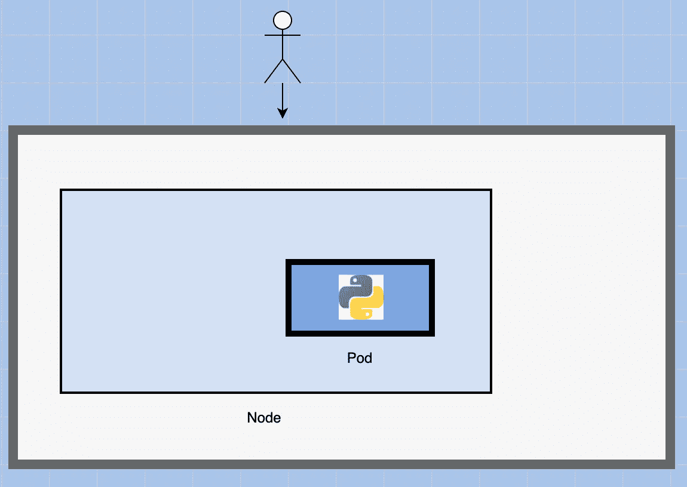
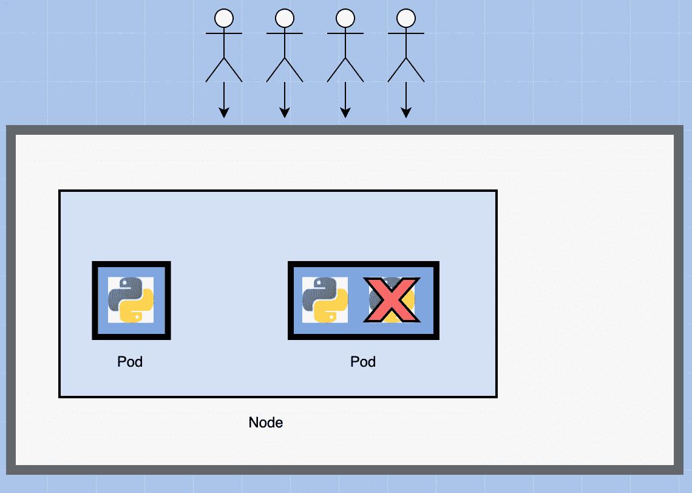

# Kubernetes POD 概念简化

> 原文：<https://blog.devgenius.io/kubernetes-pod-concepts-simplified-637f418835a7?source=collection_archive---------8----------------------->


照片由 [XPS](https://unsplash.com/@xps?utm_source=medium&utm_medium=referral) 在 [Unsplash](https://unsplash.com?utm_source=medium&utm_medium=referral) 上拍摄

看完这篇帖子，你会对使用 kubernetes PODS 的优势有一个清晰的认识。

在我们开始了解 pod 之前，让我们假设已经设置了以下内容:

*   该应用程序已经开发并内置到 Docker Images 中，可以在 Docker hub 等 Docker 存储库中获得，因此 kubernetes 可以将其下载。
*   Kubernetes 集群已经设置好并正在运行，它可以是单节点设置或多节点设置，
*   所有服务都需要处于运行状态。

正如在 [kubernetes 架构文章](https://medium.com/dev-genius/the-kubernetes-cluster-architecture-simplified-3c4a5fb41449)中所讨论的，我们的最终目标是在一组机器上以容器的形式部署我们的应用程序，这些机器被配置为集群中的工作节点。

然而，kubernetes 并不直接在 worker 节点上部署容器。

这些容器被封装到一个名为 **PODs** 的 Kubernetes 对象中。一个 **POD** 是一个应用程序的单个实例。

> **POD 是可以在 kubernetes 中创建的最小对象。**


# 例子

举一个最简单的例子来说明，您有一个单节点 kubernetes 集群，您的应用程序的一个实例运行在一个封装在 POD 中的 docker 容器中:



**如果访问您的应用程序的用户数量增加，并且您需要扩展您的应用程序，该怎么办？**


您需要添加额外的 web 应用程序实例来分担负载。

现在，您会在哪里增加额外的实例？

我们是否在同一个 POD 中启动一个新的容器实例？

**号**

我们用同一个应用程序的新实例创建了一个新的 POD。



现在，我们有两个 web 应用程序实例运行在同一个 kubernetes 系统或节点上的不同 pod 上。

**如果用户基数进一步增加，而你目前的节点没有足够的容量怎么办？**

在这种情况下，您可以在集群中的新节点上部署额外的 pod。

您将有一个新节点添加到集群中，以扩展集群的物理容量。


所以我想说明的是 **PODs 通常与运行你的应用**的容器有一对一的关系。

*   要扩大规模，您需要创建新的单元
*   若要缩小，请删除现有的窗格。

> **您不需要向现有的 pod 添加额外的容器来扩展您的应用程序。**

我们将在以后的文章中讨论如何在容器之间实现负载平衡。目前，我们只是试图理解基本概念。

## 我们是否被限制在一个容器里有一个容器？

号码

一个 pod 可以有多个容器，除非它们通常不是同一种类的多个容器。

正如我们之前讨论的，如果我们的目的是扩展我们的应用程序，那么我们需要创建额外的 pod。

但有时您可能会有一个场景，您有一个助手容器，它可能为我们的 web 应用程序执行某种支持任务，例如:

*   处理用户输入的数据
*   处理用户上传的文件

您还希望这些助手容器与您的应用程序容器共存。

在这种情况下，您可以让这两个容器成为同一个 pod 的一部分，以便在创建新的应用程序容器时。帮助者也被创造出来，当它死去的时候，帮助者也死了。

因为它们是同一个 POD 的一部分。这两个容器还可以通过将彼此称为“本地主机”来直接相互通信，因为它们共享相同的网络名称空间。

此外，它们还可以轻松共享同一个储物空间。


让我们暂时将 kubernetes 排除在我们的讨论之外，讨论一下简单的 docker 容器。

让我们假设我们正在开发一个流程或脚本来在 docker 主机上部署我们的应用程序。然后，我们将首先使用以下命令简单地部署我们的应用程序:

```
docker run python-app
```

应用程序运行，我们的用户能够访问它。


当负载增加时。我们通过运行 docker run 命令更多次来部署应用程序的更多实例。

```
docker run python-app 
docker run python-app
docker run python-app
```


这很好，我们都很高兴。

现在，在将来的某个时候，我们的应用程序会进一步开发，经历架构上的变化，增长并变得复杂。

我们现在有了一个新的助手容器，它通过处理或拟合来自其他地方的数据来帮助我们的 web 应用程序。


这些助手容器必须与我们的应用程序容器保持一对一的关系。助手容器还需要直接与应用程序容器通信来访问数据。为此，我们**将**需要维护一个映射来跟踪哪个助手容器对应于哪个应用程序。

*   我们需要自己使用链接和自定义网络在这些容器之间建立网络连接。
*   我们需要创建可共享的卷，并在容器之间共享它
*   我们还需要维护一张地图。最重要的是，我们需要监控应用程序容器的状态，当它终止时，手动终止助手容器，因为不再需要它了。
*   当部署新的容器时，我们也需要部署新的助手容器。

**有了 PODs，kubernetes 可以自动为我们完成所有这些工作。**

我们只需要定义 POD 由哪些容器组成，默认情况下，POD 中的容器将访问相同的存储、相同的网络命名空间和相同的命运，因为它们将被一起创建和一起销毁。

即使我们的应用程序没有那么复杂，我们可以使用单个容器，kubernetes 仍然要求您创建 pod。

这从长远来看是好的，因为您的应用程序现在已经为将来的架构变化和扩展做好了准备。

值得注意的是，多 pod 容器是一种罕见的用例。

前面我们学习了 kubectl run 命令。

```
kubectl run nginx
```

这个命令真正做的是通过创建一个 POD 来部署 docker 容器。因此，它首先自动创建一个 POD，并部署 nginx docker 映像的一个实例。

但是它是从哪里获得应用程序映像的呢？

为此，您需要使用-image 参数指定图像名称。

```
kubectl run nginx --image nginx
```

nginx 映像是从 docker hub 库下载的。Docker hub 是一个公共存储库，其中存储了各种应用程序的最新 Docker 映像。

您可以配置 kubernetes 从公共 docker hub 或组织内的私有存储库中提取图像。

现在我们已经创建了一个 POD，我们如何查看可用的 POD 列表呢？

```
kubectl get pods
```

kubectl get PODs 命令帮助我们查看集群中的 PODs 列表。

还要记住，我们还没有真正讨论用户如何访问 nginx web 服务器的概念。

所以在目前的状态下，我们还没有让外部用户访问 web 服务器。


但是，您可以从节点内部访问它。

现在，我们将只看到如何部署一个 POD，在一篇高级文章中，我们将了解如何让最终用户可以访问该服务。

*原载于* [*我的博客*](https://luispreciado.blog/posts/kubernetes/core-concepts/pods) *。*