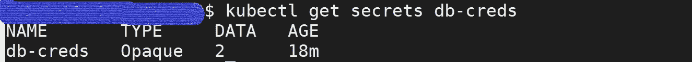

# 库伯内特的秘密

> 原文：<https://blog.devgenius.io/kubernetes-secrets-c951ad81ad0a?source=collection_archive---------40----------------------->


我们为什么需要秘密？

嗯，我们不希望我们的敏感信息，如密码、api 令牌和 ssh 密钥以纯文本形式存储在任何源代码中，也不希望硬编码在 docker 映像中。K8s 提供了一种在集群中存储这些变量的方法，这样只有具有访问权限的管理员才能管理它们。

**要点:**

1.  默认情况下，机密不加密，但可以进行 base64 编码。你可以按照[这个](https://kubernetes.io/docs/tasks/administer-cluster/encrypt-data/)来加密你的秘密。
2.  存储在 etcd 中
3.  机密是有名称空间的，这意味着只有在同一个名称空间中运行的 pod 才能使用它们

**创建秘密:**

Kubernetes 支持三种类型的秘密

1.  Generic (Opaque):这允许从本地文件或命令行或目录提供的文字值创建一个秘密。

```
kubectl create secret generic <name> --from-literal=USERNAME=<user> --from-literal=PASSWORD=<password>
```

2.Docker-Registry(kubernetes . io/docker config JSON):我们经常使用私有的 docker 存储库来存储我们创建的专有图像，当我们处理这些图像时，kubelet 需要 docker registry 凭证来获取这些图像。

```
kubectl create secret docker-registry my-private-docker-registry --docker-server=<server> --docker-username=<user> --docker-password=<password> --docker-email=<email>
```

3.TLS(kubernetes.io/tls):任何应用程序都可能需要 TLS 秘密来安全地传输数据。我们可以使用 tls 密钥生成一个，并使用这个 TLS secret 类型生成 tls crt。

`kubectl create secret tls app-tls --key="key" --cert="cert"`

**在 pod 中使用机密:**

现在我们知道了如何创建秘密，让我们看看如何将它们共享给容器。它们可以通过以下方式共享:

I)作为环境变量

ii)作为卷安装的文件

iii)docker-registry secrets 到 kubelet 以提取图像

让我们进入演示部分，通过示例更好地理解

**1。** **将用户名和密码作为环境变量传递**

I)用用户名和密码创建一个密码

```
kubectl create secret generic db-creds --from-literal=USERNAME=admin --from-literal=PASSWORD=admin
```

用`kubectl get secrets db-creds`验证。输出应该如下所示，所有使用泛型创建的秘密将显示为不透明类型。基本上，这种类型包含键值对



ii)创建一个部署，在 pod.spec 中，我们要求 api 服务器通过读取指定的机密来创建 env 变量。`envFrom`会将 secret `db-creds`中的所有密钥对值设置为 env 变量。

```
apiVersion: apps/v1
kind: Deployment
metadata:
   name: hello-world-deployment-v1
spec:
   selector:
      matchLabels:
         app: hello-world
   replicas: 1
   template:
      metadata:
         name: hello-world-pod
         labels:
            app: hello-world
      spec:
         containers:
            - name: hello-world
              image: gcr.io/google-samples/hello-app:1.0
              **envFrom:
              - secretRef:
                    name: db-creds**
```

我们可以用`kubectl exec -it <pod-name> -- /bin/sh -c 'env'`来验证这一点

**2** 。**挂载一个秘密文件作为卷**

I)创建样本文件 secret-file.txt

ii)创建一个 kubernetes 秘密对象。秘密的类型应该是不透明的，如上面的例子所示。

`kubectl create secret generic **mysecretfile** --from-file=secret-file.txt`

iii)创建一个部署，并将这个秘密文件作为一个卷安装到所需的容器中

```
apiVersion: apps/v1
kind: Deployment
metadata:
   name: hello-world-deployment-v2
spec:
    selector:
       matchLabels:
           app: hello-world
    replicas: 1
    template:
       metadata:
           name: hello-world-pod
           labels:
              app: hello-world
       spec:
           containers:
               - name: hello-world
                 image: gcr.io/google-samples/hello-app:1.0
                 volumeMounts:
                     - mountPath: **/etc/secrets/**
                       name: secret-volume volumes:
               - name: secret-volume
                 secret:
                    secretName: **mysecretfile**
```

现在，如果我们执行到容器中，我们应该在/etc/secrets 目录中看到该文件。

还要注意，如果我们挂载在第一个场景中创建的 secret `db-creds`,我们应该会看到两个文件/etc/secrets/USERNAME 和/etc/secrets/PASSWORD 及其相应的值。这意味着对于所有的键-值对，都会创建一个名称等于 key 的文件。请通过更新上述部署中的`secretName`进行尝试。