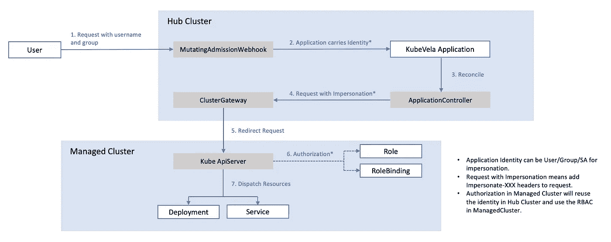
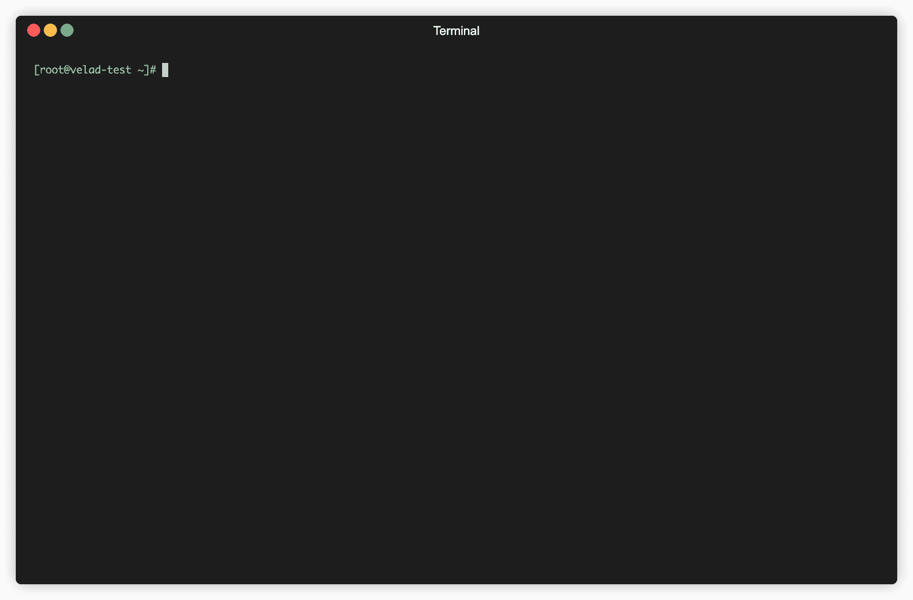
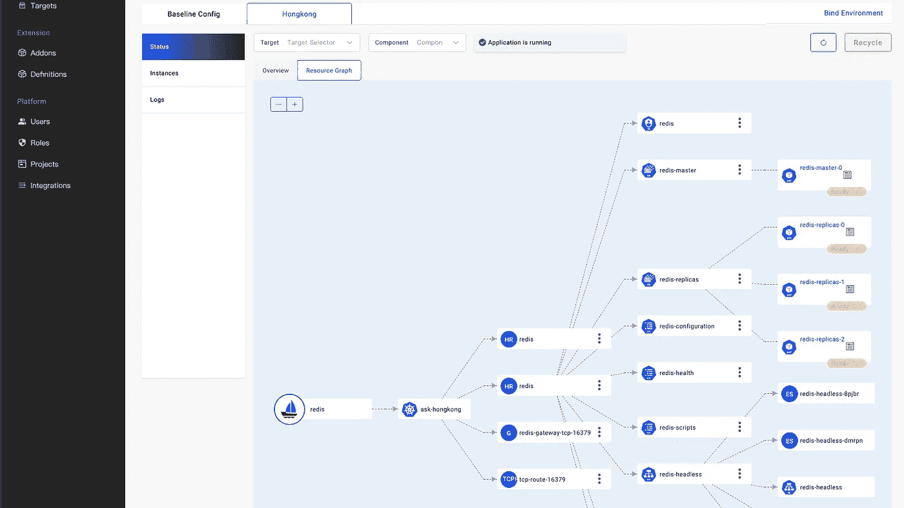
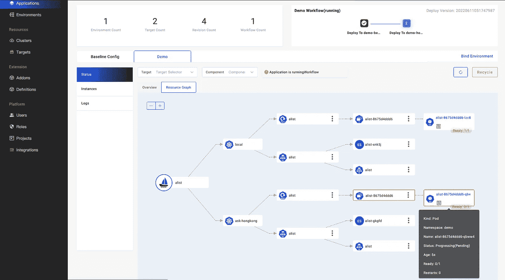
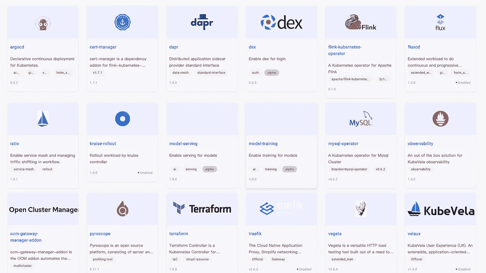
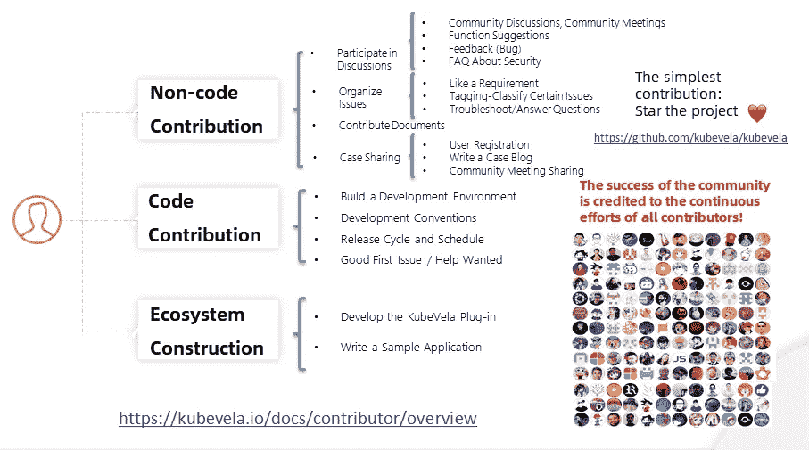

# KubeVela 1.4 发布，使应用交付安全、简单、透明

> 原文：<https://blog.devgenius.io/kubevela-1-4-released-make-application-delivery-safe-foolproof-and-transparent-1399ca8fa2dd?source=collection_archive---------9----------------------->

*由、曾庆国(库贝拉团队)*

[KubeVela](http://kubevela.net/) 是一个现代化的软件交付控制面板。我们的目标是在当今的混合云环境中使应用程序部署和操作更简单、更敏捷、更可靠。自[1.1](https://kubevela.net/blog/2021/10/08/blog-1.1)版本发布以来，KubeVela 架构自然地解决了企业在混合云环境中的交付问题，并基于 OAM 模型提供了足够的可扩展性，这使其赢得了许多企业开发者的青睐。这也加速了 KubeVela 的迭代。

在[版本 1.2](https://kubevela.net/blog/2022/01/27/blog-1.2) 中，我们发布了开箱即用的可视化控制台，允许最终用户通过界面发布和管理各种工作负载。[版本 1.3](https://kubevela.net/blog/2022/04/06/multi-cluster-management) 的发布完善了以 OAM 模型为核心的扩展系统，提供了丰富的插件功能。还为用户提供了包括 LDAP 权限认证在内的大量企业级功能，为企业集成提供了更多便利。你可以在 KubeVela 社区的[插件注册表](https://github.com/kubevela/catalog)中获得 30 多个插件。有知名的 CNCF 项目(如 argocd、istio、traefik)、数据库中间件(如 Flink、MySQL)、数百家云厂商资源。

在 1.4 版本中，我们专注于**使应用交付安全、简单、透明。**我们增加了核心功能，包括多集群权限认证和授权，复杂的资源拓扑显示，一键安装控制面板。我们全面加强了多租户场景下的交付安全性，提高了应用开发和交付的一致性体验，使应用交付过程更加透明。

# 核心功能

## 开箱即用的认证和授权，连接到 Kubernetes RBAC 和自然支持多个集群

在解决了架构升级和扩展性的挑战后，我们注意到应用交付的安全性是整个行业亟待解决的问题。我们从用例中发现了许多安全风险:

*   在使用传统的 CI/CD 时，很多用户会将生产集群的 admin 权限直接嵌入到 CI 的环境变量中，只对哪些集群交付给最基础的有一定的权限分离。CI 系统通常集中用于开发和测试，很容易引入不可控的风险。一旦 CI 系统遭到黑客攻击或出现一些人为的误操作，可能会对集中管理和粗粒度权限控制造成巨大的破坏。
*   大量 CRD 控制器依赖管理权限来对集群资源执行操作，并且不对 API 访问施加限制。Kubernetes 拥有丰富的 RBAC 控制能力。但由于权限管理的高门槛(也是独立于具体功能的实现)，大部分用户并不关心细节。他们只选择默认配置，并将其投入生产使用。具有高灵活性的控制器(例如分发 Helm Chart 的能力)很容易成为黑客攻击的目标，例如在 Helm 中嵌入一个 YAML 脚本来窃取其他名称空间的密钥。

KubeVela 1.4 增加了**认证和授权功能，自然支持多集群混合环境。**每个 KubeVela 平台管理员可以细粒度定制任意 API 权限组合，连接 Kubernetes RBAC 系统，将这些权限模块授权给开发者用户，并严格限制其权限。他们还可以轻松使用 KubeVela 平台上预设的权限模块。例如，他们可以直接授予用户对集群的特定名称空间的权限和*只读*权限。这简化了用户的学习成本和心理负担，并全面加强了应用交付的安全性。系统自动完成底层授权，并为使用该 UI 的用户严格验证项目可用资源的范围和类型，因此业务层 RBAC 权限和底层 Kubernetes RBAC 系统可以连接起来，协同工作，实现从外到内的安全，而无需在任何环节扩展权限。

具体来说，平台管理员[授权一个用户](https://kubevela.net/docs/platform-engineers/auth/basic)后，用户的请求会经过几个阶段(如图)。

1.  首先，KubeVela 的 webhook 拦截用户的请求，并将用户的权限信息(ServiceAccount)发送给 Application 对象。
2.  当 KubeVela 控制器执行应用的部署计划时，它根据 Kubernetes 的[模拟机制(impersonate)](https://kubernetes.io/docs/reference/access-authn-authz/authentication/#user-impersonation) 改变相应用户的权限。
3.  KubeVela 多集群模块(ClusterGateway)将相应的权限传递给子集群。子集群的 Kubernetes APIServer 根据子集群的权限执行身份验证。子集群的权限由 KubeVela 授权过程创建。

简而言之，KubeVela 的多集群认证和授权确保了**每个终端用户的权限受到严格限制，不会被交付系统放大。同时 KubeVela 的权限最小化**，整个用户体验简单。

请阅读官方[权限认证和授权](https://kubevela.net/docs/platform-engineers/auth/basic)了解其背后的运行机制。

## 轻巧方便的应用程序开发控制面板为本地开发和生产部署提供了一致的体验

随着生态系统的繁荣，我们看到更多的开发者开始关注云原生技术，但他们往往不知道如何入门。以下是主要原因:

*   应用**开发环境和生产环境**不一致，体验不一样。云原生是近五六年来出现的一种技术趋势。发展很快，但大多数公司还是习惯于开发一套屏蔽底层技术的内部平台。这样一来，普通的业务开发人员即使学习了云原生技术，也很难在实际工作中实践。在最好的情况下，他们可能不得不重新连接 API 和配置，更不用说一致的体验了。
*   **以 Kubernetes 为核心的云原生技术**的部署和使用**比较复杂**。仅仅为了入门而从云供应商那里购买主机服务是很昂贵的。即使花很大力气去学习部署一套可用的本地环境，也很难连接很多云原生技术来完成整个 CI/CD 流程，这涉及到很多运维领域的知识，普通开发者通常不需要关心，也很少有机会使用。

我们也在社区中观察到，越来越多的公司开始意识到自建平台跟不上社区生态系统的发展。他们希望通过 KubeVela 和 OAM 模型提供一致的体验，同时不丧失生态系统的可扩展性。不过由于 KubeVela 的控制面板依赖于 Kubernetes，所以上手门槛还是不低的。针对这一问题，社会各界一直在思考和寻找解决方案。我们的结论是，我们需要一个具有这些特征的工具:

*   只依靠容器环境(如 Docker)来部署和运行，**这样每个开发者都可以很容易地获得和使用它**
*   本地开发和生产环境体验一致，配置可重用，可以模拟混合多集群环境。
*   单个二进制包支持**离线部署**，环境初始化的时间不超过喝一杯水的时间(三分钟)。

经过几个月的酝酿，我们终于可以在 1.4 中发布这个工具: [VelaD](https://kubevela.io/github.com/kubevela/velad/) 。d 代表守护进程和开发者。它可以帮助 KubeVela 在单台机器上运行，并且不依赖于任何现有的 Kubernetes 集群。同时，它与 KubeVela 一起作为轻量级应用程序开发控制面板，帮助开发人员获得集成的开发、测试和交付体验，并简化云原生应用程序部署和管理的复杂性。

您可以使用[演示文档](https://github.com/kubevela/velad/blob/main/docs/01.simple.md)来安装和尝试这个工具，以了解更多关于实现的细节。初始化安装只需三分钟。

## 显示资源拓扑和状态，使交付过程透明

应用交付的另一个大需求是资源交付过程的透明管理。例如，社区中的许多用户喜欢使用 Helm Chart 将许多复杂的 YAML 打包在一起。但一旦部署出现问题，就会因整体黑箱而难以排查(哪怕是小问题)。一些问题包括未正常提供底层存储、未正常创建相关资源以及底层配置不正确。有许多类型的资源(尤其是在现代混合多集群混合环境中),如何从中获取有效信息并解决问题是一个挑战。

在 1.4 版本中，我们增加了资源拓扑查询功能，以改善 KubeVela 以应用为中心的交付体验。当开发人员启动应用交付时，他们只需要关心简单和一致的 API。当他们需要解决问题或关注交付过程时，他们可以使用资源拓扑功能快速获取从应用程序到 Pod 实例运行状态的不同集群**中资源的编排关系，并自动获取资源的关系，包括复杂的黑盒掌舵图。**

上图所示的应用程序就是一个例子。Redis 集群通过 Helm Chart 包提供。图表第一层是应用名称，第二层是集群，第三层是应用直接渲染的资源。接下来的第三层和第四层是根据不同的资源跟踪的较低层的关联资源。

在应用交付过程中，用户可以使用图表来观察派生的资源及其状态。异常点以黄色或红色显示，并显示具体原因。与下图所示的应用程序相比，它是一个交付给两个集群的基本 Webservice。开发人员可以发现，应用程序分别在两个集群中创建部署和服务资源。此外，ask-hongkong 集群中的部署资源显示为黄色，因为 Pod 实例尚未完全启动。

这个特性还允许您使用不同的集群和组件进行搜索、过滤和查询。这有助于开发人员快速发现问题，并以非常低的门槛了解底层应用的交付状态。

请阅读官方博客 [*可视化多集群资源的拓扑关系*](https://kubevela.net/blog/2022/06/10/visualize-resources) 了解其背后的运行机制。

# 其他主要变化

除了核心功能和插件生态系统，1.4 版还增强了工作流等核心功能:

*   您可以配置字段忽略规则来维护申请状态。这使得 KubeVela 能够与 HPA 和 Istio 等其他控制器配合使用。
*   应用程序资源回收支持基于资源类型的设置。目前，它支持基于组件名称、组件类型、功能类型和资源类型的设置。
*   工作流支持子步骤。子步骤支持并发执行，这加快了多集群高可用性场景中的资源交付。
*   您可以将工作流步骤暂停一段时间。之后，工作流程会自动继续。
*   资源部署和回收支持遵循组件依赖规则设置，并支持资源的顺序部署和回收。
*   工作流步骤支持条件判断。目前支持 *if: always* 规则，这意味着该步骤在任何情况下都会执行，因此支持部署失败通知。
*   您可以设置 O&M 功能的部署范围，以将 O&M 功能与组件的部署状态分开。O&M 功能可以独立部署在控制集群中。

得益于国内和国际上 30 多个组织和个人(如阿里云、招商银行、Napptive)的持续贡献和努力，在短短两个月内完成了 200 多项功能特性和修复，使得这次迭代非常出色。

更多信息请见[发布详情](https://github.com/kubevela/kubevela/releases/tag/v1.4.0)。

# 附加生态系统

我们的插件生态也因为 1.3 addon 系统的完善而迅速扩大:

*   更新的 fluxcd 插件支持 OCI 注册表，允许您在部署期间在图表中选择不同的值文件
*   添加 cert-manager 插件是为了自动管理 Kubernetes 证书。
*   添加了一个 flink-kubernetes-operator 插件来提供 flink 工作负载。
*   添加 kruise-rollout 插件是为了支持各种发布策略(比如 canary release)。
*   添加 pyroscope 插件是为了支持持续的性能调整。
*   添加 traefik 插件是为了支持配置 API 网关。
*   添加 vegeta 插件是为了支持工作负载的自动化压力测试。
*   添加 argocd 插件是为了支持基于 ArgoCD 的头盔交付和 GitOps。
*   添加 Dapr 插件是为了支持 Dapr 订阅和发布的 O&M 功能。
*   添加 istio 插件是为了支持基于 Istio 的网关功能和流量控制。
*   添加 mysql-operator 插件是为了支持高可用性分布式 mysql 数据库的部署。

欢迎开发者加入社区并[创建插件](https://kubevela.net/docs/platform-engineers/addon/intro)来扩展 KubeVela 的系统功能。

# 你如何参与社区？

KubeVela 是 CNCF 基金会的一个开放源代码的全球顶级项目。有 300 多个国内外贡献者和 40 多个社区成员和维护者。它是一种双语国际运营模式，拥有超过 4000 个社区成员，包括代码、文档和社区通信。

如果您有兴趣加入开源社区，我们欢迎您加入 KubeVela 社区。你可以通过 KubeVela 社区的[开发者文档了解更多关于加入开源社区的方法。社区的工程师会指导你。](https://kubevela.io/docs/contributor/overview)

# 近期规划

KubeVela 将继续围绕两个月的迭代周期进行发展。在下一个版本中，我们将重点关注这三个方面:

*   **可观察性**将围绕日志、指标和跟踪维度提供端到端的丰富应用洞察，为应用交付的稳定性和智能性奠定坚实的基础。
*   **工作流交付能力**将提供更丰富的框架和集成能力，包括自定义步骤超时、基于上下文信息的条件判断、分支工作流，连接 CI/CD，为用户提供更丰富的用例及场景。
*   **应用(包括插件)管理能力:**可以禁用和重启应用。您可以将应用程序导入、导出和上传到应用程序市场。

如果你想了解更多关于规划的知识，并成为一名贡献者或合作伙伴，你可以通过参与[社区交流](https://github.com/kubevela/community)与我们联系。我们期待着您的回复！