# CNCF 下一代云原生应用交付平台 KubeVela v1.3 发布

> 原文：<https://blog.devgenius.io/kubevela-v1-3-released-cncfs-next-generation-of-cloud-native-application-delivery-platform-40e3588ca52b?source=collection_archive---------10----------------------->

由于来自 KubeVela 社区的数百名开发人员和来自 30 多个贡献者的大约 500 名 pr 的贡献，KubeVela 1.3 版正式发布。相比于三个月前发布的 [v1.2，该版本在 OAM 引擎(Vela Core)、GUI dashboard (VelaUX)和 addon 生态系统三个方面提供了大量新功能。这些新功能源自阿里巴巴、LINE、招商银行、爱奇艺等众多终端用户的深入实践，然后最终成为人人开箱即用的 KubeVela 项目的一部分。](https://kubevela.io/blog/2022/01/27/blog-1.2)

# 应用交付的难点

那么，我们在云原生应用交付中遇到了哪些挑战？

## 混合云和多集群是新的标准

一方面，随着全球云提供商服务的日趋成熟，大多数企业构建基础设施的方式已经变得以云提供商为主，自建为辅。越来越多的企业可以直接享受云技术发展带来的业务便利，利用云的弹性，降低自建基础设施的成本。企业需要一个标准化的应用交付层，可以统一包含容器、云服务和各种自建服务，轻松实现云到云的互操作，降低繁琐的应用迁移带来的风险，无忧云迁移。

另一方面，出于基础设施稳定性和多环境隔离等安全考虑，以及由于 Kubernetes 能够处理的最大规模的[限制，越来越多的企业开始采用多个 Kubernetes 集群来管理容器工作负载。如何在多集群级别管理和编排容器应用程序，并解决调度、依赖、版本和灰色释放等问题，同时为业务开发人员提供低门槛的体验，是一个很大的挑战。](https://kubernetes.io/docs/setup/best-practices/cluster-large/)

可以看出，现代应用交付中涉及的混合云和多集群不仅仅是多个 Kubernetes 集群，还包括管理云服务、SaaS 和自建服务的多样化工作负载和 DevOps 能力。

## 如何在云原生时代从 1000 多种技术中挑选

以加入 CNCF 生态系统的开源项目为例，其数量已经超过 1000 个。对于不同规模、不同行业、不同技术背景的团队，看似 R&D 团队做的是类似的业务应用交付和管理，但随着需求和使用场景的变化，会衍生出技术栈的巨大差异。这涉及到非常大的学习成本和集成、迁移的门槛。CNCF 数以千计的生态项目总是吸引我们整合新项目，增加新功能，更好地完成业务目标。静态技术堆栈的时代早已过去。

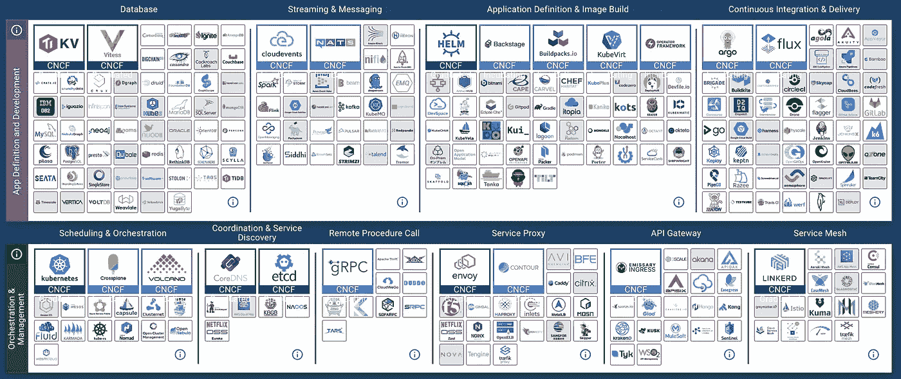

*图一。CNCF 风景*

下一代应用交付和管理需要灵活的组装能力。根据团队的需求，在最小能力集的基础上，可以小成本地扩展新的功能，但不能大幅放大。传统的 PaaS 解决方案仅仅基于一组固定的经验，已经被证明难以满足团队在产品进化过程中不断变化的场景需求。

## 开发运维的下一步，为不同的基础架构交付和管理应用

十多年来，DevOps 技术一直在不断发展，以提高工作效率。如今，业务应用的生产流程也发生了巨大的变化，从传统的编码、测试、打包、部署、维护和观察方式，到云基础设施的不断增强，意味着基于 API 的各种 SaaS 服务直接成为应用不可或缺的一部分。从开发语言的多样化到部署环境的多样化，再到组件的多样化，传统的 DevOps 工具链逐渐无法应对，与此同时，用户需求的复杂性呈指数级增长。

虽然 DevOps 延长了，但是我们需要一些不同的解决方案。对于现代的应用交付和管理，我们仍然有着同样的追求，那就是尽可能减少人为的投入，变得更加智能。新一代 DevOps 技术需要具备更易用的集成能力、服务网状能力以及集成观察和维护的管理能力。同时，工具需要简单易用，复杂性保持在平台之内。企业在选择时，可以结合自身的业务需求，配合新架构和遗留系统，组装出适合自己团队的平台解决方案，避免新平台成为业务开发者或企业的负担。

# 库伯韦拉之路就在前方

为了构建下一代应用交付平台，我们做到了:

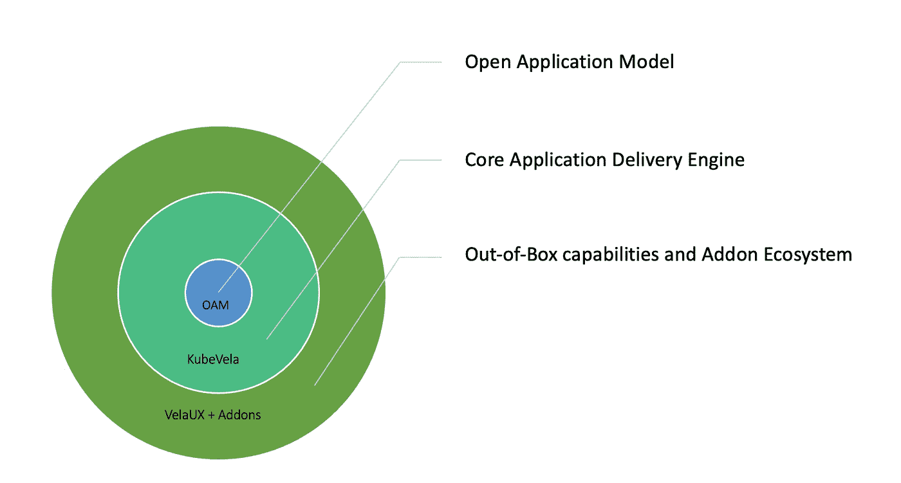

*图二。OAM/KubeVela 生态系统一览*

## OAM(开放应用模型):快速起搏实践中不断发展的方法论

基于阿里巴巴和微软的内部实践经验，我们在 2019 年推出了 OAM 这一全新的应用模式和理念。其核心思想在于关注点分离，通过组件和性状的统一抽象，可以规范云原生时代的业务研发。开发团队和 DevOps 团队之间的协作变得更加高效，同时我们希望避免因不同基础设施的差异而导致的复杂性。然后，我们发布了 KubeVela，作为 OAM 模型的标准化实现，以帮助公司快速实现 OAM，同时确保符合 OAM 的应用程序可以在任何地方运行。简而言之，OAM 以声明的方式描述了现代应用的完整组件，而 KubeVela 则根据 OAM 声明的最终状态运行。通过面向最终状态的 reconcile 循环，两者共同保证应用交付的一致性和正确性。

最近我们看到 Google 发表的一篇论文，公布了其在基础设施建设方面的内部学习成果，命名为“ [Prodspec 和 Annealing](https://www.usenix.org/publications/loginonline/prodspec-and-annealing-intent-based-actuation-google-production) ”。其设计理念和做法与“OAM 和 KubeVela”惊人的相似。可以看出，全球不同的企业对交付云原生应用程序有着相同的愿景。本文也再次证实了标准化模型和 KubeVela 的正确性。在未来，我们将继续基于社区的实践和 KubeVela 的演进来推动 OAM 模型的发展，并继续将最佳实践存放到方法论中。

## 通用混合环境和多集群交付控制平面

KubeVela 的内核以 [CRD 控制器](https://kubernetes.io/docs/concepts/extend-kubernetes/api-extension/custom-resources/)的形式存在，可以很容易地与 Kubernetes 生态系统集成，OAM 模型也兼容 Kubernetes API。除了 OAM 模型的抽象和编排功能，KubeVela 的微内核还是一个自然的应用交付控制平面，专为多集群和混合云环境而设计。这也意味着 KubeVela 可以无缝连接云资源和容器等不同的工作负载，并在不同的云和集群中进行编排和交付。

除了基本的编排功能，KubeVela 的一个核心特性是它允许用户定制交付工作流。工作流步骤提供了向集群部署组件、设置手动批准、发送通知等。当工作流执行进入稳定状态时(比如等待人工审批)，KubeVela 也会自动维护状态。或者，通过基于 CUE 的配置语言，可以集成任何基于 IaC 的流程，比如 Kubernetes CRD、SaaS API、Terraform 模块、图像脚本等。KubeVela 的 IaC 扩展性使其能够以微薄的成本集成 Kubernetes 的生态技术。对于平台构建者来说，将平台整合到他们自己的 PaaS 或交付系统中是非常迅速的。还有，通过 KubeVela 强大的扩展性，可以为企业用户标准化其他生态能力。

除了高级模型和扩展内核之外，我们还从社区中听到了很多关于使用 KubeVela 的现成产品的呼声。从 1.2 版本开始，社区投资开发了 GUI dashboard (VelaUX)项目，该项目基于 KubeVela 的微内核，运行在 OAM 模型之上，为 CI/CD 场景创建了一个交付平台。我们希望企业能够迅速采用 VelaUX 来满足业务需求，并拥有强大的可扩展能力来满足未来业务的需求。

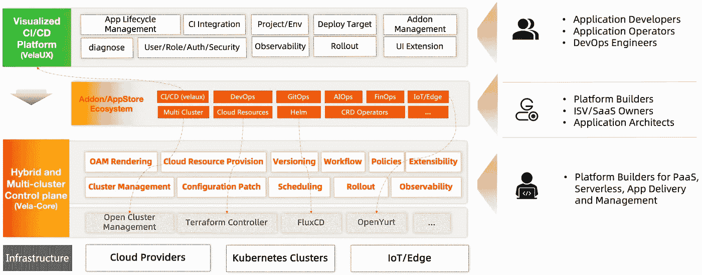

*图三。KubeVela 的产品架构*

围绕这一途径，在 1.3 版中，社区带来了以下更新:

# 作为 Kubernetes 多集群控制平面的增强

## 无需迁移，无缝切换到多集群

企业完成了向云原生架构的应用转型后，在切换到多集群部署时，是否还需要进行配置转型？答案是否定的。

KubeVela 自然是建立在多集群基础上的。如图 4 所示，这个应用程序 YAML 代表 Nginx 组件的一个应用程序，它将被发布到所有标记为`region=hangzhou`的集群。对于相同的应用程序描述，我们只需要在策略中指定要交付的集群的名称，或者通过标记过滤特定的集合。

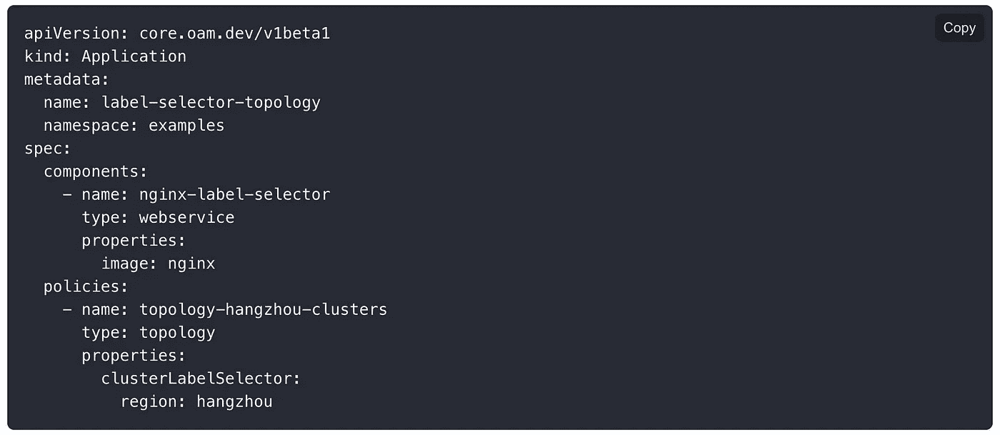

*图四。OAM 应用—选择部署集群*

当然，图 4 中显示的应用程序描述完全基于 OAM 规范。如果您当前的应用程序已经在 Kubernetes 本机资源中定义，不要担心，我们支持从它平滑过渡，如下面的图 5 所示，“引用 Kubernetes 资源进行多集群部署”，它描述了一个特定的应用程序，其组件依赖于控制集群中存在的一个秘密资源，并将其发布到所有标记为`region=hangzhou`的集群。

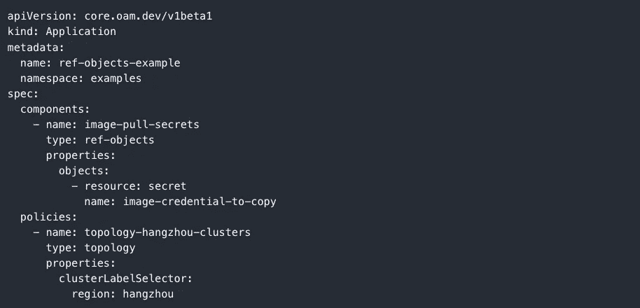

*图 5。参考 Kubernetes 本地资源*

除了应用的多集群部署，引用 Kubernetes 对象还可以用于现有资源的多集群复制、集群数据备份等场景。

## 处理多集群差异

尽管已经在统一的 OAM 模型中描述了应用程序，但是不同集群的部署可能会有所不同。例如，其他地区使用不同的环境变量和图像注册表。不同的集群部署不同的组件，或者一个组件部署在多个集群中，但对所有集群都具有高可用性，等等。对于这样的需求，我们提供了一个部署策略来进行差异化配置，如下面的图 6 所示，作为这种策略的一部分。策略的第一和第二拓扑类型以两种方式定义了两个目标策略。第三个意味着只部署指定的组件。第四个策略表示所选两种组件的部署以及其中一个组件的映像配置的差异。

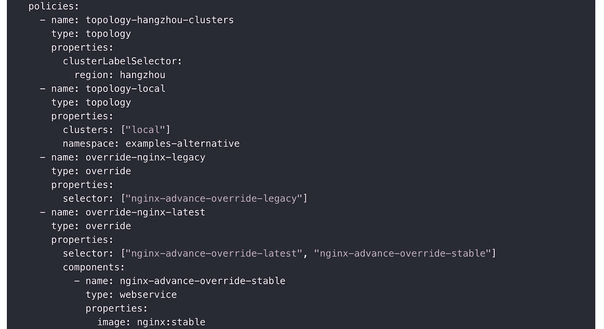

*图 6。多集群的差异化配置*

KubeVela 支持灵活的差异配置策略，可以通过组件属性、特征和其他形式进行配置。如上图所示，第三个策略描述的是组件选择能力，第四个策略描述的是镜像版本的区别。我们可以看到，在描述差异时没有指定目标。通过将差异配置合并到工作流步骤中，可以灵活地对其进行修补。

## 配置多集群交付流程

向不同目标集群的应用交付过程是可控的，并由工作流描述。如图 7 所示，分别采用了部署到两个集群的步骤以及目标策略和差异化策略。以上说明，策略部署只需要原子化定义，可以在工作流步骤中灵活组合，满足不同场景的需求。

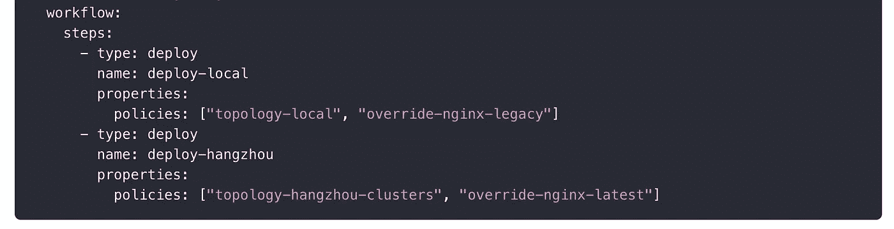

*图七。定制多集群交付流程*

交付工作流还有更多用途，包括多集群金丝雀发布、人工审批、精准发布控制等。

## 版本控制，安全且可追踪

随着敏捷开发，复杂应用程序的描述随时都在变化。为了确保应用程序发布的安全性，我们需要能够在发布时或发布后将应用程序回滚到以前的正确状态。因此，我们在当前版本中引入了更健壮的版本控制机制。

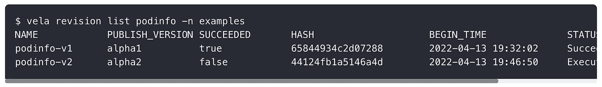

*图 8。查询应用程序的历史版本*

我们可以查询应用程序的每一个过去的版本，包括它的发布时间和它是否成功。我们可以比较版本之间的变化，并在发布过程中遇到失败时，根据前一个成功版本呈现的快照快速回滚。在发布一个新版本后，如果它失败了，你不需要改变配置源。您可以基于历史版本直接重新发布。

版本控制机制是应用程序配置管理的中心思想。在应用程序的完整描述被统一呈现后，它被检查、存储和分发。

## 查看更多 Vela 核心用法

*   多集群应用交付:[https://kubevela.io/docs/case-studies/multi-cluster](https://kubevela.net/zh/docs/case-studies/multi-cluster)
*   参考外部 Kubernetes 对象:【https://kubevela.io/docs/end-user/components/ref-objects 
*   应用版本管理:【https://kubevela.io/docs/end-user/version-control 

# VelaUX 引入了多租户隔离和用户认证

## 企业的多租户和隔离

在 VelaUX 中，我们引入了一个项目的概念，该项目为了安全将多租户分开，包括应用交付目标、环境、团队成员和权限等。图 9 显示了项目列表页面。项目管理员可以在这个页面上根据团队的需求创建不同的项目，分配相应的资源。当企业中有多个团队或多个项目组同时使用 VelaUX 平台发布他们的业务应用程序时，这种能力变得非常重要。

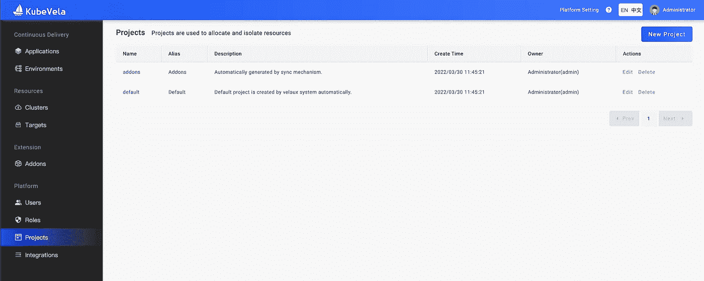

*图九。项目管理页面*

## 开放认证和 RBAC

作为一个至关重要的平台，用户认证是必须具备的基本能力之一。从 1.3 版本开始，我们支持用户身份验证和 RBAC 身份验证。

我们相信大多数企业都建立了统一的认证平台(Oauth 或 LDAP)来进行用户认证。因此，VelaUX 优先考虑让 Dex 打通单点登录能力，支持 LDAP、OIDC、Gitlab/Github 等用户认证方式，并将 VelaUX 作为让 access 打通的子门户之一。当然，如果你的团队不需要统一认证，我们也提供基本的本地用户认证能力。

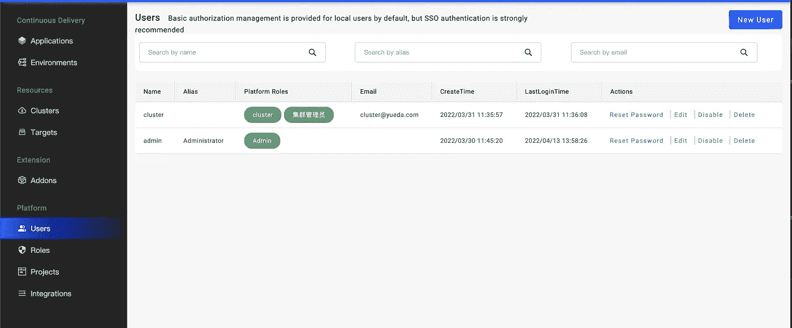

*图 10。本地用户管理*

对于认证，我们使用 RBAC 模型。尽管如此，我们也看到，主要的 RBAC 模式不能处理更精确的权限控制场景，例如将应用程序的操作权限授权给特定的用户。我们继承了 IAM 的设计理念，将权限扩展到资源+动作+条件+行为的策略组合。认证系统(前端 UI 认证/后端 API 认证)实现了面向策略的细粒度认证。但在授权方面，当前版本只是内置了一些标准权限策略，后续版本提供了创建自定义权限的能力。

同时，我们也看到一些大型企业已经搭建了独立的 IAM 平台。VelaUX 的 RBAC 数据模型与常见的 IAM 平台相同。因此，希望将 VelaUX 连接到其自建 IAM 的用户可以无缝扩展。

## 更安全的集中式开发运维

在应用交付中不可避免地会有一些操作和维护需求的配置管理，主要基于多集群。配置管理需求尤为突出，比如私有映像库的认证配置，Helm 产品库的认证配置，或者 SSL 证书等待。我们需要统一管理这些配置的有效性，并在需要的地方安全地同步它们，最好是在业务开发人员不知道的情况下。

在 1.3 版本中，我们在 VelaUX 中引入了一个集成配置管理模块。它的底层也使用组件模板和应用程序资源分配链接来管理和分配配置。目前，Secret 用于配置存储和分发。配置生命周期独立于业务应用程序，我们在每个项目中独立维护配置分发过程。您只需要根据配置模板填写管理员用户的配置信息。

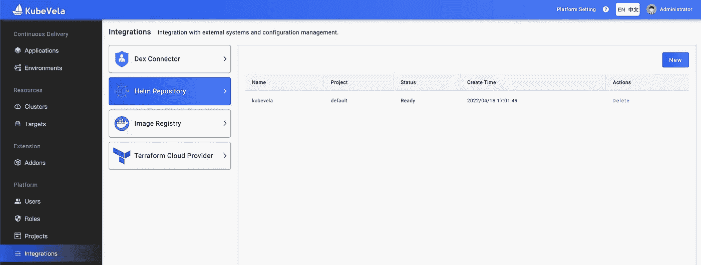

*图 11。集成配置*

各种插件提供不同的配置类型，用户可以根据需要定义更多的配置类型，统一管理。对于业务级的配置管理，社区也在规划。

## 查看更多 VelaUX 用法

*   项目管理:【https://kubevela.io/docs/how-to/dashboard/user/project 
*   用户管理:【https://kubevela.io/docs/how-to/dashboard/user/user 
*   https://kubevela.io/docs/how-to/dashboard/user/rbacRBAC 授权:
*   使用单点登录:【https://kubevela.io/docs/tutorials/sso 
*   配置管理:[https://kubevela . io/docs/how-to/dashboard/config/dex-connectors](https://kubevela.net/zh/docs/how-to/dashboard/config/dex-connectors)

# 在插件生态系统中引入版本控制

插件功能是在版本 1.2 中引入的，提供了扩展的插件规范、安装、操作和维护管理功能。社区可以通过制作不同的附加物来扩大库比韦拉的生态容量。当我们的插件和框架在不断迭代的时候，版本兼容的问题逐渐显现出来，我们迫切需要一个版本管理机制。

*   插件版本发布:我们在 Github 上开发和管理社区的官方插件。除了集成的第三方产品版本，每个插件还包括一个定义和其他配置。所以，每一个 Addon 发布后，我们都是按照它的定义来定义的。版本号被打包，历史被保留。同时，我们重用了 Helm Chart 的产品分发 API 规范来分发 Addon。
*   插件版本发布:我们在 Github 上开发和管理社区的官方插件。除了集成的第三方产品版本，每个插件还包括一个定义和其他配置。所以，每一个 Addon 发布后，我们都是按照它的定义来定义的。版本号被打包，历史被保留。同时，我们重用了 Helm Chart 的产品分发 API 规范来分发 Addon。

## 多集群插件可控安装

安装时需要在子集群中安装一类插件，如图 12 所示的 FluxCD 插件，它提供了舵图渲染和部署功能。我们需要将它部署到子集群，而在过去，这个过程是分发给所有子集群的。但是，根据社区反馈，不一定需要在所有集群中安装不同的插件。我们需要一种不同的处理机制来按需安装特定集群的扩展。

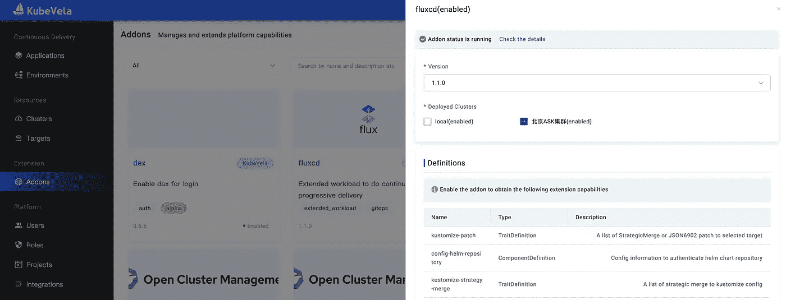

图 12 附加配置

用户可以在启用插件时指定要部署的集群，系统会根据用户的配置部署插件。

## 附加生态系统的新成员

在迭代扩展框架功能的同时，社区中现有的插件也在不断增加和升级。在云服务支持级别，受支持的供应商数量已经增加到 7 家。生态技术、AI 训练和服务插件、Kruise Rollout 插件、Dex 插件等。，已添加。与此同时，舵图表插件和 OCM 集群管理插件也进行了更新，以改善用户体验。

## 更多附加用法

*   附加介绍:[https://kubevela.io/docs/how-to/cli/addon/addon](https://kubevela.net/zh/docs/how-to/cli/addon/addon)

# 最近的路线图

随着 KubeVela core 越来越稳定，其可扩展性也逐渐释放出来。社区 1.2/1.3 版本的演进已经加速。未来，我们将在两个月的周期内逐步迭代新版本。在下一个 1.4 版本中，我们将添加以下功能:

*   可观测性:围绕日志、指标和跟踪提供完整的可观测性解决方案，提供 KubeVela 系统的开箱即用可观测性，允许定制可观测性配置，并集成现有的可观测性组件或云资源。
*   离线安装:提供相对完善的离线安装工具和解决方案，方便更多用户在离线环境下使用 KubeVela。
*   多集群权限管理:为 Kubernetes 多集群提供深入的权限管理功能。
*   更多开箱即用的附加功能。

KubeVela 社区期待您的加入，共同构建一个易用、标准化的下一代云原生应用交付和管理平台！​