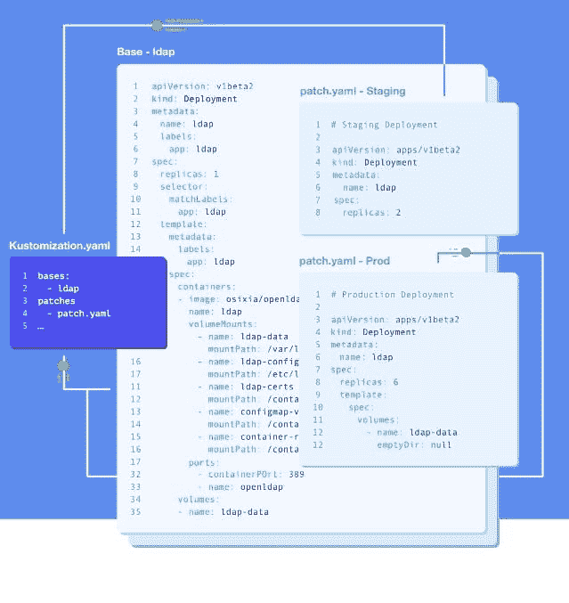
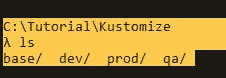
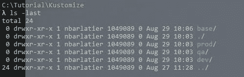
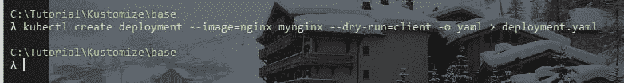
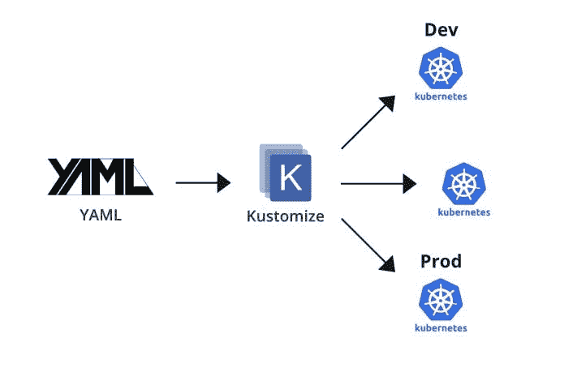

# 草泽游戏攻略

> 原文：<https://blog.devgenius.io/kustomize-introduction-a52ea3eff66d?source=collection_archive---------12----------------------->


# Kubernetes 和 Kustomize 简介:如何使用 Kustomize 轻松定制任何资源配置？

在 Kubernetes 中，就像在计算机科学的任何其他生态系统中一样，我们需要使用配置的概念来引导我们不同的过程。

通过 Kubernetes，我们驱动不同的资源(工作负载、部署、pod、配置图、机密、服务等)。

> 资源是 Kubernetes API 中的一个端点，它存储某种 API 对象的集合；例如，内置的 Pod 资源包含一组 Pod 对象。

像任何生态系统一样，我们可以有几种不同的环境。因此，在 Kubernetes **K8s** 中，我们可能会遇到以下常见情况:

*   发展环境
*   质量保证环境
*   生产环境

在关于 kustomize 的第一部分中，我们将在教程中重点关注一种类型的资源:**工作负载**，我们将了解如何 Kustomize 每个环境的副本数量:-)

换句话说，我们将研究如何为每个环境定制部署。今天，我们将使用一个常见的设置:豆荚的数量。

因为很明显，它在产量上要高于其他环境。

因此，我们将看到 Kustomize 如何帮助我们覆盖一个工作负载的配置。

在下一节中，我们来看看什么是 Kustomize。

# 草泽

首先:为什么使用 Kustomize 是最好的选择，即使我们有像 Helm 这样的工具。

# 利弊

Kustomize 比 Helm 简单多了。它不需要复杂的模板，甚至不需要安装，如果你最近使用 kubectl 的话。事实上，1.14 及以上版本的 kubectl 都可以使用 Kustomize。

从 1.14 开始与 kubectl 集成，它允许您在不接触模板的情况下对配置进行声明性更改。

所以基本上我们什么都不需要做，只需要将 Kustomize 和 kubectl 一起使用，并带有一些选项！

此外，我们不需要使用模板，用于配置 k8s 资源的 yaml 文件将不会受到不同环境之间 Kustomize 的影响！

现在为了我们的需要，我们将使用**补丁**的概念，有一个基础和覆盖。我们稍后会解释这三个词的意思。

我们将会看到即使在更复杂的情况下使用 Kustomize 也是多么容易。事实上，我们还可以在整个代码中使用 Kustomize 来处理集群状态。

现在让我们看看缺点

使用 Kustomize，我们需要添加更多的文件，这样我们就可以告诉 Kustomize 工具要做什么。但在其他方面，这是一种非常好且灵活的方法。

# Kustomize 怎么用

Kustomize 有三种不同的主要用途:

*   我们的 kubernetes 资源的设置字段(设置名称空间、设置或添加名称、公共标签或注释)
*   定制我们的 kubernetes 资源(通过应用带有 **patchesStrategicMerge** 或 **patchesJson6902** 的补丁)
*   从其他来源获取资源

在本教程中，我们将重点关注第二个选项:定制我们的 Kubernetes 资源，并了解何时使用一种修补策略。

现在我们看到了如何使用 Kustomize，我们需要学习最后一个概念:基础和覆盖

# 重叠的概念

使用 Kustomize，我们总是从一个原始的资源配置文件开始。在我们的用例中，我们将从一个部署 yaml 文件开始，该文件将配置如何在 kubernetes 集群中部署工作负载。

一旦我们有了这个原始文件，我们将看到 kustomize 如何在不接触原始文件的情况下，通过原始文件的转换来应用覆盖更改。

我们将在这里应用一个特殊的覆盖转换:通过在这里修补可以在不同环境(开发、QA、生产)之间改变的工作负载数量来进行修补。

例如，在开发中，我们将需要一个实例，对于 QA，我们可以通过多达 3 个实例来测试工作负载如何处理扩展。最后，我们将在 PROD 上应用 6 个实例。

我们将首先创建原始的部署 YAML 文件，正如我们在使用 kubernetes 时所做的那样。

**该文件无需修改即可在不同的环境中使用。**

现在我们有了原始的资源清单，我们将需要 Kustomize 将使用的另一个文件，以便能够应用覆盖转换:



基本上，Kustomize 使用补丁在现有的标准配置文件上引入特定于环境的变化，而不会干扰它。

所以我们的部署 yaml 文件将保持不变。

让我们首先组织我们的演示。我们将有一个基本目录和三个不同的“覆盖”目录(每个环境一个:dev qa 和 prod)



首先创建一个名为“Kustomize”的目录

然后创建一个名为**【基地】**的目录。

“base”目录将包含描述我们的部署资源的原始 yaml 文件。Kustomize 不会碰它。按照惯例，我们可以将它存储在一个名为**“base”**的目录中。我们在基本目录中只需要一个特殊的文件:

“基本”目录将与我们将创建的**“覆盖”**目录形成对比，后者仅包含通过转换应用于原始目录的变化。

然后，我们为环境创建 3 个“覆盖”目录:dev、qa、prod。

最后我们得到:



因此，让我们进入“基本”目录

```
C:\Tutorial\Kustomize 
λ cd base\
```

我们将从使用模拟运行从 kubectl 生成 YAML 部署文件开始，这将从一个基本的 kubettl 命令创建 YAML 部署配置文件。

我们将使用 nginx docker 映像来演示 nginx 应用程序。

为此，我们可以使用以下命令:

`# kubectl create deployment --image=nginx mynginx --dry-run=client -o yaml`

该命令做两件事:

*   使用命令**创建名为 mynginx 的部署**来构建部署(我们可以使用任何名称), mynginx 将是部署名称。部署将使用没有任何标签的 docker 镜像 **nginx** (这意味着该命令将采用最新版本)
*   在 yaml 中显示 kubectl run 命令在标准输出中的结果。

我们得到以下结果

```
λ kubectl create deployment --image=nginx mynginx --dry-run=client -o yaml     
apiVersion: apps/v1                                                            
kind: Deployment                                                               
metadata:                                                                      
  creationTimestamp: null                                                      
  labels:                                                                      
    app: mynginx                                                               
  name: mynginx                                                                
spec:                                                                          
  replicas: 1                                                                  
  selector:                                                                    
    matchLabels:                                                               
      app: mynginx                                                             
  strategy: {}                                                                 
  template:                                                                    
    metadata:                                                                  
      creationTimestamp: null                                                  
      labels:                                                                  
        app: mynginx                                                           
    spec:                                                                      
      containers:                                                              
      - image: nginx                                                           
        name: nginx                                                            
        resources: {}                                                          
status: {}
```

让我们使用命令将它保存到基本目录中的部署 yaml 配置文件中

```
λ kubectl create deployment --image=nginx mynginx --dry-run=client -o yaml > deployment.yaml
```



让我们看看文件的内容:

```
C:\Tutorial\Kustomize\base
λ cat deployment.yaml
apiVersion: apps/v1
kind: Deployment
metadata:
  creationTimestamp: null
  labels:
    app: mynginx
  name: mynginx
spec:
  replicas: 1
  selector:
    matchLabels:
      app: mynginx
  strategy: {}
  template:
    metadata:
      creationTimestamp: null
      labels:
        app: mynginx
    spec:
      containers:
      - image: nginx
        name: nginx
        resources: {}
status: {}
```

让我们删除空值和空值:

```
apiVersion: apps/v1
kind: Deployment
metadata:
  labels:
    app: mynginx
  name: mynginx
spec:
  replicas: 1
  selector:
    matchLabels:
      app: mynginx
  template:
    metadata:
      labels:
        app: mynginx
    spec:
      containers:
      - image: nginx
        name: nginx
```

我们有文件:

```
λ ls -last
total 1
1 -rw-r--r-- 1 xxx 1049089 392 Aug 29 17:45 deployment.yaml
0 drwxr-xr-x 1 xxx 1049089   0 Aug 29 10:06 ./
0 drwxr-xr-x 1 xxx 1049089   0 Aug 29 10:03 ../
```

让我们应用它，看看它是否有效:

```
C:\Tutorial\Kustomize\base
λ kubectl apply -f deployment.yaml
deployment.apps/mynginx createdλ kubectl get deploy
NAME      READY   UP-TO-DATE   AVAILABLE   AGE
mynginx   1/1     1            1           56s
```

好了，现在我们确定这个部署配置 yaml 文件是有效的，我们可以开始研究如何在“base”目录中告诉 Kustomize 它了！

但是首先我们需要检查 Kustomize 是否在我们的 Kubectl 内:)

```
C:\Tutorial\Kustomize\base
λ kubectl kustomize --help
Build a set of KRM resources using a 'kustomization.yaml' file. The DIR argument must be a path to a
directory containing 'kustomization.yaml', or a git repository URL with a path suffix specifying
same with respect to the repository root. If DIR is omitted, '.' is assumed.Examples:
  # Build the current working directory
  kubectl kustomize# Build some shared configuration directory
  kubectl kustomize /home/config/production# Build from github
  kubectl kustomize [https://github.com/kubernetes-sigs/kustomize.git/examples/helloWorld?ref=v1.0.6](https://github.com/kubernetes-sigs/kustomize.git/examples/helloWorld?ref=v1.0.6)Options:
      --enable-alpha-plugins=false: enable kustomize plugins
      --enable-helm=false: Enable use of the Helm chart inflator generator.
      --enable-managedby-label=false: enable adding app.kubernetes.io/managed-by
  -e, --env=[]: a list of environment variables to be used by functions
      --helm-command='helm': helm command (path to executable)
      --load-restrictor='LoadRestrictionsRootOnly': if set to 'LoadRestrictionsNone', local
kustomizations may load files from outside their root. This does, however, break the relocatability
of the kustomization.
      --mount=[]: a list of storage options read from the filesystem
      --network=false: enable network access for functions that declare it
      --network-name='bridge': the docker network to run the container in
  -o, --output='': If specified, write output to this path.
      --reorder='legacy': Reorder the resources just before output. Use 'legacy' to apply a legacy
reordering (Namespaces first, Webhooks last, etc). Use 'none' to suppress a final reordering.Usage:
  kubectl kustomize DIR [flags] [options]Use "kubectl options" for a list of global command-line options (applies to all commands).
```

让我们试试第一个例子:

```
# Build the current working directory
  kubectl kustomize
```

我们得到的结果是:

```
C:\Tutorial\Kustomize\base
λ kubectl kustomize
Error: unable to find one of 'kustomization.yaml', 'kustomization.yml' or 'Kustomization' in directory 'C:\Tutorial\Kustomize\base'
```

好了，现在我们知道我们可以选择:

*   kustomization.yaml 或 kustomization.yml
*   甚至目录库定制化

让我们创建以下文件:kustomization.yaml，其中仅包含以下内容:

```
resources:
  - deployment.yaml
```

没别的了。

最后，我们有:

```
C:\Tutorial\Kustomize\base
λ ls -last
total 6
4 drwxr-xr-x 1 nbarlatier 1049089   0 Aug 30 22:16 ./
1 -rw-r--r-- 1 nbarlatier 1049089  31 Aug 30 22:14 kustomization.yaml
1 -rw-r--r-- 1 nbarlatier 1049089 392 Aug 29 17:45 deployment.yaml
0 drwxr-xr-x 1 nbarlatier 1049089   0 Aug 29 10:03 ../
```

让我们看看 Kustomize 在与 kubectl 一起使用时会做什么:

```
C:\Tutorial\Kustomize\base
λ kubectl kustomize
apiVersion: apps/v1
kind: Deployment
metadata:
  creationTimestamp: null
  labels:
    app: mynginx
  name: mynginx
spec:
  replicas: 1
  selector:
    matchLabels:
      app: mynginx
  strategy: {}
  template:
    metadata:
      creationTimestamp: null
      labels:
        app: mynginx
    spec:
      containers:
      - image: nginx
        name: nginx
        resources: {}
status: {}
```

它只是重新显示部署内容，这与使用-dry-run=client -o yaml 创建部署非常相似！Kustomize 必须在幕后使用它。:-)

现在我们有了“基础”，现在让我们通过进入 dev 文件夹来查看“叠加”:

```
C:\Tutorial\Kustomize\base 
λ cd ..\dev 
C:\Tutorial\Kustomize\dev
```

让我们创建以下 Dev 覆盖文件:kustomization.yaml，内容如下:

```
λ cat kustomization.yaml
apiVersion: kustomize.config.k8s.io/v1beta1
kind: Kustomization
bases:
  - ../base
patchesStrategicMerge:
  - numberReplica.yaml
```

覆盖文件总是引用基础，所以 Kustomize 知道什么资源是目标。我们使用 patchesStrategicMerge 策略来改变副本的数量。最后，我们给出 yaml 文件名，它将包含开发环境的副本数量:numberReplica.yaml，内容如下:

```
apiVersion: apps/v1
kind: Deployment
metadata:
    name: mynginx
spec:
    replicas: 2
```

在这个覆盖文件中，我们只是告诉它将部署 mynginx 作为目标，并将副本的数量设置为 2！

因此，现在我们准备测试如何覆盖开发的基础，并显示这个转换的结果，而不接触基础和覆盖文件。

让我们记住我们的文件和目录结构:

```
C:\Tutorial  (Tutorial@1.0.0)
λ tree Kustomize\ /f
Folder PATH listing for volume OS
Volume serial number is C0000100 8021:2C9C
C:\TUTORIAL\KUSTOMIZE
├───base
│       deployment.yaml
│       kustomization.yaml
│
├───dev
│       kustomization.yaml
│       numberReplica.yaml
│
├───prod
└───qa
```

让我们在 dev 环境中应用 kustomize，在 kubectl 和命令 kustomize 的帮助下非常简单，我们只需传递 dev 目录:

```
λ kubectl kustomize Kustomize\dev\
```

我们得到如下显示

```
C:\Tutorial  (Tutorial@1.0.0)
λ kubectl kustomize Kustomize\dev\
apiVersion: apps/v1
kind: Deployment
metadata:
  labels:
    app: mynginx
  name: mynginx
spec:
  replicas: 2
  selector:
    matchLabels:
      app: mynginx
  strategy: {}
  template:
    metadata:
      labels:
        app: mynginx
    spec:
      containers:
      - image: nginx
        name: nginx
        resources: {}
status: {}
```

我们可以看到副本的数量现在是 2！当我们创建覆盖 yaml 文件时，我们必须小心考虑正确的 yaml 缩进，以便补丁合并在 yaml 中选择正确的键值元组。

让我们对 QA 和 PROD 做同样的事情:

kustomization.yaml 文件不会改变:

kustomization.yaml:

```
apiVersion: kustomize.config.k8s.io/v1beta1
kind: Kustomization
bases:
  - ../base
patchesStrategicMerge:
  - numberReplica.yaml
```

对于 QA 和 PROD，只有 numberReplica.yaml 文件随着复制副本的数量而变化:

对于质量保证:

```
apiVersion: apps/v1
kind: Deployment
metadata:
  name: mynginx
spec:
  replicas: 4
```

对于产品:

```
apiVersion: apps/v1
kind: Deployment
metadata:
  name: mynginx
spec:
  replicas: 8
```

让我们看看最后一棵树:

```
C:\Tutorial  (Tutorial@1.0.0)
λ tree Kustomize\ /f
Folder PATH listing for volume OS
Volume serial number is C0000100 8021:2C9C
C:\TUTORIAL\KUSTOMIZE
├───base
│       deployment.yaml
│       kustomization.yaml
│
├───dev
│       kustomization.yaml
│       numberReplica.yaml
│
├───prod
│       kustomization.yaml
│       numberReplica.yaml
│
└───qa
        kustomization.yaml
        numberReplica.yaml
```

让我们测试 Kustomize 如何帮助我们在不改变原始部署的情况下为每个环境拥有 3 个不同的 yaml 部署配置

```
C:\Tutorial\Kustomize
λ kubectl kustomize dev
apiVersion: apps/v1
kind: Deployment
metadata:
  labels:
    app: mynginx
  name: mynginx
spec:
  replicas: 2
  selector:
    matchLabels:
      app: mynginx
  strategy: {}
  template:
    metadata:
      labels:
        app: mynginx
    spec:
      containers:
      - image: nginx
        name: nginx
        resources: {}
status: {}C:\Tutorial\Kustomize
λ kubectl kustomize qa
apiVersion: apps/v1
kind: Deployment
metadata:
  labels:
    app: mynginx
  name: mynginx
spec:
  replicas: 4
  selector:
    matchLabels:
      app: mynginx
  strategy: {}
  template:
    metadata:
      labels:
        app: mynginx
    spec:
      containers:
      - image: nginx
        name: nginx
        resources: {}
status: {}C:\Tutorial\Kustomize
λ kubectl kustomize prod
apiVersion: apps/v1
kind: Deployment
metadata:
  labels:
    app: mynginx
  name: mynginx
spec:
  replicas: 8
  selector:
    matchLabels:
      app: mynginx
  strategy: {}
  template:
    metadata:
      labels:
        app: mynginx
    spec:
      containers:
      - image: nginx
        name: nginx
        resources: {}
status: {}
```

我们可以看到每个环境中副本数量的变化:

*   戴夫:2
*   问答:4
*   产品:8

到目前为止，我们只使用 Kustomize 来显示转换的结果。它不适用于 kubernetes 集群。

现在，让我们看看如何将 kustomization 应用于我们的集群:

我们使用它非常简单

```
kubectl apply -k EnvDirectory
```

对于 Dev，我们得到:

```
C:\Tutorial\Kustomize
λ kubectl apply -k dev
deployment.apps/mynginx created
```

让我们检查部署:

```
C:\Tutorial\Kustomize
λ kubectl get deployment
NAME      READY   UP-TO-DATE   AVAILABLE   AGE
mynginx   2/2     2            2           57s
```

我们果然有两个复制品！

让我们将 kustomization 应用于 QA:

```
C:\Tutorial\Kustomize
λ kubectl apply -k qa
deployment.apps/mynginx configured
```

我们注意到部署是配置的，而不是创建的，因为我只更改了副本的数量，但在现实世界中，我们应该更改 kubectl 的名称空间甚至集群配置。

但是我想在这里只关注最简单形式的 Kustomize。

让我们再次检查部署:

```
C:\Tutorial\Kustomize
λ kubectl get deployment
NAME      READY   UP-TO-DATE   AVAILABLE   AGE
mynginx   4/4     4            4           3m59s
```

最后，让我们检查一下产品

```
C:\Tutorial\Kustomize
λ kubectl apply -k prod
deployment.apps/mynginx configuredC:\Tutorial\Kustomize
λ kubectl get deployment
NAME      READY   UP-TO-DATE   AVAILABLE   AGE
mynginx   4/8     8            4           4m36sC:\Tutorial\Kustomize
λ kubectl get deployment
NAME      READY   UP-TO-DATE   AVAILABLE   AGE
mynginx   8/8     8            8           4m57s
```

我们声明性地得到了我们想要的 8 个实例！

所以现在让我们总结一下:

*   我们使用了一种类型的覆盖:带有 patchesStrategicMerge 策略的补丁，因此我们可以更改每个环境的副本数量



*   我们看到了如何在不接触我们的集群的情况下查看 kustomization 结果
*   我们看到了如何将 kustomization 应用于我们在每个环境的集群上的部署

那都是乡亲们！下一次，我们将深入探讨如何改变名称空间，并使用 Kustomize 提供的其他类型的策略。

感谢你阅读这篇文章，如果你喜欢它，我将不胜感激，如果你能给一个喜欢或关注我。祝您愉快！

*原载于*[*https://nicolasbarlatier . hash node . dev*](https://nicolasbarlatier.hashnode.dev/introduction-kubernetes-and-kustomize-how-to-easily-customize-any-resource-configuration-with-kustomize)*。*