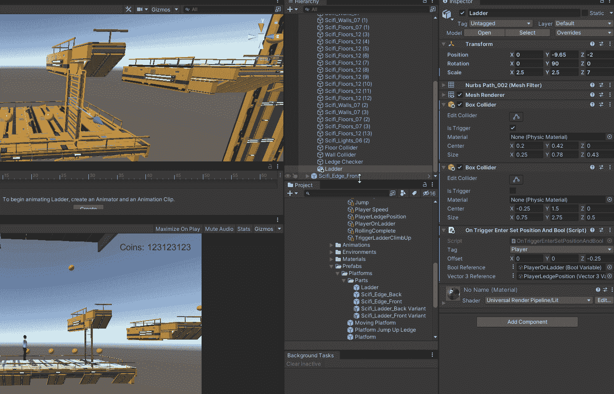
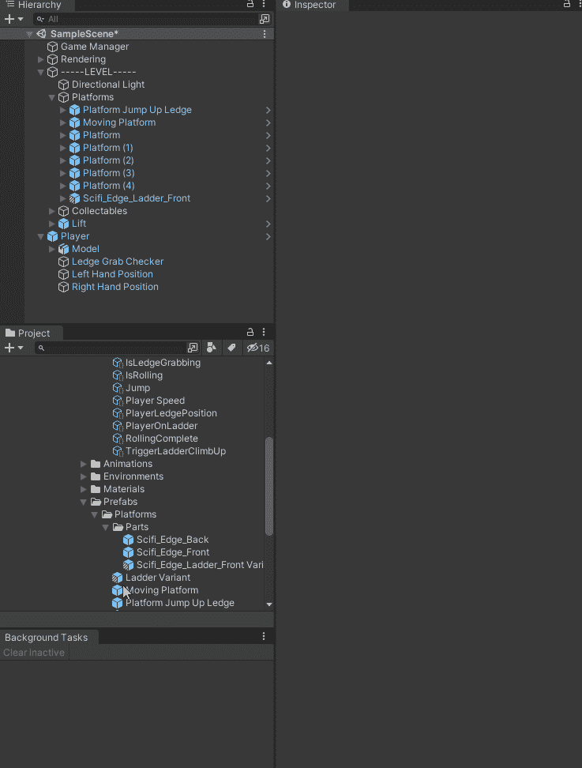

# 阶梯系统

> 原文：<https://blog.devgenius.io/ladder-system-22ed1a5bb8a8?source=collection_archive---------2----------------------->

## 使用动画系统使玩家看起来像在爬梯子

# 建立

我首先在游戏中添加了一个梯子。

现在我需要一种方法来防止玩家走过梯子，所以我给它添加了一个盒子碰撞器，然后调整它，使它适合我不想让玩家走过的地方。

接下来，我在梯子前面添加了另一个盒子碰撞器，用来检测玩家。当玩家输入这个触发器时，我想激活爬梯动画。

接下来我给梯子添加一个壁架组件，这是我为我的 [**壁架抓取系统**](/completing-the-ledge-grabbing-system-9a4fef94be3b) 创建的行为。当任何设置了标记字段的标记进入触发器时，玩家的壁架位置被设置，玩家的壁架抓取球被设置为真。这也是我希望玩家进入天梯触发时发生的事情。我将 Bool 的 Z 偏移设置为 0.5，我使用我创建的 Player On Ladder 来激活爬梯动画。

注意:我将壁架行为重命名为触发时输入 Set Position 和 Bool。

我确保我的爬梯动画设置正确。位置和旋转被烘焙到动画中，它是一个人形。

接下来，我将动画添加到播放器动画控制器，并设置所有的过渡。当爬上梯子是真的时，我过渡到动画。当从梯子上爬的触发器被触发时，我就转换到自由攀登。我还添加了一个当“爬上梯子”设置为“假”时返回空闲状态的转换，以防有一次我希望能够在没有到达梯子顶部的情况下转换出梯子。我还确保了爬梯有玩家设定的位置

# 让玩家爬梯子

我将代码添加到我的玩家动画中，让它设置所需的动画参数，这样我的玩家就会看起来像在爬梯子。当触发器梯子向上爬设置为真时，我在动画上设置触发器，并确保设置向上爬梯子为假。我还将梯子爬上触发器重新设置为 false，这样就不会再次触发。

我把需要的代码添加到播放器中。如果 On Ladder Bool 引用设置为 true，我将玩家设置在梯子上，然后调用 Grab Ledge 方法。在这方面，抓壁架和爬梯子的规则是一样的。如果玩家在梯子上，我会把它移向动画位置。如果玩家不再在梯子上，我将玩家的位置设置为壁架位置。

然后，我确保向播放器和播放器动画组件添加了正确的 ScriptableObject 变量。

现在我的玩家要爬梯子了。

## 到达梯子的顶端

玩家没有办法知道他们什么时候到达梯子的顶端，并且将永远向上爬。

为了解决这个问题，我在场景中添加了一个壁架预制体，然后我让梯子成为壁架的孩子，并移动所有东西，直到所有东西在视觉上排成一行。

这个壁架是为玩家搭建的。我所需要做的就是改变布尔参考触发器阶梯向上爬。

现在玩家可以爬上梯子了

# 让它成为一个预制的

最后，我需要做的就是把它变成一个我可以使用的预制组件。我也确保我把这个预设部分添加到我的平台预设中，这样我就可以很容易地在游戏中的任何平台上使用它。

当然，我也需要为后边缘创建一个。为了避免几何图形出错，我还需要确保将梯子的比例设置为 Z 轴上的-7，平台的比例设置为 Z 轴上的-1，以帮助在视觉上正确排列。

现在，我可以在游戏中的任何平台上使用梯子作为优势，只需启用游戏对象。

我现在可以爬梯子了。

