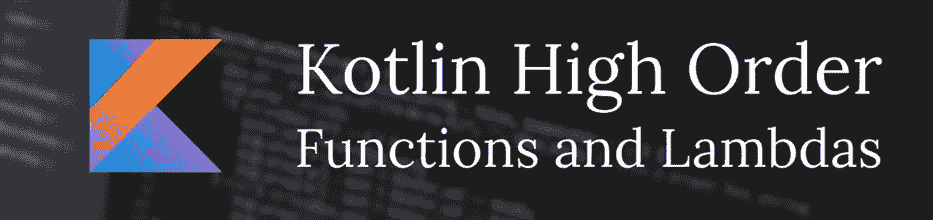

# Lambdas &具有 Kotlin 的高阶函数

> 原文：<https://blog.devgenius.io/lambdas-higher-order-functions-with-kotlin-2508cab53609?source=collection_archive---------12----------------------->



# 兰姆达斯

在 kotlin 中，每个函数都有一个名字，body &名字前的关键字“fun ”,意思是，我们要声明一个函数，在 body 中加入代码，我们要做些什么，这就是函数的全部，但是 kotlin 也支持 lambda。

Lambda 是一个做函数的表达式，是一个匿名函数，不是像我们通常做的那样声明一个函数，而是声明一个没有名字的函数。

Lambdas 表达式总是以花括号开始和结束，你也可以像变量值一样添加一个 lambda，以后再使用它。

这是一个如何声明 lambda 表达式的例子。

```
val expressionOne = **{** x: Int **->** x +1 **}**
```

在上面的代码中我们可以看到括号内的表达式分为两部分，首先是接收这个函数的参数，我们需要指定变量的类型。然后它是一个箭头操作符，然后我们有一个要执行的代码。

Kotlin 还允许我们，用一个可以接收变量的函数类型来声明变量。让我们看看如何实现这一点。

```
val expressionTwo: (x:Int) -> (Int) = **{** x **->** x +1 **}**
```

在这个例子中，我们对 kotlin 说，可以接受的值是一个带有一个 Int 类型参数的函数，并返回一个 Int。在表达式中，我们不再需要添加对象类型，因为 kotlin 推断出了它。

要调用和执行这些函数，只需像调用普通函数一样，让我们看看。

```
*println*(expressionOne(1))
    // x=1 return 2
*println*(expressionTwo(3))
   // x=3 return 4
```

现在，lambda 用起来有用吗？。

嗯，lambda 在不同方面都很有用，但当我们在高阶函数中使用它时更好，那么什么是高阶函数呢？

# 高阶函数

高阶函数是将另一个函数作为参数或返回一个函数的函数。

但是让我们看一个例子来更好地理解，它到底是什么，kotlin 的标准库中有许多高阶函数，例如，repeat()。

```
public inline fun repeat(times: Int, action: (Int) -> Unit) {
    *contract* **{** callsInPlace(action) **}** for (index in 0 *until* times) {
        action(index)
    }
}
```

Repeat 函数接收两个参数，第一个是 Int，表示我们作为第二个参数传递的函数将重复多少次，第二个是接收 Int 但不返回任何值的函数。

在上面的函数中，action 参数是我们的 lambda 表达式，我们想执行多少次就执行多少次。

```
*repeat*(2)**{** it ->
    *println*("${it+1} time")
**}**Result:
    **//** 1 time
    // 2 time
```

这些是标准库中的其他例子。

**让**

```
val fruits = *listOf*("apple","pineapple","watermelon","cherry")*println*(fruits.*let* **{ it**.*last*() **}**)Result:
    //cherry
```

**敷**

```
data class Person(var name: String,var lastName: String)var john = Person("John","Smith").*apply* **{** name="Tommy" **}***println*( john.name )Result:
   //Tommy
```

**亦作**

```
"String".*also***{***println*("$**it** other String")**}**Result:
  //String other String
```

**运行**

```
*println*("STRING".*run***{***lowercase*()**}**)Result:
  //string
```

## 制作高阶函数

好了，我们已经看到了 lambda 是如何工作的，以及如何将它应用到函数中。

Kotlin 还支持向现有类添加方法，在下面的例子中，我们也会看到这一点。

好吧，让我们想象一下，我们有一个整数列表，我们要添加新的功能，将列表中的每个整数乘以一个数，然后返回结果列表。

```
inline fun MutableList<Int>.multiple(block : (Int) -> Int):List<Int>{
    for(index in 0 *until* this.size){
       this[index] = block(this[index])
    }
    return this
}
```

在上面的代码中，为一个包含整数的可变列表声明一个新的函数 o method，然后这个函数通过参数接收另一个函数，那个参数为了方便起见叫做 block，是一个接收整数并返回整数的函数。

该函数遍历调用该函数的列表，并将其传递给块函数，以便它做它必须做的事情。

```
val lisNUmber: MutableList<Int>  = *arrayListOf*(1,2,3,4,5,6)
*println*(lisNUmber.*multiple* **{** it -> it *3 **}**)//Result: [3, 6, 9, 12, 15, 18]
```

如您所见，这个函数的结果与我们应用的 lambda 函数的结果相同。

我希望这篇文章对你有帮助，如果你喜欢这篇文章，给我一个掌声，然后跟我来，谢谢。

在 [LinkedIn](https://www.linkedin.com/in/alejandro-avi%C3%B1a-748a6a203?lipi=urn%3Ali%3Apage%3Ad_flagship3_profile_view_base_contact_details%3B9m5mWHEjS0a51dpm3IQ9bA%3D%3D) 上与我联系，或者在 [Twitter](https://twitter.com/Alejand10307258) 和 [Instagram](https://www.instagram.com/kotlin_tricks/) 上关注我。


## 参考

[](https://kotlinlang.org/docs/lambdas.html#higher-order-functions) [## 高阶函数和 lambdas | Kotlin

### 高阶函数是以函数为参数，或者返回函数的函数。一个很好的例子…

kotlinlang.org](https://kotlinlang.org/docs/lambdas.html#higher-order-functions)