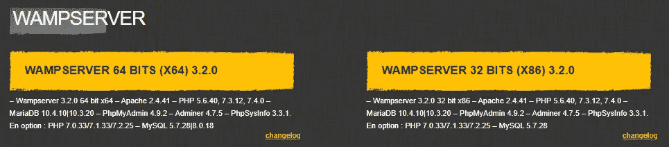
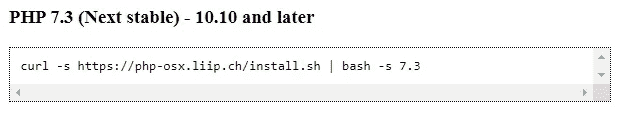
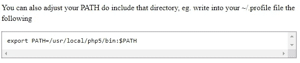
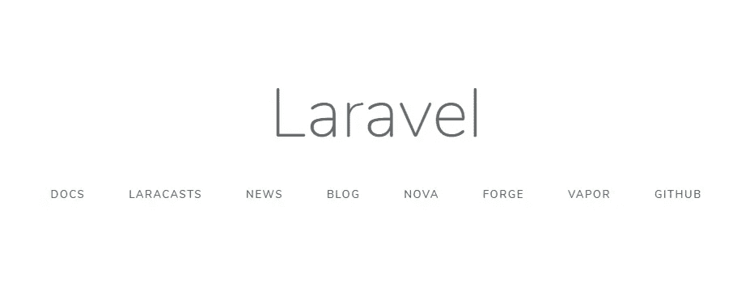
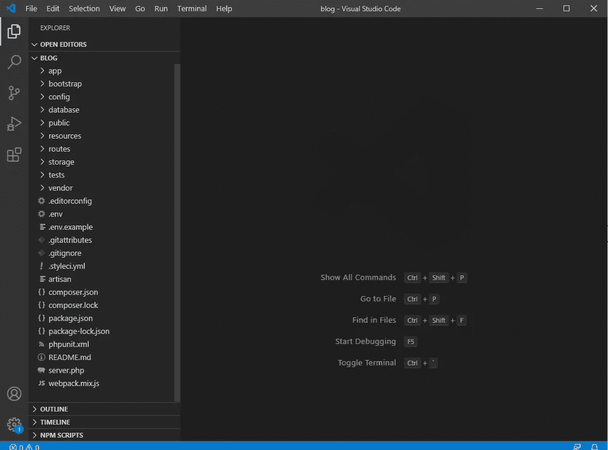
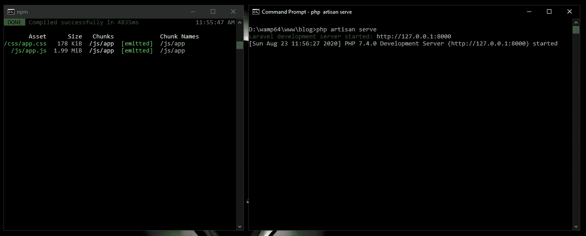
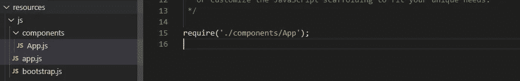
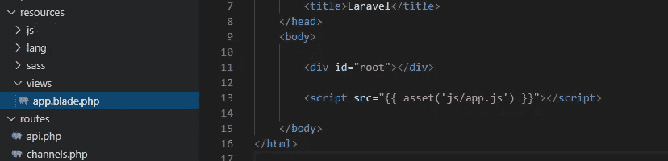
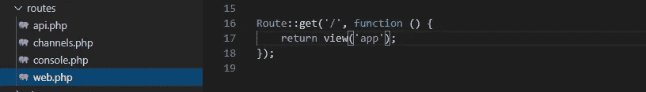

# Laravel 7.x— P1:安装 React 和 React-路由器

> 原文：<https://blog.devgenius.io/laravel-7-x-p1-installation-with-react-and-react-router-7713f4748b6f?source=collection_archive---------0----------------------->


欢迎来到另一个系列。这次我会把注意力放在拉弗尔身上。虽然这个系列将专门关注 Laravel，但我将有另一个系列来关注 React。两个系列完成后，我将合并它们，并让 Laravel 与 React 一起使用。这就是为什么这次安装将集中在配有 React 脚手架的 Laravel 上。如果你只是为了拉弗尔而来，我会告诉你什么时候你可以停下来，如果你不感兴趣的话。

如果你不熟悉 PHP，我建议你关注我正在写的 PHP 系列。在撰写本文时，我已经写了 42 篇关于 PHP 的文章(还有 30 多篇草稿准备好了)。

让我们开始吧。有什么比从安装过程开始更好的学习 Laravel 的方法呢？

导航到[laravel.com](https://laravel.com/)并点击[文档](https://laravel.com/docs/7.x)。在撰写本文时，Laravel 的版本是 7。在**服务器需求**下，你会看到为了让 Laravel 正常工作所需要的 PHP 版本。对我来说，它声明需要 PHP ≥ 7.2.5 的版本。

通过在您的终端上键入 *php -v* ，验证您是否拥有指定的 PHP 版本。我目前有 PHP 7.4.0。

```
C:\Users\Dino Cajic>php -v
PHP 7.4.0 (cli) (built: Nov 27 2019 10:14:18) ( ZTS Visual C++ 2017 x64 )
Copyright (c) The PHP Group
Zend Engine v3.4.0, Copyright (c) Zend Technologies
```

## PHP Windows Prep

如果你的电脑上没有安装 PHP，对于 Windows 用户来说，最简单的解决方案就是去[wampserver.com](https://www.wampserver.com/en/)下载最新版本的 WAMP。单击下载按钮，并为您的计算机选择合适的下载:32 位或 64 位。



您可以看到 PHP 7.4.0 将与您在安装过程中指定的其他版本一起安装。

一旦安装了 WAMP 服务器，再次运行命令 *php -v* 。应显示版本≥ 7.2.5。如果显示的版本低于 7.2.5，单击 WAMP 图标，滚动 PHP，然后滚动版本，最后选择正确的版本。我的设置为 7.4.0。

如果你已经安装了 WAMP，只需要最新版本的 PHP，去 wampserver.aviatechno.net 下载最新版本的 PHP，32 位或 64 位操作系统都可以。运行可执行文件，重启 WAMP，并再次检查 WAMP 服务器；应该在那里。

您可能还需要修改您的环境变量，以便能够使用 *php* 命令行。我写了一整篇关于这个的文章，所以如果你需要帮助，请查看一下。

## PHP MAC 准备

MAC 电脑预装了 PHP。打开你的终端，运行 *php -v，*，你会看到你的 php 版本。如果您需要更高版本的 PHP，请导航到 [https://php-osx.liip.ch](https://php-osx.liip.ch/) ，复制您想要的版本的命令，将其粘贴到您的终端中，然后等待它完成。



然后，您需要按照页面中间的说明修改 path 变量。



输入 *php -v* ，你会看到你运行的是正确版本的 php。

## 获取作曲家

返回到 Laravel 的文档。下一个要求是您的计算机上安装了最新版本的 composer。在您的终端中，键入 *composer - version。撰写本文时的最新版本是 1.10.10。*

```
C:\Users\Dino Cajic>composer --version                                                                                  Composer version 1.10.10 2020-08-03 11:35:19
```

如果您的计算机上没有安装 composer，导航到[https://getcomposer.org/](https://getcomposer.org/)并点击[下载](https://getcomposer.org/download/)。Windows 安装非常简单:只需点击 Composer-Setup.exe 链接。它就在命令行安装标题的正上方；如果你不寻找它，你可能会错过它。运行提示并再次检查版本。要使更改生效，您可能需要关闭并重新打开终端。

如果你有一个过时版本的 composer，只需再次下载它，它会用最新版本覆盖你的过时版本。

## NPM 包装经理

我们将需要 npm 包管理器来确保我们已经正确地设置了一切。导航到[nodejs.org](https://nodejs.org/en/)并下载 Node (LTS)的最新版本。您可以通过键入 *node -v* 来验证您已经安装了 node，并且可以使用 *npm -v* 来验证 npm 安装。

## Laravel 安装程序

回到 Laravel 文档。文档说明的下一步是让我们安装 **laravel** 安装程序。我们通过运行以下命令来实现这一点:

```
composer global require laravel/installer
```

一旦安装完成，运行 *laravel -v* 查看 **laravel** 命令行实用程序的版本。如果你没有看到一个版本，你将不得不从头开始仔细重读这篇文章，并验证你是否有概述的所有内容的最新版本。

## 创建 Laravel 项目

文档表明我们已经准备好通过键入 **laravel new project_name** 来创建我们的 laravel 项目。导航到您的 web 目录，例如 C:/wamp/www。进入终端中的正确文件夹后，运行:

```
C:\wamp64\www>laravel new blog
```

我选择 *blog* 作为项目名称，因为这是 Laravel 在其文档中推荐的。您可以随意命名项目。这可能需要一些时间。

一旦一切都完成了，您就可以通过启动默认主页来验证一切都已正确安装。

光盘放入新创建的项目:*光盘博客。* Laravel 自带测试服务器，你可以通过运行命令 *php artisan serve 来启动它。Artisan 是一个由 laravel 安装的实用程序，位于 Laravel 项目的根目录下；这就是为什么我们必须先将 *cd* 放入*博客*目录。*

```
C:\wamp64\www>cd blog
C:\wamp64\www\blog>php artisan serveLaravel development server started: [http://127.0.0.1:8000](http://127.0.0.1:8000)                                                               [Sun Aug 23 11:08:31 2020] PHP 7.4.0 Development Server ([http://127.0.0.1:8000](http://127.0.0.1:8000)) started
```

导航至 127.0.0.1:8000，查看您的 Laravel 主页。



如果你看到上面的页面，恭喜你，你已经成功安装了 Laravel。

如果你的计算机上运行着 WAMP 服务器，你可以导航到你的项目，对我来说是在 *http://localhost/blog* ，点击 *public* 文件夹，看到完全相同的页面:*http://localhost/blog/public*。所以，如果你不想使用 *php artisan serve，*你不一定非要现在就用。

## 在 IDE 中打开 Laravel 项目

在 IDE 中打开 *blog* 文件夹(现在我将使用 VS 代码)。你会看到运行 *laravel new blog* 命令时安装的所有不同的文件夹和文件。



如果你只是为了 Laravel 而来，你可以就此打住，等待下一篇关于 Laravel 的文章。如果您对使用 React 作为前端感兴趣，那么请继续。

## 反应脚手架

导航到 Laravel 文档，点击前端->前端搭建:[https://laravel.com/docs/7.x/frontend](https://laravel.com/docs/7.x/frontend)。

第一步声明我们将需要 laravel/ui。如果您正在运行命令 *php artisan serve* ，按 CTRL+C 终止测试服务器。将以下命令粘贴到您的终端中:

```
C:\wamp64\www\blog>composer require laravel/ui
```

安装完成后，我们需要通过粘贴以下命令来生成基本的 React 脚手架: *php artisan ui react。*

```
C:\wamp64\www\blog>php artisan ui react 
                                                                                React scaffolding installed successfully.                                                                               Please run "npm install && npm run dev" to compile your fresh scaffolding.
```

安装时，我们被通知需要运行*NPM install&&NPM run dev*。所以让我们开始吧: *npm 安装*已经完成，可以下载所有必需的包和依赖项； *npm run dev* 运行是为了编译任何现有的 JavaScript 代码，也就是刚刚生成的 React 代码。

```
C:\wamp64\www\blog>npm install && npm run devDONE  Compiled successfully in 5546ms                                                                       11:28:10 AM                                                                                                                               Asset      Size   Chunks             Chunk Names                                                                 /css/app.css   178 KiB  /js/app  [emitted]  /js/app                                                                       /js/app.js  1.99 MiB  /js/app  [emitted]  /js/app
```

如果我们返回到我们的 IDE，我们可以看到一些文件被修改，新的文件被添加。

1.  resources/js/app.js:行*要求('。/components/Example')* 被添加。它将导入*示例*组件。
2.  resources/js/components/example . js:添加的 React 组件。它只包含一个名为 Example 的功能性 React 组件。该组件正在被导出，应该在当前不存在的*示例*元素 id 处呈现。

如果我们运行 *php artisan serve* ，服务器启动，但是没有任何变化。我们必须自己再做一些改变。

如果我们打开 routes 文件，web.php 的*，我们会看到它正在调用 welcome.blade.php 的*文件。*欢迎*文件没有引用*示例* id。**

*我们将删除 *<正文>* 和 *<样式>* 标签内的所有内容。没必要。在 *<体>* 标记的内部，我们需要添加两行。第一行告诉 React 在哪里插入*示例*组件。在 *Example.js* 里面，我们看到它在寻找 *example* id。*

```
*<div id="example"></div>*
```

*我们还需要包括 React 组件。还记得我们之前看的 *app.js* 文件吗？它包括*示例*。因此，让我们将 *app.js* 包含在我们的*welcome.blade.php*文件中。*

```
*<script src="{{ asset('js/app.js') }}"></script>*
```

*现在还不要担心语法:我们将在以后的文章中讨论所有这些内容。*

*如果我们现在运行 *php artisan serve* 并打开页面，我们将得到以下结果:*

*示例组件
我是示例组件！*

*这就是*示例*组件生成的内容。恭喜你。React 已经安装。*

## *在 React 组件中进行更改*

*让我们修改*示例*组件。我们将更改内部部分，说明*这是一个样本 React 组件。**

*如果我们保存了文件*resources/js/components/example . js*，并刷新了页面，那么这些更改将不会显示出来。为了显示更改，我们必须运行 *npm run dev* 来重新编译 JavaScript 代码。一旦您运行了这个命令，再次运行 *php artisan serve* 来查看您更改。你的页面会说*这是一个样本 React 组件。**

*这是否意味着每次做出更改时，您都必须键入 *npm run dev* ？如果这是你唯一知道的命令，那么是的。但是，您可以运行另一个命令: *npm run watch* 。 *watch* 命令监视任何类型的 JavaScript 变化，并自动重新编译代码。*

*当您运行命令 *npm run watch* 时，该命令实际上从未完成，因此您必须打开一个新的终端窗口来同时运行 *php artisan serve* 。*

**

*每当您对 React 代码进行更改时，它都会自动更新。*

## *清理反应脚手架*

*您很可能不想保留名为 *Example* 的组件。我喜欢把我的改名为 *App* 。打开*resources/js/components/Example . js*，将*实例*的所有实例改为 *App* 。我通常将所有*示例* id 引用更改为*根*。*

*然后我会将文件名从*resources/js/components/example . js*更改为*resources/js/components/app . js*。*

*文件 *resources/js/app.js* 是*需要的。/components/Example* ，它已经不存在了，所以我们必须将其修改为*require(’。/组件/应用')。**

**

*然后我将把*resources/views/welcome . blade . PHP*文件重命名为*resources/views/app . blade . PHP*。我们需要将其中的 *id* 从*示例*修改为*根*。*

**

*最后，我们的 *routes/web.php* route 文件在找*welcome.blade.php*，我们刚刚把它改名为*app.blade.php*。我们也必须改变这一点。*

**

*重启你的 *npm 运行手表*和 *php 工匠服务*来验证一切仍然正常运行。*

## *反应路由器*

*我们只需要将我们的路由处理从 Laravel 改为*react-router*；我们不想依赖 *routes/web.php* 。*

*打开*web.php*，用以下代码替换现有代码:*

*它只是说，对于任何路径，我们都要加载*app.blade.php*视图。 *app* 视图将加载 React 组件，该组件将处理所有的路线。我们现在不打算讨论如何使用 react-router，但是我们将浏览设置。*

*停止 *npm 运行手表*和 *php 匠服* (CTRL+C) *。*在你的项目根目录下，运行以下命令:*

```
*C:\wamp64\www\blog>**npm install react-router-dom***
```

*就是这样。React 路由器已安装，您可以像使用 React 应用程序一样使用它。这里有一个 React 路由器运行的快速示例，这样您就可以从这里继续前进。*

*在以后的文章中，我们将会看到所有这些概念，以及更多。到时候见。*

**

*迪诺·卡伊奇目前是 [LSBio(生命周期生物科学公司)](https://www.lsbio.com/)、[绝对抗体](https://absoluteantibody.com/)、 [Kerafast](https://www.kerafast.com/) 、[珠穆朗玛生物](https://everestbiotech.com/)、[北欧 MUbio](https://www.nordicmubio.com/) 和 [Exalpha](https://www.exalpha.com/) 的 IT 主管。他还担任我的自动系统的首席执行官。他有十多年的软件工程经验。他拥有计算机科学学士学位，辅修生物学。他的背景包括创建企业级电子商务应用程序、执行基于研究的软件开发，以及通过写作促进知识的传播。*

*你可以在 [LinkedIn](https://www.linkedin.com/in/dinocajic/) 上联系他，在 [Instagram](https://instagram.com/think.dino) 上关注他，或者[订阅他的媒体出版物](https://dinocajic.medium.com/subscribe)。*

*[*阅读迪诺·卡吉克(以及媒体上成千上万其他作家)的每一个故事。你的会员费直接支持迪诺·卡吉克和你阅读的其他作家。你也可以在媒体上看到所有的故事。*](https://dinocajic.medium.com/membership)*