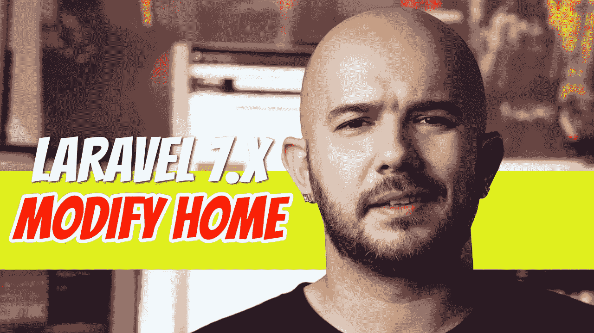
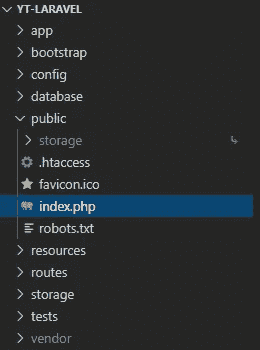
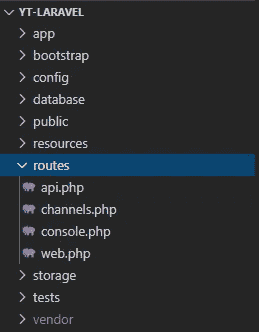
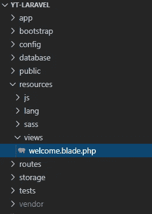
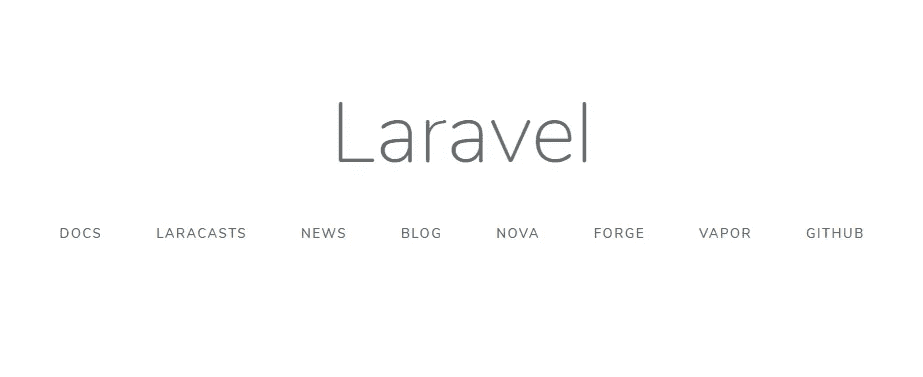
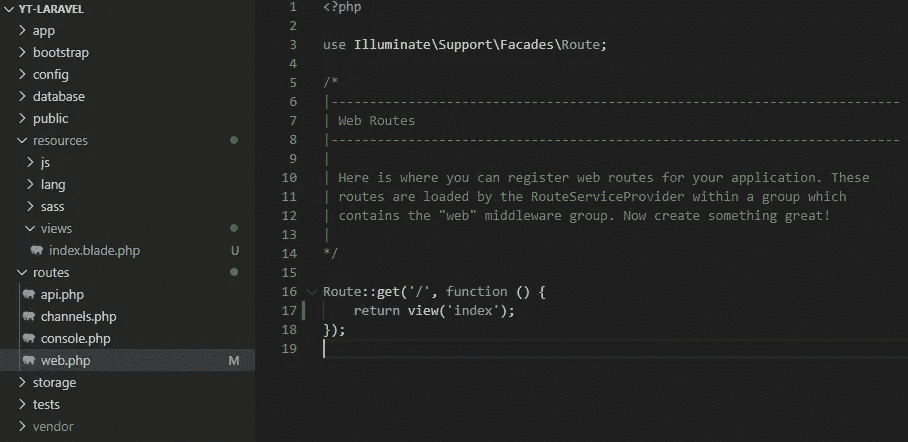
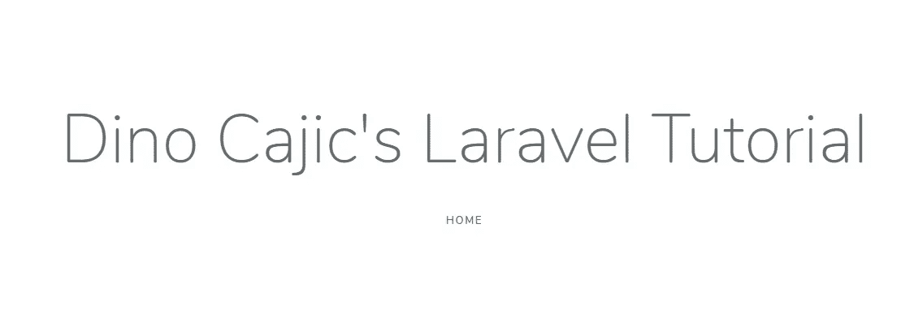

# Laravel 7.x — P2:修改欢迎视图

> 原文：<https://blog.devgenius.io/laravel-7-x-p2-modifying-the-welcome-view-3a00367cc27?source=collection_archive---------0----------------------->

我们将从修改主页开始这个过程。你认为 Hello World 节目为什么如此受欢迎？人们希望看到一些变化，并觉得他们实际上做了一些事情。在 Laravel 中，没有比修改主页更好的方法了。

我们如何找到主页？为此，我们必须了解 Laravel 在高层次上是如何工作的。一旦用户在地址栏(http://example.com)中输入一个 URL，请求就被发送到承载 Laravel 应用程序的服务器，并调用 Laravel 应用程序本身。哪个文件先被调用？它是位于*公共*目录中的*index.php*文件。

用户可以访问的是*公共*目录。所有其他目录应该隐藏在比 *public* 目录低一级的目录中。你的网络服务器被设置为自动调用特定的页面，比如 index.php 的页面。*index.php*文件将加载必要的代码以使 Laravel 工作(我们现在不讨论这个)。

该请求到达 Laravel 的路由文件(web.php)，该文件位于 *routes* 目录中。

展开*路线*目录，你会看到*api.php、channels.php、console.php、*和*web.php*。我们将把重点放在*web.php*上，因为这是发出请求时被调用的文件。

如果我们打开*web.php*文件，你会看到已经定义了一条路线。

路由文件*web.php*可以处理多种类型的 HTTP 请求，比如 GET、POST、PUT 和 DELETE。如果我们看看上面的代码( *Route::get* )，很容易看出 GET 请求是正在处理的请求。第一个参数是一个字符串，表示您正在为哪个页面创建路线。当我们访问[http://example.com 的时候，](http://example.com,)默认的路径叫做“/”。如果我们要访问“关于”页面，[http://example.com/about,](http://example.com/about,)需要在*web.php*文件中创建“关于”路线。我们将在接下来的几篇文章中更详细地讨论这个问题。

现在，您可以看到*欢迎*视图被返回。*迎宾*景观在哪里？它位于*资源/视图*目录中。文件本身被命名为*welcome.blade.php*。Laravel 使用 Blade 模板引擎，我们稍后也会看到。这就是为什么这个文件被命名为 welcome.blade.php 的*。*

**

*如果我们打开该文件，我们可以看到构成当前主页的 HTML 代码和 Blade 语法。*

**

*我们可以使用主页来存储我们将在本系列中涉及的所有主题的链接。将要修改的代码在 *<主体>* 标签中。这是标准的 HTML，所以你应该能够发现上面的代码和下面的代码之间的区别。*

*现在，让我们将 welcome.blade.php 的*文件重命名为 index.blade.php 的*。你可以简单地在你的 IDE 中右击这个文件，然后点击*重命名*。一旦文件被重命名，我们还需要修改*web.php*文件中的路由，因为它仍然试图返回*欢迎*视图。我们将把它改为*索引*。***

**

*要查看您的更改，从根目录键入 *php artisan serve* 并导航到 [http://127.0.0.1:8000/](http://127.0.0.1:8000/) 。恭喜你！你刚刚修改了主页。*

*** [## dinocajic/laravel-7-YouTube-教程

### 运行以下命令 composer install NPM install CP . env . example。env 或复制您的。环境文件 php artisan…

github.com](https://github.com/dinocajic/laravel-7-youtube-tutorials)* **

*Dino Cajic 目前是 [LSBio(寿命生物科学公司)](https://www.lsbio.com/)、[绝对抗体](https://absoluteantibody.com/)、 [Kerafast](https://www.kerafast.com/) 、[珠峰生物技术](https://everestbiotech.com/)、[北欧 MUbio](https://www.nordicmubio.com/) 和 [Exalpha](https://www.exalpha.com/) 的 IT 负责人。他还担任我的自动系统的首席执行官。他有十多年的软件工程经验。他拥有计算机科学学士学位，辅修生物学。他的背景包括创建企业级电子商务应用程序、执行基于研究的软件开发，以及通过写作促进知识的传播。*

*你可以在 [LinkedIn](https://www.linkedin.com/in/dinocajic/) 上联系他，在 [Instagram](https://instagram.com/think.dino) 上关注他，或者[订阅他的媒体刊物](https://dinocajic.medium.com/subscribe)。*

*阅读 Dino Cajic(以及 Medium 上成千上万的其他作家)的每一个故事。你的会员费直接支持迪诺·卡吉克和你阅读的其他作家。你也可以在媒体上看到所有的故事。*