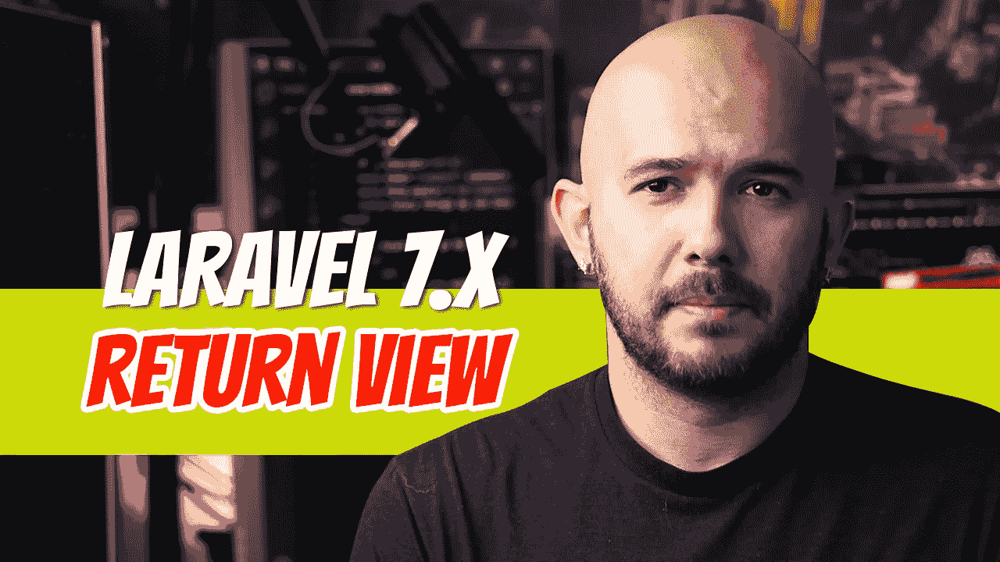
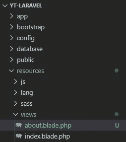
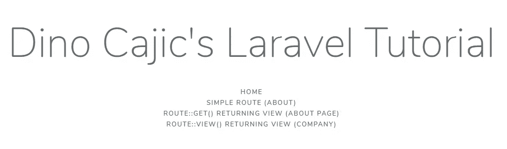

# Laravel 7.x — P4:返回视图(路线)

> 原文：<https://blog.devgenius.io/laravel-7-x-p4-return-view-routes-55073989ee55?source=collection_archive---------3----------------------->

我们在[的上一篇文章](https://medium.com/dev-genius/laravel-7-x-p3-first-route-98b8ac4edcfc)中看到了如何返回一些基本的 HTML，但是我们想移出 route 文件；这不是路由文件应该做的。*路径*文件应该会将您引向*控制器*，控制器又会返回*视图*。对于简单的静态页面，可以直接从*路径*返回*视图*，有几种方法可以实现这一点。首先，我们必须创建一个基本的视图。我们将在后面的文章中广泛地讨论*视图*，但是这是一个基本的介绍，它更侧重于*路线*而不是*视图*本身。

在*资源/视图*目录下，创建一个文件并命名为*about.blade.php。*别想多了:右键- >新建文件。

从*index.blade.php*文件中复制内容并粘贴到那里。修改它以匹配下面的代码。

为了将*about.blade.php*视图返回给用户，我们需要创建一条*路线*。当我们返回*index.blade.php*文件时，我们已经看到了一种创建*路线*的方法。在 *routes/web.php* 中创建一个新的*路由*，并添加下面的代码。

当用户访问 *about-us* 页面(*127 . 0 . 0 . 1:8000/about-us*)时，Laravel 将在 *view()* 助手的帮助下返回【about.blade.php】视图*。*

还可以用 *Route::view()* 语法返回一个视图。对于 Laravel 来说，返回一个特殊语法是为了处理这个概念而开发的观点是非常普遍的。让我们创建另一个名为*公司的页面。*在*资源/视图*下，创建*company.blade.php*并添加下面的代码(类似于 About)。

这一次，我们将使用 *Route::view()* 来检索并返回*company.blade.php*文件。将下面的代码添加到您的 *routes/web.php* 文件中。

*view()* 方法接受的第一个参数是 *URL* 参数。第二个参数是它将返回的*视图*。如果您导航到*127 . 0 . 0 . 1:8000/公司页面*，您将从*company.blade.php*视图接收内容。

我们要添加的最后一点代码是到我们的*index.blade.php*文件的链接。

你可能会问自己“我如何传递参数”或“我如何做这个或那个？”放松点。慢慢来。当我拿到一本书，我看到它有多厚，它会变得让人不知所措。但是，如果我假装除了我正在关注的那一章之外，没有别的东西存在，那就更容易消化了。这就是为什么我采取这样一种精心策划的方法来写这些文章。我不想压倒任何人，压倒是极其简单的。拿起一本拉勒维尔的书，你会发现作者会说多少次“让我们看看这个。现在还不要担心这个超级先进的概念，我们以后再看。”你猜怎么着？我看到了，我很紧张。如果你引入更小的概念，当你进入更高级的东西时，你的大脑已经熟悉了环境，很容易调整。因此，为了回答你最初的问题，我们将在接下来的文章中研究向视图传递 URL 参数等。在那之前，让这篇文章消化一下。创建几个更多的视图和几个更多的路线，直到您不再需要查找语法。

 [## dinocajic/laravel-7-YouTube-教程

### 运行以下命令 composer install NPM install CP . env . example。env 或复制您的。环境文件 php artisan…

github.com](https://github.com/dinocajic/laravel-7-youtube-tutorials) 

迪诺·卡伊奇目前是 [LSBio(生命周期生物科学公司)](https://www.lsbio.com/)、[绝对抗体](https://absoluteantibody.com/)、 [Kerafast](https://www.kerafast.com/) 、[珠穆朗玛生物](https://everestbiotech.com/)、[北欧 MUbio](https://www.nordicmubio.com/) 和 [Exalpha](https://www.exalpha.com/) 的 IT 主管。他还担任我的自动系统的首席执行官。他有十多年的软件工程经验。他拥有计算机科学学士学位，辅修生物学。他的背景包括创建企业级电子商务应用程序、执行基于研究的软件开发，以及通过写作促进知识的传播。

你可以在 [LinkedIn](https://www.linkedin.com/in/dinocajic/) 上联系他，在 [Instagram](https://instagram.com/think.dino) 上关注他，或者[订阅他的媒体出版物](https://dinocajic.medium.com/subscribe)。

阅读 Dino Cajic(以及 Medium 上成千上万的其他作家)的每一个故事。你的会员费直接支持迪诺·卡吉克和你阅读的其他作家。你也可以在媒体上看到所有的故事。