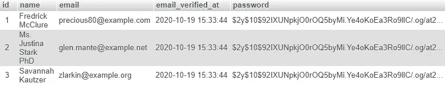
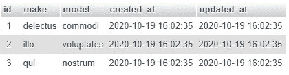
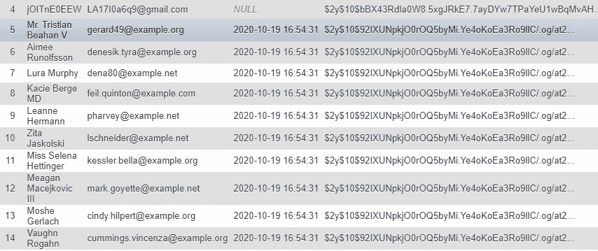
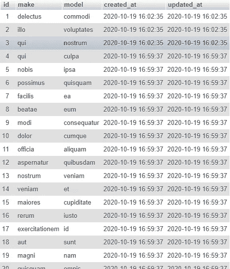

# Laravel 8.x 数据库种子商、伪造者和工厂

> 原文：<https://blog.devgenius.io/laravel-8-x-database-seeders-fakers-and-factories-7cb759918124?source=collection_archive---------0----------------------->


如果您刚开始使用 Laravel，您首先会遇到的一些问题是:

*   播种者，造假者，工厂有什么区别？
*   我应该使用它们吗？
*   我需要使用全部还是可以使用其中的一部分？
*   我如何创建它们？

如果你正在寻找这些问题的答案，我会假设你已经安装了 Laravel。如果你没有，也不知道怎么做，你可以按照我的另一篇文章中的步骤来做:

[](https://medium.com/dev-genius/setting-up-laravel-8-x-with-jetstream-auth-84bbeafc0cd3) [## 使用 JetStream Auth 设置 Laravel 8.x

### 是时候用 Laravel 安装 JetStream 认证了。有时简单，有时不简单。

medium.com](https://medium.com/dev-genius/setting-up-laravel-8-x-with-jetstream-auth-84bbeafc0cd3) 

## 工厂

根据 Laravel 的官方文档，“工厂是对 Laravel 的基本工厂类进行扩展并定义一个模型属性和定义方法的类。”就这么想吧。如果您曾经创建过一个模型，比如*用户的*模型(App\Models\User)，您会知道当您使用 *create()* 方法时应该填充某些字段。

在上面的例子中，我们向*用户*模型提供了*姓名*、*电子邮件*和*密码*字段，以填充*用户*表。工厂会为我们定义一个标准的方法来做这件事。当您测试应用程序时，这非常有用。

在您的测试中，您可能有数百个需要生成新用户的地方。如果你改变你的代码，你将不得不在数百个不同的地方改变它(例如，为你的用户添加*角色*)。您只是创建一个测试用户，这样您就可以利用一个工厂来为您创建测试用户。

Laravel 已经为我们创建了一个*用户*工厂。它位于 database/factory/user factory . PHP 中。

*UserFactory* 利用了 Faker，我们在这个例子中不会用到它。让我们修改 *definition()* 方法中的代码，使用静态名称和电子邮件。

你可以看到 *definition()* 方法只是返回了一个数组…几乎就像我们在*用户*模型中可以传递给 *create()* 方法的数组一样。

要调用一个工厂，我们可以"[在我们的雄辩模型上使用 Illuminate \ Database \口才\Factories\HasFactory trait 提供的静态工厂方法。](https://laravel.com/docs/8.x/database-testing#creating-models)“在我们这里，*User::factory()->make()*。*用户*模型怎么知道应该用哪个工厂？它是在工厂的顶层定义的:

为了测试这一点，打开 tinker:

```
php artisan tinker
```

运行 factory 命令:

```
User::factory()->make();
```

您应该会得到类似如下的响应:

```
=> App\Models\User {#3477
     name: "Dino Cajic",
     email: "[dinocajic@gmail.com](mailto:dinocajic@gmail.com)",
     email_verified_at: "2020-10-19 14:58:29",
   }
```

这就创建了*用户*模型；它实际上并没有把它保存到数据库中。要保存到数据库，可以用 *create()* 代替 *make()* 。

```
User::factory()->**create()**;
```

您可以通过查看数据库中的 *users* 表来验证该用户是否存在。

仅此而已。当您创建您的测试时，您可以使用 factory 命令在您需要的任何地方创建任何新的用户实例。

这种方法将创建一个新用户，每次使用相同的名称和电子邮件。如果你每次都想要一个随机的名字和一个唯一的电子邮件会怎么样？这就是 faker 的用武之地。

## 赝品王中王

你可以开始自动使用 [faker 库](https://github.com/fzaninotto/Faker)。Faker PHP 库非常强大，使得生成随机的名字、电子邮件等变得非常容易。你可以阅读 [Faker 文档](https://github.com/fzaninotto/Faker)了解更多。

在我们的例子中，我们只是想要一个随机的名字和一个唯一的电子邮件。我们可以将*用户工厂*中的代码恢复到原始状态。

我们可以通过在 *tinker* 中运行相同的 *factory()- > make()* 命令来测试以确保它能够工作。你可以任意多次运行这段代码，faker 每次都会产生新的用户。

```
php artisan tinker**>>> User::factory()->make();**
=> App\Models\User {#3477
     name: "Mr. Milo Jast MD",
     email: "[herzog.mose@example.org](mailto:herzog.mose@example.org)",
     email_verified_at: "2020-10-19 15:13:31",
   }
**>>> User::factory()->make();**
=> App\Models\User {#3476
     name: "Carolanne Hettinger",
     email: "[eladio62@example.org](mailto:eladio62@example.org)",
     email_verified_at: "2020-10-19 15:13:34",
   }
```

你现在可以像以前一样，在任何你需要的时候使用你的 faker 工厂来生成随机用户。

如果你想产生 50 个用户呢？Laravel 也让这变得不痛不痒。我们再来看看 tinker 里的。

```
php artisan tinker>>> **User::factory()->count(50)->make();**=> Illuminate\Database\Eloquent\Collection {#3474
     all: [
       App\Models\User {#3479
         name: "Geovanni Brakus",
         email: "[xokuneva@example.com](mailto:xokuneva@example.com)",
         email_verified_at: "2020-10-19 15:27:23",
       },
       App\Models\User {#3480
         name: "Dr. Clara Nienow",
         email: "[jerde.orval@example.net](mailto:jerde.orval@example.net)",
         email_verified_at: "2020-10-19 15:27:23",
       },
       App\Models\User {#3481
         name: "Prof. Stephon Ziemann IV",
         email: "[sonia.mitchell@example.org](mailto:sonia.mitchell@example.org)",
         email_verified_at: "2020-10-19 15:27:23",
       },
       App\Models\User {#3482
         name: "Katrina O'Kon",
         email: "[jessika.gaylord@example.org](mailto:jessika.gaylord@example.org)",
         email_verified_at: "2020-10-19 15:27:23",
       },
       App\Models\User {#3483
         name: "Marlen Rosenbaum",
         email: "[hartmann.edwina@example.org](mailto:hartmann.edwina@example.org)",
         email_verified_at: "2020-10-19 15:27:23",
       },
       ...
```

就这样，在已经链接的 *count()* 方法的帮助下，你有了 50 个新用户。您还可以通过使用 *create()* 方法来持久化数据。

```
php artisan tinker>>> **User::factory()->count(50)->create();**
```

检查数据库中的 *users* 表，确认您有 50 个新用户。



## 创建工厂和利用 Faker

到目前为止，我们已经研究了用户模型。让我们同时创建一个新的模型和工厂。

```
php artisan make:model Car -mf*Model created successfully.
Factory created successfully.
Created Migration: 2020_10_19_154353_create_cars_table*
```

该命令将生成一个带有迁移(-m)和工厂(-f)的模型*汽车*。首先，打开汽车迁移(database/migrations/create _ cars _ table…PHP)并定义汽车的*品牌*和*型号*。

运行迁移。

```
php artisan migrate
```

现在我们已经用*品牌*和*型号*字段创建了汽车表，让我们填充这个表。我们必须使 *make* 和 *model* 字段可写，方法是转到我们的 *Car* 模型(App\Models\Car)并将这些字段添加到我们的 *$fillable* 属性中。

打开 *CarFactory* (数据库/工厂/CarFactory.php)。

定义是空的，准备好让我们填充。我们关心的只是*制造*和*型号*是字符串。我们可以用 faker 来帮助我们。

让我们看看它是否有效。打开 tinker 并运行*factory()->create()*命令来保存数据。

```
php artisan tinker>>> **Car::factory()->count(3)->create();**=> Illuminate\Database\Eloquent\Collection {#3474
     all: [
       App\Models\Car {#3478
         make: "delectus",
         model: "commodi",
         updated_at: "2020-10-19 16:02:35",
         created_at: "2020-10-19 16:02:35",
         id: 1,
       },
       App\Models\Car {#3479
         make: "illo",
         model: "voluptates",
         updated_at: "2020-10-19 16:02:35",
         created_at: "2020-10-19 16:02:35",
         id: 2,
       },
       App\Models\Car {#3480
         make: "qui",
         model: "nostrum",
         updated_at: "2020-10-19 16:02:35",
         created_at: "2020-10-19 16:02:35",
         id: 3,
       },
     ],
   }
```

检查数据库中的*汽车*表，瞧，就在那里。



## 创建模型后创建工厂

如果您在创建模型时忘记了创建工厂，您总是可以在事后创建它。

```
php artisan make:factory CarFactory --model=Car
```

*- model* 标志告诉*汽车厂*这是哪个型号的。如果您忘记包含 *-型号*标志，您将不得不修改*汽车工厂*并手动包含该型号。

到目前为止一切顺利。现在，您可以在一个地方创建假数据，并根据需要多次填充您的表。如果您想在开始测试/使用应用程序之前在数据库中填充一些数据，该怎么办？在开始使用应用程序之前，您可以对每个数据库表运行*model name::factory()->count(20)->create()*。如果你有一打桌子呢？在每次测试之前，您必须运行十几个命令。如果你有几百张桌子呢？这就是播种者发挥作用的地方。

## 播种者

当您运行以下命令时，种子将填充您的数据库表:

```
// Can call multiple seeders
php artisan db:seed
```

您也可以调用单个播种器:

```
php artisan db:seed --class=UserSeeder
```

让我们创建一个播种机，看看这一切是如何联系在一起的。运行以下命令创建用户种子:

```
php artisan make:seeder UserSeeder
```

Artisan 将在 database/seeders/user seeder . PHP 下生成一个名为 *UserSeeder* 的新类。

它只是一个带有空的 *run()* 方法的类。 *run()* 方法是我们添加所有代码来查看数据库的地方。让我们首先在不使用工厂的情况下填充*用户*表。

正如您可能猜到的那样，这将在 users 表中插入一条新记录。让我们调用播种器并验证数据是否持续:

```
php artisan db:seed --class=UserSeeder
```

通过检查数据库表，我可以验证新记录是否存在。


我们又开始在多个地方添加代码了。如您所见，当发出 *db:seed* 命令时， *run()* 方法只运行它内部的任何内容。那么为什么它不能直接运行我们的工厂命令呢？它可以，而且它会，只要我们想它多少次。

上面的代码将在我们的数据库中存储 10 个新的随机条目(感谢 faker)。让我们再次运行相同的命令，并验证它们是否存在。

```
php artisan db:seed --class=UserSeeder
```



让我们为我们的*汽车*模型创建另一个播种机，并利用我们之前创建的*汽车工厂*。

```
php artisan make:seeder CarSeeder
```

我们可以运行 *db:seed* 命令，用 50 个新条目填充 *cars* 表。

```
php artisan db:seed --class=CarSeeder
```

验证*汽车*表包含 50 个新行。



此时，您可能会看到用一个命令运行多个 seeders 的价值。如果你有 50 个种子，你不会想要运行 50 个不同的命令。幸运的是，Laravel 也解决了这个问题。

你可能已经注意到了 Laravel 自动创建的另一个类，名为*database seeder*(database/seeders/database seeder . PHP)。

您可以取消对代码的注释，直接从这里调用用户工厂，或者您可以使用 *call()* 方法调用每个种子。根据 Laravel 的文档，“使用 call 方法可以将数据库种子分解成多个文件，这样就不会有一个种子类变得过大。”

让我们将我们的 *UserSeeder* 和 *CarSeeder* 传递给 *call()* 方法。 *call()* 方法接受一个数组作为参数，其中每个元素都是您想要调用的种子类。

我们现在可以使用下面的命令来调用 *DatabaseSeeder* ，它将依次调用我们指定的每个 Seeder:

```
**php artisan db:seed***Seeding: Database\Seeders\UserSeeder
Seeded:  Database\Seeders\UserSeeder (26.58ms)
Seeding: Database\Seeders\CarSeeder
Seeded:  Database\Seeders\CarSeeder (14.14ms)
Database seeding completed successfully.*
```

Artisan 将为我们提供消息，让我们知道一切进展顺利。您还可以验证数据库表是否已经被可视化地植入。

如果您的数据库表中已经有太多的数据，您总是可以在运行 seeder 之前清除它们。您可能每次都想这样做:

```
php artisan migrate:fresh --seed
```

我希望这篇文章有助于为你揭开种子商、造假者和工厂的神秘面纱。


迪诺·卡希奇目前是 [LSBio(寿命生物科学公司)](https://www.lsbio.com/)、[绝对抗体](https://absoluteantibody.com/)、 [Kerafast](https://www.kerafast.com/) 、[珠穆朗玛生物科技](https://everestbiotech.com/)、[北欧 MUbio](https://www.nordicmubio.com/) 和 [Exalpha](https://www.exalpha.com/) 的 IT 主管。他还担任我的自动系统的首席执行官。他有十多年的软件工程经验。他拥有计算机科学学士学位，辅修生物学。他的背景包括创建企业级电子商务应用程序、执行基于研究的软件开发，以及通过写作促进知识的传播。

你可以在 [LinkedIn](https://www.linkedin.com/in/dinocajic/) 上联系他，在 [Instagram](https://instagram.com/think.dino) 上关注他，或者[订阅他的媒体刊物](https://dinocajic.medium.com/subscribe)。

阅读 Dino Cajic(以及 Medium 上成千上万的其他作家)的每一个故事。你的会员费直接支持迪诺·卡吉克和你阅读的其他作家。你也可以在媒体上看到所有的故事。