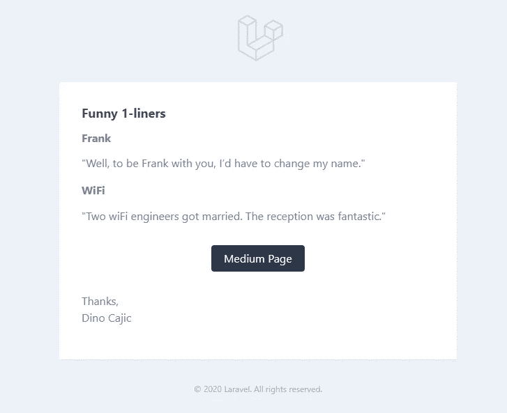
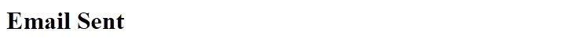
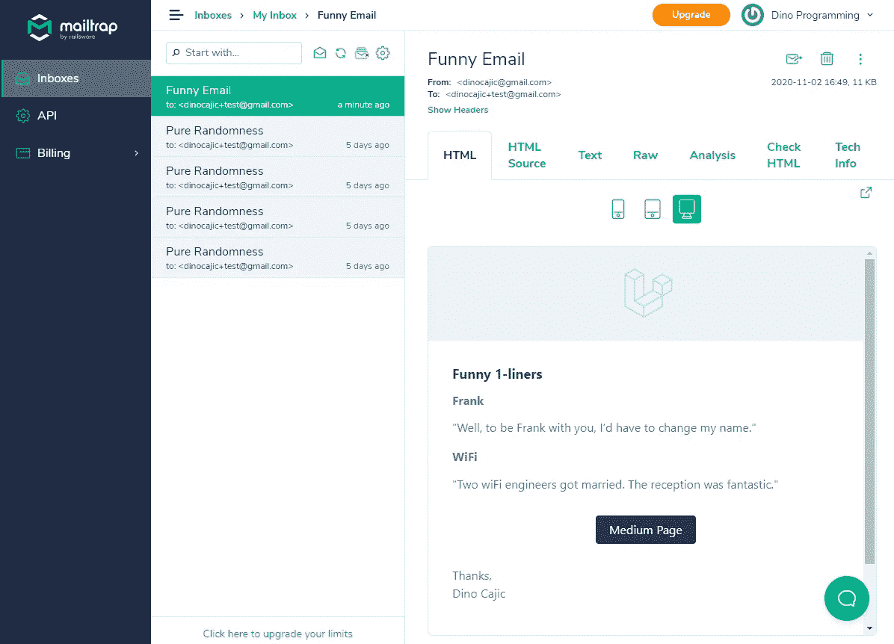
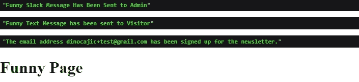
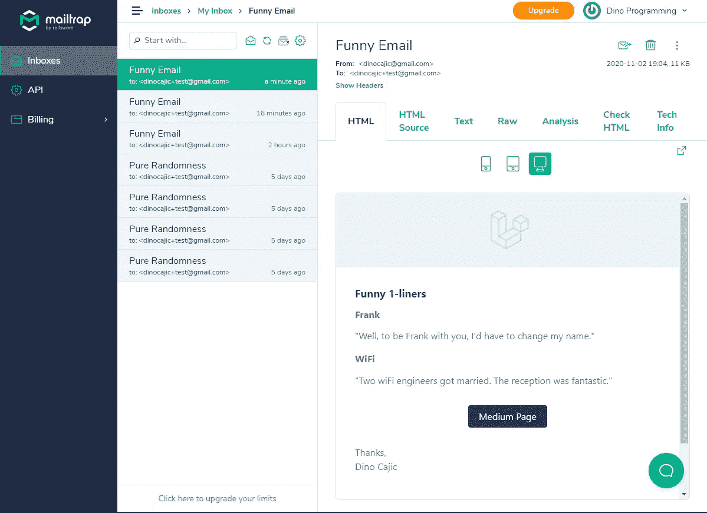
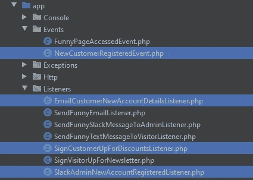
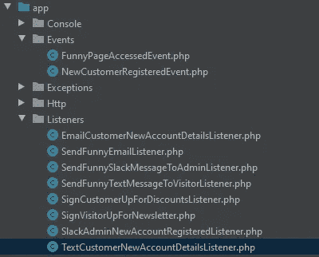

# Laravel 8.x 事件和侦听器

> 原文：<https://blog.devgenius.io/laravel-8-x-events-and-listeners-5608ff25f997?source=collection_archive---------0----------------------->


什么是事件？说白了，就是“发生的事情。”只要代码中发生了什么，就可以触发一个事件。Laravel 会说“我刚刚完成了一件事，我要让所有听到的人都知道。谁因为这个事件被触发而想做什么，就去做吧。”假设一个用户刚刚购买了一些东西。您可能希望:

*   创建发票
*   通过电子邮件通知管理员
*   通过松弛消息通知管理员
*   通过电子邮件通知客户
*   通过短信通知客户

如果您试图将这些任务合并到一个控制器中，那么您的代码将会紧密耦合。大多数程序员都认为解耦代码是一条出路。您的发票管理员应该不知道如何通知管理员；它应该只知道如何管理发票。

另一个应该触发事件的例子是当用户注册在线访问时。您可能希望向用户发送一封欢迎电子邮件，并获得一个延迟通知，让您知道用户已经订阅。

在本文中，我们不打算讨论身份验证系统；我想让它尽可能简单，所以我们将做一些更基本的事情。每当我们访问一个特定的页面，让我们发送一封电子邮件给用户。在正常环境下，您很可能不会这样做，但是我想完全去掉所有不必要的代码。

## Laravel 8.x 应用程序

首先，创建一个新的 Laravel 8.x 应用程序。如果你需要这方面的帮助，你可以看看我下面的文章。

[](https://medium.com/dev-genius/setting-up-laravel-8-x-with-jetstream-auth-84bbeafc0cd3) [## 使用 JetStream Auth 设置 Laravel 8.x

### 是时候用 Laravel 安装 JetStream 认证了。有时简单，有时不简单。

medium.com](https://medium.com/dev-genius/setting-up-laravel-8-x-with-jetstream-auth-84bbeafc0cd3) [](https://medium.com/dev-genius/laravel-homestead-on-windows-10-348062f07848) [## Windows 10 上的 Laravel 家园

### 揭开拉勒维尔家园的神秘面纱

medium.com](https://medium.com/dev-genius/laravel-homestead-on-windows-10-348062f07848) 

## 可邮寄的

接下来，我们需要创建 Mailable 类的一个实例，这样我们就有东西要发送了。如果您需要关于 Mailable 类的详细介绍性解释，请查看我关于 Mailables 的文章。在本文中，我将在不做更多解释的情况下浏览它。

[](https://dinocajic.medium.com/laravel-8-x-mailable-29cffdd19332) [## Laravel 8.x 可邮寄

### Laravel 附带了一个 Mailable 类，您可以使用它毫不费力地发送电子邮件。

dinocajic.medium.com](https://dinocajic.medium.com/laravel-8-x-mailable-29cffdd19332) 

我将使用[邮件陷阱](https://mailtrap.io/)来测试我的代码。如果您还没有，请设置一个邮件陷阱帐户，并将配置变量添加到您的。环境文件。

使用降价模板选项创建新的可邮寄类别:

```
php artisan make:mail FunnyEmail -m emails.funny
```

该命令将生成两个文件:

*   *app/Mail/FunnyEmail.php*
*   *资源/观点/邮件/搞笑.刀锋. php*

打开 *FunnyEmail* Mailable 类，并验证它在 *build()* 方法中返回了 *emails.funny* markdown 模板。

打开*funny.blade.php*降价文件。您应该会看到类似这样的内容。

因为我们想展示一些有趣的东西，你可以修改 markdown 文件来说一些有趣的东西。

让我们看看那是什么样子。打开您的【web.php】路线文件( *routes/web.php* )并创建一条新路线；我给我的*起名叫搞笑*。在这个过程中，我们将返回我们的 *FunnyEmail* 类的一个新实例。请确保将其导入到顶部。

在浏览器中访问该页面；你可能用 Homestead 设置了一个测试域，或者你可能用`php artisan serve`启动了服务器。不管是什么情况，你都应该知道如何访问你的`funny`页面。

您应该会看到类似如下的页面:



现在我们知道这是可行的，我们可以测试我们的邮件陷阱设置。让我们从相同的路线发送电子邮件。*现在您应该已经配置好了邮件陷阱设置。*

我们首先需要修改我们的*funny email*maible 类，以包含 *from()* 和 *subject()* 方法。

修改发送电子邮件的路线，并返回“电子邮件已发送”确认消息。

通过在浏览器中访问路线来验证它是否有效。我可以在浏览器中看到“电子邮件已发送”消息。



进入我的邮件陷阱账户，我能够确认我收到了邮件。



## 事件/侦听器

现在我们可以验证电子邮件是否可以发送，让我们创建一个事件/侦听器系统来完成相同的任务。你可能忘了系统的点是什么，赶紧刷新吧。假设一个客户下了一本书的订单(我们只卖搞笑书)。订单控制器可以存储订单细节，并向客户发送电子邮件，让他/她知道已经下了订单。订单控制器然后可以发送显示几个笑话的另一封电子邮件，随后向管理员发送松弛消息，随后向客户发送文本消息，随后向时事通讯注册用户，等等。

您可以很快判断出，订单控制器除了管理订单之外不应该知道如何做任何事情。订单控制器应该在存储完订单后发出一个标志(一个事件),监听该事件的监听器应该配合并做它需要做的事情，比如发送一封有趣的电子邮件。

在这个例子中，我们没有订单控制器。我们就按*/搞笑*路线来做。

在我们的*/搞笑*路线中，我们将在 *event()* 全球助手的帮助下发起一个事件。可以从应用程序的任何地方访问 *event()* 全局助手；它接受一个参数，该参数是事件的一个实例。如果这是一个客户注册页面，您可以引发一个 *CustomerRegistered* 事件；如果已经下了一个新订单，您可以引发一个 *OrderCreated* 事件。每次有人访问我们的*/有趣的*路线时，我们都会引发一个事件；我把它命名为 *FunnyPageAccessedEvent* 。

因此，让我们将 *FunnyPageAccessedEvent* 事件的新实例传递给 *event()* 全局助手。FunnyPageAccessedEvent 事件还不存在。

创建事件和侦听器有手动方式和自动方式。让我们两个都看看。

## 手动创建事件和侦听器

要创建一个事件，您将使用`make:event` artisan 命令。我们已经知道要给这个事件起什么名字了: *FunnyPageAccessedEvent* 。

```
php artisan make:event FunnyPageAccessedEvent
```

您将看到一个新文件，位于:*app/Events/funnypageaccessedevent . PHP*。如果你打开它，你会看到一个类似这样的文件:

新注册的事件 *FunnyPageAccessedEvent* 可以通过构造函数接受数据，比如电子邮件地址。所以让我们把电子邮件地址传递给它。

现在，无论何时调用该事件，都需要电子邮件地址。这意味着我们需要在我们的*有趣的*路由中向实例传递一个电子邮件地址。这也是在文档顶部导入*App \ Events \ FunnyPageAccessedEvent*的好时机。

于是，当用户访问*滑稽*路由时， *event()* 全局助手对 Laravel 应用大喊:“嘿，滑稽页面被访问了。任何在听的人，做你想做的事！”

还没有人在听任何东西。在我们创建任何监听器之前，让我们看一下 *FunnyPageAccessedEvent* 类。我们初始化了 email，并将其设置为私有属性。如果我们将其更改为 *public* ，那么监听器将可以访问那个 *public* 属性。所以让我们现在就做这个小小的改变。对于这个例子，我们也不需要 *broadcastOn()* 方法，所以让我们也删除它。您的 *FunnyPageAccessedEvent* 类现在应该是这样的。

是时候创建监听器了。我们将使用`make:listener` artisan 命令。

```
php artisan mke:listener SendFunnyEmailListener
```

您将看到一个新文件已经创建:*app/Listeners/sendfunnyemaillistener . PHP*。

打开该文件，您将看到新创建的侦听器。

我们想给我们的访问者发一封电子邮件。我们可以复制相同的 *Mail::to()* 代码，它是我们在测试我们的 maible 类时创建的，并将其粘贴到我们的 *handle()* 方法中。

```
Mail::to('dinocajic+test@gmail.com')->send(new FunnyEmail());
```

确保导入了*邮件*外观和 *FunnyEmail* 邮件类。

如果你看一下 *handle()* 方法，它接收事件作为参数。因此，我们可以通过 *$event* 参数访问 *FunnyPageAccessedEvent* 的 *public $email* 属性。让我们修改硬编码的电子邮件，改为接收传递给事件的电子邮件。

太好了。我们现在有一个在*滑稽*路线中“分派”的事件和一个侦听器，但是侦听器只是存在的；它没有监听这个事件。

最后一个阶段是确保 *SendFunnyEmailListener* 确实在监听 *FunnyPageAccessedEvent。*这是通过位于*app/Providers/EventServiceProvider . PHP 中的 *EventServiceProvider* 来完成的*你的 *EventServiceProvider* 应该是这样的。

您将看到 *$listen* 数组属性。您必须为每个事件/侦听器创建一个映射。在这个例子中，我们有一个事件和一个监听器。将事件和监听器添加到 *$listen* 数组:

让我们回顾一下。

1.  用户访问*搞笑*路线。
2.  *滑稽*路由内部的回调函数调用 *event()* 全局助手，全局助手“调度”事件。
3.  被调度的事件是 *FunnyPageAccessedEvent* 。它以字符串形式接收*电子邮件*地址。
4.  在 *FunnyPageAccessedEvent* 的实例化过程中，email 参数被分配给 *FunnyPageAccessedEvent* 类中的 *$email* 公共属性。
5.  监听器 *SendFunnyEmailListener* 正在监听 *FunnyPageAccessedEvent。*它知道监听这个特定事件的方式是由于在 *EventServiceProvider* 类中完成的映射。
6.  *SendFunnyEmailListener* 听到 *FunnyPageAccessedEvent* 事件。
7.  调用 *SendFunnyEmailListener* 内部的 *handle()* 方法，并将*funnypageacessdevent*事件作为参数传递给 *handle()* 方法。
8.  *handle()* 方法现在可以从 *FunnyPageAccessedEvent* 事件中访问 *$email* 属性。
9.  调用*邮件外观*并且 *to()* 方法接受来自*FunnyPageAccessedEvent->$ email*属性的 *$email* 地址。
10.  *邮件外观*也调用 *send()* 方法，并传递*FunnyEmail maillable*类。
11.  *funny email maible*类从和*主题*字段返回 *markdown* 模板和*。*
12.  *邮件门面*将邮件发送到指定的邮件地址。

让我们看看它是否有效。在你的浏览器中刷新有趣的路线，并查看你的邮件收件箱。我成功地收到了邮件。


让我们再创建三个侦听器。我们只是要模拟动作已经发生，而不是实际实现它。创建以下监听器:

*   *SendFunnySlackMessageToAdminListener*
*   *sendfunnytextmessagetovisitolistener*
*   *SignVisitorUpForNewsletter*

```
php artisan make:listener SendFunnySlackMessageToAdminListenerphp artisan make:listener SendFunnyTextMessageToVisitorListenerphp artisan make:listener SignVisitorUpForNewsletter
```

打开每个监听器(从*应用程序/监听器*)并添加以下内容:

同样，听众是存在的，但他们并没有真正在听。让我们确保他们正在监听何时调度 *FunnyPageAccessedEvent* 。打开 *EventServiceProvider* 类，将三个新的监听器添加到 *FunnyPageAccessedEvent* 数组中。确保在顶部导入每个侦听器。

刷新你的*搞笑*页面，看看会发生什么。您应该会看到如下所示的页面:



检查 MailTrap 并验证电子邮件确实已发送。



我们可以得出结论，映射到 *EventServiceProvider* 类中的所有侦听器实际上都触发了。

## 自动方式

您不必执行我们上面列出的所有命令。您可以访问您的 *EventServiceProvider* 类，在创建事件和侦听器之前映射它们。

让我们采用自动化的方法来创建这个事件/侦听器系统。该事件将被称为*NewCustomerRegisteredEvent*，并将在每次新客户注册新帐户时被触发。我们还想创建三个新的侦听器:

*   *EmailCustomerNewAccountDetailsListener*
*   *slackdadminnewaccountregistered listener*
*   *SignCustomerUpForDiscountsListener*

打开您的 *EventServiceProvider* 类，并将它们添加到您的 *$listen* 属性中。**确保为事件添加完整的名称空间**:***\ App \ Events***，为监听器添加***\ App \ Listeners***。

接下来，用 artisan 运行`event:generate`命令。`event:generate`命令查看 *EventServiceProvider* 类，并生成它没有找到的所有事件和侦听器。

```
php artisan event:generate
```

检查您的*应用程序/事件*和*应用程序/监听器*文件夹。你所有的文件都应该在那里。



您现在可以像以前一样修改这些文件。如果你需要单独添加一个新的监听器，你可以把它添加到 *EventServiceProvider* 类中，然后运行`event:generate` artisan 命令。假设我们想给客户发一条短信；我们首先将新的监听器类名添加到 *EventServiceProvider* 中。

运行`php artisan event:generate`并验证新的监听器是否在您的 *app/Listeners* 文件夹中。



要阅读关于事件和侦听器的更多细节，请访问 Laravel 文档。

 [## 事件

### Laravel 的事件提供了一个简单的观察者实现，允许您订阅和监听各种事件…

laravel.com](https://laravel.com/docs/8.x/events) 

Dino Cajic 目前是 [LSBio(寿命生物科学公司)](https://www.lsbio.com/)、[绝对抗体](https://absoluteantibody.com/)、 [Kerafast](https://www.kerafast.com/) 、 [Everest BioTech](https://everestbiotech.com/) 、 [Nordic MUbio](https://www.nordicmubio.com/) 和 [Exalpha](https://www.exalpha.com/) 的 IT 主管。他还担任我的自动系统的首席执行官。他有十多年的软件工程经验。他拥有计算机科学学士学位，辅修生物学。他的背景包括创建企业级电子商务应用程序、执行基于研究的软件开发，以及通过写作促进知识的传播。

你可以在 [LinkedIn](https://www.linkedin.com/in/dinocajic/) 上联系他，在 [Instagram](https://instagram.com/think.dino) 上关注他，或者[订阅他的媒体刊物](https://dinocajic.medium.com/subscribe)。

阅读 Dino Cajic(以及 Medium 上成千上万的其他作家)的每一个故事。你的会员费直接支持迪诺·卡吉克和你阅读的其他作家。你也可以在媒体上看到所有的故事。