# Laravel 8.x 可邮寄

> 原文：<https://blog.devgenius.io/laravel-8-x-mailable-29cffdd19332?source=collection_archive---------0----------------------->


Laravel 附带了一个 *Mailable* 类，你可以用它毫不费力地发送电子邮件。何时使用 *Mailable* 类的一个很好的例子就是用户注册的时候。注册完成后，会向用户发送一封欢迎电子邮件。为了去掉所有不必要的代码，我们将创建一个应用程序，在您每次访问特定页面时发送一封电子邮件。

## 先决条件

首先，创建一个新应用程序。如果您需要帮助，您可以阅读下面我写的关于创建新应用程序的文章。

[](https://medium.com/dev-genius/setting-up-laravel-8-x-with-jetstream-auth-84bbeafc0cd3) [## 使用 JetStream Auth 设置 Laravel 8.x

### 是时候用 Laravel 安装 JetStream 认证了。有时简单，有时不简单。

medium.com](https://medium.com/dev-genius/setting-up-laravel-8-x-with-jetstream-auth-84bbeafc0cd3) [](https://medium.com/dev-genius/laravel-homestead-on-windows-10-348062f07848) [## Windows 10 上的 Laravel 家园

### 揭开拉勒维尔家园的神秘面纱

medium.com](https://medium.com/dev-genius/laravel-homestead-on-windows-10-348062f07848) 

接下来，让我们使用 [MailTrap.io](https://mailtrap.io/) 来测试我们的邮件。如果你还没有，开一个邮件陷阱账户。转到收件箱，选择您的收件箱。在集成下，选择 Laravel。将配置设置复制到项目的。环境文件。您将看到 Laravel 已经用 *smtp.mailtrap.io* 预先填充了 *MAIL_HOST* ，预计您将使用 mailtrap 进行电子邮件测试。

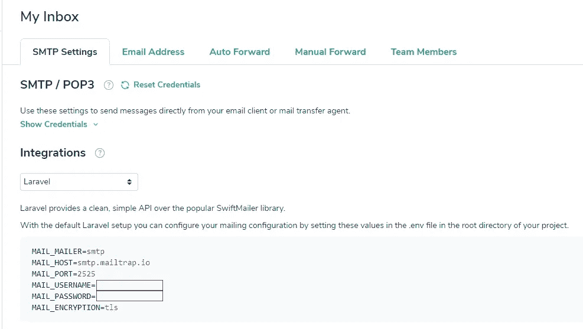

## 可邮寄的

要创建一个新的*可邮寄*类，使用 artisan `make:mail`命令:

```
php artisan make:mail RandomEmail
```

一旦运行该命令， *RandomEmail* 类将被构建并保存在新的 *Mail* 目录中:

```
app/Mail/RandomEmail.php
```

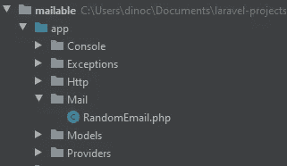

如果你打开*RandomEmail.php*文件，你会看到它包含一个构造函数和一个 *build()* 方法。

build 方法返回一个*视图。让我们创建一个
*mail/random-email . blade . PHP*视图。*

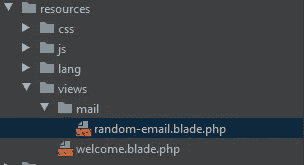

首先，给你的*random-email.blade.php*文件添加一些文本:

```
Hey there, This is just a random email. Randomly, 
Dino Cajic
```

返回到*random email*maible 类，并将返回视图更改为*random-email.blade.php。*

返回视图只是我们在 *build()* 方法中可以做的一件事。我们还可以指定谁发送了电子邮件和电子邮件的主题。根据 Laravel 文档，“所有可邮寄类的配置都是在`build`方法中完成的。在这个方法中，您可以调用各种方法，如`from`、`subject`、`view`、`attach`来配置邮件的展示和发送。"

我们可以将这些方法链接到我们的 return 语句中。让我们从链接来自()方法的*开始。*

接下来，我们来添加一个主题。

到目前为止，我们所做的一切都是静态的。我们的电子邮件模板应该是动态的。至少，它应该指定接收电子邮件的人的名字。由于 *RandomEmail* 类只是一个类，我们可以利用构造函数在实例化时向它传递数据。

*   创建一个名为 *$name* 的私有财产。
*   声明 *$name* 构造函数参数。
*   将 *$name* 构造函数参数分配给 *$name* 属性。
*   将 *$name* 属性传递给 *mail.random-email* 视图。

修改*随机电子邮件*，使其可以接受 *$name* 变量。我们将使用 *{{ $name }}* 刀片语法来呈现 *$name* 。

```
// *resources/views/mail/random-email.blade.php*Hey there {{$name}},This is just a random email.Randomly, 
Dino Cajic
```

我们准备调用 RandomEmail 可发送邮件的类并发送邮件。我们将从创建一条路线开始。打开 *routes/web.php* ，创建一条*随机*路线。在你的回电中，

*   创建 *$name* 变量。
*   使用*邮件*门面。
*   在 *to()* 方法中指定您要将电子邮件发送给谁。
*   链式 *send()* 方法。 *send()* 方法接受 *RandomEmail* 实例作为参数。
*   将 *$name* 变量传递给 *RandomEmail* 类。

是时候测试一下了。启动您的服务器:`php artisan serve`并导航到随机路线:`localhost:8080/random`。如果你得到一个空白屏幕，检查你的邮箱。这是一个空白屏幕，因为我们没有从路由返回任何 HTML。

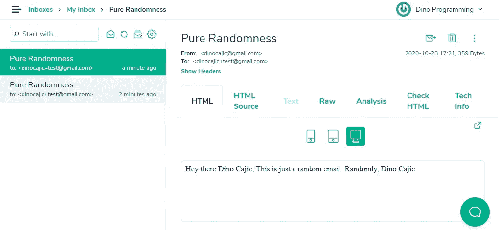

恭喜你，成功了。我们的格式丢失了，但那是因为它是一个纯文本文件。让我们给*随机电子邮件*视图添加一些 HTML。

如果我们刷新页面，我们应该有一个格式正确的 HTML 电子邮件。

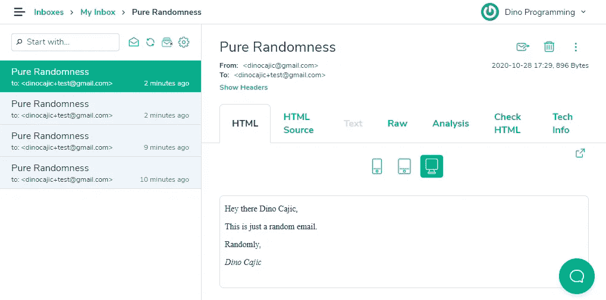

## 使用降价

我们可以使用可选的降价模板来进一步简化这一过程。根据 Laravel 文档，“减价可邮寄消息允许您利用可邮寄消息中的预建模板和邮件通知组件。由于消息是用 Markdown 编写的，Laravel 能够为消息呈现漂亮的、响应性强的 HTML 模板，同时还能自动生成纯文本的副本。

让我们创建另一个可邮寄的类，但是这次使用 Markdown 模板选项。要生成 markdown 模板文件，您需要传递-m 标志和新的 Markdown 视图位置。在这个实例中，我们希望视图存储在*resources/views/emails/*下，我们将它命名为*funny.blade.php。*

```
php artisan make:mail FunnyEmail -m emails.funny
```

该命令在 *app/Mail* 目录中生成*funny email*maible 类和一个*resources/views/emails/funny . blade . PHP*视图。

如果我们打开 *Mail/FunnyEmail* ，我们可以看到 *build()* 方法返回了一个 *markdown。*

让我们看看*funny.blade.php*降价视图。

我们现在可以修改*funny email*maiable 类，像以前一样链接 *from()* 和 *subject()* 方法。但是，在此之前，如果能在发送之前看到我们的电子邮件不是很好吗？让我们开始吧。

在 web.php 的*文件中，返回一个 *FunnyEmail* Mailable 类的新实例。*

启动你的服务器，访问有趣的页面。您应该会看到类似这样的内容。

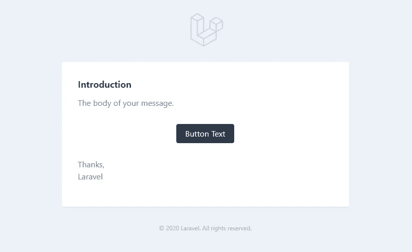

已经很好看了。

“Markdown mailables 使用 Blade 组件和 Markdown 语法的组合，这使您可以轻松地构建邮件消息，同时利用 Laravel 的预制组件。”

我们来修改一下*滑稽*视图(*资源/视图/邮件/滑稽. blade.php* )。

刷新你的*搞笑*页面。

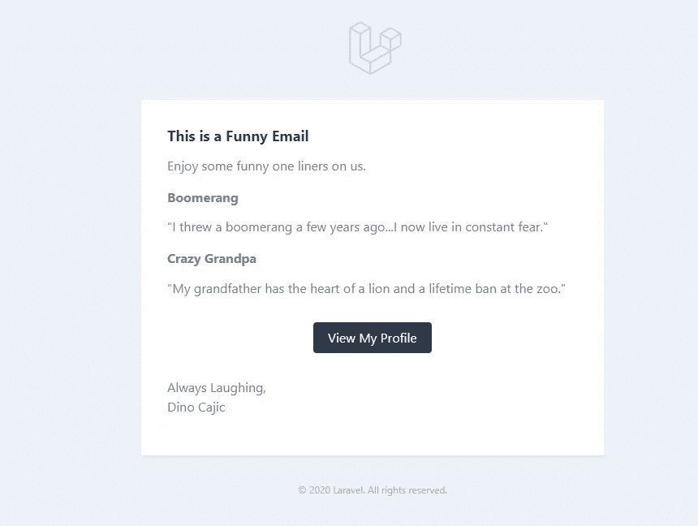

在页面底部，您会看到 2020 Laravel 版权。要改变这一点，只需修改您的*中的 *APP_NAME* 变量。env* 文件。我把我的改成了可邮寄的。如果我刷新页面，版权已经更新。如果您正在使用`php artisan serve`，您将不得不停止并重启服务器，以使更改生效。

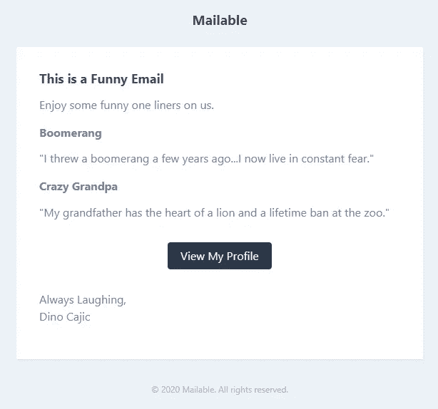

你会注意到 Laravel 的标志也被替换成了你的应用名称。如果你想进一步修改模板，比如改变页脚，你必须首先发布 *laravel-mail* 组件，然后编辑必要的文件。运行 *vendor:publish* 命令，并在 *laravel-mail* 旁边输入标签号。

```
php artisan vendor:publish 
...
13
```

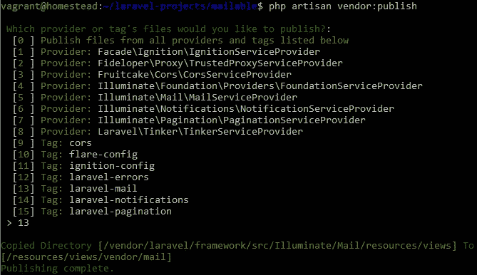

我们可以在新创建的*resources/views/vendor/mail*目录中看到可用的文件。

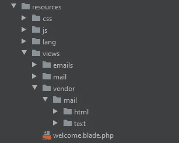

要修改页脚，打开*mail/html/footer . blade . PHP*。您应该看到以下内容:

当然，你可以直接从这里修改页脚内容，但是如果你想知道版权到底来自哪里，它实际上位于*messages.blade.php*(*resources/views/vendor/mail/html/message . blade . PHP*)。打开它，你会看到你的*页脚*内容。

将*版权所有*改为*滑稽版权所有*。保存文件并刷新页面。

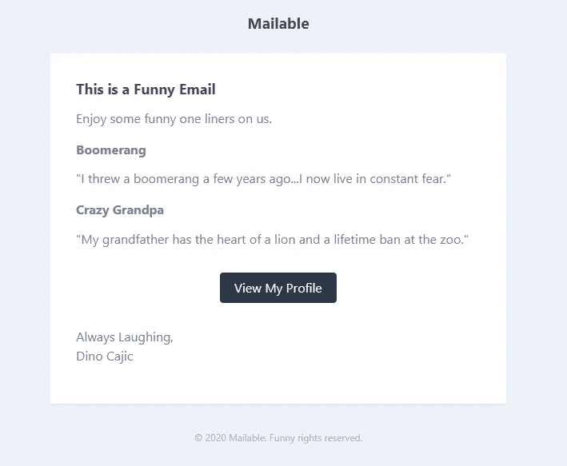

要修改 CSS，请修改*resources/views/vendor/mail/themes/default . CSS*文件。

这是对 Laravel 中 Mailable 类的快速介绍。我相信从现在开始，文档会变得更有意义。您可能还想探索许多其他功能，比如发送带附件的电子邮件。您还可以了解可以添加的其他组件，如表格。

 [## 邮件

### Laravel 在流行的 SwiftMailer 库上提供了一个干净、简单的 API，包括 SMTP、Mailgun、邮戳等驱动程序

laravel.com](https://laravel.com/docs/8.x/mail) 

迪诺·卡伊奇目前是 [LSBio(生命周期生物科学公司)](https://www.lsbio.com/)、[绝对抗体](https://absoluteantibody.com/)、 [Kerafast](https://www.kerafast.com/) 、[珠穆朗玛生物](https://everestbiotech.com/)、[北欧 MUbio](https://www.nordicmubio.com/) 和 [Exalpha](https://www.exalpha.com/) 的 IT 主管。他还担任我的自动系统的首席执行官。他有十多年的软件工程经验。他拥有计算机科学学士学位，辅修生物学。他的背景包括创建企业级电子商务应用程序、执行基于研究的软件开发，以及通过写作促进知识的传播。

你可以在 [LinkedIn](https://www.linkedin.com/in/dinocajic/) 上联系他，在 [Instagram](https://instagram.com/think.dino) 上关注他，或者[订阅他的媒体出版物](https://dinocajic.medium.com/subscribe)。

[*阅读迪诺·卡吉克(以及媒体上成千上万其他作家)的每一个故事。你的会员费直接支持迪诺·卡吉克和你阅读的其他作家。你也可以在媒体上看到所有的故事。*](https://dinocajic.medium.com/membership)