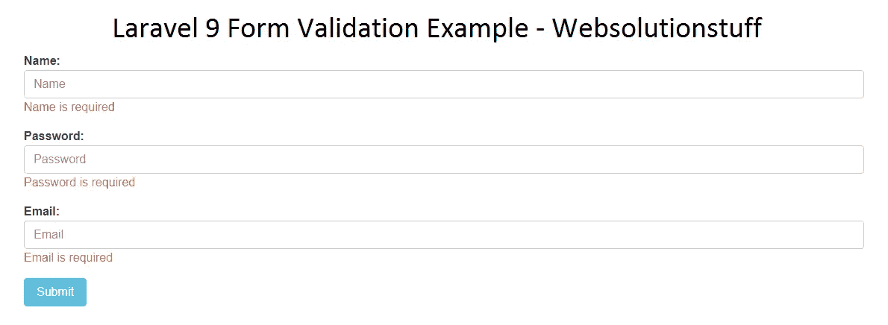

# Laravel 9 表单验证示例

> 原文：<https://blog.devgenius.io/laravel-9-form-validation-example-40742d5c825a?source=collection_archive---------11----------------------->

在本教程中，我们将看到 laravel 9 表单验证示例。对于任何传入的数据，我们需要在将它存储到数据库之前对其进行验证。Laravel 提供了几种不同的方法来验证应用程序的输入数据。最常见的是对所有传入的 HTTP 请求使用可用的`validate`方法。

Laravel 9 包括各种各样方便的验证规则，您可以将它们应用于数据验证。在 laravel 9 中，您还可以在刀片文件中添加错误消息，在 laravel 9 中自定义验证。

让我们看看 laravel 9 中的表单验证、laravel 9 自定义验证规则、laravel 9 验证错误消息、laravel 9 中的自定义验证消息。

这里，我们将在会话中使用 has()函数来检查 laravel 9 中的错误消息。使用这个示例，您可以检查简单的表单验证，也可以在 laravel 9 中创建自己的自定义验证。

**第一步:添加路线**

首先，我们在 **routes/web.php** 文件中定义了以下路由。

```
<?phpuse App\Http\Controllers\UserController;

Route::get('/user/create', [UserController::class, 'create']);
Route::post('/user/store', [UserController::class, 'store']);
```

**阅读更多:** [**Laravel 9 AJAX CRUD 示例**](https://websolutionstuff.com/post/laravel-9-ajax-crud-example)

**第二步:创建控制器**

现在，我们将创建 UserController 来保存数据库中的数据。因此，将下面的代码复制到您的控制器中。

```
<?phpnamespace App\Http\Controllers;use Illuminate\Http\Request;
use App\Models\User;class UserController extends Controller
{
    public function create()
    {
    	return view('index');
    } public function store(Request $request)
    {
        $validatedData = $request->validate([
                'name' => 'required',
                'password' => 'required|min:8',
                'email' => 'required|email|unique:users'
            ], [
                'name.required' => 'Name is required',
                'password.required' => 'Password is required',
                'email.required' => 'Email is required'
            ]);

        $validatedData['password'] = bcrypt($validatedData['password']);
        $user = User::create($validatedData);

        return back()->with('success', 'User Created Successfully !!');
    }   
}
```

或者，在 laravel 9 中，验证规则可以被指定为规则数组，而不是单个`|`分隔的字符串。

```
$validatedData = $request->validate([
    'name' => 'required',
    'password' => ['required', 'min:8'],
    'email' => ['required, email, unique:users'],
]);
```

**阅读更多:** [**Laravel 9 CRUD 操作示例**](https://websolutionstuff.com/post/laravel-9-crud-operation-example)

**在第一次验证失败时停止**

有时，在第一次验证失败后，我们需要停止对属性运行验证规则。为此，将`bail`规则分配给 laravel 9 中的属性。

```
$request->validate([
    'name' => 'bail|required|unique:users|max:255',
    'password' => ['required', 'min:8'],
    'email' => ['bail, required, email, unique:users'],
]);
```

在本例中，如果**名称**属性上的**唯一**规则失败，将不会检查**最大**规则。规则将按照分配的顺序进行验证。

**第三步:添加刀片文件**

在这一步中，我们将创建一个刀片文件，并将文件名保存为**index.blade.php**

```
<html>
<head>
    <title>Laravel 9 Form Validation Example - Websolutionstuff</title>
    <meta charset="utf-8">
    <meta http-equiv="X-UA-Compatible" content="IE=edge">
    <meta name="viewport" content="width=device-width, initial-scale=1">
    <link href="https://cdnjs.cloudflare.com/ajax/libs/twitter-bootstrap/4.0.0-alpha/css/bootstrap.css" rel="stylesheet">
</head>
<body>
    <div class="container">  
        <div class="row">
            <div class="col-md-12" style="margin-top: 30px;">
                <h1>Laravel 9 Form Validation Example - Websolutionstuff</h1>   
                @if(Session::has('success'))
                <div class="alert alert-success">
                    {{ Session::get('success') }}
                    @php
                        Session::forget('success');
                    @endphp
                </div>
                @endif

                <form method="POST" action="{{ url('user/store') }}">
                    @csrf
                    <div class="form-group">
                        <strong>Name:</strong>
                        <input type="text" name="name" class="form-control" placeholder="Name">
                        @if ($errors->has('name'))
                            <span class="text-danger">{{ $errors->first('name') }}</span>
                        @endif
                    </div>

                    <div class="form-group">
                        <strong>Password:</strong>
                        <input type="password" name="password" class="form-control" placeholder="Password">
                        @if ($errors->has('password'))
                            <span class="text-danger">{{ $errors->first('password') }}</span>
                        @endif
                    </div>

                    <div class="form-group">
                        <strong>Email:</strong>
                        <input type="text" name="email" class="form-control" placeholder="Email">
                        @if ($errors->has('email'))
                            <span class="text-danger">{{ $errors->first('email') }}</span>
                        @endif
                    </div>

                    <div class="form-group">
                        <button class="btn btn-info btn-submit">Submit</button>
                    </div>
                </form>
            </div>
        </div>
    </div>
</body>
</html>
```

**阅读更多:** [**如何在 MySQL 中获取小时数据**](https://websolutionstuff.com/post/how-to-get-hourly-data-in-mysql)

**输出:**



**你可能也会喜欢:**

*   **检查还:** [**在线密码生成器**](https://websolutionstuff.com/tools/online-password-generator)
*   **检查还:** [**在线 JSON 格式化程序和查看器**](https://websolutionstuff.com/tools/online-json-formatter-and-viewer)
*   **阅读也:** [**如何在 Vue Js 中实现 Google 条形图**](https://websolutionstuff.com/post/how-to-implement-google-bar-chart-in-vue-js)
*   **读也:** [**Jquery appendTo 和 prependTo 示例**](https://websolutionstuff.com/post/jquery-appendto-and-prependto-example)