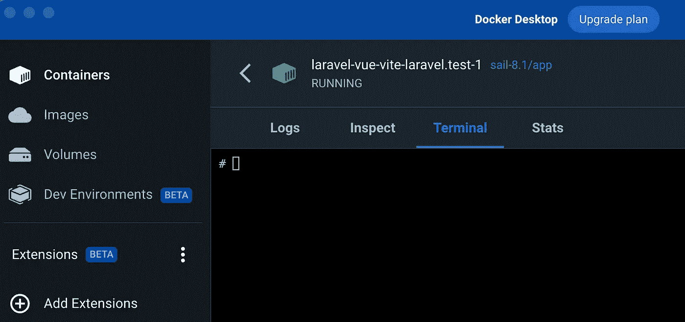
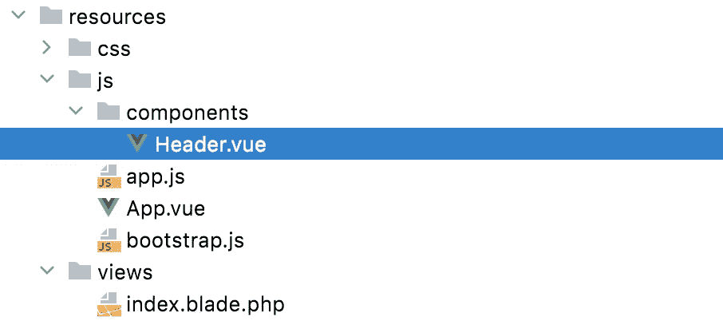
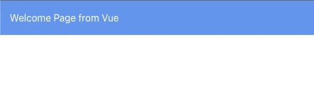
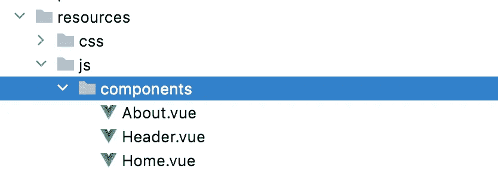
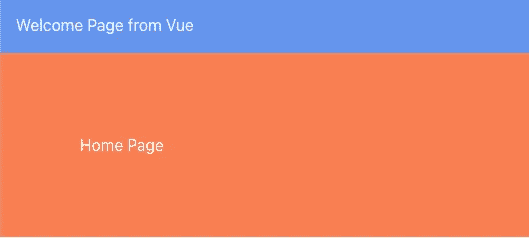
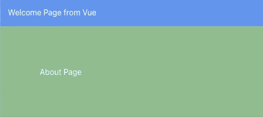

# 带 Vue、顺风和 Vue 路由器的 Laravel 9.x

> 原文：<https://blog.devgenius.io/laravel-9-x-with-vue-tailwind-and-vue-router-4c2da39831ea?source=collection_archive---------0----------------------->


你是将后端与前端完全分开，还是尝试将 Vue 和 Laravel 结构集成到一个项目中？我更喜欢后者。没有想象中的直观。我以前很喜欢 UI 预设，你可以选择 React 或 Vue，然后继续前进。虽然并不可怕，但我们确实需要适当地设置它。

# 安装 Vue

首先，建立一个新的 Laravel 项目。我在 Mac 上使用 Docker，所以我的安装非常简单。

```
curl -s "https://laravel.build/laravel-vue" | bash
```

安装完成后，将 cd 放入您的目录并运行`./vendor/bin/sail up`来启动您的项目。

## resources/welcome.blade.php

打开`welcome.blade.php`文件并删除其中的大部分代码。你只需要一个有`id="app"`属性的`div`。

```
<!DOCTYPE html>
<html lang="{{ str_replace('_', '-', app()->getLocale()) }}">
    <head>
        <meta charset="utf-8">
        <meta name="viewport" content="width=device-width, initial-scale=1">

        <title>Laravel</title>

        <!-- Fonts -->
        <link href="https://fonts.bunny.net/css2?family=Nunito:wght@400;600;700&display=swap" rel="stylesheet">

    </head>
    <body class="antialiased">
        <div id="app"></div>
    </body>
</html>
```

我们很快就需要重新查看欢迎视图。

## vitejs/plugin-vue

为了使用 Vue，我们需要安装 vite vue 插件。打开名为`laravel-vue-laravel.test-1`的 docker 容器。这是我创建的项目的名字。走进候机楼。你可以通过你的终端来做这件事，但是我喜欢通过容器来做，因为我可以确保安装了正确的版本，而且我不用担心我的电脑上的版本。



键入以下命令:

`npm i vue@next`

安装完成后，再运行一个命令来安装 vue 插件:

`npm i @vitejs/plugin-vue`

如果出现错误，您可能需要运行以下版本的命令:

`npm i @vitejs/plugin-vue@3`

## vite.config.js

你主目录下的`vite.config.js`文件需要修改。我们需要从插件中导入`Vue`，并在`plugins`下注册。您可能会看到如下所示的文件:

```
import { defineConfig } from 'vite';
import laravel from 'laravel-vite-plugin';

export default defineConfig({
    plugins: [
        laravel({
            input: ['resources/css/app.css', 'resources/js/app.js'],
            refresh: true,
        }),
    ],
});
```

添加所有必要的代码后，该文件应该如下所示。

```
import { defineConfig } from 'vite';
import laravel from 'laravel-vite-plugin';
import Vue from '@vitejs/plugin-vue';

export default defineConfig({
    plugins: [
        laravel({
            input: ['resources/css/app.css', 'resources/js/app.js'],
            refresh: true,
        }),
        Vue({
            template: {
                transformAssetUrls: {
                    base: null,
                    includeAbsolute: false,
                }
            }
        }),
    ],
});
```

## resources/js/App.vue

是时候创建`App.vue`文件了。只要你知道这是入口点，你可以给它起任何你喜欢的名字。我将从包含一个`h1`标签的简单文件开始。

```
<template>
    <h1>Welcome Page from Vue</h1>
</template>

<script>
export default {
    name: 'App',
    components: {},
}
</script>

<style>

</style>
```

## 资源/js/app.js

接下来，我们需要修改我们的`app.js`文件。它目前正在从同一个目录导入`bootstrap.js`，但是我们需要它实际导入我们的`App.vue`。我们还需要来自`vue`的`createApp`，这样我们可以在`resources/views/welcome.blade.php`内将内容挂载到`#app` id 上。您的`resources/js/app.js`文件应该是这样的。

```
import { createApp } from "vue";
import App from "./App.vue";

createApp(App).mount("#app");
```

## 重命名 welcome.blade.php

我通常喜欢把名字从`welcome.blade.php`改成`index.blade.php`。这也要求您在您的路由文件`routes/web.php`中更改路由，以指向`index`。

```
<?php

use Illuminate\Support\Facades\Route;

Route::get('/', function () {
    return view('index');
});
```

## 包括 index.blade.php 的 app.js

使其工作的最后一个修改是在`index.blade.php`中包含`app.js`文件。我们可以第六次做这个。

```
<!DOCTYPE html>
<html lang="{{ str_replace('_', '-', app()->getLocale()) }}">
    <head>
        <meta charset="utf-8">
        <meta name="viewport" content="width=device-width, initial-scale=1">

        <title>Laravel</title>

        <!-- Fonts -->
        <link href="https://fonts.bunny.net/css2?family=Nunito:wght@400;600;700&display=swap" rel="stylesheet">

        @vite(['resources/js/app.js'])
    </head>
    <body class="antialiased">
        <div id="app"></div>
    </body>
</html>
```

## 确保它能工作

回到你的容器并运行`npm run dev`。在浏览器中访问您的应用程序，`http://localhost`或`http://0.0.0.0`，查看 Vue 应用程序的运行情况。


# 安装顺风

我们不想就此止步。我们还需要安装顺风装置。关于如何做到这一点，Tailwind 网站给了我们很好的指导。

[](https://tailwindcss.com/docs/guides/laravel) [## 用 Laravel - Tailwind CSS 安装 Tailwind CSS

### 在 Laravel 项目中设置 Tailwind CSS。

tailwindcss.com](https://tailwindcss.com/docs/guides/laravel) 

回到你的码头集装箱。如果`npm run dev`仍在运行，点击`CTRL+C`停止运行。执行以下命令:

```
npm install -D tailwindcss postcss autoprefixer
```

```
npx tailwindcss init -p
```

## tailwind.config.js

一旦完成，回到你的编辑器，打开新创建的位于根目录的`tailwind.config.js`文件。

修改`modeule.exports`中的`content`部分。您的文件应该如下所示。

```
/** @type {import('tailwindcss').Config} */
module.exports = {
  content: [
    "./resources/**/*.blade.php",
    "./resources/**/*.js",
    "./resources/**/*.vue",
  ],
  theme: {
    extend: {},
  },
  plugins: [],
}
```

## resources/css/app.css

顺风也需要添加到我们的`app.css`文件中。

```
@tailwind base;
@tailwind components;
@tailwind utilities;
```

## 在 index.blade.php 包含 app.css

最后，我们需要在我们的`index.blade.php`文件中包含`app.css`文件。我们可以用`vite`再做一次。

```
<!DOCTYPE html>
<html lang="{{ str_replace('_', '-', app()->getLocale()) }}">
    <head>
        <meta charset="utf-8">
        <meta name="viewport" content="width=device-width, initial-scale=1">

        <title>Laravel</title>

        <!-- Fonts -->
        <link href="https://fonts.bunny.net/css2?family=Nunito:wght@400;600;700&display=swap" rel="stylesheet">

        @vite(['resources/js/app.js', 'resources/css/app.css'])
    </head>
    <body class="antialiased">
        <div id="app"></div>
    </body>
</html>
```

## 确保它能工作

回到你的容器并运行`npm run dev`。在浏览器中访问您的应用程序，`http://localhost`或`http://0.0.0.0`，查看安装了 Tailwind 的 Vue 应用程序。


# 带着 Vue 应用程序兜一圈

让我们在`resources/js/`内制作一个`components`目录。创建完成后，创建一个名为`Header.vue`的新文件。



我们将把我们的`Welcome Page from Vue`标题从`App.vue`移到`Header.vue`。我们还可以给`h1`标签添加一些`scoped`样式。为了确保 Tailwind 工作，我们可以在我们的`h1`标签中添加一个`p-4`类。

```
<template>
    <h1 class="p-4">Welcome Page from Vue</h1>
</template>

<script>
export default {
    name: 'Header',
}
</script>

<style scoped>
    h1 {
        background-color: cornflowerblue;
        color: white;
    }
</style>
```

修改`App.vue`以包含`Header.vue`组件。

```
<template>
    <Header />
</template>

<script>
import Header from './components/Header.vue';

export default {
    name: 'App',
    components: {
        Header,
    },
}
</script>

<style>

</style>
```

确保`npm run dev`处于活动状态，并刷新页面。你会看到它正常工作。



# 安装 Vue 路由器

让我们通过添加`vue-router`来完成这个。我们需要首先安装依赖项。转到 Docker 容器并停止应用程序运行(`CTRL+C`)。使用以下命令安装`vue-router`依赖项:

```
npm install vue-router
```

您可以检查您的`package.json`文件，以确保您的所有依赖项都已添加。

```
{
    "private": true,
    "scripts": {
        "dev": "vite",
        "build": "vite build"
    },
    "devDependencies": {
        "autoprefixer": "^10.4.13",
        "axios": "^1.1.2",
        "laravel-vite-plugin": "^0.7.0",
        "lodash": "^4.17.19",
        "postcss": "^8.4.20",
        "tailwindcss": "^3.2.4",
        "vite": "^3.0.0"
    },
    "dependencies": {
        "@vitejs/plugin-vue": "^3.2.0",
        "vue": "^3.2.36",
        "vue-router": "^4.1.6"
    }
}
```

## web.php

我们现在的`web.php`文件的配置方式将会遇到一些问题。让我们先把这件事解决掉，这样以后就不用担心了。

```
<?php

use Illuminate\Support\Facades\Route;

Route::get('/{all}', function () {
    return view('index');
})->where("all", ".*");
```

## 创建主页和关于零部件

为了测试我们的路线，我们需要创建几个组件。我将创建两个最常见的页面，`Home`和`About`。

```
<template>
    <div class="p-20">Home Page</div>
</template>

<script>
export default {
    name: 'Home',
}
</script>

<style scoped>
div {
    background-color: coral;
    color: white;
}
</style>
```

```
<template>
    <div class="p-20">About Page</div>
</template>

<script>
export default {
    name: 'Home',
}
</script>

<style scoped>
div {
    background-color: darkseagreen;
    color: white;
}
</style>
```



## 资源/js/router/index.js

是时候创建我们的路径文件了。这将处理我们所有的路线，而不是`web.php`。对于该文件，我们需要:

*   从`vue-router`导入`createRouter`和`createWebHistory`
*   导入任何我们需要定义路径的页面组件，如`Home`和`About`
*   创建我们的路由常量并将组件绑定到它
*   创建我们的`router`并将`history`和`routes`绑定到它
*   导出路由器

```
import {createRouter, createWebHistory } from "vue-router";
import Home from "../components/Home.vue";
import About from "../components/About.vue"

const routes = [
    {
        path: "/",
        name: "home",
        component: Home,
    },
    {
        path: "/about",
        name: "about",
        component: About,
    },
];

const router = createRouter({
    history: createWebHistory(import.meta.env.BASE_URL),
    routes,
});

export default router;
```

## 资源/js/app.js

导出的`router`现在需要导入。它需要导入到我们的`app.js`文件中。一旦进口，我们需要`use`它。在我们`mount`我们的应用程序之前添加`use(router)`功能。

```
import { createApp } from "vue";
import App from "./App.vue";
import router from "./router/index";

createApp(App)
    .use(router)
    .mount("#app");
```

## resources/js/App.vue

最后，我们需要修改`App.vue`文件，使其包含路由器文件返回的内容。我们将在`<Header />`下面直接添加`<router-view />`。

```
<template>
    <Header />
    <router-view />
</template>

<script>
import Header from './components/Header.vue';

export default {
    name: 'App',
    components: {
        Header,
    },
}
</script>

<style>

</style>
```

# 体验完整的应用程序

回到你的容器并运行`npm run dev`。在您的浏览器`http://localhost`或`http://0.0.0.0`中访问您的应用，并查看使用 Tailwind 和 Vue-Router 运行的 Vue 应用。

主路径(`/`)将返回`Home`组件。



转到 about 路线，(`/about`)，将返回`About`组件。



我将在标题中添加几个链接，这样我们就可以轻松地在页面之间切换。

```
<template>
    <h1 class="p-4">Welcome Page from Vue</h1>
    <div class="p-4">
        <router-link to="/">Home</router-link> |
        <router-link to="/about">About</router-link>
    </div>
</template>

<script>
export default {
    name: 'Header',
}
</script>

<style scoped>
    h1, div {
        background-color: cornflowerblue;
        color: white;
    }
</style>
```

我们现在可以在两个页面之间点击。玩得开心。

[](https://github.com/dinocajic/laravel-vue-tailwind) [## GitHub-dinocajic/laravel-vue-tail wind

### 此时您不能执行该操作。您已使用另一个标签页或窗口登录。您已在另一个选项卡中注销，或者…

github.com](https://github.com/dinocajic/laravel-vue-tailwind) 

Dino Cajic 目前是 [Absolute Biotech](http://absolutebiotech.com/) 的 IT 主管，该公司是 [LSBio(寿命生物科学公司)](https://www.lsbio.com/)、 [Absolute 抗体](https://absoluteantibody.com/)、 [Kerafast](https://www.kerafast.com/) 、 [Everest BioTech](https://everestbiotech.com/) 、 [Nordic MUbio](https://www.nordicmubio.com/) 和 [Exalpha](https://www.exalpha.com/) 的母公司。他还担任我的自动系统的首席执行官。他拥有计算机科学学士学位，辅修生物学，并拥有十多年的软件工程经验。他的背景包括创建企业级电子商务应用程序、执行基于研究的软件开发，以及通过写作促进知识的传播。

你可以在 [LinkedIn](https://www.linkedin.com/in/dinocajic/) 上联系他，在 [Instagram](https://instagram.com/think.dino) 上关注他，或者[订阅他的媒体出版物](https://dinocajic.medium.com/subscribe)。

阅读迪诺·卡吉克(以及媒体上成千上万的其他作家)的每一个故事。你的会员费直接支持迪诺·卡吉克和你阅读的其他作家。你也可以在媒体上看到所有的故事。