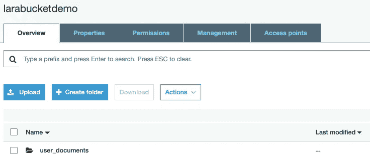

# Laravel API 文件上传到 AWS

> 原文：<https://blog.devgenius.io/laravel-api-file-upload-to-aws-a8e87319b82e?source=collection_archive---------0----------------------->

## 如何设置 amazon bucket 并从 Laravel API 应用程序上传文件


图片作者。由[绘制的 SVG 插图](https://undraw.co/illustrations)

亚马逊 S3(简单存储服务)是一个云存储设施，允许上传，存储和检索数据，包括静态网站，图像和文件。你可以在亚马逊的[官方文档](https://aws.amazon.com/s3/)上阅读更多关于 S3 优惠的信息。

Laravel 提供了驱动程序来方便地连接和上传你的数据到亚马逊 S3，我们将会看到如何。源代码可在[这里](https://github.com/emygeek/laravel-aws-s3-demo)获得。本文分为三个部分:

1.  [项目设置](#7477)，在这里我们创建文档模型以及相关的迁移、控制器和 API 资源
2.  [文件上传](#26e0)，这里我们添加一个脚本来上传文件到 S3
3.  [亚马逊存储桶设置](#6959)
4.  [环境和配置文件设置](#2f60)

我们将使用 [Postman](https://www.postman.com/downloads/) 来测试 API 路由。

> **免责声明**:本文的重点是亚马逊 S3 的文件上传、检索和删除。API 认证超出了本文的范围。如果需要的话，阅读更多关于[护照认证](https://laravel.com/docs/7.x/passport)的内容，但是理想情况下，应该对通过 API 发出请求的用户进行认证。

## 项目设置

让我们创建一个新的 Laravel 项目

```
composer create-project --prefer-dist laravel/laravel laravel-aws-demo
```

移动到项目中，创建文档模型和相关的迁移。

```
cd laravel-aws-demo && php artisan make:model Models/Document -m
```

让我们修改文档迁移。

```
Schema::create('documents', function (Blueprint $table) {
    $table->id();
    $table->string('name');
    $table->string('path');
    $table->timestamps();
});
```

> 在您的模型上，您可以使用 UUID 而不是自动递增 ID 作为您的主键。我已经在这篇文章的[中介绍了在 Laravel 中使用 UUID。](https://medium.com/@emymbenoun/how-to-use-uuids-instead-of-auto-increment-ids-in-your-laravel-app-2e6cc045f6c1)

**为了将** [**连接到 Laravel app 内的 s3 bucket**](https://laravel.com/docs/7.x/filesystem#driver-prerequisites) **，需要安装这个必需的包:**

```
composer require league/flysystem-aws-s3-v3 ~1.0
```

最后，用您的数据库凭证更新您的`.env`文件。然后运行`php artisan migrate`。

## 文件上传

让我们创建文件上传控制器。在这个演示中，我们将只关注存储和销毁方法。

```
php artisan make:controller DocumentsController --api
```

当`store()`方法运行时，将在 s3 bucket(我们将在`.env`文件中指定)中创建一个文件夹‘user _ documents ’,该文件夹将包含我们上传的文件。文件名将被散列。如果你想指定文件名，你可以使用`storeAs()`方法。因为我们没有使用默认的存储路径，所以我们需要指定将要使用的磁盘，在本例中是`s3`。同样适用于销毁方法，我们需要指定`s3`磁盘。

现在让我们创建一个文档[资源](https://laravel.com/docs/7.x/eloquent-resources)来格式化发送给用户`php artisan make:resource DocumentResource`的响应

```
<?phpnamespace App\Http\Resources;use Illuminate\Http\Resources\Json\JsonResource;
use Storage;class DocumentResource extends JsonResource
{
    /**
     * Transform the resource into an array.
     *
     * [@param](http://twitter.com/param)  \Illuminate\Http\Request  $request
     * [@return](http://twitter.com/return) array
     */
    public function toArray($request)
    {
        return [
            "id" => $this->id,
            "name" => $this->name,
            "path" => !empty($this->path) ? Storage::disk('s3')->url($this->path) : '',
        ];
    }
}
```

让我们更新一下`routes/api.php`文件。


作者图片

## 亚马逊帐户设置

前往[亚马逊网络服务](https://aws.amazon.com/s3/)并创建一个账户。您需要输入您的账单详情，才能激活您的账户。任何列在他们的[免费等级](https://aws.amazon.com/free/?all-free-tier.sort-by=item.additionalFields.SortRank&all-free-tier.sort-order=asc)下的服务都是免费的，为期 1 年，只要你不超出他们的使用限制。一旦您的帐户被验证并激活，在顶部菜单，点击服务，并选择 S3。


作者图片


作者图片

单击创建存储桶按钮。在新页面上，输入唯一的时段名称并选择区域:


作者图片

如果您的地区没有默认显示，您可以为您的帐户[启用它](https://docs.aws.amazon.com/general/latest/gr/rande-manage.html)。

> 根据我的配置，在我的 Laravel `.env`文件中，我的区域配置将是`AWS_DEFAULT_REGION=af-south-1`。我们稍后将更新`.env`文件。

下一节允许您设置存储桶的可见性。默认情况下，它被设置为阻止所有访问。您需要取消选中以允许读写访问。

***警告*** *！根据您的要求授予或拒绝对您的存储桶的访问权限。在这里阅读更多关于桶安全的*[](https://docs.aws.amazon.com/AmazonS3/latest/dev/security-best-practices.html)**)**

**

*作者图片*

*根据您的要求更新以下部分*

**

*作者图片*

**

*作者图片*

*您可以稍后更新这些设置。点击**创建桶**。*

**

*作者图片*

*这是你的桶的样子:*

**

*作者图片*

*既然创建了 bucket，我们需要设置访问键，API 将使用这些键来连接到我们的 bucket。在顶部菜单中，在您的帐户名称下，选择`Security Credentials`。*

**

*作者图片*

*单击左侧边栏上的用户，然后单击添加用户按钮:*

**

*作者图片*

*让我们开始吧。步骤 1:创建新用户*

**

*作者图片*

*第二步:点击**直接附加现有策略**。在过滤器中搜索 AmazonS3，并选择 AmazonS3FullAccess，以便能够对 bucket 进行读写访问。*

**

*作者图片*

*步骤 3:添加标签(可选)*

**

*作者图片*

*第四步:检查你的输入*

**

*作者图片*

*第 5 步:您的用户创建完毕。**复制访问密钥 ID 和秘密访问密钥。**这些值将保存到您的`.env`文件中。*

**

*作者图片*

## *环境和配置文件设置*

```
*AWS_ACCESS_KEY_ID=PUT_THE_ACCESS_KEY_ID
AWS_SECRET_ACCESS_KEY=PUT_THE_SECRET_ACCESS_KEY
AWS_DEFAULT_REGION=PUT_THE_SELECTED_REGION_CODE
AWS_BUCKET=PUT_YOUR_BUCKET_NAME*
```

***设置文件可见性***

*打开`config/filesystems.php`文件，它包含我们的 Laravel 应用程序的文件系统配置。向下滚动到文件系统磁盘部分。默认情况下，Laravel 包括本地、公共和 s3 磁盘的配置。您可以自由添加其他磁盘或更新现有磁盘。为了能够在文件上传到亚马逊 S3 后访问/查看文件，您可以将 S3 磁盘的可见性更改为公共。*

```
*'visibility' => 'public',*
```

*您的 s3 设置将如下所示:*

**

> *如果您不希望默认情况下可以访问上传到 s3 存储桶的所有文件，而不是将 S3 磁盘的可见性设置添加/更新为 public，您可以基于每个文件来执行此操作。例如，在存储文件时，您需要将可见性设置为 public，如下所示:*

```
*$documentPath = $request->file('document')->store($base_location, ['disk' => 's3', 'visibility' => 'public']);*
```

***测试***

*我们去找邮递员吧。创建新的发布请求。选择正文>表单-数据。*

*输入屏幕截图上的密钥名称。默认情况下，属性类型设置为文本。您需要从下拉菜单中选择**文件**。*

**

*一旦你上传文件并点击**发送**，你应该会看到一个类似的结果。*

**

*数据库将看起来像这样:*

**

*存储桶将显示一个名为 user_documents 的新文件夹，您将在其中找到我们上传的文件:*

****

## *您可能会遇到的错误*

***1-未找到适配器***

```
*Class 'League\Flysystem\AwsS3v3\AwsS3Adapter' not found*
```

*请确保运行 composer 命令来安装适配器:`composer require league/flysystem-aws-s3-v3 ~1.0`*

***2-检索凭证时出错***

```
***Error** retrieving credentials from the instance profile metadata service. (cURL error 7: Failed to connect to xxx.xxx.xxx.xxx port 80: Operation timed out (see https://curl.haxx.se/libcurl/c/libcurl-errors.html))* 
```

*中仔细检查您的 AWS 凭据。环境文件*

***3-拒绝访问错误***

**

*当试图在浏览器上打开 URL 时，您可能会看到此错误。发生这种情况是因为在上传文件时，其可见性被设置为私有。您可以使用`setVisibility`方法更改现有文件的可见性。你可以在这里了解更多信息。这也可能是 S3 桶阻止公众访问其数据的一个迹象。*

## *结束语*

*如果您有任何问题或评论，请在下面留下，或通过 Twitter [@MarieInnov](https://twitter.com/MarieInnov) 与我联系。*