# laravel API——存储库模式(使你的代码更加结构化)——简单指南

> 原文：<https://blog.devgenius.io/laravel-api-repository-pattern-make-your-code-more-structured-the-simple-guide-5b770da766d7?source=collection_archive---------1----------------------->

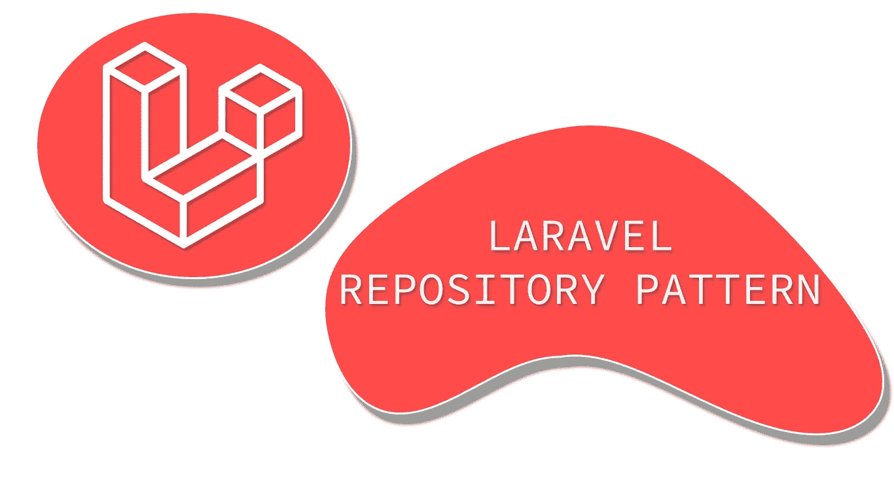

Laravel 知识库模式

嗨，朋友们，就在这里，我们要再次谈论拉勒维尔。我们走吧！

# 遵循这篇文章的要求

1.  非常基础的 OOP。
2.  基本拉勒维尔。
3.  基础 API。

# 跟随本文的必备工具

## 1.PHP / Laravel

重要的是 Laravel 本身，你可以安装在这里([https://laravel.com/docs/7.x](https://laravel.com/docs/7.x))。我目前使用的是 Laravel 7 *。*

## 2.邮递员

Postman 是一个强大而友好的用户界面应用程序，可以在这里下载(【https://www.postman.com】T4)。

## 3.文字编辑器

有很多文本编辑器，我更喜欢使用 VSCode，你可以在这里下载([https://code.visualstudio.com](https://code.visualstudio.com/))。
如果你想使用 Sublime Text 或 Atom **，**这样的文本编辑器没问题，只要选择适合你的工具就行了。

## 4.数据库ˌ资料库

可以使用 XAMPP **、** LAMPP **、**或者 WAMPP。但是我用的是包含 MySQL 的 XAMPP。这里有下载 https://www.apachefriends.org/index.html 的链接。

# 看完这篇文章你得到了什么？

1.  结构化的 Laravel 应用程序。
2.  做一个更好的 API。
3.  让你的代码更容易维护。

# 知识库模式

在本文中，我们将讨论 Laravel **中的存储库模式。顺便问一下，什么是存储库模式？根据微软文档，以下是解释:**

> 存储库是封装了访问数据源所需的逻辑的类或组件。它们集中了常见的数据访问功能，提供了更好的可维护性，并将用于访问数据库的基础设施或技术从域模型层中分离出来。

如需进一步阅读，请访问下面由 Microsoft 提供的文档:

[](https://docs.microsoft.com/en-us/dotnet/architecture/microservices/microservice-ddd-cqrs-patterns/infrastructure-persistence-layer-design#:~:text=The%20Repository%20pattern,from%20the%20domain%20model%20layer.) [## 设计基础设施持久层

### 数据持久性组件提供了对微服务边界内托管的数据的访问(即…

docs.microsoft.com](https://docs.microsoft.com/en-us/dotnet/architecture/microservices/microservice-ddd-cqrs-patterns/infrastructure-persistence-layer-design#:~:text=The%20Repository%20pattern,from%20the%20domain%20model%20layer.) 

简单的解释就是， ***存储库模式让你的应用更加结构化，易于维护，并且非常容易与数据库*** *中的东西(比如模型)进行交互。当然，这在将来会更容易开发，因为代码有标准。最后一件事是，你的应用程序有主要的文件要配置，叫做**接口，储存库**，**，**和**提供者**。*

## 另一篇拉勒维尔的文章

查看我之前的文章 2019 年谈论 Laravel API 和 VueJS，这里是这篇文章，我顺便用印度尼西亚语写的。

[](https://medium.com/gits-apps-insight/laravel-6-membuat-api-menggunakan-resource-part-1-eec91149d7aa) [## Laravel 6 —成员 API Menggunakan 资源(第 1 部分)

### 我们可以用 API 来管理 6 种资源吗？这是我的第一份工作。

medium.com](https://medium.com/gits-apps-insight/laravel-6-membuat-api-menggunakan-resource-part-1-eec91149d7aa) [](https://medium.com/gits-apps-insight/laravel-6-part-2-full-stack-dengan-vuejs-18911280901c) [## Laravel 6(第二部分)—全栈[dengan VueJS]

### 第 6 类和第 3 类网站的建立需要大量资金。不，bagaimana…

medium.com](https://medium.com/gits-apps-insight/laravel-6-part-2-full-stack-dengan-vuejs-18911280901c) 

# 准备我们的申请

您可以按照这里的文档来安装 Laravel。

 [## 装置

### Laravel 框架有一些系统需求。所有这些要求都由拉勒维尔家园满足…

laravel.com](https://laravel.com/docs/7.x/installation#installation) 

好吧，我假设你已经安装了 Laravel，让我们先设置我们的 Laravel。

## 1.配置数据库

我这里用的是 **MySQL** ，所以这是我的数据库。环境配置:

```
DB_CONNECTION=mysqlDB_HOST=127.0.0.1DB_PORT=3306DB_DATABASE=laravel-repository-patternDB_USERNAME=rootDB_PASSWORD=
```

## 2.配置模型

这对你来说是完全可选的，我只是更喜欢这样做来构建应用程序。

好了这里这篇文章的一个主要的东西，你看到 Laravel 模型位于 ***app*** 文件夹里面对吗？我的意思是，这没关系，但我想将该模型移动到***app****/****Models***中，这是我将在这一步中创建的一个更好的开发环境文件夹。

转到***config/auth . PHP***并搜索这一行，将代码改为。

```
'providers' => ['users' => ['driver' => 'eloquent','model' => App\Models\User::class, 
        // I added "Models" Folder up there],
```

之后，将名称空间模型**User.php**改为这个。

```
namespace App\Models;
```

这样做之后，清除缓存，并通过在终端或 CMD 中键入以下命令，在应用程序中重新添加该类。

```
// clear cache
php artisan config:cache// re-add class
composer dump-autoload
```

## 3.制造假数据

使用 seeder 为我们的 API 创建假数据，使用以下命令生成 seeder。

```
php artisan make:seeder UserSeeder
```

将这段代码复制到我们已经在 ***数据库/seeds/UserSeeder.php*** 中创建的播种机中

UserSeeder.php

并且不要忘记进入***database/factories/user factory . PHP****，*当您生成 Laravel 项目并复制这段代码时，这个文件已经在那里了。

UserFactory.php

之后，在 ***数据库/seeds/database seeder . PHP****，*中注册***【UserSeeder.php***，这样。

DatabaseSeeder.php

最后，运行下面的代码，重新添加类，将假数据插入数据库并进行迁移。

```
// Re-add the class
composer dump-autoload// Migrating and inserting fake data from seeder to database
php artisan migrate:fresh --seed
```

**上面代码的结论**是，我们要使用 Laravel 工厂生成假数据，确切地说是用户的 20 个数据。不同的是，我们只是改变了***User.php***模型的命名空间。

## 4.创建用户控制器

好吧，假设我们已经有了 20 个虚假用户的数据，对吗？现在，我将创建 UserController，并将其放在用于处理用户数据的***app/Http/Controllers/API***文件夹中，运行以下代码。

```
php artisan make:controller API/UserController -r
```

并在下面写下这段代码。

UserController.php

## 5.在 api.php 注册路线

转到 ***routes/api.php*** 、添加这段代码。

```
Route::resource(‘users’, ‘API\UserController’);
```

你可以在邮差 app 上查看，端点是:

*   获取所有用户，方法**获取** (api/users)。
*   创建新用户，方法**发布** (api/users)。
*   通过 ID 获取用户，方法 **GET** (api/users/{id})。
*   更新用户，方法**放** (api/users/{id})。
*   删除用户，方法**删除** (api/users/{id})。

> 注意:对于创建用户，端点主体包含(名称、电子邮件和密码)，对于更新，主体包含(名称和电子邮件)，这些字段是必需的。

有什么问题吗？不会，只是一个普通的控制器对吗？你完全正确。但是，如果我们有效地看待编码，维护起来看起来很可怕。为什么？因为如果你有复杂的逻辑，**你的控制器会变胖，难以阅读**。从现在开始，你要把逻辑搬到仓库去。从上面的代码来看，什么也不是。但是想象一下，如果你有一个很大的应用程序，你还在使用那个控制器，你在里面实现了很多逻辑。

> 如果你实现了这个存储库模式，你的控制器看起来会更干净，逻辑会更少。但是，如果你想让你的控制器保持那样，没关系。这取决于你的应用程序有多复杂。

# 让我们实现存储库模式！

我们开始吧！首先，你要在你的 ***app*** 文件夹中创建三个文件夹，分别是存储库、接口和特征。所以在你的 ***app*** 文件夹里面会是这样的。

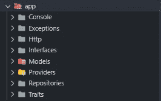

应用程序文件夹列表

## 1.创造特质

什么是特质？根据 PHP 文档，下面是解释。

> **特征**是单一继承中代码重用的一种机制

**简单解释一下**，Trait 是在你的 app 中放置一些可重用代码的文件，用于减少重复做同样的功能。在这种情况下，我们将创建向客户机发送 JSON 响应的函数。

我将**命名为 ResponseAPI.php，**将文件放在你的 ***app/Traits*** 文件夹中。代码，你可以写在下面。

ResponseAPI.php

这只是我为这篇文章做的简单的特征，代码在那里是不言自明的。

## 为什么我会有这种特质？

如果我们回到我在那里创造的 UserController.php。如您所见，我一遍又一遍地以相同的格式发送 JSON 响应。如果你有一个更大的应用程序要构建，你会厌倦写响应格式。很快，我们将重构控制器。

## 2.创建界面

在开始创建接口之前，我只想创建一个 Laravel 给出的验证类。**如果你使用一个存储库模式，你不允许在一个控制器或存储库中创建一个验证，它必须是单独的**。下面是创建验证的代码。我正在使用 FormRequest 验证。

```
php artisan make:request UserRequest
```

上面的命令将在***app/Http/Requests/user request . PHP .***中创建一个文件，下面是你可以写下来的代码。

UserRequest.php

接口是解释起来复杂的部分，但是接口就像一个类，是用来描述类在那里实现什么方法的。如果您仍然感到困惑，让我们创建界面。

我将**命名为 UserInterface.php，**将文件放在你的***app/Interfaces***文件夹中。代码，你可以写在下面。

UserInterface.php

我要重复上面界面中发生的事情。所以我们有一个包含四个方法的接口，对吗？这些方法是:

*   getAllUsers()，从数据库中获取所有用户。
*   从数据库中获取一个用户。
*   requestUser()，从数据库创建或更新用户。
*   deleteUser()，从数据库中删除用户。

上面的四种方法将在我们的知识库中使用。接口只是为了描述我们的知识库或类的工作。如果您想要为应用程序的功能创建一个存储库，存储库中的方法必须与实现的接口相同。让我们创建存储库。

## 3.创建存储库

在这里，我将创建一个存储库。储存库到底是什么？储存库是用于与控制器和数据通信的层，在这种情况下，与数据库进行交互。因此，我将把我之前创建的所有逻辑从**UserController.php**移到这个存储库中。

我命名为**UserRepostitory.php，**将文件放在你的***app/Repositories***文件夹中。代码，你可以写在下面。

UserRepository.php

看到了吗？就像我们刚刚在**UserController.php 做的一样，**但是我们做得更干净，我们只是创建方法来实现我们刚刚创建的**UserInterface.php**。如果你没有实现 UserInterface.php 的方法，你会得到一个错误。

> 哦，对了，还有一件事，你看我用 DB facades 写代码。这只是为了防止如果我们的服务器有任何问题，如果我们向数据库发出请求，特别是创建/更新/删除数据，如果有错误，它会得到**回滚**而不是保存到数据库。要获得更多解释，您可以在这里浏览文档。

 [## 数据库:入门

### Laravel 使跨各种数据库后端与数据库的交互变得极其简单，使用原始 SQL…

laravel.com](https://laravel.com/docs/7.x/database#database-transactions) 

## 4.重构 UserController.php

我们来重构一下***app/Http/Controllers/API/user controller . PHP****中那个看起来乱七八糟的**UserController.php**。好了，这是代码。*

*重构的 UserController.php*

*看到了吗？所以控制器是干净整洁的，我们只需要得到用户接口，在构造函数中，得到我们想要的所有方法。控制器中不再有逻辑和验证，这很好。从现在开始，如果你有问题或调试，你只需去接口或仓库本身。*

*因此，为了让这些事情工作，您必须向 Laravel 本身注册一个**提供者**。怎么做呢？让我们再向下滚动。*

## *5.注册新的提供商*

*我们要注册一个供应商，对吗？我们只是简单地在***app/Providers***文件夹*中创建新文件。**

*我命名**RepositoryServiceProvider.php，**把文件放在你的***app/Providers***文件夹里。代码，你可以写在下面。*

*RepositoryServiceProvider.php*

*之后就可以在***config/app . PHP***文件中注册提供者了。转到 **providers** 数组，放置这段代码。*

```
*App\Providers\RepositoryServiceProvider::class,*
```

*在注册了**提供者**之后，运行下面的代码来重新添加类并清空缓存。*

```
*// clear cache
php artisan config:cache// re-add class
composer dump-autoload*
```

*最后，您应该能够再次运行服务器并到达同一个端点。*

*看到了吗？在我们实现存储库模式之前和之后有什么不同。在我们实现了存储库模式之后，我们的代码更加结构化，可读性更强，更重要的是，易于开发。*

## *如果你有另一个回购和接口呢？怎么注册？*

*如果您有其他回购或接口，您可以通过前往，***app/Providers/*RepositoryServiceProvider.php**轻松注册。示例代码应该是这样的。*

*注册新存储库和接口的示例。*

*你只要每次做一个新的回购和接口就注册一个新的***$ this->app->bind()***，。*

*让我们看看结果！*

## *我们在那里做的结果*

*好的，我会在**邮差**上测试这个。我认为你之前已经完成了所有这些步骤。不要忘记运行服务器和数据库。*

```
*php artisan serve*
```

1.  *获取所有用户端点，方法**获取**(API/用户)*

*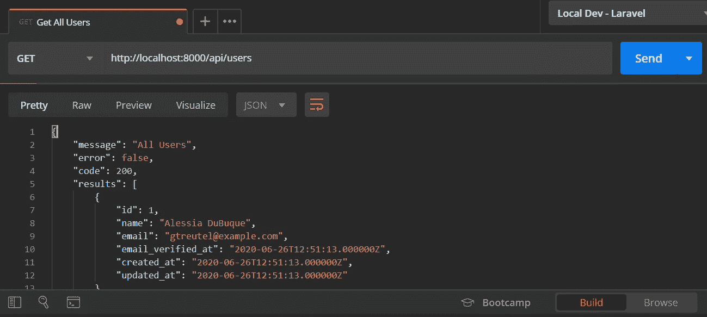*

*获取所有用户*

*2.按 ID 获取用户，方法**获取**(API/user/{ ID })*

*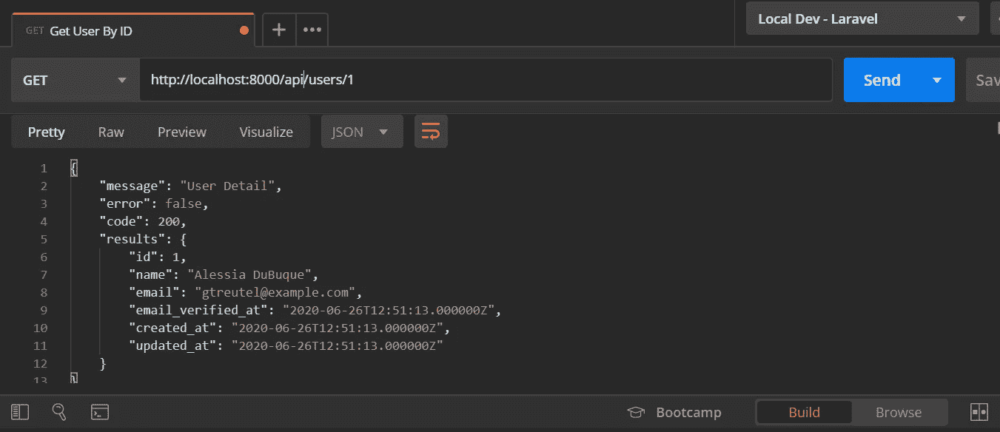*

*按 ID 获取用户*

*3.创建新用户，方法**POST**(API/用户)*

*首先，你要把标题放在邮差里，应该是这样的。*

*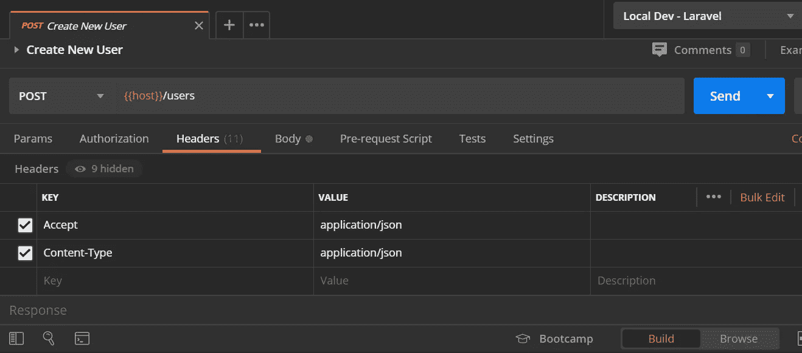*

*请求的标头*

*其次，这是请求的主体，字段都是必需的。*

*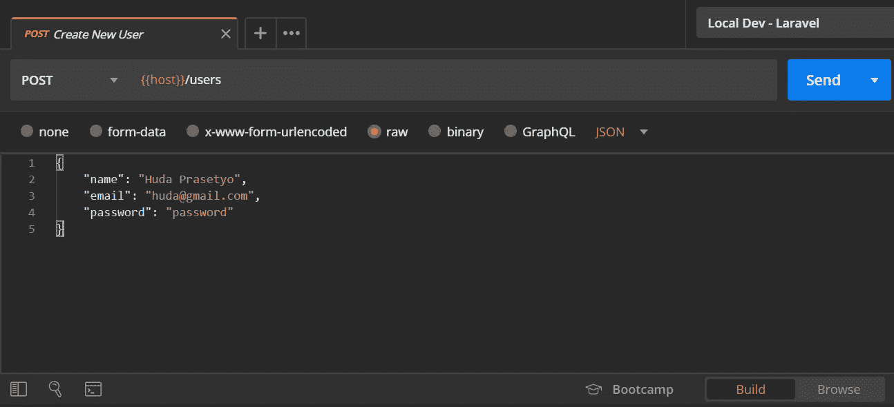*

*创建新用户主体*

*最后是结果。*

*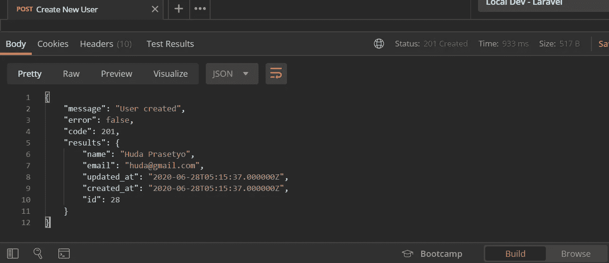*

*创建新用户结果响应*

*4.更新用户，方法**PUT**(API/user/{ id })*

*这些步骤与创建新用户、差异位于正文和 param 相同。*

*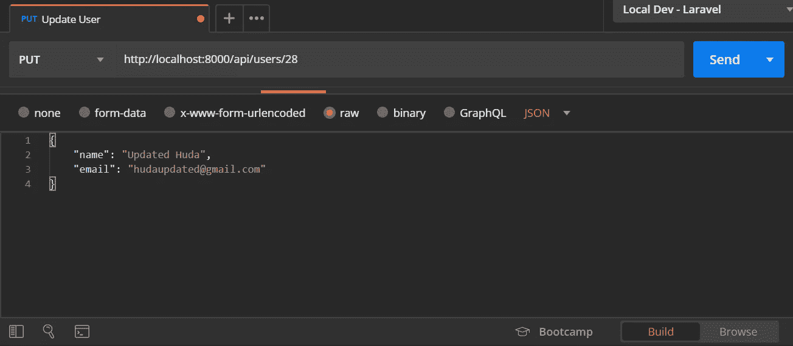*

*更新用户*

*结果。*

*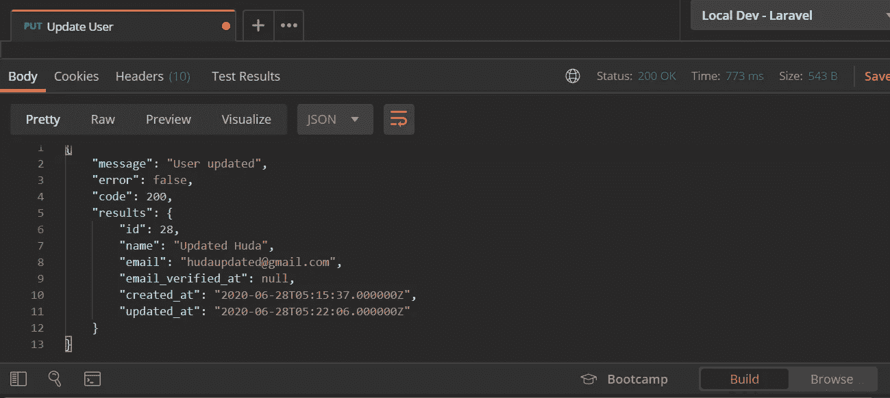*

*用户更新结果*

*5.删除用户，方法**DELETE**(API/user/{ id })*

*最后一点是，删除用户。*

*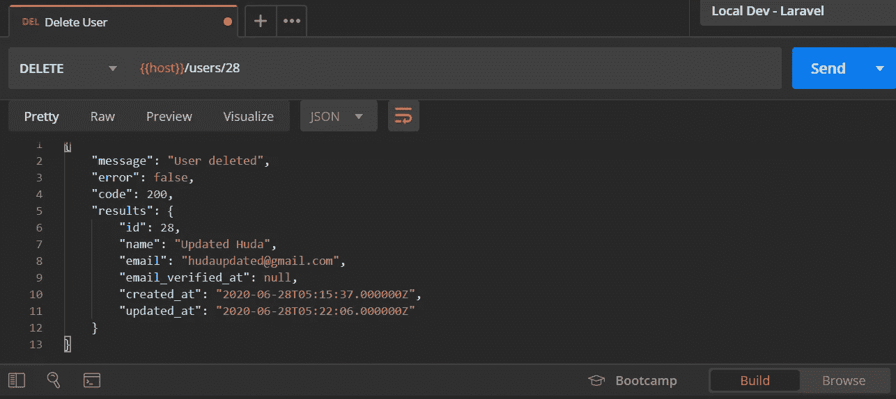*

*删除用户结果*

*就是这样！你用存储库模式使 API 成为可能。*

## *错误响应结果*

*对于错误响应，如果您从服务器获得任何错误，您将获得以下响应(例如)。*

*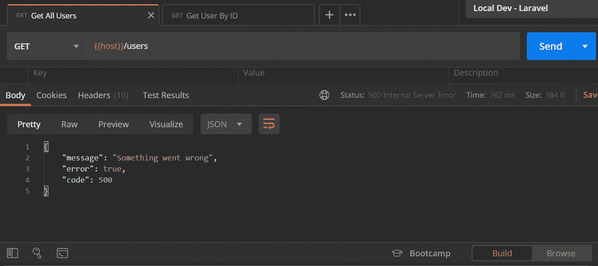*

*错误响应*

*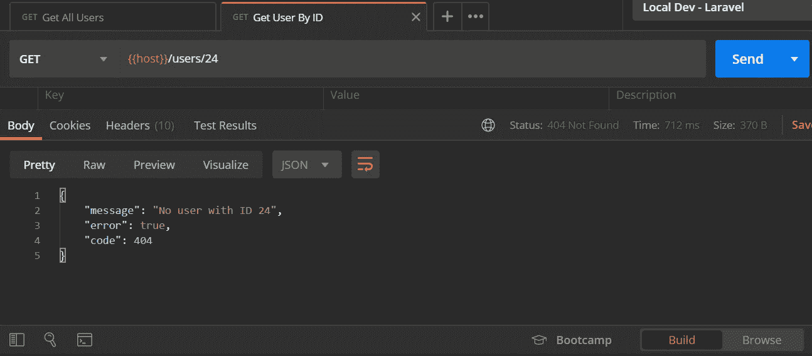*

*从数据库中查找未注册用户的错误响应*

# *结论*

*在阅读并实施了上面的操作之后，您将:*

*   *让你的代码更有条理。*
*   *一致。*
*   *永远不要在 controller 中编写任何逻辑，如果必须这样做也没关系。*
*   *让你的代码在未来更加可重用。*

*我们刚刚使用存储库模式创建了一个 Laravel 应用程序。现在的代码更有结构性，也更易于维护。这样我们的响应 API 就更具可读性和一致性。这就是本文的目的，我希望你们在代码中编写的内容更加一致，但如果不这样做，就会使代码更难理解和维护。这只是我的观点，所以实际上取决于你。*

*您可以在此处贡献或克隆回购。*

*[](https://github.com/hudaprs/be_repository_pattern_api_laravel) [## hud aprs/be _ repository _ pattern _ API _ Lara vel

### 用 Laravel 实现的存储库模式 API。通过创建一个…

github.com](https://github.com/hudaprs/be_repository_pattern_api_laravel) 

所以我们坚持到了最后一篇文章，很有意思，不是吗？我希望你得到我在那里解释的东西，如果你没有，请留下评论。下一篇文章见。*