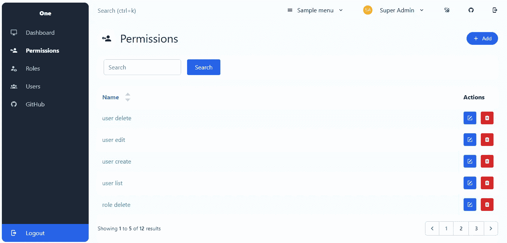
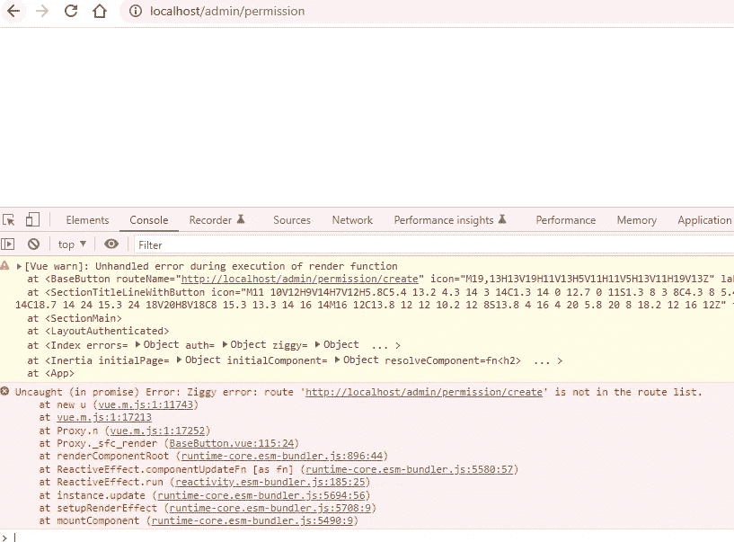
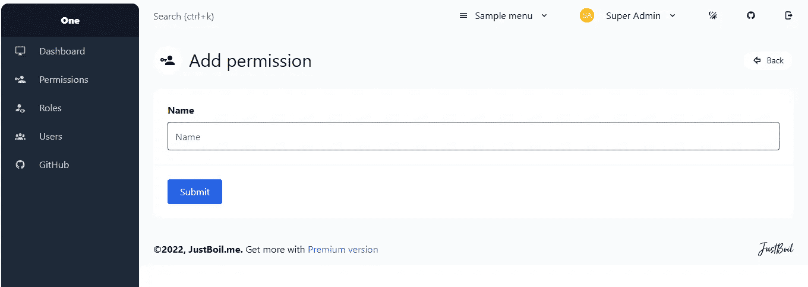
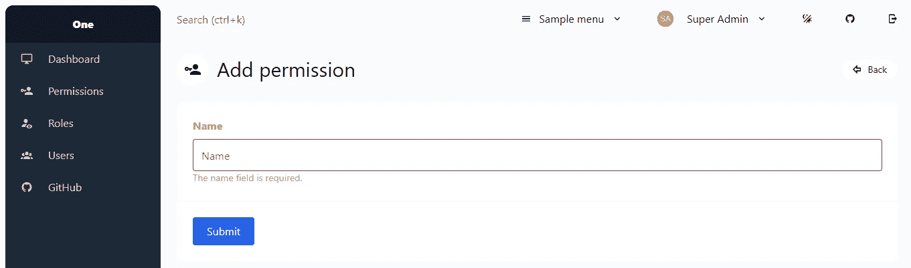
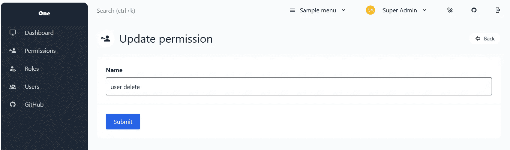
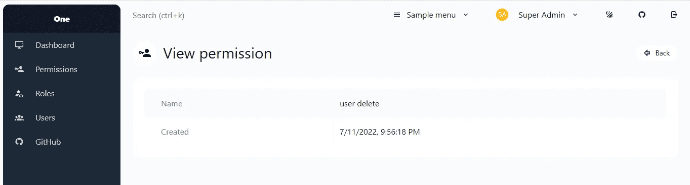

# Laravel 将 Admin One 仪表板模板应用于 CRUD

> 原文：<https://blog.devgenius.io/laravel-applies-admin-one-dashboard-template-to-crud-e187a6cce50?source=collection_archive---------8----------------------->

## Laravel 从头开始创建 Vue 管理面板——第 7 部分



上次 [par](/how-to-integrate-laravel-with-vue-tailwind-admin-one-dashboard-3753346181) t 我们添加了 [Admin One](https://github.com/justboil/admin-one-vue-tailwind) 模板到 [Laravel Vue 管理面板](https://github.com/balajidharma/laravel-vue-admin-panel)。在这一部分，我们将为已经创建的权限 CRUD 应用 Admin One 模板。

我们将管理一个模板应用到下面的权限 CRUD 页面

1.  索引页
2.  创建页面
3.  更新页面
4.  查看页面

## 1.索引页

在索引页面中，我们将使用内置的 Admin One 组件。打开权限`Index.vue`文件，替换为以下代码

resources/js/Pages/Admin/Permission/index . vue

```
<script setup>
import { Head, Link, useForm } from "@inertiajs/inertia-vue3";
import {
  mdiAccountKey,
  mdiPlus,
  mdiSquareEditOutline,
  mdiTrashCan,
  mdiAlertBoxOutline,
} from "@mdi/js";
import LayoutAuthenticated from "@/Layouts/LayoutAuthenticated.vue";
import SectionMain from "@/Components/SectionMain.vue";
import SectionTitleLineWithButton from "@/Components/SectionTitleLineWithButton.vue";
import BaseButton from "@/Components/BaseButton.vue";
import CardBox from "@/Components/CardBox.vue";
import BaseButtons from "@/Components/BaseButtons.vue";
import NotificationBar from "@/Components/NotificationBar.vue";
import Pagination from "@/Components/Admin/Pagination.vue";
import Sort from "@/Components/Admin/Sort.vue";const props = defineProps({
  permissions: {
    type: Object,
    default: () => ({}),
  },
  filters: {
    type: Object,
    default: () => ({}),
  },
  can: {
    type: Object,
    default: () => ({}),
  },
});const form = useForm({
  search: props.filters.search,
});const formDelete = useForm({});function destroy(id) {
  if (confirm("Are you sure you want to delete?")) {
    formDelete.delete(route("permission.destroy", id));
  }
}
</script><template>
  <LayoutAuthenticated>
    <Head title="Permissions" />
    <SectionMain>
      <SectionTitleLineWithButton
        :icon="mdiAccountKey"
        title="Permissions"
        main
      >
        <BaseButton
          :route-name="route('permission.create')"
          :icon="mdiPlus"
          label="Add"
          color="info"
          rounded-full
          small
        />
      </SectionTitleLineWithButton>
      <NotificationBar
        v-if="$page.props.flash.message"
        color="success"
        :icon="mdiAlertBoxOutline"
      >
        {{ $page.props.flash.message }}
      </NotificationBar>
      <CardBox class="mb-6" has-table>
        <form @submit.prevent="form.get(route('permission.index'))">
          <div class="py-2 flex">
            <div class="flex pl-4">
              <input
                type="search"
                v-model="form.search"
                class="
                  rounded-md
                  shadow-sm
                  border-gray-300
                  focus:border-indigo-300
                  focus:ring
                  focus:ring-indigo-200
                  focus:ring-opacity-50
                "
                placeholder="Search"
              />
              <BaseButton
                label="Search"
                type="submit"
                color="info"
                class="ml-4 inline-flex items-center px-4 py-2"
              />
            </div>
          </div>
        </form>
      </CardBox>
      <CardBox class="mb-6" has-table>
        <table>
          <thead>
            <tr>
              <th>
                <Sort label="Name" attribute="name" />
              </th>
              <th v-if="can.edit || can.delete">Actions</th>
            </tr>
          </thead><tbody>
            <tr v-for="permission in permissions.data" :key="permission.id">
              <td data-label="Name">
                <Link
                  :href="route('permission.show', permission.id)"
                  class="
                    no-underline
                    hover:underline
                    text-cyan-600
                    dark:text-cyan-400
                  "
                >
                  {{ permission.name }}
                </Link>
              </td>
              <td
                v-if="can.edit || can.delete"
                class="before:hidden lg:w-1 whitespace-nowrap"
              >
                <BaseButtons type="justify-start lg:justify-end" no-wrap>
                  <BaseButton
                    v-if="can.edit"
                    :route-name="route('permission.edit', permission.id)"
                    color="info"
                    :icon="mdiSquareEditOutline"
                    small
                  />
                  <BaseButton
                    v-if="can.delete"
                    color="danger"
                    :icon="mdiTrashCan"
                    small
                    @click="destroy(permission.id)"
                  />
                </BaseButtons>
              </td>
            </tr>
          </tbody>
        </table>
        <div class="py-4">
          <Pagination :data="permissions" />
        </div>
      </CardBox>
    </SectionMain>
  </LayoutAuthenticated>
</template>
```

现在运行 npm run dev 并在浏览器中加载权限索引页面。但是下面的索引页出错了。



由于 BaseButton `href`导致的错误是再次调用 route 函数。要解决此问题，请打开 BaseButton 组件并更新以下代码

resources/js/Components/base button . vue

```
diff --git a/resources/js/Components/BaseButton.vue b/resources/js/Components/BaseButton.vue
index 1a77999..b154c37 100644
--- a/resources/js/Components/BaseButton.vue
+++ b/resources/js/Components/BaseButton.vue
@@ -112,7 +112,7 @@ const componentClass = computed(() => {
   <component
     :is="is"
     :class="componentClass"
-    :href="routeName ? route(routeName) : href"
+    :href="routeName ? routeName : href"
     :type="computedType"
     :target="target"
     :disabled="disabled"
```

还有，更新一下`route-name`下面的文件

resources/js/Pages/Auth/log in . vue

```
diff --git a/resources/js/Pages/Auth/Login.vue b/resources/js/Pages/Auth/Login.vue
index ae8a42a..453010a 100644
--- a/resources/js/Pages/Auth/Login.vue
+++ b/resources/js/Pages/Auth/Login.vue
@@ -111,7 +111,7 @@ const submit = () => {
             />
             <BaseButton
               v-if="canResetPassword"
-              route-name="password.request"
+              :route-name="route('password.request')"
               color="info"
               outline
               label="Remind"
```

resources/js/Pages/Auth/register . vue

```
diff --git a/resources/js/Pages/Auth/Register.vue b/resources/js/Pages/Auth/Register.vue
index 3d854d9..d1f5bea 100644
--- a/resources/js/Pages/Auth/Register.vue
+++ b/resources/js/Pages/Auth/Register.vue
@@ -129,7 +129,7 @@ const submit = () => {
             :disabled="form.processing"
           />
           <BaseButton
-            route-name="login"
+            :route-name="route('login')"
             color="info"
             outline
             label="Login"
```

## 2.创建页面



复制下面的代码以获得上面的创建页面

resources/js/Pages/Admin/Permission/create . vue

```
<script setup>
import { Head, Link, useForm } from "@inertiajs/inertia-vue3";
import {
  mdiAccountKey,
  mdiArrowLeftBoldOutline
} from "@mdi/js";
import LayoutAuthenticated from "@/Layouts/LayoutAuthenticated.vue";
import SectionMain from "@/Components/SectionMain.vue";
import SectionTitleLineWithButton from "@/Components/SectionTitleLineWithButton.vue";
import CardBox from "@/Components/CardBox.vue";
import FormField from '@/Components/FormField.vue';
import FormControl from '@/Components/FormControl.vue';
import BaseButton from '@/Components/BaseButton.vue';
import BaseButtons from '@/Components/BaseButtons.vue'const form = useForm({
  name: '',
});
</script><template>
  <LayoutAuthenticated>
    <Head title="Create permission" />
    <SectionMain>
      <SectionTitleLineWithButton
        :icon="mdiAccountKey"
        title="Add permission"
        main
      >
        <BaseButton
          :route-name="route('permission.index')"
          :icon="mdiArrowLeftBoldOutline"
          label="Back"
          color="white"
          rounded-full
          small
        />
      </SectionTitleLineWithButton>
      <CardBox
        form
        @submit.prevent="form.post(route('permission.store'))"
      >
        <FormField
          label="Name"
          :class="{ 'text-red-400': form.errors.name }"
        >
          <FormControl
            v-model="form.name"
            type="text"
            placeholder="Name"
            :error="form.errors.name"
          >
            <div class="text-red-400 text-sm" v-if="form.errors.name">
              {{ form.errors.name }}
            </div>
          </FormControl>
        </FormField>
        <template #footer>
          <BaseButtons>
            <BaseButton
              type="submit"
              color="info"
              label="Submit"
              :class="{ 'opacity-25': form.processing }"
              :disabled="form.processing"
            />
          </BaseButtons>
        </template>
      </CardBox>
    </SectionMain>
  </LayoutAuthenticated>
</template>
```

需要对 FormControl 进行以下更新以显示错误消息和错误边框



资源/js/Components/FormControl.vue

```
diff --git a/resources/js/Components/FormControl.vue b/resources/js/Components/FormControl.vue
index ca204ad..7f9d1f3 100644
--- a/resources/js/Components/FormControl.vue
+++ b/resources/js/Components/FormControl.vue
@@ -43,7 +43,8 @@ const props = defineProps({
   required: Boolean,
   borderless: Boolean,
   transparent: Boolean,
-  ctrlKFocus: Boolean
+  ctrlKFocus: Boolean,
+  error: {
+    type: String,
+    default: null
+  }
 })const emit = defineEmits(['update:modelValue', 'setRef'])
@@ -57,11 +58,12 @@ const computedValue = computed({const inputElClass = computed(() => {
   const base = [
-    'px-3 py-2 max-w-full focus:ring focus:outline-none border-gray-700 rounded w-full',
+    'px-3 py-2 max-w-full focus:ring focus:outline-none rounded w-full',
     'dark:placeholder-gray-400',
     computedType.value === 'textarea' ? 'h-24' : 'h-12',
     props.borderless ? 'border-0' : 'border',
-    props.transparent ? 'bg-transparent' : 'bg-white dark:bg-slate-800'
+    props.transparent ? 'bg-transparent' : 'bg-white dark:bg-slate-800',
+    props.error ? 'border-red-400' : 'border-gray-700'
   ]if (props.icon) {
@@ -163,5 +165,6 @@ if (props.ctrlKFocus) {
       :icon="icon"
       :h="controlIconH"
     />
+    <slot />
   </div>
 </template>
```

## 3.更新页面

编辑页面类似于创建页面。

resources/js/Pages/Admin/Permission/edit . vue

```
<script setup>
import { Head, Link, useForm } from "@inertiajs/inertia-vue3";
import {
  mdiAccountKey,
  mdiArrowLeftBoldOutline
} from "@mdi/js";
import LayoutAuthenticated from "@/Layouts/LayoutAuthenticated.vue";
import SectionMain from "@/Components/SectionMain.vue";
import SectionTitleLineWithButton from "@/Components/SectionTitleLineWithButton.vue";
import CardBox from "@/Components/CardBox.vue";
import FormField from '@/Components/FormField.vue';
import FormControl from '@/Components/FormControl.vue';
import BaseButton from '@/Components/BaseButton.vue';
import BaseButtons from '@/Components/BaseButtons.vue'const props = defineProps({
  permission: {
    type: Object,
    default: () => ({}),
  },
});const form = useForm({
  _method: 'put',
  name: props.permission.name,
});
</script><template>
  <LayoutAuthenticated>
    <Head title="Update permission" />
    <SectionMain>
      <SectionTitleLineWithButton
        :icon="mdiAccountKey"
        title="Update permission"
        main
      >
        <BaseButton
          :route-name="route('permission.index')"
          :icon="mdiArrowLeftBoldOutline"
          label="Back"
          color="white"
          rounded-full
          small
        />
      </SectionTitleLineWithButton>
      <CardBox
        form
        @submit.prevent="form.post(route('permission.update', this.permission.id))"
      >
        <FormField
          label="Name"
          :class="{ 'text-red-400': form.errors.name }"
        >
          <FormControl
            v-model="form.name"
            type="text"
            placeholder="Name"
            :error="form.errors.name"
          >
            <div class="text-red-400 text-sm" v-if="form.errors.name">
              {{ form.errors.name }}
            </div>
          </FormControl>
        </FormField>
        <template #footer>
          <BaseButtons>
            <BaseButton
              type="submit"
              color="info"
              label="Submit"
              :class="{ 'opacity-25': form.processing }"
              :disabled="form.processing"
            />
          </BaseButtons>
        </template>
      </CardBox>
    </SectionMain>
  </LayoutAuthenticated>
</template>
```



4.查看页面

resources/js/Pages/Admin/Permission/show . vue

```
<script setup>
import { Head, Link, useForm } from "@inertiajs/inertia-vue3";
import {
  mdiAccountKey,
  mdiArrowLeftBoldOutline,
} from "@mdi/js";
import LayoutAuthenticated from "@/Layouts/LayoutAuthenticated.vue";
import SectionMain from "@/Components/SectionMain.vue";
import SectionTitleLineWithButton from "@/Components/SectionTitleLineWithButton.vue";
import CardBox from "@/Components/CardBox.vue";
import BaseButton from "@/Components/BaseButton.vue";const props = defineProps({
  permission: {
    type: Object,
    default: () => ({}),
  },
});
</script><template>
  <LayoutAuthenticated>
    <Head title="View permission" />
    <SectionMain>
      <SectionTitleLineWithButton
        :icon="mdiAccountKey"
        title="View permission"
        main
      >
        <BaseButton
          :route-name="route('permission.index')"
          :icon="mdiArrowLeftBoldOutline"
          label="Back"
          color="white"
          rounded-full
          small
        />
      </SectionTitleLineWithButton>
      <CardBox class="mb-6">
        <table>
          <tbody>
            <tr>
              <td
                class="
                  p-4
                  pl-8
                  text-slate-500
                  dark:text-slate-400
                  hidden
                  lg:block
                "
              >
                Name
              </td>
              <td data-label="Name">
                {{ permission.name }}
              </td>
            </tr>
            <tr>
              <td
                class="
                  p-4
                  pl-8
                  text-slate-500
                  dark:text-slate-400
                  hidden
                  lg:block
                "
              >
                Created
              </td>
              <td data-label="Created">
                {{ new Date(permission.created_at).toLocaleString() }}
              </td>
            </tr>
          </tbody>
        </table>
      </CardBox>
    </SectionMain>
  </LayoutAuthenticated>
</template>
```



## GitHub 知识库

Laravel Vue 管理面板在[https://github.com/balajidharma/laravel-vue-admin-panel](https://github.com/balajidharma/laravel-vue-admin-panel)上可用。安装管理面板并分享您的反馈。

感谢您的阅读。

敬请关注更多内容！

*跟我来*[***balajidharma.medium.com***](https://balajidharma.medium.com/)。

上一部分—第 6 部分:[整合 Laravel 和 Vue &顺风管理一个仪表板](/how-to-integrate-laravel-with-vue-tailwind-admin-one-dashboard-3753346181)

下一部分——第八部分: [Laravel 用惯性和 Vue 创建了一个个人资料更新页面](/laravel-creates-a-profile-update-page-with-inertia-and-vue-6c6f0d7a01ef)