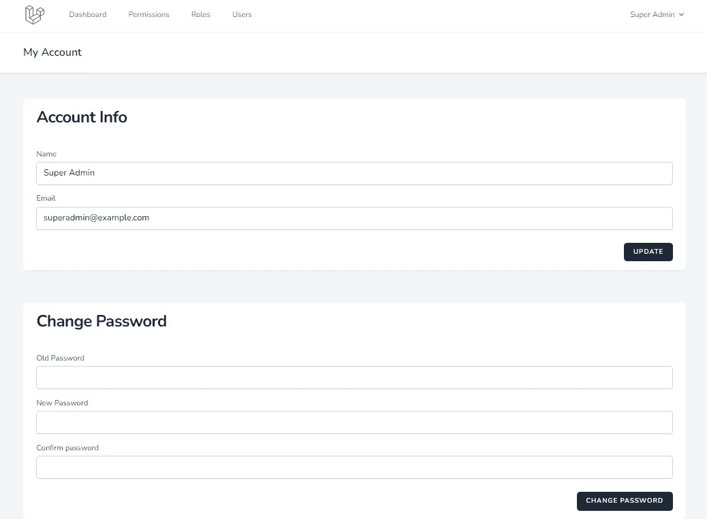
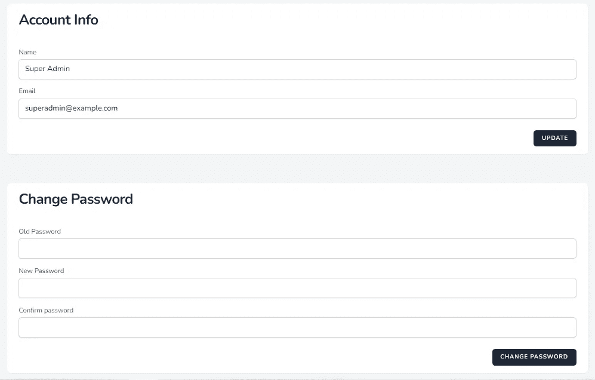
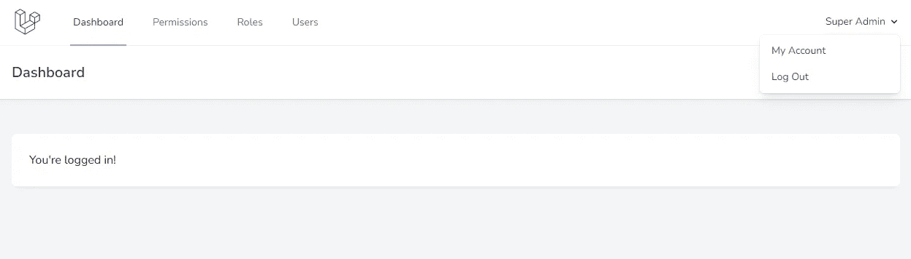

# Laravel 为管理员用户创建一个帐户更新页面

> 原文：<https://blog.devgenius.io/laravel-create-an-account-update-page-for-admin-users-e123cd88f24b?source=collection_archive---------5----------------------->

## Laravel 从头开始创建管理面板——第 9 部分



Laravel 管理面板帐户更新页面

我们创建了管理面板用户、角色和权限管理。在这一部分，我们将为管理面板用户创建一个帐户更新页面。

# 帐户更新页面

创建 Laravel 管理面板帐户更新页面包括以下步骤。

*   1.添加路线
*   2.在控制器上添加功能
*   3.创建视图
*   4.保存帐户信息
*   5.保存密码
*   6.向导航添加链接

## 1.添加路线

我们将为帐户更新创建一个新页面。将以下路线添加到我们的管理组

routes/admin.php

```
Route::get('edit-account-info', 'UserController@accountInfo')->name('admin.account.info');
Route::post('edit-account-info', 'UserController@accountInfoStore')->name('admin.account.info.store');
Route::post('change-password', 'UserController@changePasswordStore')->name('admin.account.password.store');
```

第一个路径是帐户更新表单的“编辑-帐户-信息”。另外两种保存账户信息和密码的途径。

## 2.在控制器上添加功能

在 UserController 上添加以下功能

app/Http/Controllers/Admin/user controller . PHP

```
public function accountInfo()
{
    $user = \Auth::user();
    return view('admin.user.account_info', compact('user'));
}
```

## 3.创建视图

在 resources/views/admin/user/文件夹中创建 account_info.blade.php 文件。在视图中，我们添加了两个表单。一个用于基本帐户信息更新(姓名和电子邮件)。还有一个就是更新账号密码。

资源/视图/管理/用户/帐户信息. blade.php

```
<x-app-layout>
    <x-slot name="header">
        <h2 class="font-semibold text-xl text-gray-800 leading-tight">
            {{ __('My Account') }}
        </h2>
    </x-slot>
<div class="py-12">
        <div class="max-w-7xl mx-auto sm:px-6 lg:px-8">
            <div class="bg-white overflow-hidden shadow-sm sm:rounded-lg">
                <div class="px-6">
                    <h1 class="inline-block text-2xl sm:text-3xl font-extrabold text-slate-900 tracking-tight dark:text-slate-200 py-4 block sm:inline-block flex">{{ __('Account Info') }}</h1>
                    @if ($errors->account->any())
                        <ul class="mt-3 list-none list-inside text-sm text-red-400">
                            @foreach ($errors->account->all() as $error)
                                <li>{{ $error }}</li>
                            @endforeach
                        </ul>
                    @endif
                    @if(session()->has('account_message'))
                        <div class="mb-8 text-green-400 font-bold">
                            {{ session()->get('account_message') }}
                        </div>
                    @endif
                </div>
                <div class="w-full px-6 py-4 bg-white overflow-hidden">
<form method="POST" action="{{ route('admin.account.info.store') }}">
                    @csrf
<div class="py-2">
                            <label for="name" class="block font-medium text-sm text-gray-700{{$errors->account->has('name') ? ' text-red-400' : ''}}">{{ __('Name') }}</label>
<input id="name" class="rounded-md shadow-sm border-gray-300 focus:border-indigo-300 focus:ring focus:ring-indigo-200 focus:ring-opacity-50 block mt-1 w-full{{$errors->account->has('name') ? ' border-red-400' : ''}}"
                                            type="text"
                                            name="name"
                                            value="{{ old('name', $user->name) }}"
                                            />
                        </div>
<div class="py-2">
                            <label for="email" class="block font-medium text-sm text-gray-700{{$errors->account->has('email') ? ' text-red-400' : ''}}">{{ __('Email') }}</label>
<input id="email" class="rounded-md shadow-sm border-gray-300 focus:border-indigo-300 focus:ring focus:ring-indigo-200 focus:ring-opacity-50 block mt-1 w-full{{$errors->account->has('email') ? ' border-red-400' : ''}}"
                                            type="email"
                                            name="email"
                                            value="{{ old('email', $user->email) }}"
                                            />
                        </div>
<div class="flex justify-end mt-4">
                            <button type="submit" class="inline-flex items-center px-4 py-2 bg-gray-800 border border-transparent rounded-md font-semibold text-xs text-white uppercase tracking-widest hover:bg-gray-700 active:bg-gray-900 focus:outline-none focus:border-gray-900 focus:ring ring-gray-300 disabled:opacity-25 transition ease-in-out duration-150">
                                {{ __('Update') }}
                            </button>
                        </div>
                    </form>
                </div>
            </div>
        </div>
    </div>
    <div class="py-3">
        <div class="max-w-7xl mx-auto sm:px-6 lg:px-8">
            <div class="bg-white overflow-hidden shadow-sm sm:rounded-lg">
                <div class="px-6">
                    <h1 class="inline-block text-2xl sm:text-3xl font-extrabold text-slate-900 tracking-tight dark:text-slate-200 py-4 block sm:inline-block flex">{{ __('Change Password') }}</h1>
                    @if ($errors->password->any())
                        <ul class="mt-3 list-none list-inside text-sm text-red-400">
                            @foreach ($errors->password->all() as $error)
                                <li>{{ $error }}</li>
                            @endforeach
                        </ul>
                    @endif
                    @if(session()->has('password_message'))
                        <div class="mb-8 text-green-400 font-bold">
                            {{ session()->get('password_message') }}
                        </div>
                    @endif
                </div>
                <div class="w-full px-6 py-4 bg-white overflow-hidden">
<form method="POST" action="{{ route('admin.account.password.store') }}">
                    @csrf
<div class="py-2">
                            <label for="old_password" class="block font-medium text-sm text-gray-700{{$errors->password->has('old_password') ? ' text-red-400' : ''}}">{{ __('Old Password') }}</label>
<input id="old_password" class="rounded-md shadow-sm border-gray-300 focus:border-indigo-300 focus:ring focus:ring-indigo-200 focus:ring-opacity-50 block mt-1 w-full{{$errors->password->has('old_password') ? ' border-red-400' : ''}}"
                                            type="password"
                                            name="old_password"
                                            />
                        </div>
<div class="py-2">
                            <label for="new_password" class="block font-medium text-sm text-gray-700{{$errors->password->has('new_password') ? ' text-red-400' : ''}}">{{ __('New Password') }}</label>
<input id="new_password" class="rounded-md shadow-sm border-gray-300 focus:border-indigo-300 focus:ring focus:ring-indigo-200 focus:ring-opacity-50 block mt-1 w-full{{$errors->password->has('new_password') ? ' border-red-400' : ''}}"
                                            type="password"
                                            name="new_password"
                                            />
                        </div>
<div class="py-2">
                            <label for="confirm_password" class="block font-medium text-sm text-gray-700{{$errors->password->has('confirm_password') ? ' text-red-400' : ''}}">{{ __('Confirm password') }}</label>
<input id="confirm_password" class="rounded-md shadow-sm border-gray-300 focus:border-indigo-300 focus:ring focus:ring-indigo-200 focus:ring-opacity-50 block mt-1 w-full{{$errors->password->has('confirm_password') ? ' border-red-400' : ''}}"
                                            type="password"
                                            name="confirm_password"
                                            />
                        </div>
<div class="flex justify-end mt-4">
                            <button type='submit' class='inline-flex items-center px-4 py-2 bg-gray-800 border border-transparent rounded-md font-semibold text-xs text-white uppercase tracking-widest hover:bg-gray-700 active:bg-gray-900 focus:outline-none focus:border-gray-900 focus:ring ring-gray-300 disabled:opacity-25 transition ease-in-out duration-150'>
                                {{ __('Change Password') }}
                            </button>
                        </div>
                    </form>
                </div>
            </div>
        </div>
    </div>
</x-app-layout>
```



帐户更新表单

## 4.保存帐户信息

创建`accountInfoStore`函数来存储用户帐户的详细信息。

app/Http/Controllers/Admin/user controller . PHP

```
public function accountInfoStore(Request $request)
{
    $request->validateWithBag('account', [
        'name' => ['required', 'string', 'max:255'],
        'email' => ['required', 'string', 'email', 'max:255', 'unique:users,email,'.\Auth::user()->id],
    ]);
    $user = \Auth::user()->update($request->except(['_token']));
    if ($user) {
        $message = "Account updated successfully.";
    } else {
        $message = "Error while saving. Please try again.";
    }
    return redirect()->route('admin.account.info')->with('account_message', $message);
}
```

我们使用`validateWithBag`来分离视图中的错误消息。Laravel 被称为[，被命名为错误包](https://laravel.com/docs/9.x/validation#named-error-bags)。因为我们在同一页上使用了两种形式。

## 5.保存密码

`changePasswordStore` a 功能用于保存用户修改后的密码。新增`$validator->after`验证，验证规则后验证当前密码。

app/Http/Controllers/Admin/user controller . PHP

```
public function changePasswordStore(Request $request)
{
    $validator = \Validator::make($request->all(), [
        'old_password' => ['required'],
        'new_password' => ['required', Rules\Password::defaults()],
        'confirm_password' => ['required', 'same:new_password', Rules\Password::defaults()],
    ]);
    $validator->after(function ($validator) use ($request) {
        if ($validator->failed()) return;
        if (! Hash::check($request->input('old_password'), \Auth::user()->password)) {
            $validator->errors()->add(
                'old_password', 'Old password is incorrect.'
            );
        }
    });
    $validator->validateWithBag('password');
    $user = \Auth::user()->update([
        'password' => Hash::make($request->input('new_password')),
    ]);
    if ($user) {
        $message = "Password updated successfully.";
    } else {
        $message = "Error while saving. Please try again.";
    }
    return redirect()->route('admin.account.info')->with('password_message', $message);
}
```

## 6.向导航添加链接

最后一步在`navigation.blade.php`上添加我的账户链接

资源/视图/布局/导航. blade.php

```
<x-slot name="content">
                         <!-- Authentication -->
+                        <x-dropdown-link :href="route('admin.account.info')" :active="request()->routeIs('admin.account.info')">
+                                {{ __('My Account') }}
+                        </x-dropdown-link>
                         <form method="POST" action="{{ route('logout') }}">
                             @csrf
@@ -94,6 +97,9 @@
             </div>
<div class="mt-3 space-y-1">
+                <x-responsive-nav-link :href="route('admin.account.info')" :active="request()->routeIs('admin.account.info')">
+                        {{ __('My Account') }}
+                </x-responsive-nav-link>
                 <!-- Authentication -->
                 <form method="POST" action="{{ route('logout') }}">
                     @csrf
```



我们已经成功地为我们的管理面板创建了一个帐户更新页面。

Laravel 管理面板可在[https://github.com/balajidharma/basic-laravel-admin-panel](https://github.com/balajidharma/basic-laravel-admin-panel)获得。安装管理面板并分享您的反馈。

感谢您的阅读！

上一部分—第 8 部分:[为用户管理创建 UI](/basic-laravel-admin-panel-user-management-crud-45f694ef60cc)

下一部分—第 10 部分:[使用表单请求验证重构 Laravel 控制器](/restructuring-a-laravel-controller-using-form-request-validation-e546fe22c298)