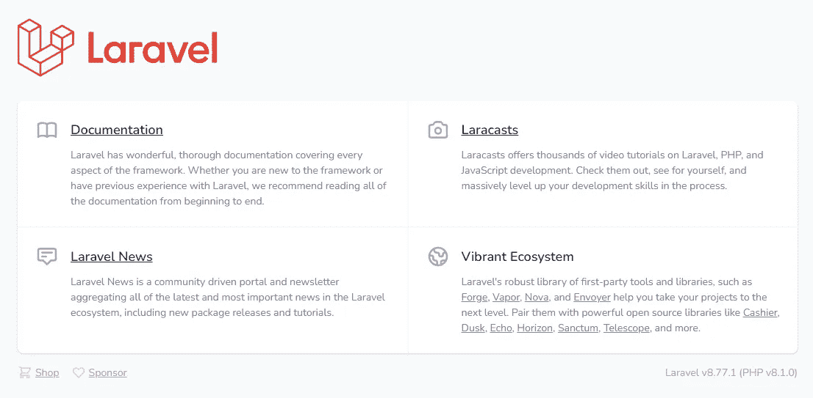
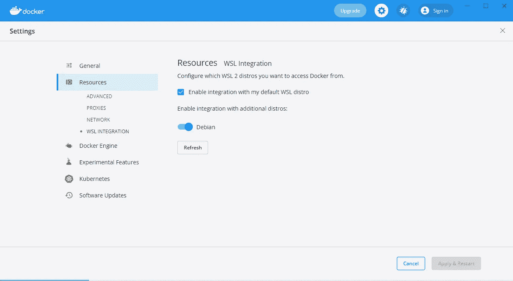
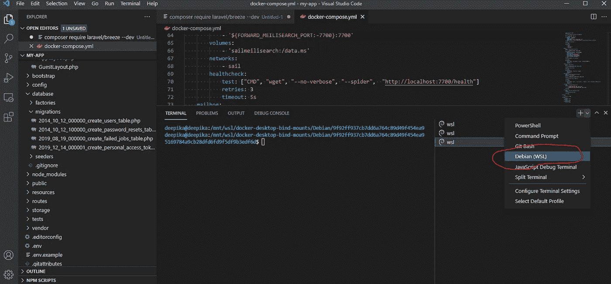
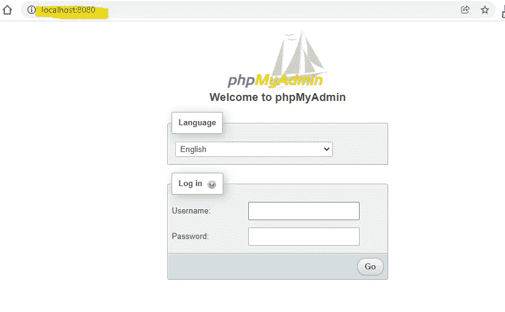
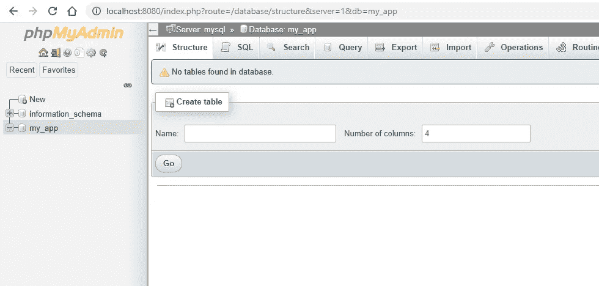

# Laravel 从头开始创建管理面板—第 1 部分—安装

> 原文：<https://blog.devgenius.io/laravel-create-an-admin-panel-from-scratch-part-1-installation-8c11dae7e684?source=collection_archive---------4----------------------->

## Laravel 在 Docker 中的安装步骤或通过 WAMP 或 XAMPP 的 Composer 安装 Laravel


由[丹尼尔·索](https://unsplash.com/@danist07?utm_source=medium&utm_medium=referral)在 [Unsplash](https://unsplash.com?utm_source=medium&utm_medium=referral) 上拍摄的照片

Laravel 是一个 web 应用框架，一个开源的 PHP web 框架。Laravel 遵循模型-视图-控制器(MVC)架构设计模式。

现代的 Laravel 框架被用来为分离的架构构建 API 服务。

在这个博客系列中，我们将使用基本功能来构建我们的 Laravel 管理面板。

# **安装**

所有安装细节可在官方 [Lavarvel 文档](https://laravel.com/docs/installation)中找到。我们可以在您现有的网络服务器(WAMP 或 XAMPP)或 Docker 上安装 Laravel。

*   1.通过 Composer 安装
*   2.将 Laravel 安装在 Docker 上

## 1.通过 Composer 安装

如果您的计算机上已经安装了 [WAMP](https://www.wampserver.com/en/) 或 [XAMPP](https://www.apachefriends.org/index.html) 和 [Composer](https://getcomposer.org/) ，请使用 Composer 安装您的 Laravel。

```
composer create-project laravel/laravel my-app

cd my-app
```

创建应用程序后，您可以使用 Artisan CLI 的`serve`命令启动 Laravel 的本地开发服务器:

```
php artisan serve
```



**MySQL 数据库**

现在我们的应用程序已经准备好了。在 PhpMyAdmin 中创建一个新的数据库，并将 DB 细节添加到根目录`.env`文件中。

```
DB_CONNECTION=mysql
DB_HOST=mysql
DB_PORT=3306
DB_DATABASE=my_app
DB_USERNAME=root
DB_PASSWORD=password
```

## 2.将 Laravel 安装在 Docker 上

安装 [Docker 桌面](https://www.docker.com/products/docker-desktop)，如果你使用 Mac 或 Windows 电脑。对于 Windows，您应该确保安装并启用了 Linux 2 的 Windows 子系统(WSL2)。WSL 允许您在 Windows 10 上本地运行 Linux 二进制可执行文件。关于如何安装和启用 WSL2 的信息可以在微软的[开发者环境文档](https://docs.microsoft.com/en-us/windows/wsl/install-win10)中找到。

在我的 windows 中，我安装了 [Debian WSL](https://www.microsoft.com/en-us/p/debian/9msvkqc78pk6) 。之后，我在资源设置下的 WSL 集成中启用了 Debian WSL。



**什么是帆？**

[Sail](https://laravel.com/docs/8.x/sail) 是一个内置的解决方案，用于使用 [Docker](https://www.docker.com/) 运行您的 Laravel 项目。

> Laravel Sail 是一个轻量级命令行界面，用于与 Laravel 的默认 Docker 配置进行交互。Sail 为使用 PHP、MySQL 和 Redis 构建 Laravel 应用程序提供了一个很好的起点，不需要任何 Docker 经验。

启动 [Windows 终端](https://www.microsoft.com/en-us/p/windows-terminal/9n0dx20hk701?rtc=1&activetab=pivot:overviewtab)并为您的 WSL2 Linux 操作系统开始一个新的终端会话。否则，如果你使用 VS 代码，打开新的 Debian WSL。参考下面的截图。



```
curl -s https://laravel.build/my-app | bash
```

是的，您可以将此 URL 中的“我的应用程序”更改为您喜欢的任何内容。Laravel 应用程序的目录将在您执行命令的目录中创建。

```
cd my-app

./vendor/bin/sail up
```

第一次执行命令可能需要几分钟。因为它在您的机器上构建 Sail 的应用程序容器。不用担心，后续尝试起航会快很多。

一旦应用程序的 Docker 容器启动，您就可以在您的 web 浏览器中访问该应用程序，网址为 [http://localhost](http://localhost/) 。

Laravel Sail 没有附带 PhpMyAdmin。所以我们要将 PhpMyAdmin 添加到 Docker 容器中。

## Laravel Sail 添加 PhpMyAdmin

如果你的帆船已经在运行，使用`./vendor/bin/sail down`命令停止你的帆船容器。

打开你的项目根目录`docker-compose.yml`文件，在`laravel.test:`中的`services`上添加下面几行

```
phpmyadmin:
        image: phpmyadmin/phpmyadmin
        links:
            - mysql:mysql
        ports:
            - 8080:80
        environment:
            MYSQL_USERNAME: "${DB_USERNAME}"
            MYSQL_ROOT_PASSWORD: "${DB_PASSWORD}"
            PMA_HOST: mysql
        networks:
            - sail
```

使用`./vendor/bin/sail up`再次启动服务，并打开网络浏览器 [http://localhost:8080](http://localhost:8080)

使用下面的默认安装登录信息，并开始使用 PhpMyAdmin

```
Username: sail
Password: password
```



PhpMyAdmin 登录



我们已经成功地在计算机上安装了 Laravel 应用程序。我的首选安装方法是 Laravel 帆。使用 Docker 让开发更容易，不用担心 PHP 版本。

下一部分，我们将添加用户认证到我们的管理面板。

感谢您的阅读！

下一部分—第 2 部分:[向 Laravel 应用程序添加用户认证的步骤](/laravel-create-an-admin-panel-from-scratch-part-2-authentication-f0eb0bbd6139)