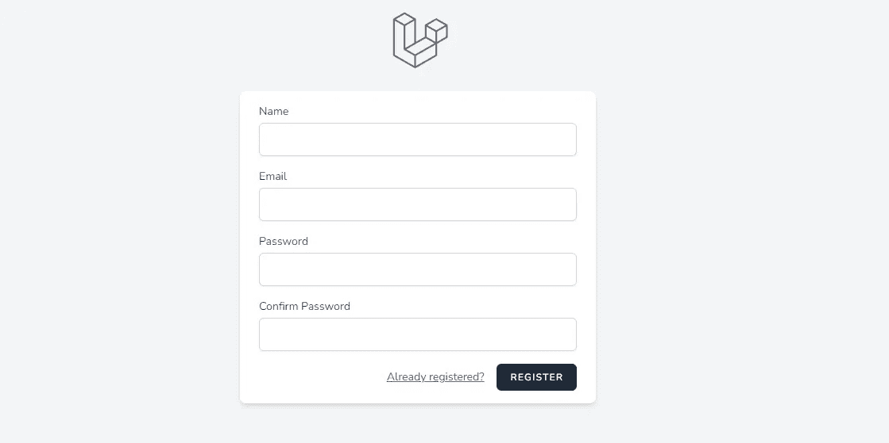
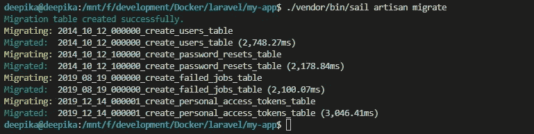
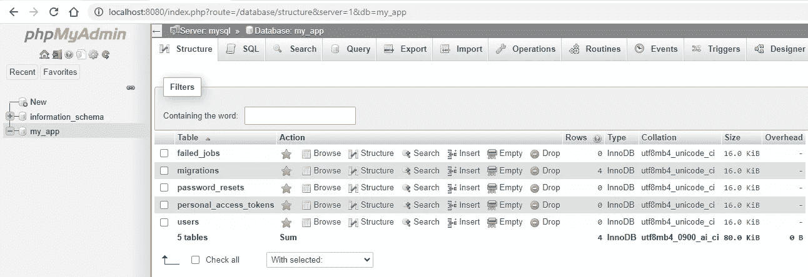
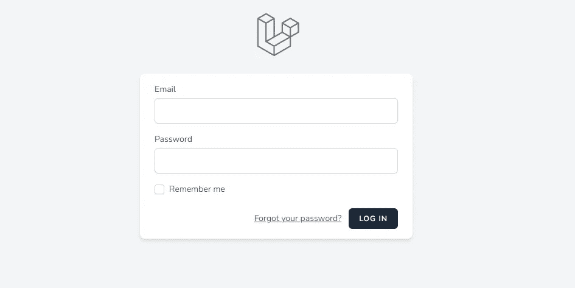
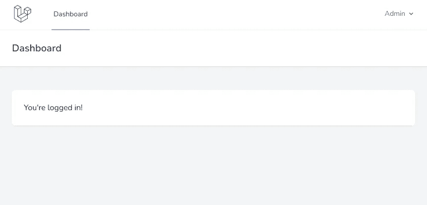

# Laravel 从头开始创建管理面板-第 2 部分-认证

> 原文：<https://blog.devgenius.io/laravel-create-an-admin-panel-from-scratch-part-2-authentication-f0eb0bbd6139?source=collection_archive---------4----------------------->

## 向 Laravel 应用程序添加用户认证的步骤



Laravel Breeze 入门套件

在这一部分，我们将添加用户认证到我们的管理面板。[第 1 部分](https://balajidharma.medium.com/laravel-create-an-admin-panel-from-scratch-part-1-installation-8c11dae7e684)我们完成了 Laravel 安装和 DB 设置。

[](https://balajidharma.medium.com/laravel-create-an-admin-panel-from-scratch-part-1-installation-8c11dae7e684) [## Laravel 从头开始创建管理面板—第 1 部分—安装

### 在 Docker 中安装 Laravel 或者通过 PHP Composer 安装 Laravel

balajidharma.medium.com](https://balajidharma.medium.com/laravel-create-an-admin-panel-from-scratch-part-1-installation-8c11dae7e684) 

我已经使用 [Sail](https://laravel.com/docs/8.x/sail) 在 Docker 上安装了我的 Laravel 应用程序。认证在 Laravel 的官方[认证](https://laravel.com/docs/authentication)文档中有详细解释。

> Laravel 的认证设施由“守卫”和“[提供者](https://laravel.com/docs/providers)”组成。安全措施定义了如何针对每个请求对用户进行身份验证。守卫定义了如何对每个请求进行用户身份验证

外部 Laravel 应用程序的认证配置文件位于`config/auth.php`。在 [GitHub](https://github.com/laravel/laravel/blob/master/config/auth.php) 上查看完整文件

## Laravel Breeze 入门套件

[Laravel Breeze](https://laravel.com/docs/starter-kits#laravel-breeze) 是 Laravel 认证功能的入门套件。这个初学者工具包将负责搭建您的整个身份验证系统。

以下步骤涉及到为我们的 Laravel 管理面板设置认证。

*   1.安装 Laravel Breeze
*   2.编译资产
*   3.运行迁移

## 1.安装 Laravel Breeze

我们需要使用 Composer 安装 Laravel Breeze。

```
./vendor/bin/sail composer require laravel/breeze --dev
```

我们将为`vendor/bin/sail` Sail 命令创建一个别名:

```
alias sail='[ -f sail ] && bash sail || bash vendor/bin/sail'
```

配置好 Bash 别名后，只需输入`sail`就可以执行 Sail 命令。本博客示例的其余部分将假设您已经配置了该别名:

```
sail composer require laravel/breeze --dev
```

Laravel Breeze 包安装完成后，我们需要运行`breeze:install` Artisan 命令。这个命令将向我们的应用程序发布身份验证视图、路由、控制器和其他资源。

```
sail artisan breeze:install
```

## 2.编译资产

安装 Breeze 后，执行 npm 来编译资产。

```
sail npm install 

sail npm run dev
```

## 3.运行迁移

使用`artisan migrate`运行您的数据库迁移

```
sail artisan migrate
```



迁移后，在数据库上创建了用户和其他表。



现在，您可以在 web 浏览器中导航到应用程序的`/login`或`/register`URL。



成功注册或登录后，用户将被重定向到仪表板。



## Laravel Breeze 漫游

我们已成功将身份验证添加到您的应用程序中。现在浏览 Laravel Breeze 文件结构，了解 Laravel 的认证功能是如何实现的。

## 控制器

所有的控制器都位于认证文件夹`app/Http/Controllers/Auth`中

```
AuthenticatedSessionController.php
ConfirmablePasswordController.php
EmailVerificationNotificationController.php
EmailVerificationPromptController.php
NewPasswordController.php
PasswordResetLinkController.php
RegisteredUserController.php
VerifyEmailController.php
```

## 路线

`/login`、`/register`和所有授权[路由](https://laravel.com/docs/routing)在`routes/auth.php`中定义。仪表板路线在`routes/web.php`可用

[中间件](https://laravel.com/docs/middleware) `->middleware(‘auth’)`提供了一种方便的机制来检查和过滤进入应用程序的 HTTP 请求。

```
Route::get('/register', [RegisteredUserController::class, 'create'])
                ->middleware('guest')
                ->name('register');Route::post('/register', [RegisteredUserController::class, 'store'])
                ->middleware('guest');Route::get('/login', [AuthenticatedSessionController::class, 'create'])
                ->middleware('guest')
                ->name('login');Route::post('/login', [AuthenticatedSessionController::class, 'store'])
                ->middleware('guest');
```

## 视图

授权视图包含在`resources/views/auth/`文件夹中。仪表板视图是`resources/views/dashboard.blade.php`

## 登录请求

登录请求表在`app/Http/Requests/Auth/LoginRequest.php`文件的`LoginRequest.php`中处理。

## **GitHub** 仓库

我为我们的“基本 Laravel 管理面板”创建了一个 GitHub 存储库。[https://github.com/balajidharma/basic-laravel-admin-panel](https://github.com/balajidharma/basic-laravel-admin-panel)

安装和认证代码可在 [1.0.1](https://github.com/balajidharma/basic-laravel-admin-panel/tree/archive/1.0.1) 分公司获得

感谢您的阅读！

上一部分—第 1 部分:[在 Docker 中安装 Laravel 的步骤或在 WAMP 或 XAMPP 通过 Composer 安装 Laravel](/laravel-create-an-admin-panel-from-scratch-part-1-installation-8c11dae7e684)

下一部分—第 3 部分:[用户角色和权限](/laravel-user-roles-and-permissions-6dbfd4abfcf8)