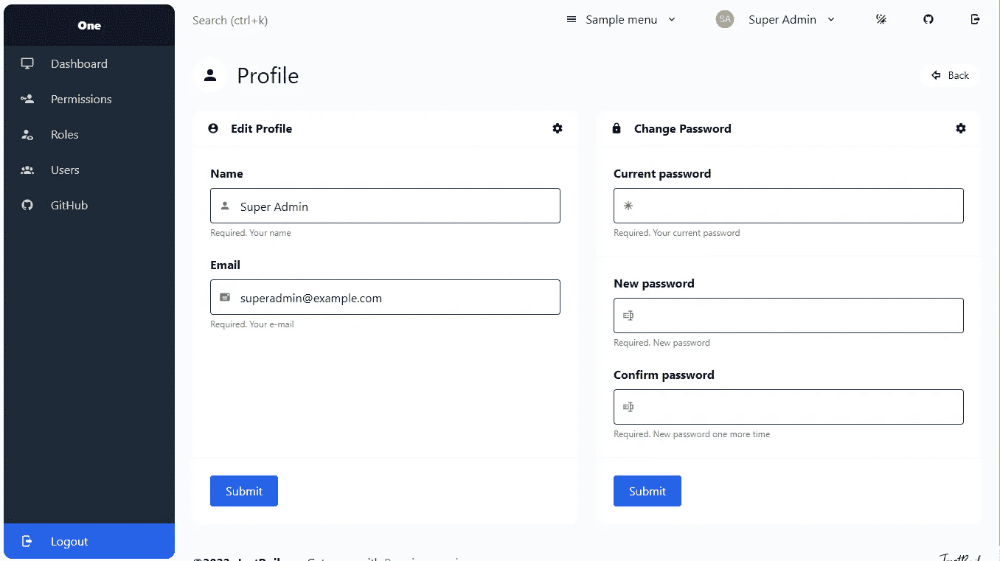
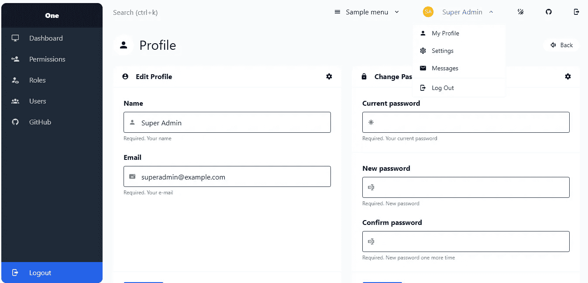

# Laravel 用惯性和 Vue 创建了一个配置文件更新页面

> 原文：<https://blog.devgenius.io/laravel-creates-a-profile-update-page-with-inertia-and-vue-6c6f0d7a01ef?source=collection_archive---------0----------------------->

## Laravel 从头开始创建 Vue 管理面板——第 8 部分



在这一部分，我们将为管理仪表板用户创建我的个人资料页面。此个人资料更新页面将有个人资料和密码更新表格。

## 管理员配置文件更新页面

创建帐户配置文件更新页面涉及以下步骤。

*   1.添加路线
*   2.在控制器上添加功能
*   3.创建 AccountInfo 组件
*   4.保存帐户信息
*   5.保存密码
*   6.向导航添加链接

## 1.添加路线

我们将为帐户更新创建一个新页面。将以下路线添加到我们的管理组

routes/admin.php

```
Route::get('edit-account-info', 'UserController@accountInfo')->name('admin.account.info');
Route::post('edit-account-info', 'UserController@accountInfoStore')->name('admin.account.info.store');
Route::post('change-password', 'UserController@changePasswordStore')->name('admin.account.password.store');
```

第一个路径是帐户更新表单的“编辑-帐户-信息”。另外两种保存账户信息和密码的途径。

## 2.在控制器上添加功能

在用户控制器上添加以下功能

app/Http/Controllers/Admin/user controller . PHP

```
/**
 * Show the user a form to change their personal information & password.
 */
public function accountInfo()
{
    $user = \Auth::user(); return Inertia::render('Admin/User/AccountInfo', [
        'user' => $user,
    ]);
}
```

## 3.创建 AccountInfo 组件

在 resources/js/Pages/Admin/User 文件夹中创建一个 AccountInfo 组件。在视图中，我们添加了两个表单。一个用于基本帐户信息更新(姓名和电子邮件)。还有一个就是更新账号密码。

resources/js/Pages/Admin/User/account info . vue

```
<script setup>
import { Head, Link, useForm } from "@inertiajs/inertia-vue3";
import {
  mdiAccount,
  mdiAccountCircle,
  mdiLock,
  mdiMail,
  mdiAsterisk,
  mdiFormTextboxPassword,
  mdiArrowLeftBoldOutline,
  mdiAlertBoxOutline,
} from "@mdi/js";
import SectionMain from "@/Components/SectionMain.vue";
import CardBox from "@/Components/CardBox.vue";
import BaseDivider from "@/Components/BaseDivider.vue";
import FormField from "@/Components/FormField.vue";
import FormControl from "@/Components/FormControl.vue";
import BaseButton from "@/Components/BaseButton.vue";
import BaseButtons from "@/Components/BaseButtons.vue";
import NotificationBar from "@/Components/NotificationBar.vue";
import LayoutAuthenticated from "@/Layouts/LayoutAuthenticated.vue";
import SectionTitleLineWithButton from "@/Components/SectionTitleLineWithButton.vue";const props = defineProps({
  user: {
    type: Object,
    default: () => ({}),
  },
});const profileForm = useForm({
  name: props.user.name,
  email: props.user.email,
});
const passwordForm = useForm({
  old_password: null,
  new_password: null,
  confirm_password: null,
});
</script><template>
  <LayoutAuthenticated>
    <SectionMain>
      <SectionTitleLineWithButton :icon="mdiAccount" title="Profile" main>
        <BaseButton
          :route-name="route('dashboard')"
          :icon="mdiArrowLeftBoldOutline"
          label="Back"
          color="white"
          rounded-full
          small
        />
      </SectionTitleLineWithButton>
      <NotificationBar
        v-if="$page.props.flash.message"
        color="success"
        :icon="mdiAlertBoxOutline"
      >
        {{ $page.props.flash.message }}
      </NotificationBar>
      <div class="grid grid-cols-1 lg:grid-cols-2 gap-6">
        <CardBox
          title="Edit Profile"
          :icon="mdiAccountCircle"
          form
          @submit.prevent="profileForm.post(route('admin.account.info.store'))"
        >
          <FormField
            label="Name"
            help="Required. Your name"
            :class="{ 'text-red-400': profileForm.errors.name }"
          >
            <FormControl
              v-model="profileForm.name"
              :icon="mdiAccount"
              name="name"
              required
              :error="profileForm.errors.name"
            >
              <div class="text-red-400 text-sm" v-if="profileForm.errors.name">
                {{ profileForm.errors.name }}
              </div>
            </FormControl>
          </FormField>
          <FormField
            label="Email"
            help="Required. Your e-mail"
            :class="{ 'text-red-400': profileForm.errors.email }"
          >
            <FormControl
              v-model="profileForm.email"
              :icon="mdiMail"
              type="email"
              name="email"
              required
              :error="profileForm.errors.email"
            >
              <div class="text-red-400 text-sm" v-if="profileForm.errors.email">
                {{ profileForm.errors.email }}
              </div>
            </FormControl>
          </FormField> <template #footer>
            <BaseButtons>
              <BaseButton color="info" type="submit" label="Submit" />
            </BaseButtons>
          </template>
        </CardBox> <CardBox
          title="Change Password"
          :icon="mdiLock"
          form
          @submit.prevent="
            passwordForm.post(route('admin.account.password.store'), {
              preserveScroll: true,
              onSuccess: () => passwordForm.reset(),
            })
          "
        >
          <FormField
            label="Current password"
            help="Required. Your current password"
            :class="{ 'text-red-400': passwordForm.errors.old_password }"
          >
            <FormControl
              v-model="passwordForm.old_password"
              :icon="mdiAsterisk"
              name="old_password"
              type="password"
              required
              :error="passwordForm.errors.old_password"
            >
              <div
                class="text-red-400 text-sm"
                v-if="passwordForm.errors.old_password"
              >
                {{ passwordForm.errors.old_password }}
              </div>
            </FormControl>
          </FormField> <BaseDivider /> <FormField
            label="New password"
            help="Required. New password"
            :class="{ 'text-red-400': passwordForm.errors.new_password }"
          >
            <FormControl
              v-model="passwordForm.new_password"
              :icon="mdiFormTextboxPassword"
              name="new_password"
              type="password"
              required
              :error="passwordForm.errors.new_password"
            >
              <div
                class="text-red-400 text-sm"
                v-if="passwordForm.errors.new_password"
              >
                {{ passwordForm.errors.new_password }}
              </div>
            </FormControl>
          </FormField> <FormField
            label="Confirm password"
            help="Required. New password one more time"
            :class="{ 'text-red-400': passwordForm.errors.confirm_password }"
          >
            <FormControl
              v-model="passwordForm.confirm_password"
              :icon="mdiFormTextboxPassword"
              name="confirm_password"
              type="password"
              required
              :error="passwordForm.errors.confirm_password"
            >
              <div
                class="text-red-400 text-sm"
                v-if="passwordForm.errors.confirm_password"
              >
                {{ passwordForm.errors.confirm_password }}
              </div>
            </FormControl>
          </FormField> <template #footer>
            <BaseButtons>
              <BaseButton type="submit" color="info" label="Submit" />
            </BaseButtons>
          </template>
        </CardBox>
      </div>
    </SectionMain>
  </LayoutAuthenticated>
</template>
```


## 4.保存帐户信息

创建`accountInfoStore`函数来存储用户帐户的详细信息。

app/Http/Controllers/Admin/user controller . PHP

```
/**
 * Save the modified personal information for a user.
 */
public function accountInfoStore(Request $request)
{
    $request->validate([
        'name' => ['required', 'string', 'max:255'],
        'email' => ['required', 'string', 'email', 'max:255', 'unique:users,email,'.\Auth::user()->id],
    ]); $user = \Auth::user()->update($request->except(['_token'])); if ($user) {
        $message = 'Account updated successfully.';
    } else {
        $message = 'Error while saving. Please try again.';
    } return redirect()->route('admin.account.info')->with('message', __($message));
}
```

## 5.保存密码

`changePasswordStore` a 功能用于保存用户更改的密码。增加了`$validator->after`验证来验证当前密码后的验证规则。

app/Http/Controllers/Admin/user controller . PHP

```
/**
 * Save the new password for a user.
 */
public function changePasswordStore(Request $request)
{
    $validator = \Validator::make($request->all(), [
        'old_password' => ['required'],
        'new_password' => ['required', Rules\Password::defaults()],
        'confirm_password' => ['required', 'same:new_password',   Rules\Password::defaults()],
    ]); $validator->after(function ($validator) use ($request) {
        if ($validator->failed()) {
            return;
        }
        if (! Hash::check($request->input('old_password'), \Auth::user()->password)) {
            $validator->errors()->add(
                'old_password', __('Old password is incorrect.')
            );
        }
    }); $validator->validate(); $user = \Auth::user()->update([
        'password' => Hash::make($request->input('new_password')),
    ]); if ($user) {
        $message = 'Password updated successfully.';
    } else {
        $message = 'Error while saving. Please try again.';
    }return redirect()->route('admin.account.info')->with('message', __($message));
}
```

## 6.向导航添加链接

更新 NavBar 组件上的帐户更新链接

resources/js/Components/navbar . vue

```
+++ b/resources/js/Components/NavBar.vue
@@ -138,7 +138,7 @@ const logout = () => {
             </NavBarItemLabel><template #dropdown>
-              <NavBarItem to="/profile">
+              <NavBarItem route-name="admin.account.info">
                 <NavBarItemLabel
                   :icon="mdiAccount"
                   label="My Profile"
```



我们已经成功地为我们的管理面板创建了一个帐户更新页面。

## GitHub 知识库

Laravel Vue 管理面板在 https://github.com/balajidharma/laravel-vue-admin-panel 的[上可用。安装管理面板并分享您的反馈。](https://github.com/balajidharma/laravel-vue-admin-panel)

感谢您的阅读。

敬请关注更多内容！

*跟我来*[***balajidharma.medium.com***](https://balajidharma.medium.com/)。

上一部分—第 7 部分: [Laravel 将 Admin One 仪表板模板应用于 CRUD](/laravel-applies-admin-one-dashboard-template-to-crud-e187a6cce50)

下一部分—第 9 部分:即将推出