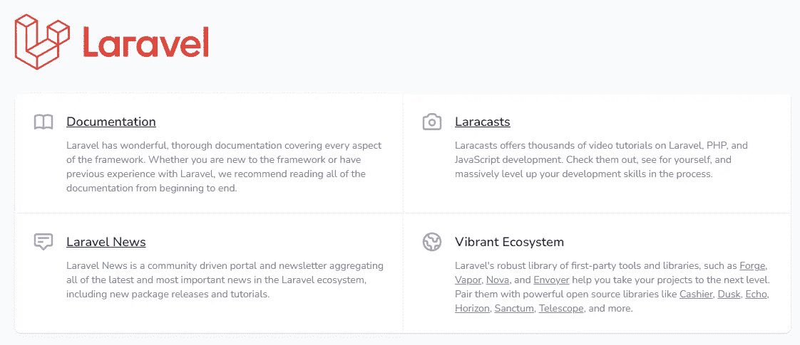
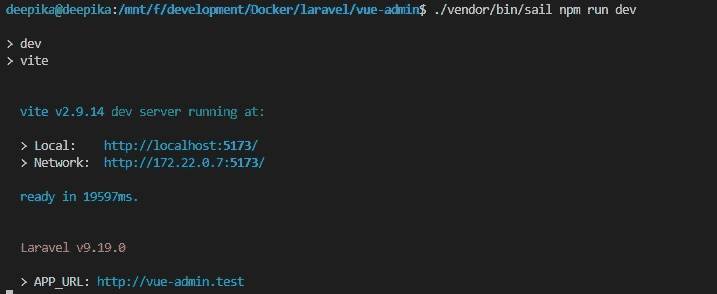
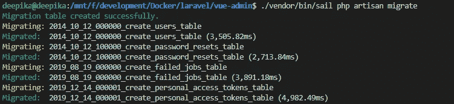
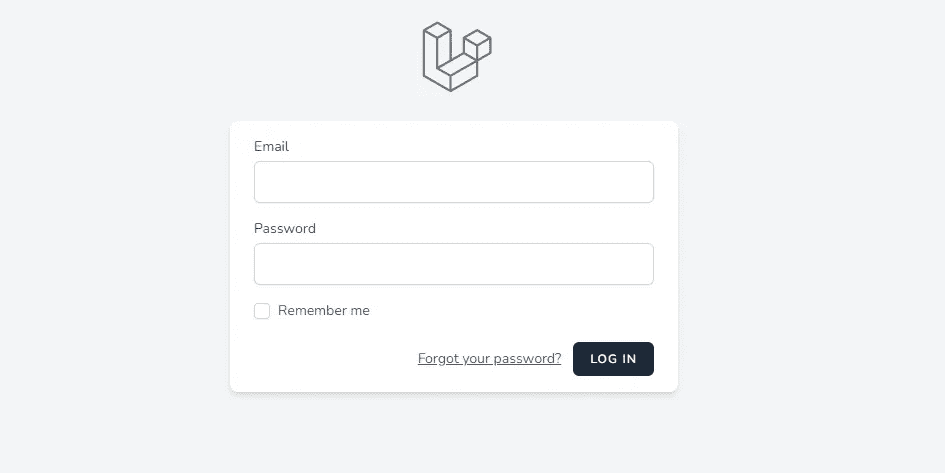
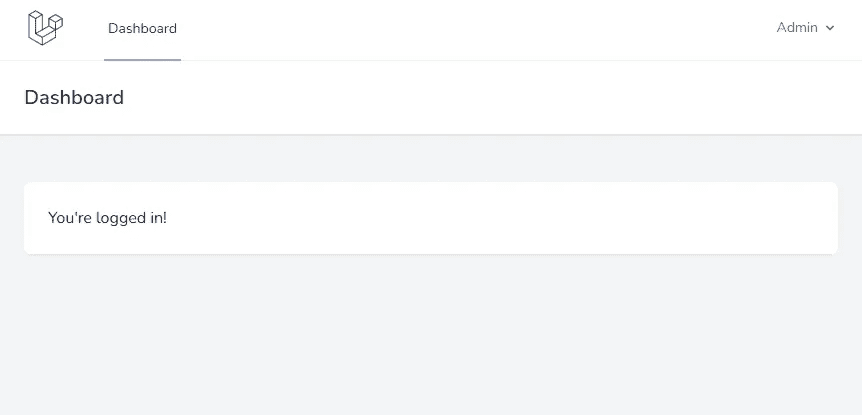
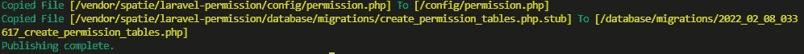

# Laravel 从头开始创建 Vue 管理面板——第 1 部分——安装和认证

> 原文：<https://blog.devgenius.io/laravel-creates-a-vue-admin-panel-from-scratch-part-1-installation-and-authentication-56c451d4d697?source=collection_archive---------1----------------------->

## 添加 Laravel Breeze 和 Spatie Laravel-permission 软件包的安装和步骤

我已经使用刀片模板创建了一个基本的拉勒维尔管理面板。该管理员提供基本的身份验证、用户、角色和权限管理。你也可以[点击这里](/laravel-create-an-admin-panel-from-scratch-part-1-installation-8c11dae7e684)，启动 Balde 基于模板的管理面板。

# Laravel Vue 管理面板

我们将使用 Vue 构建单页管理面板，并使用 [Tailwind CSS](https://tailwindcss.com/) 进行样式化。在第 1 部分中，我们将进行安装和身份验证。

1.  装置
2.  证明
3.  用户角色和权限

# 1.装置

你可以通过 Docker 博客上的 [Install Laravel 来完成安装。](/laravel-create-an-admin-panel-from-scratch-part-1-installation-8c11dae7e684) [Sail](https://laravel.com/docs/8.x/sail) 是一个内置的解决方案，用于使用 [Docker](https://www.docker.com/) 运行您的 Laravel 项目。

我假设您在安装过程中完成了下面的命令。

```
curl -s https://laravel.build/vue-admin | bashcd my-app

./vendor/bin/sail up
```

一旦应用程序的 Docker 容器启动，您就可以在您的 web 浏览器中访问该应用程序，网址为 [http://localhost](http://localhost/) 。



# 2.证明

我们将使用 [Laravel Breeze](https://laravel.com/docs/starter-kits#laravel-breeze) 初学者工具包进行身份验证。该入门套件包括登录、注册、密码重置、电子邮件验证和密码确认。

> Laravel Breeze 还通过一个[惯性](https://inertiajs.com/)前端实现提供 React 和 Vue 脚手架

我们将为我们的管理面板设置 Vue 脚手架。以下步骤涉及到为我们的 Laravel Vue 管理面板设置认证。

*   1.安装 Laravel Breeze
*   2.编译资产
*   3.运行迁移

## 1.安装 Laravel Breeze

我们需要使用 Composer 安装 Laravel Breeze。

```
./vendor/bin/sail composer require laravel/breeze --dev
```

Laravel Breeze 包安装完成后，我们需要运行`breeze:install` Artisan 命令。这个命令将向我们的应用程序发布身份验证视图、路由、控制器和其他资源。

```
./vendor/bin/sail artisan breeze:install vue
```

## 2.编译资产

安装 Breeze 后，执行 npm 来编译资产。 [Vite](https://vitejs.dev/) 现在是默认的前端资产捆绑器。

```
./vendor/bin/sail npm install./vendor/bin/sail npm run dev
```



## 3.运行迁移

使用`artisan migrate`运行数据库迁移

```
./vendor/bin/sail artisan migrate
```



现在，您可以在网络浏览器中导航到应用程序的`/login`或`/register`URL。



成功注册或登录后，用户将被重定向到仪表板。



# 3.用户角色和权限

Spatie[Laravel-permission](https://github.com/spatie/laravel-permission)是管理数据库中用户权限和角色的最佳包。在这一部分，我们为我们的管理面板安装和使用这个包。

以下步骤涉及到为我们的 Laravel 管理面板设置角色和权限。

*   1.安装 Spatie Laravel-权限包
*   2.发布配置和迁移文件
*   3.运行迁移

## 1.安装 Spatie Laravel-权限包

使用 composer 命令安装软件包

```
./vendor/bin/sail composer require spatie/laravel-permission
```

## 2.发布配置和迁移文件

`vendor:publish` artisan 命令用于将包配置发布到 config 文件夹。此外，将迁移文件复制到迁移文件夹。

```
./vendor/bin/sail artisan vendor:publish --provider="Spatie\Permission\PermissionServiceProvider"
```



`Laravel artisan vendor:publish`

## 3.运行迁移

使用`artisan migrate`运行迁移

```
./vendor/bin/sail artisan migrate
```

现在我们成功地将 Spatie Laravel-permission 包安装到我们的管理面板中。软件包没有附带 UI。

所以在接下来的部分，我们将在拉勒维尔创建我们的第一个 Vue CRUD。

## GitHub 知识库

我为我们的“Laravel Vue 管理面板”创建了一个 GitHub 存储库。[https://github.com/balajidharma/laravel-vue-admin-panel](https://github.com/balajidharma/laravel-vue-admin-panel)

感谢您的阅读。

敬请关注更多内容！

*跟我来*[***balajidharma.medium.com***](https://balajidharma.medium.com/)。

下一部分——第二部分:[使用惯性和 Vue 3 创建 Laravel CRUD 带有搜索和分页的列表页面](/create-laravel-crud-using-inertia-and-vue-3-list-page-with-search-and-pagination-c4a52b6501c3)