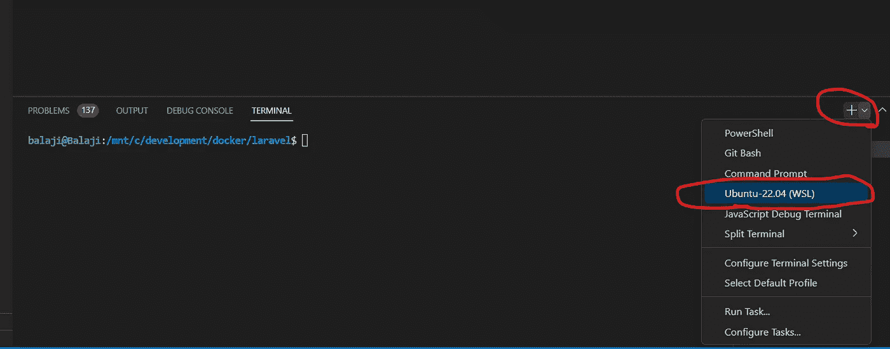
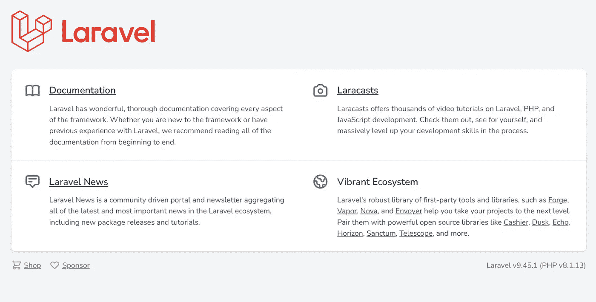
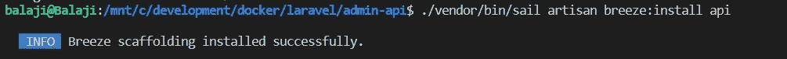
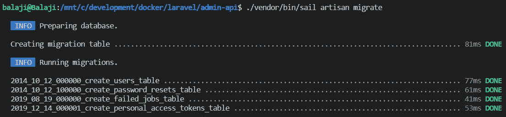
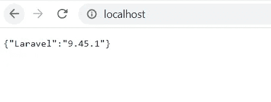
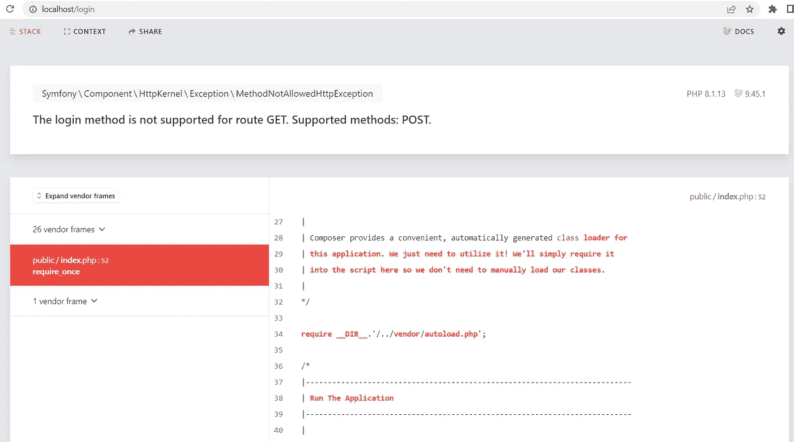
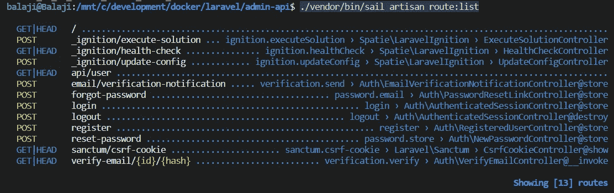
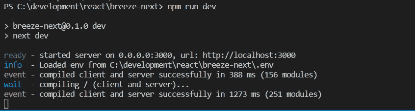
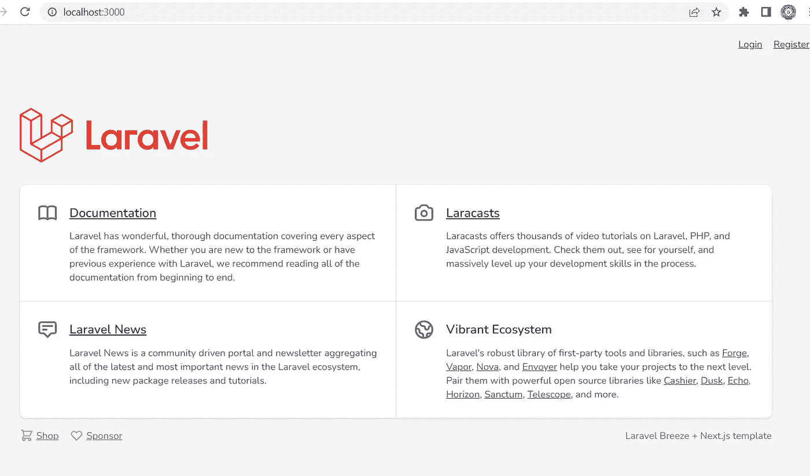
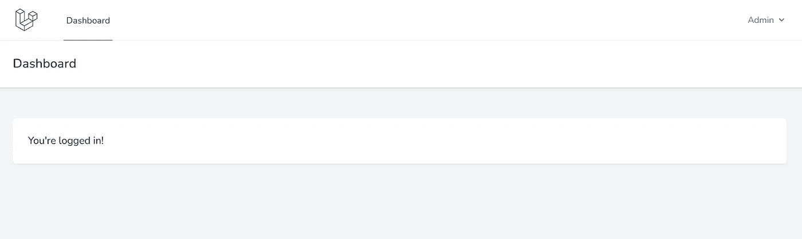

# Laravel 从头开始创建一个管理 API 第 1 部分-安装

> 原文：<https://blog.devgenius.io/laravel-creates-an-admin-api-from-scratch-part-1-installation-91e8651514ae?source=collection_archive---------4----------------------->

## Laravel Sail & Breeze API 安装


由 [Unsplash](https://unsplash.com?utm_source=medium&utm_medium=referral) 上的[路径数码](https://unsplash.com/@pathdigital?utm_source=medium&utm_medium=referral)拍摄

对于初学者来说，[拉勒维尔微风](https://laravel.com/docs/starter-kits#laravel-breeze)是开发和理解流程的最佳入门套件。为了在 Laravel 中实现角色和权限，Spatie[Laravel-permission](https://github.com/spatie/laravel-permission)是最好的包之一。

我使用[Breeze](https://laravel.com/docs/starter-kits#laravel-breeze)+Spatie[Laravel-permission](https://github.com/spatie/laravel-permission)开发了一个[基本 Laravel 管理面板](https://github.com/balajidharma/basic-laravel-admin-panel)和 [Laravel Vue 管理面板](https://github.com/balajidharma/laravel-vue-admin-panel)初学者工具包。

在这个博客系列中，我决定尝试基于 API 的解耦架构。我们将探索 [Breeze API](https://laravel.com/docs/starter-kits#breeze-and-next) 初学者工具包，并为 Spatie Laravel-permission 创建一个 API。

## 拉勒韦尔装置

我们将在 docker 中安装 Laravel。安装 [Docker 桌面](https://www.docker.com/products/docker-desktop)，如果你使用 Mac 或 Windows 电脑。对于 Windows，您应该确保安装并启用了 Linux 2 的 Windows 子系统(WSL2)。

Sail 是一个内置的解决方案，使用 [Docker](https://www.docker.com/) 运行你的 Laravel 项目。

启动 [Windows 终端](https://www.microsoft.com/en-us/p/windows-terminal/9n0dx20hk701?rtc=1&activetab=pivot:overviewtab)并为您的 WSL2 Linux 操作系统开始一个新的终端会话。否则，如果你使用 VS 代码，打开新的 WSL 终端。参考下面的截图。



在新的 WSL 终端中运行下面的命令，在“admin-api”文件夹中创建一个新的 Laravel 项目。

```
curl -s https://laravel.build/admin-api | bash
```

在本地机器上构建 Sail 应用程序容器时，Sail 安装可能需要几分钟时间。创建项目后，您可以导航到应用程序目录并启动 Laravel Sail。

```
cd admin-api

./vendor/bin/sail up -d
```

容器启动后，您可以在您的 web 浏览器中通过 [http://localhost](http://localhost/) 访问应用程序。



## 安装 Laravel Breeze API

Laravel Breeze API 初学者工具包用于 [Laravel Sanctum](https://laravel.com/docs/sanctum) 认证系统。Laravel Sanctum 为 spa(单页应用程序)、移动应用程序和简单的基于令牌的 API 提供了一个轻量级认证系统。Sanctum 允许应用程序的每个用户为他们的帐户生成多个 API 令牌。

我们需要使用 Composer 安装 Laravel Breeze。

```
./vendor/bin/sail composer require laravel/breeze --dev
```

Laravel Breeze 包安装完成后，我们需要运行`breeze:install api` Artisan 命令。这个命令将向我们的应用程序发布身份验证路由、控制器和其他资源。

```
./vendor/bin/sail artisan breeze:install api
```



使用`artisan migrate`运行您的数据库迁移

```
./vendor/bin/sail artisan migrate
```



安装 Breeze API 后，您会看到下面的首页画面



当您在浏览器 [http://localhost/login](http://localhost/login) 中加载登录 URL 时，您会看到下面的错误屏幕。因为 API 只接受 POST 方法。



使用 below artisan 命令可以查看可用的路线和支持的方法

```
./vendor/bin/sail artisan route:list
```



## 接下来是拉勒维尔微风

我们将通过安装 Laravel Breeze 下一个应用程序来检查我们的 API。

Laravel [Breeze Next](https://github.com/laravel/breeze-next) 是基于 [Next.js](https://nextjs.org/) 构建的官方认证入门套件前端。这个前端使用 Breeze API。

[单击此处](https://github.com/laravel/breeze-next/archive/refs/heads/master.zip)下载您本地的 Breeze Next。然后提取到文件夹。然后运行`npm install`，使用`npm run dev`启动应用程序

```
npm install

npm run dev
```



现在访问 [http://localhost:3000/](http://localhost:3000/) 上的前端应用程序



通过注册新用户然后登录来尝试这个单页应用程序。



我们已经成功安装了 Laravel 和 Breeze API。此外，我们尝试了 Breeze Next 前端应用程序。

[下一篇博客](/how-to-test-laravel-with-sanctum-api-using-the-postman-4e0515b30b82)，我们使用[邮递员](https://www.postman.com/)应用程序测试 API。

感谢您的阅读。

敬请关注更多内容！

【balajidharma.medium.com】跟我来[](https://balajidharma.medium.com/)*。*