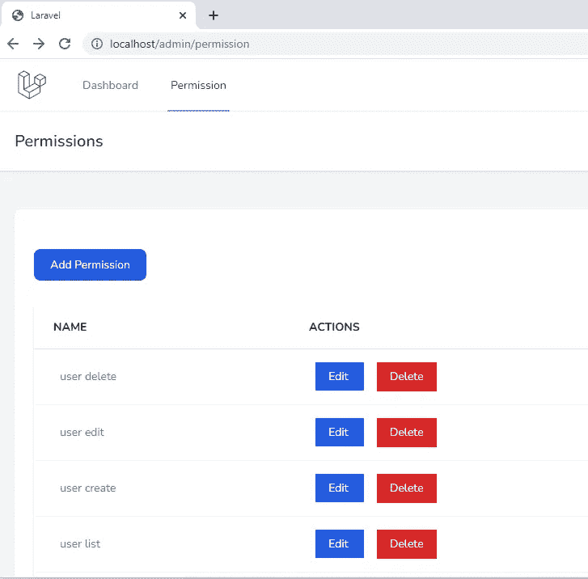
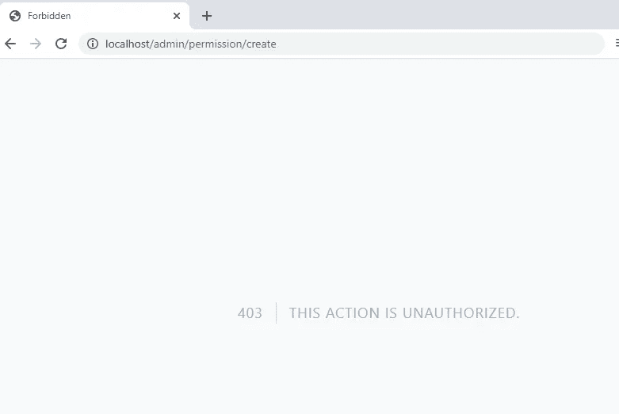
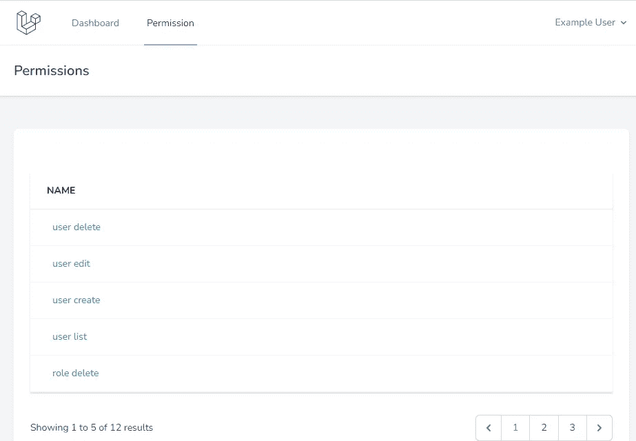

# 基于角色和权限的访问控制

> 原文：<https://blog.devgenius.io/laravel-crud-access-control-based-on-role-and-permission-f190d03f1fa2?source=collection_archive---------1----------------------->

## Laravel 从头开始创建一个管理面板——第 5 部分


照片由[凯尔·格伦](https://unsplash.com/@kylejglenn?utm_source=medium&utm_medium=referral)在 [Unsplash](https://unsplash.com?utm_source=medium&utm_medium=referral) 上拍摄

在这一部分，我们将把基于权限的访问限制添加到我们的权限 CRUD 中。

*   1.创建许可播种者
*   2.重新迁移并植入数据库
*   3.授予超级管理员访问权限
*   4.添加权限检查

## 1.创建许可播种者

我们需要一些角色。权限和用户控制对我们的管理应用程序的访问。因此，我们将为我们的表创建一个[播种机](https://laravel.com/docs/seeding)。

`/database/seeders/PermissionsDemoSeeder.php`新建一个文件，如下面的代码

```
<?php
namespace Database\Seeders;
use Illuminate\Database\Seeder;
use Spatie\Permission\Models\Permission;
use Spatie\Permission\Models\Role;
use Spatie\Permission\PermissionRegistrar;
class BasicAdminPermissionSeeder extends Seeder
{
    /**
     * Create the initial roles and permissions.
     *
     * @return void
     */
    public function run()
    {
        // Reset cached roles and permissions
        app()[PermissionRegistrar::class]->forgetCachedPermissions();
        // create permissions
        $permissions = [
            'permission list',
            'permission create',
            'permission edit',
            'permission delete',
            'role list',
            'role create',
            'role edit',
            'role delete',
            'user list',
            'user create',
            'user edit',
            'user delete'
         ];
        foreach ($permissions as $permission) {
            Permission::create(['name' => $permission]);
        }
        // create roles and assign existing permissions
        $role1 = Role::create(['name' => 'writer']);
        $role1->givePermissionTo('permission list');
        $role1->givePermissionTo('role list');
        $role1->givePermissionTo('user list');
        $role2 = Role::create(['name' => 'admin']);
        foreach ($permissions as $permission) {
            $role2->givePermissionTo($permission);
        }
        $role3 = Role::create(['name' => 'super-admin']);
        // gets all permissions via Gate::before rule; see AuthServiceProvider
        // create demo users
        $user = \App\Models\User::factory()->create([
            'name' => 'Super Admin',
            'email' => 'superadmin@example.com',
        ]);
        $user->assignRole($role3);
        $user = \App\Models\User::factory()->create([
            'name' => 'Admin User',
            'email' => 'admin@example.com',
        ]);
        $user->assignRole($role2);
        $user = \App\Models\User::factory()->create([
            'name' => 'Example User',
            'email' => 'test@example.com',
        ]);
        $user->assignRole($role1);
    }
}
```

用户工厂的默认密码是“password”。

`$user->assignRole`用于给用户分配角色。在用户模型中包含 Spatie \ Permission \ Traits \ has roles 特征。

```
+++ b/app/Models/User.php
@@ -7,10 +7,11 @@ use Illuminate\Database\Eloquent\Factories\HasFactory;
 use Illuminate\Foundation\Auth\User as Authenticatable;
 use Illuminate\Notifications\Notifiable;
 use Laravel\Sanctum\HasApiTokens;
+use Spatie\Permission\Traits\HasRoles;
class User extends Authenticatable
 {
-    use HasApiTokens, HasFactory, Notifiable;
+    use HasApiTokens, HasFactory, Notifiable, HasRoles;
     /**
      * The attributes that are mass assignable.
```

## 2.重新迁移并植入数据库

以下命令将删除您的所有数据。它将删除所有表，并再次运行所有迁移，最后，我们的种子将运行。

```
sail artisan migrate:fresh --seed --seeder=BasicAdminPermissionSeeder
```

如果您不想删除您的数据，请运行以下命令。它只会运行播种机

```
sail artisan db:seed --class=BasicAdminPermissionSeeder
```

## 3.授予超级管理员访问权限

超级管理员将拥有对应用程序的所有访问权限。所以当超级管理员登录时，需要为所有的权限检查函数`can()`或`@can()`返回 true

在下面添加一个`Gate::before`检查你的`AuthServiceProvider`启动功能。

```
public function boot()
    {
        $this->registerPolicies();

        // Implicitly grant "Super-Admin" role all permission checks using can()
       Gate::before(function ($user, $ability) {
           if ($user->hasRole('super-admin')) {
               return true;
           }
       });
    }
```

## 4.添加权限检查

现在，所有用户都可以完全访问该应用程序。因为我们没有添加检查 Laravel 默认`can`函数的权限。

```
$user->can('permission create');
```

```
In Blade directives:
@can('permission create')
...
@endcan
```

已经使用中间件在控制器构造器中检查了权限。

将以下代码添加到控制器`app/Http/Controllers/Admin/PermissionController.php`

```
function __construct()
    {
         $this->middleware('can:permission list', ['only' => ['index','show']]);
         $this->middleware('can:permission create', ['only' => ['create','store']]);
         $this->middleware('can:permission edit', ['only' => ['edit','update']]);
         $this->middleware('can:permission delete', ['only' => ['destroy']]);
    }
```

作为一个作者创建权限时，您将获得 403。因为作者只有列表访问权限。



许可列表



权限创建

通过使用 Blade 指令，我们将隐藏列表页面上的创建、编辑和删除按钮。

```
diff --git a/resources/views/admin/permission/index.blade.php b/resources/views/admin/permission/index.blade.php
index 5f31bab..90d4086 100644
--- a/resources/views/admin/permission/index.blade.php
+++ b/resources/views/admin/permission/index.blade.php
@@ -10,9 +10,11 @@
             <div class="bg-white overflow-hidden shadow-sm sm:rounded-lg">
                 <div class="p-6 bg-white border-b border-gray-200">
                     <div class="flex flex-col mt-8">
+                    @can('permission create')
                     <div class="d-print-none with-border mb-8">
                         <a href="{{ route('permission.create') }}" class="text-white bg-blue-700 hover:bg-blue-800 focus:ring-4 focus:ring-blue-300 font-medium rounded-lg text-sm px-5 py-2.5 text-center mr-2 mb-2 dark:bg-blue-600 dark:hover:bg-blue-700 dark:focus:ring-blue-800">{{ __('Add Permission') }}</a>  
                     </div>
+                    @endcan
                         <div class="py-2">
                         @if(session()->has('message'))
                             <div class="mb-8 text-green-400 font-bold">
@@ -26,9 +28,11 @@
                                             <th class="py-4 px-6 bg-grey-lightest font-bold uppercase text-sm text-grey-dark border-b border-grey-light text-left">
                                                 {{ __('Name') }}
                                             </th>
+                                            @canany(['permission edit', 'permission delete'])
                                             <th class="py-4 px-6 bg-grey-lightest font-bold uppercase text-sm text-grey-dark border-b border-grey-light text-left">
                                                 {{ __('Actions') }}
                                             </th>
+                                            @endcanany
                                         </tr>
                                     </thead>
@@ -40,21 +44,25 @@
                                                     <a href="{{route('permission.show', $permission->id)}}" class="no-underline hover:underline text-cyan-600 dark:text-cyan-400">{{ $permission->name }}</a>  
                                                 </div>
                                             </td>
-
+                                            @canany(['permission edit', 'permission delete'])
                                             <td class="border-b border-slate-100 dark:border-slate-700 
p-4 pl-8 text-slate-500 dark:text-slate-400">
                                                 <form action="{{ route('permission.destroy', $permission->id) }}" method="POST">
+                                                    @can('permission edit')
                                                     <a href="{{route('permission.edit', $permission->id)}}" class="px-4 py-2 text-white mr-4 bg-blue-600">
                                                         {{ __('Edit') }}
                                                     </a>
+                                                    @endcan
+                                                    @can('permission delete')
                                                     @csrf
                                                     @method('DELETE')
                                                     <button class="px-4 py-2 text-white bg-red-600">   
                                                         {{ __('Delete') }}
                                                     </button>
+                                                    @endcan
                                                 </form>
                                             </td>
-
+                                            @endcanany
                                         </tr>
                                         @endforeach
                                     </tbody>
```

在`index.blade.php`更新之后，writer 用户的索引页面



仅具有列表访问权限的用户

我们成功地为我们的权限 CRUD 添加了基于权限的访问控制。

下一部分，我们将把搜索添加到我们的索引页面。并创建剩余的角色和用户 CRUD。

## GitHub 知识库

许可代码可在 [1.0.3](https://github.com/balajidharma/basic-laravel-admin-panel/tree/archive/1.0.3) 分支上获得

上一部分—第四部分:[权限管理的基础 Laravel CRUD 创建](/basic-laravel-admin-panel-basic-laravel-crud-creation-for-permission-management-6bd93fb0e1a2)

下一部分——第 6 部分:[在 Laravel](/implements-a-basic-search-filter-and-column-sort-with-pagination-in-laravel-crud-5e3c70fb12ac) 中实现了基本的搜索过滤器和带有分页的列排序