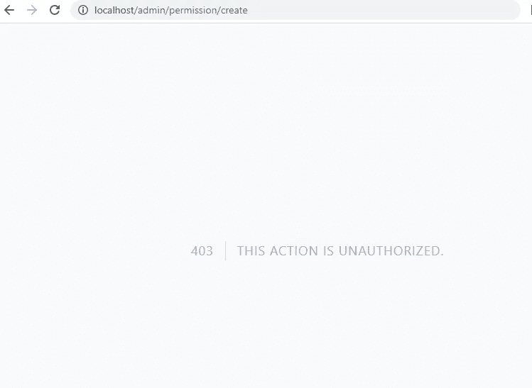
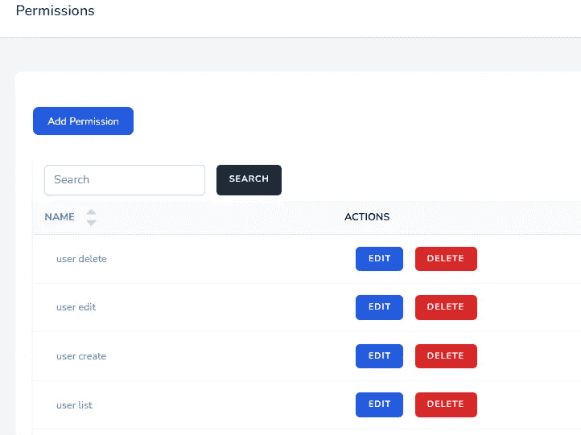
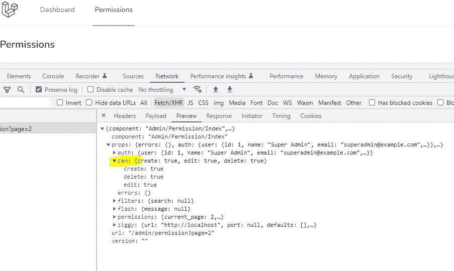
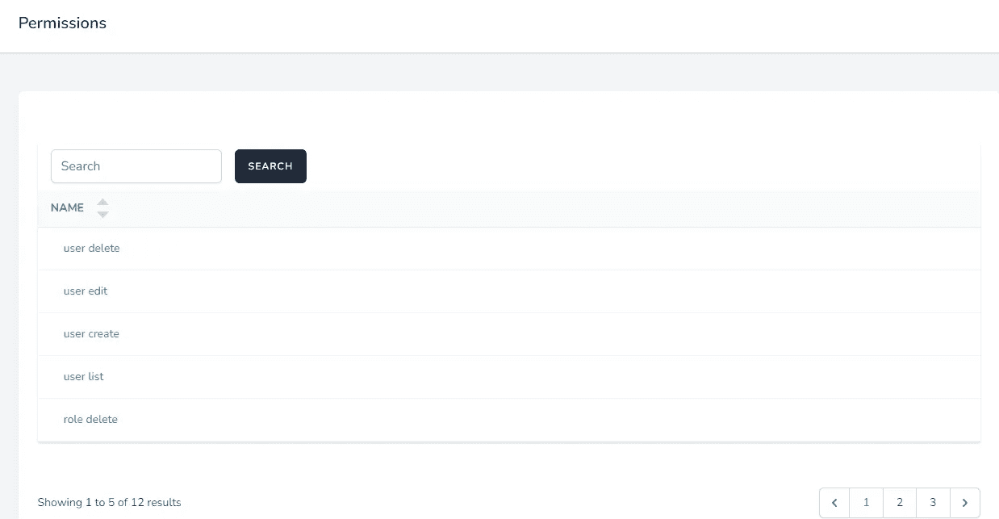

# 具有惰性的 Laravel CRUD 授权和使用角色和权限的 Vue 访问控制

> 原文：<https://blog.devgenius.io/laravel-crud-authorization-with-inertia-and-vue-access-control-using-role-and-permission-bb718f0b3a78?source=collection_archive---------3----------------------->

## Laravel 从头开始创建 Vue 管理面板——第 5 部分


[迈卡·威廉姆斯](https://unsplash.com/@mr_williams_photography?utm_source=medium&utm_medium=referral)在 [Unsplash](https://unsplash.com?utm_source=medium&utm_medium=referral) 上拍照

在最后 4 个部分中，我们完成了[安装](/laravel-creates-a-vue-admin-panel-from-scratch-part-1-installation-and-authentication-56c451d4d697)和[权限 CRUD](/create-laravel-crud-using-inertia-and-vue-3-list-page-with-search-and-pagination-c4a52b6501c3) 以及[列排序](/laravel-crud-column-sorting-with-inertia-and-vue-6bb16c30d3e0)。在这一部分，我们将根据角色和权限来限制用户访问。以下步骤用于创建对我们的 [Laravel Vue 管理面板](https://github.com/balajidharma/laravel-vue-admin-panel)的访问控制。

1.  使用中间件
2.  将授权检查传递给组件
3.  组件中的访问控制

## 1.使用中间件

我们使用[Spatie Laravel-permission](https://spatie.be/docs/laravel-permission)包来管理用户权限和角色。已经在[部件 2](/create-laravel-crud-using-inertia-and-vue-3-list-page-with-search-and-pagination-c4a52b6501c3) 的`AuthServiceProvider`引导功能上授予超级管理员访问权限。

在将要使用`can`的权限控制器中，内置了`\Illuminate\Auth\Middleware\Authorize::class`提供的 Laravel 中间件

在构造函数中添加访问检查中间件，如下所示

```
class PermissionController extends Controller
{
    public function __construct()
    {
        $this->middleware('can:permission list', ['only' => ['index', 'show']]);
        $this->middleware('can:permission create', ['only' => ['create', 'store']]);
        $this->middleware('can:permission edit', ['only' => ['edit', 'update']]);
        $this->middleware('can:permission delete', ['only' => ['destroy']]);
    }
```

现在以示例用户(test@example.com/password 的身份登录，并尝试创建操作。对于示例用户，您将得到 403。因为此用户角色是一个作者，只能访问“许可权列表”



您还可以探索其他授权操作[门](https://laravel.com/docs/9.x/authorization#gates)和[策略](https://laravel.com/docs/9.x/authorization#creating-policies)。这是在 Laravel 授权行动的主要方式。

## 2.将授权检查传递给组件

构造器中的中间件将检查所有的动作授权。所以在后端，我们添加了权限和基于角色的访问控制。但是我们需要根据用户权限隐藏前端组件中的“添加权限”、“编辑”和“删除”链接。



为了检查 JavaScript 页面组件的访问，我们需要将授权检查作为道具传递给页面组件。打开权限控制器索引函数，并将下面的“can”对象添加到组件中。

[惯性](https://inertiajs.com/)建议此[授权](https://inertiajs.com/authorization)检查是否向页面组件传递属性。

`app/Http/Controllers/Admin/PermissionController.php`

```
return Inertia::render('Admin/Permission/Index', [
    'permissions' => $permissions,
    'filters' => request()->all('search'),
    'can' => [
        'create' => Auth::user()->can('permission create'),
        'edit' => Auth::user()->can('permission edit'),
        'delete' => Auth::user()->can('permission delete'),
    ]
]);
```

此外，在控制器顶部添加`use Illuminate\Support\Facades\Auth;`。现在，JavaScript 页面组件上提供了“can”属性。



## 3.组件中的访问控制

使用“can”道具，我们将隐藏权限索引组件中的操作链接。在此之前，在`defineProps`中添加“`can`”对象。

`resources/js/Pages/Admin/Permission/Index.vue`

```
const props = defineProps({
  permissions: {
    type: Object,
    default: () => ({}),
  },
  filters: {
    type: Object,
    default: () => ({}),
  },
  can: {
    type: Object,
    default: () => ({}),
  },
});
```

之后添加基于`can`对象的`v-if`

```
<div class="bg-white overflow-hidden shadow-sm sm:rounded-lg">
   <div class="p-6 bg-white border-b border-gray-200">
     <div class="flex flex-col mt-8">
-              <div class="d-print-none with-border mb-8">
+              <div v-if="can.create" class="d-print-none with-border mb-8">
         <Link
           :href="route('permission.create')"
           class="
@@ -158,6 +162,7 @@ function destroy(id) {
                   <Sort label="Name" attribute="name" />
                 </th>
                 <th
+                          v-if="can.edit || can.delete"
                   class="
                     py-2
                     px-4
@@ -203,6 +208,7 @@ function destroy(id) {
                   </div>
                 </td>
                 <td
+                          v-if="can.edit || can.delete"
                   class="
                     border-b border-slate-100
                     dark:border-slate-700
@@ -214,6 +220,7 @@ function destroy(id) {
                 >
                   <div class="flex">
                     <Link
+                              v-if="can.edit"
                       :href="route('permission.edit', permission.id)"
                       class="
                         inline-flex
@@ -245,6 +252,7 @@ function destroy(id) {
                       Edit
                     </Link>
                     <BreezeButton
+                              v-if="can.delete"
                       class="px-4 py-2 text-white bg-red-600"
                       @click="destroy(permission.id)"
                     >
```

现在以示例用户的身份访问许可权索引页面。未授权用户不会看到操作链接。



我们已经成功地完成了权限 CRUD 的所有功能，包括授权。在接下来的部分中，我们将创建其他角色和用户 CRUD。

## GitHub 知识库

Laravel Vue 管理面板在[https://github.com/balajidharma/laravel-vue-admin-panel](https://github.com/balajidharma/laravel-vue-admin-panel)上可用。安装管理面板并分享您的反馈。

感谢您的阅读。

敬请关注更多内容！

*跟我来*[***balajidharma.medium.com***](https://balajidharma.medium.com/)。

上一部分—第 4 部分:[创建具有惯性和 Vue 的 Laravel CRUD 列排序](/laravel-crud-column-sorting-with-inertia-and-vue-6bb16c30d3e0)

下一部分—第 6 部分:[如何将 Laravel 与 Vue 集成& Tailwind Admin One 仪表盘](/how-to-integrate-laravel-with-vue-tailwind-admin-one-dashboard-3753346181)