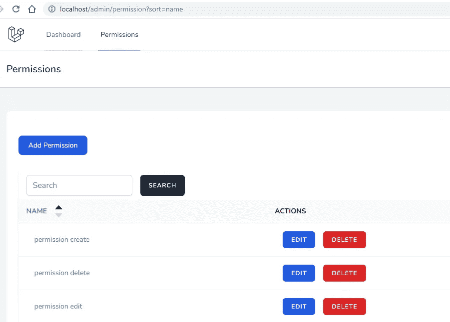
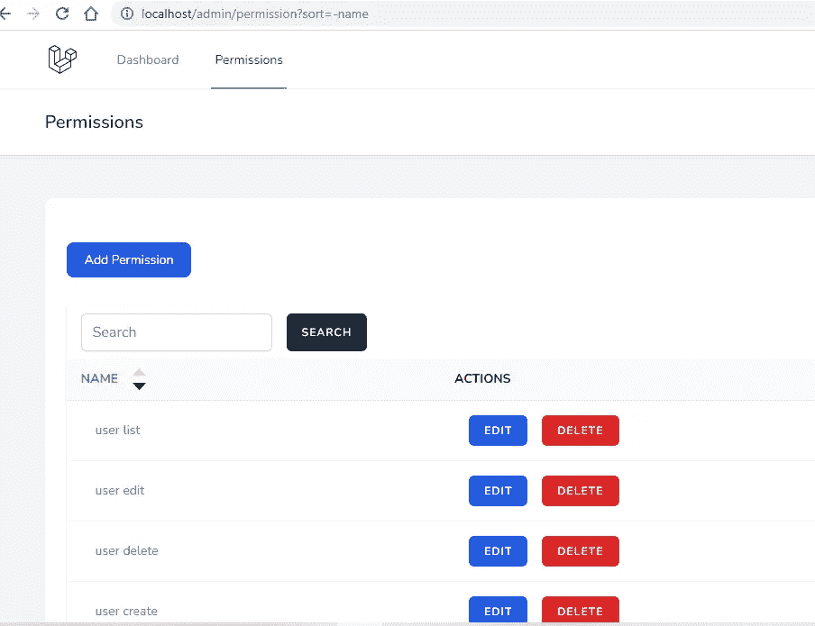

# 使用惯性和 Vue 创建 Laravel CRUD 列排序

> 原文：<https://blog.devgenius.io/laravel-crud-column-sorting-with-inertia-and-vue-6bb16c30d3e0?source=collection_archive---------4----------------------->

## Laravel 从头开始创建 Vue 管理面板——第 4 部分



利用惯性和 Vue 进行列排序

在最后两部分中，我们已经创建了我们的第一个 Vue CRUD。除了列排序和授权，我们几乎完成了权限 CRUD。在这一部分中，我们将实现排序功能。

以下步骤涉及到为我们的 [Laravel Vue 管理面板](https://github.com/balajidharma/laravel-vue-admin-panel)创建列排序。

*   1.添加排序依据
*   2.创建排序组件
*   3.包括排序组件到索引组件

## 1.添加排序依据

我们将在 URL 中添加`sort`查询字符串参数。基于下面的排序值，我们进行排序。

**sort = ASC 订单的名称**

**排序 order 订单的名称**

在权限控制器中打开索引函数，并用下面的代码添加替换索引函数

`app/Http/Controllers/Admin/PermissionController.php`

```
public function index()
{
    $permissions = (new Permission)->newQuery(); if (request()->has('search')) {
        $permissions->where('name', 'Like', '%'.request()->input('search').'%');
    } if (request()->query('sort')) {
        $attribute = request()->query('sort');
        $sort_order = 'ASC';
        if (strncmp($attribute, '-', 1) === 0) {
            $sort_order = 'DESC';
            $attribute = substr($attribute, 1);
        }
        $permissions->orderBy($attribute, $sort_order);
    } else {
        $permissions->latest();
    } $permissions = $permissions->paginate(5)->onEachSide(2)->appends(request()->query()); return Inertia::render('Admin/Permission/Index', [
        'permissions' => $permissions,
        'filters' => request()->all('search'),
    ]);
}
```

确保在分页链接上添加`request()->query()`。

```
$permissions->paginate(5)->onEachSide(2)->appends(request()->query());
```

现在使用查询参数`sort=name`访问浏览器上的许可页面。它显示 ASC 订单结果。另外，用`sort=-name`检查 DESC 订单。

## 2.创建排序组件

创建一个新的排序组件，用排序链接和排序图标显示列名。复制下面的代码，并在 Component/Admin 文件夹中创建排序组件

`resources/js/Components/Admin/Sort.vue`

```
<script setup>
import { ref, computed } from "vue";
import { Link } from "@inertiajs/inertia-vue3";const props = defineProps({
  label: {
    type: String,
    default: "",
  },
  attribute: {
    type: String,
    default: "",
  },
});const downFill = ref("lightgray");
const upFill = ref("lightgray");const sortLink = computed(() => {
  let url = new URL(document.location);
  let sortValue = url.searchParams.get("sort"); if (sortValue == props.attribute) {
    url.searchParams.set("sort", "-" + props.attribute);
    upFill.value = "black";
  } else if (sortValue === "-" + props.attribute) {
    url.searchParams.set("sort", props.attribute);
    downFill.value = "black";
  } else {
    url.searchParams.set("sort", props.attribute);
  }
  return url.href;
});
</script><template>
  <div class="flex items-center gap-4">
    <Link
      :href="sortLink"
      class="no-underline hover:underline text-cyan-600 dark:text-cyan-400"
      >{{ label }}</Link
    >
    <div class="flex flex-col">
      <svg
        class="inline-block"

        width="15px"
        height="15px"
        viewBox="0 0 15 15"
        fill="none"
      >
        <path d="M7.5 3L15 11H0L7.5 3Z" :fill="upFill" />
      </svg>
      <svg
        class="inline-block"

        width="15px"
        height="15px"
        viewBox="0 0 15 15"
        fill="none"
      >
        <path
          d="M7.49988 12L-0.00012207 4L14.9999 4L7.49988 12Z"
          :fill="downFill"
        />
      </svg>
    </div>
  </div>
</template>
```

排序组件有一个标签和属性属性。同样，在组件中，我们使用 Vue reactive [ref()](https://vuejs.org/guide/essentials/reactivity-fundamentals.html#reactive-variables-with-ref) 填充颜色来对 SVG 图标进行排序。

## 3.包括排序组件到索引组件

在最后一步，我们将在`Index.vue`上导入排序组件，并将排序组件包含在表头列中。

```
<Sort label="Name" attribute="name" />
```

打开你的`Index.vue`组件并用下面的代码替换

`resources/js/Pages/Admin/Permission/Index.vue`

```
<script setup>
import BreezeAuthenticatedLayout from "@/Layouts/Authenticated.vue";
import { Head, Link, useForm } from "@inertiajs/inertia-vue3";
import BreezeButton from "@/Components/Button.vue";
import Pagination from "@/Components/Admin/Pagination.vue";
import Sort from "@/Components/Admin/Sort.vue";const props = defineProps({
  permissions: {
    type: Object,
    default: () => ({}),
  },
  filters: {
    type: Object,
    default: () => ({}),
  },
});const form = useForm({
  search: props.filters.search,
});const formDelete = useForm({});function destroy(id) {
  if (confirm("Are you sure you want to delete?")) {
    formDelete.delete(route("permission.destroy", id));
  }
}
</script><template>
  <Head title="Permissions" /><BreezeAuthenticatedLayout>
    <template #header>
      <h2 class="font-semibold text-xl text-gray-800 leading-tight">
        Permissions
      </h2>
    </template> <div class="py-12">
      <div class="max-w-7xl mx-auto sm:px-6 lg:px-8">
        <div
          v-if="$page.props.flash.message"
          class="
            p-4
            mb-4
            text-sm text-green-700
            bg-green-100
            rounded-lg
            dark:bg-green-200 dark:text-green-800
          "
          role="alert"
        >
          <span class="font-medium">
            {{ $page.props.flash.message }}
          </span>
        </div>
        <div class="bg-white overflow-hidden shadow-sm sm:rounded-lg">
          <div class="p-6 bg-white border-b border-gray-200">
            <div class="flex flex-col mt-8">
              <div class="d-print-none with-border mb-8">
                <Link
                  :href="route('permission.create')"
                  class="
                    text-white
                    bg-blue-700
                    hover:bg-blue-800
                    focus:ring-4 focus:ring-blue-300
                    font-medium
                    rounded-lg
                    text-sm
                    px-5
                    py-2.5
                    text-center
                    mr-2
                    mb-2
                    dark:bg-blue-600
                    dark:hover:bg-blue-700
                    dark:focus:ring-blue-800
                  "
                  >Add Permission</Link
                >
              </div> <div class="py-2">
                <div
                  class="
                    min-w-full
                    border-b border-gray-200
                    shadow
                    overflow-x-auto
                  "
                >
                  <form @submit.prevent="form.get(route('permission.index'))">
                    <div class="py-2 flex">
                      <div class="flex pl-4">
                        <input
                          type="search"
                          v-model="form.search"
                          class="
                            rounded-md
                            shadow-sm
                            border-gray-300
                            focus:border-indigo-300
                            focus:ring
                            focus:ring-indigo-200
                            focus:ring-opacity-50
                          "
                          placeholder="Search"
                        />
                        <button
                          type="submit"
                          class="
                            ml-4
                            inline-flex
                            items-center
                            px-4
                            py-2
                            bg-gray-800
                            border border-transparent
                            rounded-md
                            font-semibold
                            text-xs text-white
                            uppercase
                            tracking-widest
                            hover:bg-gray-700
                            active:bg-gray-900
                            focus:outline-none focus:border-gray-900 focus:ring
                            ring-gray-300
                            disabled:opacity-25
                            transition
                            ease-in-out
                            duration-150
                          "
                        >
                          Search
                        </button>
                      </div>
                    </div>
                  </form>
                  <table class="border-collapse table-auto w-full text-sm">
                    <thead>
                      <tr>
                        <th
                          class="
                            py-2
                            px-4
                            bg-gray-50
                            font-bold
                            uppercase
                            text-sm text-grey-dark
                            border-b border-grey-light
                            text-left
                          "
                        >
                          <Sort label="Name" attribute="name" />
                        </th>
                        <th
                          class="
                            py-2
                            px-4
                            bg-gray-50
                            font-bold
                            uppercase
                            text-sm text-grey-dark
                            border-b border-grey-light
                            text-left
                          "
                        >
                          Actions
                        </th>
                      </tr>
                    </thead> <tbody class="bg-white dark:bg-slate-800">
                      <tr
                        v-for="permission in permissions.data"
                        :key="permission.id"
                      >
                        <td
                          class="
                            border-b border-slate-100
                            dark:border-slate-700
                            p-4
                            pl-8
                            text-slate-500
                            dark:text-slate-400
                          "
                        >
                          <div class="text-sm text-gray-900">
                            <Link
                              :href="route('permission.show', permission.id)"
                              class="
                                no-underline
                                hover:underline
                                text-cyan-600
                                dark:text-cyan-400
                              "
                              >{{ permission.name }}</Link
                            >
                          </div>
                        </td>
                        <td
                          class="
                            border-b border-slate-100
                            dark:border-slate-700
                            p-4
                            pl-8
                            text-slate-500
                            dark:text-slate-400
                          "
                        >
                          <div class="flex">
                            <Link
                              :href="route('permission.edit', permission.id)"
                              class="
                                inline-flex
                                items-center
                                px-4
                                py-2
                                text-white
                                mr-4
                                bg-blue-600
                                border border-transparent
                                rounded-md
                                font-semibold
                                text-xs text-white
                                uppercase
                                tracking-widest
                                hover:bg-gray-700
                                active:bg-gray-900
                                focus:outline-none
                                focus:border-gray-900
                                focus:shadow-outline-gray
                                transition
                                ease-in-out
                                duration-150
                                px-4
                                py-2
                                text-white
                              "
                            >
                              Edit
                            </Link>
                            <BreezeButton
                              class="px-4 py-2 text-white bg-red-600"
                              @click="destroy(permission.id)"
                            >
                              Delete
                            </BreezeButton>
                          </div>
                        </td>
                      </tr>
                    </tbody>
                  </table>
                </div>
                <div class="py-8">
                  <Pagination class="mt-6" :data="permissions" />
                </div>
              </div>
            </div>
          </div>
        </div>
      </div>
    </div>
  </BreezeAuthenticatedLayout>
</template>
```



列排序 DESC

## GitHub 知识库

Laravel Vue 管理面板在[https://github.com/balajidharma/laravel-vue-admin-panel](https://github.com/balajidharma/laravel-vue-admin-panel)上可用。安装管理面板并分享您的反馈。

感谢您的阅读。

敬请关注更多内容！

*跟我来*[***balajidharma.medium.com***](https://balajidharma.medium.com/)。

上一部分—第 3 部分:[创建 Laravel CRUD 使用 Inertia 和 Vue 创建和更新页面](/create-laravel-crud-create-and-update-pages-using-inertia-and-vue-48162d8bf6ee)

下一部分—第 5 部分:[具有惰性的 Laravel CRUD 授权和 Vue —使用角色和权限的访问控制](/laravel-crud-authorization-with-inertia-and-vue-access-control-using-role-and-permission-bb718f0b3a78)