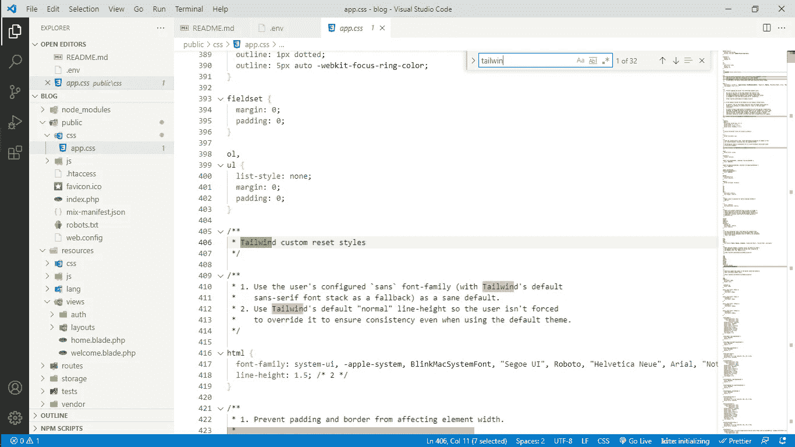
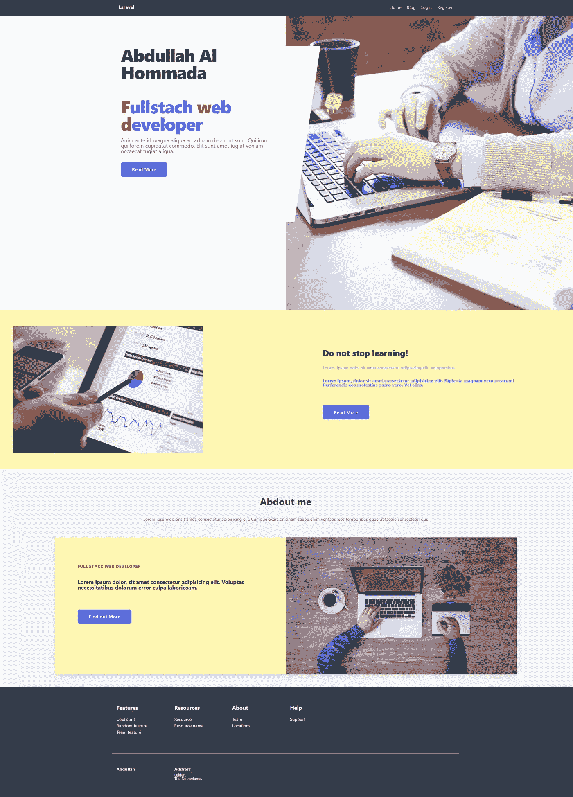

# Laravel，CRUD(创建、读取、更新和删除)app，带顺风 CSS 和 Blade。

> 原文：<https://blog.devgenius.io/laravel-crud-create-read-update-and-delete-app-with-tailwind-css-and-blade-c85e5d243f6e?source=collection_archive---------1----------------------->


来自 [pixabay](https://pixabay.com/photos/coding-business-working-macbook-699318/)

# 我们将合作的内容:

*   [Laravel](https://laravel.com/) :是一个 web 应用框架，具有丰富、优雅的语法。主要用于使用 PHP 构建定制的 web 应用程序。它是一个 web 框架，可以处理许多自己构建起来很烦人的事情，比如路由、HTML 模板和身份验证。
*   [Blade template :](https://laravel.com/docs/8.x/blade) Blade 是一个简单而强大的模板引擎，包含在 Laravel 中。与一些 PHP 模板引擎不同，Blade 不限制您在模板中使用普通 PHP 代码。
*   Tailwind css: Tailwind css 是一个实用程序第一的 CSS 框架，用于快速构建定制用户界面。

# 将涵盖哪些内容:

*   初始 Laravel 应用程序
*   制作模型、控制器并连接到数据库
*   浏览 CRUD(创建、读取、更新、删除),并解释每个步骤。
*   使用 Blade 展示应用程序的前端。

## -建立新的拉勒维尔项目

首先，您需要在计算机上安装 composer、node.js 和 php

创建一个名为 ***博客*** 的新项目

```
laravel new project blog  // if you have laravel installed globally or
composer create-project --prefer-dist laravel/laravel blog
```

使用以下命令对顺风用户界面进行验证:

```
composer require laravel-frontend-presets/tailwindcss --dev  // to //                                           install the presetphp artisan ui tailwindcss --auth
npm install && npm run dev
php artisan serve  // then go to localhost:8000 so you can see your   //                     new laravel app.
```

您现在可以看到，在视图目录中有一个新文件夹，名称为:auth 和 layout。并且看到在公共文件夹中有一个新的文件夹用于 css 和 js，在 css 目录中你可以看到 app.css 包含了 tailwind css 样式。



*关于用 laravel 安装 tailwind ui auth 的更多信息可以查看链接:*[*https://laravel-frontend-presets.github.io/tailwindcss/*](https://laravel-frontend-presets.github.io/tailwindcss/)

*顺便提一下，如果你对 laravel mix 有问题，你必须运行*

```
npm run dev
```

如果它不起作用，就发出下面的命令:

```
npm remove laravel-mix
npm install laravel-mix --save-dev
npm install cross-env --save-dev
npm rum watch
```

## 设置数据库。

我将使用 MySQL 作为数据库，但你可以使用任何你想要的，只要确保添加正确的配置

```
DB_CONNECTION=mysql
DB_HOST=127.0.0.1 
DB_PORT=3306 
DB_DATABASE=blog // your database name 
DB_USERNAME=root // your database user name 
DB_PASSWORD=     // your database password
```

## 做模型

当您创建一个新的 Laravel 项目时，已经为您创建了一个用户模型，现在我们需要创建一个 Post 模型

```
php artisan make:model Post
```

您需要在新的 Post 模型中添加以下代码，所以请访问 app/Models/Post.php

*   请注意，受保护的$fillable 值告诉应用程序需要填充和显示哪些值
*   函数 user:用于显示每个帖子属于一个用户，这样我们就可以得到发帖的用户的名字，我们将在后面看到。
*   sluggable 功能:用来从文章的标题制作一个 slug(可以作为一个友好的标题),你必须先通过 composer 安装它。

*在链接* [*中阅读更多关于懒汉包的内容 https://github . com/cviebrock/口才-懒汉#安装*](https://github.com/cviebrock/eloquent-sluggable#installation)

app/Models/Post.php

## 制作迁移帖子

```
php artisan make:migration posts
```

现在，在 database/migrations/some _ date _ create _ post _ posts . php 中有了一个新的 PHP 文件

要为 posts 表创建一个新的模式，并使用所需的列名填充它，请使用下面的代码填充 ***up 函数***

数据库/迁移/date_create_post_table.php

执行命令 migrate，以便将表迁移到数据库，这样它就会在数据库中为您创建表

```
php artisan migrate
```

## -制造控制器

控制器是一个管理处理请求行为的类，例如`**UserController**`类可能处理所有与用户相关的传入请求，包括显示、创建、更新和删除用户。默认情况下，控制器存储在`**app/Http/Controllers**`目录中。

我们将为页面和帖子制作控制器

```
php artisan make:controller PagesController 
php artisan make:controller PostsController --resource
```

在 PagesController 中添加以下代码:

app/Http/Controllers/pages controller . PHP

在我们的例子中，大部分的 CRUD 工作都是由 PostsController 来完成的。

在 **PostsController** 中添加以下代码:

app/Http/Controllers/posts controller . PHP

在 **PostsController** 中，当我们将 ***—资源*** 添加到创建 **PostsController** 的命令中时，您可以看到已经为我们创建的所有资源(这意味着创建、读取、更新、删除)动作

## -制作视图页面

## 主页面:

在 resources/view 目录中创建一个新的文件 index.blade.php，删除 web.blade.php，并在其中添加以下代码

资源/视图/索引. blade.php

在同一个根目录下创建另一个名为 search.blade.php 的页面，我们将在这里使用它的搜索功能

资源/视图/search.blade.php

在 resources/view/layout/app . blade . PHP 中，根据需要调整布局，注意在第 32 行的@guest 上方添加

```
<a class="no-underline hover:underline" href="/">Home</a>
<a class="no-underline hover:underline" href="/blog">Blog</a>
```

这是导航栏中不同页面的链接，所以在我的例子中，它将是**主页**和**博客**页面:

资源/视图/布局/app.blade.php

制作一个简单的页脚 footer.blade.php，并将其添加到布局目录中

资源/视图/布局/页脚. blade.php

现在你可以看到网络应用程序正在工作



你可以在回购中看到这个应用程序的代码:

[](https://github.com/aalhommada/laravel-crud) [## 阿尔霍姆达/拉勒韦尔-克鲁德

### 一个简单的 crud 应用程序，带有 Laravel 8，tailwind，blade。单击此处转到 web 应用程序克隆存储库- git 克隆…

github.com](https://github.com/aalhommada/laravel-crud) 

部署到 heroku 后，您可以在链接中查看 web 应用程序:

[](http://still-ravine-18094.herokuapp.com/) [## 拉勒韦尔

### Lorem，因为你是肥胖精英。沃普塔提布斯。洛勒姆·伊普斯姆，多洛勒·西塔米蒂特…

still-ravine-18094.herokuapp.com](http://still-ravine-18094.herokuapp.com/) 

***感谢阅读:)***

如果你有兴趣阅读更多关于不同主题的内容，请访问我的博客:【https://aalhommada.com/blog 