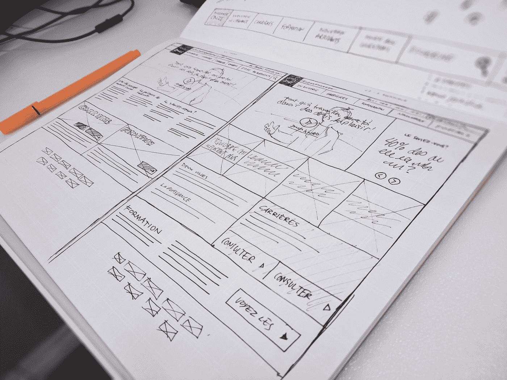
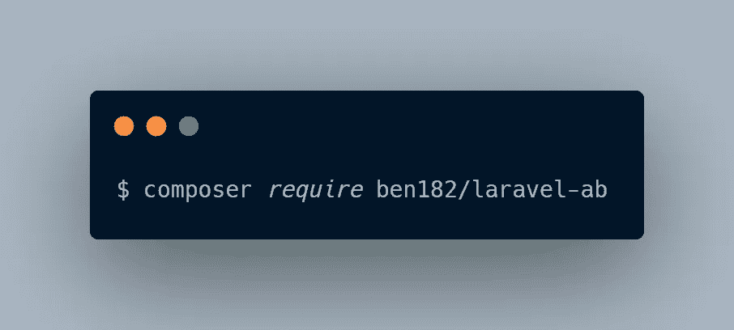
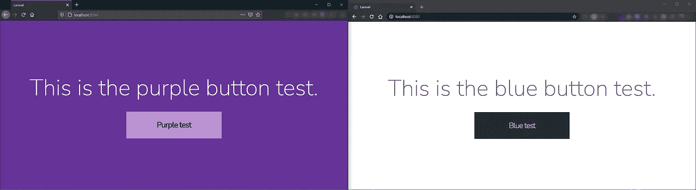
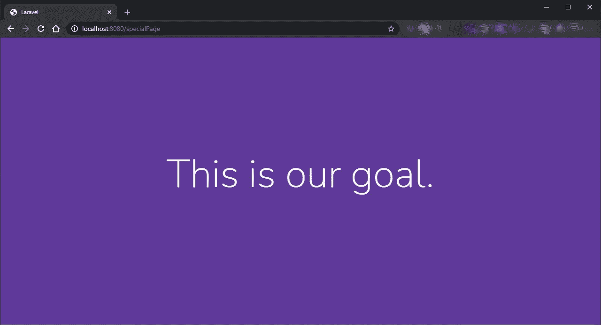

# Laravel 数据驱动策略#1:在应用程序中设置 A/B 测试

> 原文：<https://blog.devgenius.io/laravel-data-driven-strategies-1-setup-a-b-testing-in-your-application-83eebf3a9499?source=collection_archive---------1----------------------->



[西格蒙德](https://unsplash.com/@sigmund?utm_source=medium&utm_medium=referral)在 [Unsplash](https://unsplash.com?utm_source=medium&utm_medium=referral) 上拍照

> 平面设计师:“到目前为止，我们已经建立了高度互动的 UX，我们专注于为一个简单的东西取一个奇妙的名字，让它变得漂亮，有反应，有吸引力。”我花了 4 个小时实现它，并看到用户如何使用它:“那么为什么没人理解它？”

我不知道你是否有过这样的对话，但接下来的第一反应就像⚡🎯💣💥突然有人出现，说他也设计了一个替代版本，但由于某些原因被拒绝。实现某个东西的多个版本需要钱，但是如果某个东西不能像预期的那样工作，那么它的成本会比第二个实现的成本更高。

对于一个 IT 项目来说，了解某件事情如何运作以及是否运作的最佳方式是设置一些 **KPI** ，对于那些第一次听到这个的人来说，KPI 代表*关键绩效指标*，它代表了一个您想要跟踪以检查特定东西的绩效的指标(例如，在营销合作之后，您可能想要跟踪某个时间范围内的销售增长)。对于图形组件，KPI 可以设置在特定的子组件上，如按钮、可点击或可聚焦的子组件，但它们只是测量交互，可以与总访问量进行比较；如果您有同一个组件的多个实现，并且想要检查哪个执行得更好，您必须使用 **A/B 测试**。

**A/B 测试**是一种测试，在这种测试中，你实际上将你的观众分成两部分，向他们推荐不同版本的内容:如果你有两个视图实现，通过 A/B 测试，你可以向 50%的观众推荐版本 A，向另外 50%的观众推荐版本 B，然后测量每个版本的 KPI，这样你就得到了获胜的版本！(或者在非常罕见的情况下打成平手。)

# 设置

在大多数情况下，您不需要编写自己的 a/b 测试引擎，您可以坚持使用现有的引擎，设置好它并专注于您的业务逻辑实现。对于 Laravel 应用程序，`ben182/laravel-ab`包让你在几分钟内准备好，你可以在 [Github](https://github.com/ben182/laravel-ab) 上找到它。通过 composer `composer require ben182/laravel-ab`安装是一个直接的过程，您已经准备好了。



A/B 测试包安装

请注意，这并不意味着您不能编写您自己的 a/b 测试代码:如果您想创建一个具有许多方面的自定义漏斗，并且这个包不能满足您的野心，您可以随时实现您的自定义解决方案！

正确安装软件包后，我们只需发布配置并迁移它！

```
php artisan vendor:publish --provider="Ben182\AbTesting\AbTestingServiceProvider"
```

这将发布配置文件`config/ab-testing.php`以便稍后调整。之后，您只需`php artisan migrate`，这将发布两个预期的表:

```
**Migrating**: 2019_02_02_200315_create_experiments_table
**Migrated**:  2019_02_02_200315_create_experiments_table (0.01 seconds)
**Migrating**: 2019_02_02_213123_create_goals_table
**Migrated**:  2019_02_02_213123_create_goals_table (0.01 seconds)
```

# 初试:A 还是 B？

简单来说:您想在索引路径中测试一个文本和一个按钮样式。为了使*有创造性*，我们可以将我们的测试命名为`blue-button`和`purple-button`。要开始这些测试，只需打开配置文件并将测试名称添加到实验数组中:

```
return [
    'experiments' => [
        **'blue-button',
        'purple-button',**
    ],
    // ...
];
```

现在只关注内容，但是怎么做呢？对于视图部分，有一个`@ab`工具可以让你在测试之间切换。

```
**@ab('blue-button')**<div class="title m-b-md">
    This is the blue button test.
</div>
<a href="{!! url('/specialPage') !!}" class="blue-button">
    Blue test
</a>**@elseab('purple-button')**<div class="title m-b-md">
    This is the purple button test.
</div>
<a href="{!! url('/specialPage') !!}" class="purple-button">
    Purple test
</a>**@endab**
```

就是这样，它真的很简单，你真的可以在你的刀片文件的任何地方使用它。这样，正如你在下面看到的，当你打开页面时，你会看到不同的内容，实验用户的分布是平均分布的。



a 还是 B？

运行命令`php artisan ab:report`可以看到每个实验中有多少用户登陆。

```
$ php-fpm php artisan ab:report
+---------------+----------+
| **Experiment** | **Visitors** |
+---------------+----------+
| **blue-button**   | **1**        |
| **purple-button** | **1**        |
+---------------+----------+
```

如果你想仔细看看`@ab`实用程序是如何工作的，这只是一个假设

```
@if (AbTesting::isExperiment('your-experiment-name'))
```

这个工具被实现到服务提供商中，你也可以深入到 Github 的插件源代码中。

# 开始测量

一般来说，a/b 测试的目的是测量不同视图之间哪一个可以导致更好的*转换*。

为了开始测量转化率，我们在配置文件中设定目标。一个简单的目标可以是用户通过我们的按钮访问。

```
'goals' => [
    '**page-visited**'
],
```

命令`php artisan ab:report`将让你看到你通过每个实验达到了多少转换。

```
$ php-fpm php artisan ab:report
+---------------+----------+-------------------+
| Experiment    | Visitors | **Goal page-visited** |
+---------------+----------+-------------------+
| blue-button   | 1        | **0 (0%)** |
| purple-button | 1        | **0 (0%)** |
+---------------+----------+-------------------+
```

要跟踪一个转换，根据你的条件，你只需要添加

```
AbTesting::completeGoal('**your-goal-name**');
```

在这个特定的例子中，当点击按钮并加载页面时，目标就完成了。页面代码将非常简单，它将触发目标完成:

```
***AbTesting*::completeGoal('page-visited');**
return view('completed');
```



A/B 测试示例目标

要检查达到的目标统计数据，您可以再次运行`php artisan ab:report`。

```
+---------------+----------+-------------------+
| Experiment    | Visitors | **Goal page-visited** |
+---------------+----------+-------------------+
| blue-button   | 1        | **0 (0%)** |
| **purple-button** | **1** | **1 (100%)** |
+---------------+----------+-------------------+
```

就是这样，用这个来衡量和改进你的项目，一次一个统计数据！

请继续关注其他数据驱动的策略，如果你愿意，花一点时间️️to 留下评论，谈谈你如何做出由工具支持的数据驱动的决策！☕️

# 包数据库结构

如果您想在自定义页面中集成这些统计数据，该怎么办？让我们深入数据库结构。该包由两个工作台`ab_experiments`和`ab_goals`组成，对应型号为`Goal`和`Experiment`。

`ab_experiments`表结构:

```
+------------+------------------+------+-----+----------------+
| Field      | Type             | Null | Key | Extra          |
+------------+------------------+------+-----+----------------+
| id         | int(10) unsigned | NO   | PRI | auto_increment |
| name       | varchar(255)     | NO   | UNI |                |
| visitors   | int(11)          | NO   |     |                |
| created_at | timestamp        | YES  |     |                |
| updated_at | timestamp        | YES  |     |                |
+------------+------------------+------+-----+----------------+
```

`ab_goals`表格结构:

```
+---------------+------------------+------+-----+----------------+
| Field         | Type             | Null | Key | Extra          |
+---------------+------------------+------+-----+----------------+
| id            | int(10) unsigned | NO   | PRI | auto_increment |
| name          | varchar(255)     | NO   |     |                |
| hit           | int(11)          | NO   |     |                |
| experiment_id | int(11)          | NO   |     |                |
| created_at    | timestamp        | YES  |     |                |
| updated_at    | timestamp        | YES  |     |                |
+---------------+------------------+------+-----+----------------+
```

您可以从其名称空间`Ben182\AbTesting\Models.`导入相关模型

使用模型`Experiment`让你访问所有的实验数据，你可以通过`goals`属性获得目标数据(通过 Laravel *hasMany* 实现)。

使用模型`Goal`让你访问所有的目标数据，你可以通过`experiment`属性直接访问它的实验(通过下面的 Laravel *实现)。*

所以，如果你想得到紫色按钮实验，你可以使用一个标准的雄辩查询

```
$purpleExperiment = Experiment::whereName('purple-button')->first();
```

把它的目标放在接近它们的地方

```
$purpleExperiments->goals
```

通过使用包模型，您可以在自定义页面中显示您想要的每个统计数据！