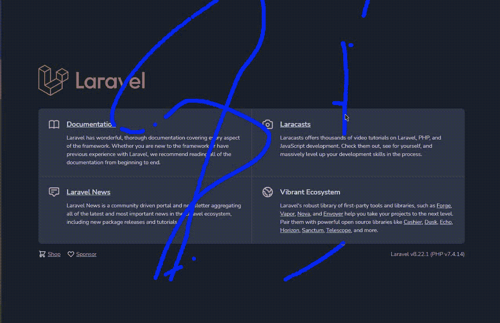

# Laravel 数据驱动策略#2:在应用程序中设置用户会话记录

> 原文：<https://blog.devgenius.io/laravel-data-driven-strategies-2-setup-user-session-recording-in-your-application-ca79de4acc8d?source=collection_archive---------3----------------------->


Kushagra Kevat 在 [Unsplash](https://unsplash.com?utm_source=medium&utm_medium=referral) 上拍摄的照片

> "不管你的界面有多酷，如果少一些就更好了."~艾兰·库伯

第一次读到这句话时，我觉得挺有趣的，因为每次你和你的 UX 设计师一起思考界面和功能之间的联系时，都需要很多东西，因为那个按钮，或者那个文本颜色，或者那个阴影……简而言之，如果你曾经做过这个，你就会明白是什么样子了！

真正的问题是，在设计 UX 的时候，你必须关注用户的行为……现实一点，你不是你的用户，甚至你的 UX 设计师也不是！你妥协了，这是事实，你必须接受。

显然，我并不是说你们的 UX 设计师不擅长他的工作，UX 的设计过程确实很困难，需要大量的创造力、研究和专注，但有时它可能需要外部的帮助。

而我说的外部是由你的用户构成的！你如何将你的用户纳入 UX 的设计中？这有点简单:**记录他们**。

如果你从未想过，这听起来可能很奇怪。现在我想你正在想，当你进入一个网站，移动你的鼠标，而另一边有人穿着睡衣看着你向下滚动你的最新消息时会发生什么，那是很尴尬的！当我谈到记录用户时，我指的是用户会话:从用户打开第一页到关闭第一页的整个时间间隔、鼠标移动和事件。观察用户在你的网站上的真实行为是很有趣的，因为它可以让你重新考虑很多东西。例如，它可以显示用户不使用某些功能，因为他们发现它们不容易访问，或者某个功能没有像您想象的那样被访问。

记录用户会话真的可以改变你投射 UX 的方式，所以让我们深入研究一下，看看它是如何工作的！

# 设置

许多在线服务允许你记录用户会话，有些是免费的，如 Yandex Metrika，有些是付费的，如 Hotjar，这完全取决于你想实现什么。在这里，我们将尝试基于 Cimice 构建我们的自定义屏幕记录解决方案，这是一个实验性的用户会话记录器，您可以在 [Github](https://github.com/artf/cimice) 上找到。

开始会话记录所需的一切都是在`dist/cimice.min.js`中可用的 cimice 构建。

为了帮助记录每个页面上的用户会话，只需创建一个自定义的刀片文件来嵌入所需的位置。`views/cimice_recording.blade.php`将包含:

```
<script *src*="{!! **asset('public/path/to/cimice.min.js')** !!}"></script>
```

这只是 cimice 脚本的导入，但也必须进行配置。
Github 的第二个例子非常简单，但对于测试目的或非常简单的情况，它只需*起作用*。

如果你放一个`console.log(movieJson)`来检查里面是什么，你会看到一个 JSON 对象包含:

*   **帧**:包含记录帧的数组。
*   **左侧**:左侧页面偏移量。
*   **顶部**:顶部页面偏移量。
*   **scrollX** :水平滚动偏移量。
*   **scrollY** :垂直滚动偏移量。
*   **场景**:当前屏幕上 Base64 编码的 HTML。

注意，如果 HTML 在同一个页面会话中发生变化，您应该调整上面的脚本来传递整个`movie`，而不是只发送`frames`。

如果您想将整个会话存储在您的数据库中，您必须通过相对迁移`php artisan make:migration create_session_recordings_table --create=session_recordings`使用合适的模型。该表应保持:

*   **session_id** :记录的会话。
*   **user_id** :你正在记录的用户(如果你想跟踪的话)。
*   **payload** :客户端发送的 JSON。
*   **previous _ session _ recordings _ id**:这将用于链接从客户端发送的每个记录。

```
$table->*id*();
$table->*string*('**session_id**');
$table->*foreignId*('**user_id**')
      ->*nullable*()
      ->*constrained*('**users**')
      ->*onUpdate*('**cascade**')
      ->*onDelete*('**cascade**');
$table->*json*('**payload**');
$table->*timestamps*();
```

我们希望通过一个模型来使用这些数据，所以只需`php artisan make:model SessionRecording`。我们还想确保每个属性都是可填充的。

现在我们必须准备一个 API 来存储我们的记录，从一个控制器`php artisan make:controller **SessionRecording\RecordingController**`和一个请求`php artisan make:request **SessionRecording\StoreRecordingRequest**`开始。

为了保持请求简单，我们只想在 JSON 请求到来时授权它，并将数据放入规则中。

```
*public* function **authorize**()
{return **$this->wantsJson()**;
}*public function* **rules**()
{
    return [
        **'frames' => 'required_if:scene,=,null|array',
        'left' => 'sometimes|nullable|numeric',
        'top' => 'sometimes|nullable|numeric',
        'scrollX' => 'sometimes|nullable|numeric',
        'scrollY' => 'sometimes|nullable|numeric',
        'scene' => 'sometimes|string',**
    ];
}
```

控制器逻辑也很简单，它只需要存储数据。

```
*public* function store(**StoreRecordingRequest** $request)
{
    $inputs = $request->only([**'frames','left','top','scrollX','scrollY','scene'**]); $user = $request->user(); **SessionRecording::create([
        'session_id' => $request->session()->getId(),
        'user_id' => $user ? $user->id : null,
        'payload' => $inputs
    ]);** return response()->json([
        'success' => true,
    ]);
}
```

所以`sendRecordings`终于可以调整了:

```
*function sendRecordings*(recordings) {
    *let* movieJson = JSON.stringify(recordings);
    *fetch*(
        '{!! route('recordings.store') !!}',
        {
            method: 'POST',
            body: movieJson,
            headers: {
                'Accept': 'application/json',
                'Content-Type': 'application/json',
                'X-CSRF-Token': '{!! csrf_token() !!}'
            },
        }
    ).then(console.log);
}
```

请注意，这只是示例代码，您可以根据自己的使用情况进行调整。

# 录音


[Fabrizio Verrecchia](https://unsplash.com/@fabrizioverrecchia?utm_source=medium&utm_medium=referral) 在 [Unsplash](https://unsplash.com?utm_source=medium&utm_medium=referral) 上拍摄的照片

现在记录用户会话非常容易，你只需要包含 cimice blade 文件，这就是诀窍！

```
*@include(***'cimice_recording'***)*
```

就这样，没别的事了！

# 透过镜子看戴夫

一旦一切都设置好了，你开始记录会话，你可能甚至想看看记录了什么。

请注意**这里我们不会构建一个仪表板**来查看会话和保护数据不被未授权用户查看，这取决于您。如果你想快速构建一个仪表板，你可以查看我的另一篇关于 Infyom 生成器的文章🤓！

这里我们想从数据库中收集数据。我之前概述的数据库结构非常简单，您可以按会话 ID 或用户 ID 对数据进行分组，或者您可以向数据库结构中添加其他数据，以便帮助您收集更专业的数据:例如，您可以添加用户代理、请求头，或者将这些数据与其他分析系统进行汇总，收集由您决定！

要获取以这种方式记录的每个会话，您只需:

```
*SessionRecording*::**distinct**('session_id')->get('session_id');
```

或者，如果您希望每个 ID 都与使用 MySQL/MariaDB 原始语法的会话相关，您可以通过以下方式获得它们:

```
*SessionRecording*::**groupBy**('session_id')->**selectRaw**('session_id, **GROUP_CONCAT(id)** AS ids')->get();
```

如果录制会话太多，您甚至可以使用 reduce 合并它们，如下所示:

```
$recordings = SessionRecording::**where**('session_id', '=', '*a_user_session_id*')
    ->**orderBy**('created_at')
    ->**get**()
    ->**reduce**(
        *function* ($rec, $v) {
            **if (empty($rec)) {
                $rec = json_decode($v->payload, true);
            } else {
                $rec['frames'] = array_merge($rec['frames'], json_decode($v->payload, true)['frames']);
            }
            return $rec;**
        },
        **[]**
    );
**usort($recordings['frames'], function ($v1, $v2) { return $v1['ts'] - $v2['ts']; });**
```

**这是如何工作的？**

*   您可以通过查询获得特定会话的所有记录
*   缩减器将开始使用空数组
*   第一次，缩减器会将有效负载放入缩减的数组中
*   每次从那里开始，新记录的帧将与以前的帧放在一起。
*   之后，为了安全起见，`usort`将根据`ts`属性(时间戳)对帧进行排序。

现在您已经有了所有的录音，您可以开始播放了！你可以把显示记录会话的代码放到一个单独的文件中，比如`cimice_play_script.blade.php`。

请注意，您可以调整播放器将如何显示每一个事件。注册的事件可以是`mousemove`、`click`、`scroll`、`resize`、`contextmenu`(您也可以监听任何其他事件，但是您必须调整初始配置)，因此使用`player.on('event', ...)`您可以编辑您的鼠标将如何出现。

一旦您将这个文件放入您的视图文件夹，您应该简单地做这样的事情:

```
<div id="player"></div>*@include(*'cimice_play_script'*)* <script>
    let **movieJSON** = **{!! json_encode($recordings) !!}**;
    *playMovie*(**movieJSON, document.getElementById('player')**);
</script>
```

这将在 div 中创建一个 iframe 作为参数传递，显示用户会话！



GIF 格式的用户会话示例

请记住，用户会话不一定是线性的:每个用户都可以切换到另一个窗口，等待几秒钟而不做任何事情，可以打开开发者标签，您无法准确预测用户将如何使用您的网站，但这是一个开始！

# 但是……隐私？

> 你的数据驱动策略的目的应该永远是给用户更好的服务！

你的用户不是你为了自己的目的需要利用的*东西*。如果你正在构建这样的东西，是因为你想改进你的服务，让它更有用，给你的用户更好的体验。你的 KPI 和指标的存在是因为你的用户，如果你想建立这样的东西，应该是因为你想给他们**一个他们可以使用和欣赏的服务。**

你的用户应该始终意识到你是如何收集和使用他们的数据的:记住在你的隐私政策中明确这种系统，在你不需要他们相关的地方匿名化数据，并在明确数据将被删除的地方保持和遵守数据保留政策。

现在该由你来创造伟大的东西了！🥂

请继续关注其他数据驱动的策略，如果你愿意，花一点时间️️to 留下评论，谈谈你如何做出由工具支持的数据驱动的决策！☕️