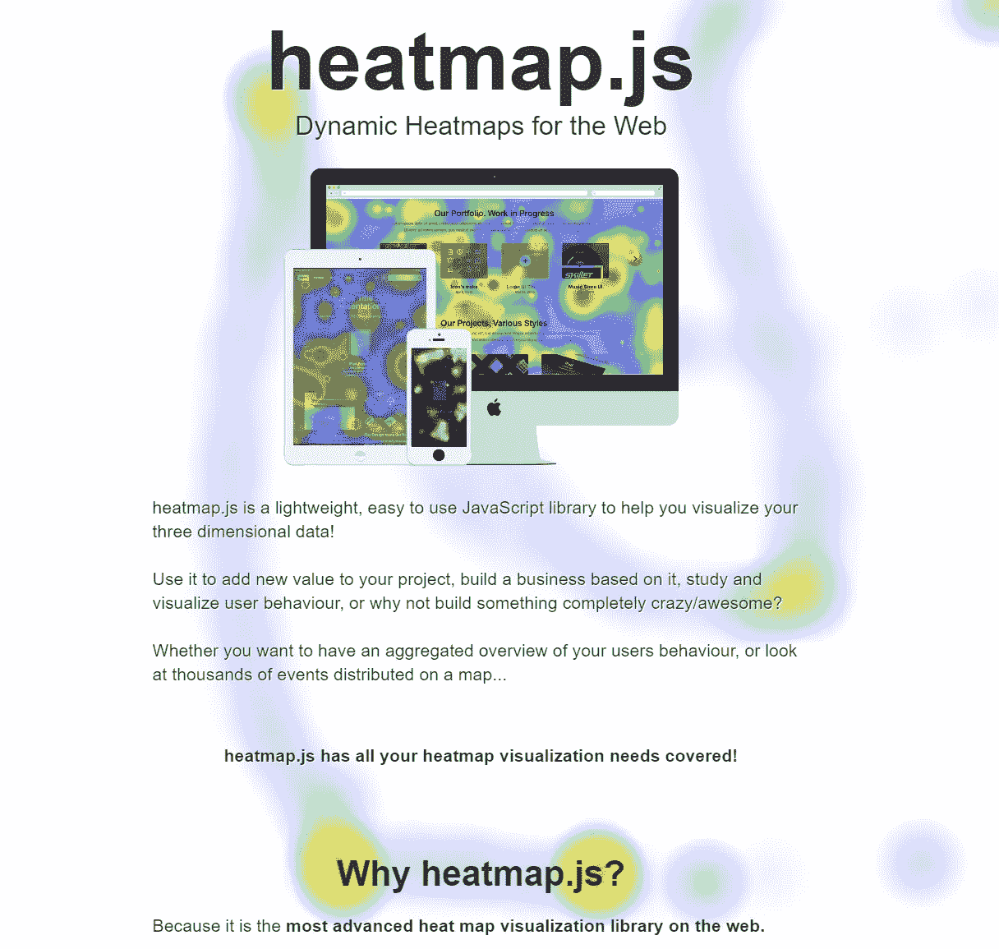

# Laravel 数据驱动策略#3:使用热图和点击地图提高 UX

> 原文：<https://blog.devgenius.io/laravel-data-driven-strategies-3-improve-your-ux-using-heat-maps-and-click-maps-b5f2d7370959?source=collection_archive---------2----------------------->


[HalGatewood.com](https://unsplash.com/@halacious?utm_source=medium&utm_medium=referral)在 [Unsplash](https://unsplash.com?utm_source=medium&utm_medium=referral) 上拍照

> “可用性是关于人们以及他们如何理解和使用事物，而不是技术”~史蒂夫·克鲁格

在我和我的一个队友的最后一次会议上，我们开始为一个项目构建一个原型。我们使用原型的目的是研究关于项目的特定目的的流程，收集和分析一些分析，并概述我们的下一步行动。作为一名开发人员，我想剖析原型，但显然，我的观点并不是唯一的。所以我问是否有人需要分析，答案是“*热图*？”。

# 什么是和使用什么

热图是一种可视化关于某人如何使用服务或功能的数据的方式。对于一个网页，热图可以显示用户如何移动鼠标或触摸页面。他们通常使用颜色梯度来表示数据。

**那么，我为什么需要热图呢？热图可以帮助 UX 分析师更好地了解用户关注的焦点。**

一个很棒的库是 [heatmap.js](https://www.patrick-wied.at/static/heatmapjs/) :开源，可以在 [Github](https://github.com/pa7/heatmap.js) 上获得，并有麻省理工学院的许可。



带有实时热图跟踪的 Heatmap.js 网站

# 构建您的第一个热图

Heatmap.js 有很棒的[文档](https://www.patrick-wied.at/static/heatmapjs/docs.html)，里面有很多例子。

要开始构建您的第一个热图，请访问网页并收集要绘制的事件。为了收集数据，我目前正在使用 RRWeb，因为我正在编写的包(你可以通过阅读[这个](https://kalizi.medium.com/laravel-package-development-part-1-projecting-a-user-session-recording-package-19f0a9868f0f)或查看 [Github](http://github.com/kalizi/laravel-spyhole) 了解更多信息)，或者你可以使用任何你喜欢的包，比如 *Cimice* (我在[写了一篇关于如何使用它的文章](https://kalizi.medium.com/laravel-data-driven-strategies-2-setup-user-session-recording-in-your-application-ca79de4acc8d)或者再次在 [Github](https://github.com/artf/cimice) 上查看)。

收集完所有数据后，以 heatmap.js 可用的方式对其进行格式化:

```
{
    x: 10,
    y: 10,
    value: 15
}
```

Heatmap.js 将根据坐标的点击数和点之间的接近度来构建热图。热图的好坏与数据密切相关，所以如果数据很少，你的地图不会真正反映用户的行为。

让我们看看它是如何工作的。该库可通过 CDN 或手动下载文件获得。

```
<script type="text/javascript" src="[https://cdn.jsdelivr.net/npm/heatmap.js@2.0.5/build/heatmap.min.js](https://cdn.jsdelivr.net/npm/heatmap.js@2.0.5/build/heatmap.min.js)"></script>
```

初始化非常简单:选择 heatmap 容器，轮询数据和格式，然后告诉 heatmap.js 构建地图！对于第一个例子，我将使用整个 DOM 作为地图容器:

```
<body style="min-height:100vh">
    <script type="text/javascript" src="[https://cdn.jsdelivr.net/npm/heatmap.js@2.0.5/build/heatmap.min.js](https://cdn.jsdelivr.net/npm/heatmap.js@2.0.5/build/heatmap.min.js)"></script> <script type="text/javascript">
      **const config = {
        container: document.documentElement,
      };
      const heatmap = h337.create(config);
      // Set data here**
    </script>
</body>
```

现在收集数据，您可以从数据库(或任何数据源)轮询它们。我使用收集大量数据的 RRWeb，所以它们必须是未序列化的，并且像前面指出的那样结构化。我只有一些数据，所以我把处理放在前端:

```
const rawData = /* data from RRWeb as array */;
const data = 
 rawData
  .filter(v => v.type === 3 && v.data.hasOwnProperty('positions'))
  .map(v => v.data.positions)
  .flat()
  .map(v => { return {x: v.x, y: v.y, value: 1}; })
  .reduce((acc, v) => {
      let position = acc.filter(el => el.x === v.x && el.y === v.y);
      if (position.length > 0) {
          position = position[0];
          let idx = acc.indexOf(position);
          ++position.value;
          acc.splice(idx, 1, position);
      } else {
          acc.push(v);
      }
      return acc;
  }, []);
```

出于测试目的，我非常快速地编写了这段代码，所以它根本没有经过优化。RRWeb 存储大量数据，因此:

*   *过滤器*为类型 3 过滤器用于鼠标事件保持位置，
*   *地图*取位置，
*   一个记录可以保存多个位置，所以只需 *flat，*
*   *映射*将内容重新格式化为所需的格式，
*   *减少*具有相同位置数据的聚合记录，更新它们的值。

一旦有了数据，您只需:

```
**heatmap.setData({
    min: 0, 
    max: 100,
    data: data
});**
```

我的测试数据集很小，只有 2370 条记录(几分钟的用户会话),所以在这种情况下,`min`和`max`值很小。


生成的热图

这似乎完全没有意义。但是，如果你在收集数据的页面上重复这一点，就开始有意义了。


生成的热图

请记住，要真实再现用户行为，您应该以正确的比例报告数据:如果您想要构建 1920x1080 的热图，而您的数据是 1280x720，您应该考虑使用 1.5 倍的缩放系数，或者基于数据构建不同的热图。

# 用数据改善您的数据驱动型决策

我们只是对这个热图略知一二，您可以将它们与会议记录结合使用，将它们导出为图像或 PDF，将它们与其他分析结合使用，以便更好地了解系统。您甚至可以跟踪任何页面变化如何反映用户行为，检查热图随时间的变化！

现在该由你来创造伟大的东西了！🥂

请继续关注其他数据驱动的策略，如果你愿意，花一点时间️️to 留下评论，谈谈你如何做出由工具支持的数据驱动的决策！☕️