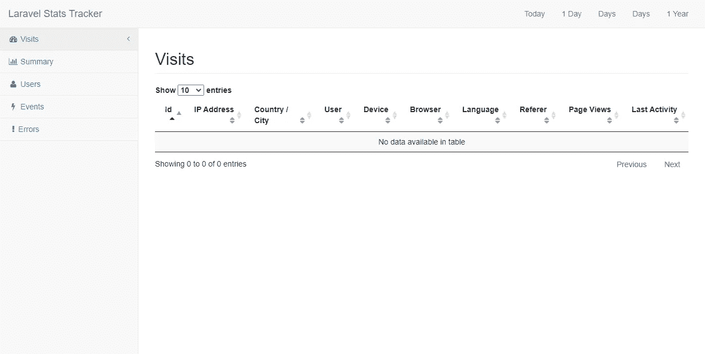
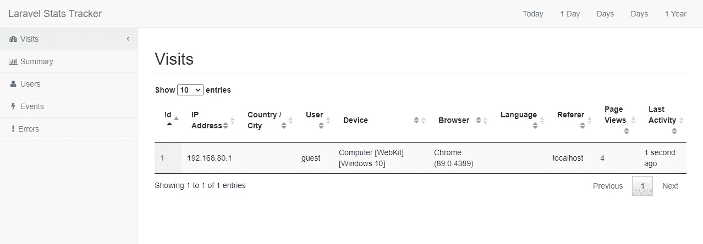
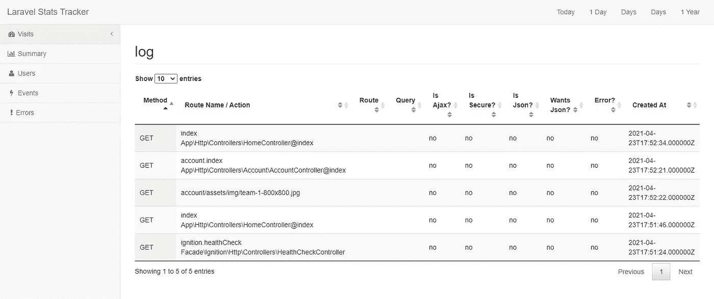

# Laravel 数据驱动策略#4:用户导航跟踪和漏斗

> 原文：<https://blog.devgenius.io/laravel-data-driven-strategies-4-user-navigation-tracking-and-funnel-16fe4c0760b7?source=collection_archive---------3----------------------->


照片由[香农波特](https://unsplash.com/@cifilter?utm_source=medium&utm_medium=referral)在 [Unsplash](https://unsplash.com?utm_source=medium&utm_medium=referral) 拍摄

> “当组织关注业务或技术，但不关注客户或用户体验时，就会出现无意的设计。结果是出现了一种通常并不愉快的体验。”Jared M. Spool

设计一个大系统可能会导致意想不到的行为。随着功能的增加，它们之间的联系可能会变弱，导致不必要的和不一致的用户体验，损害您的平台使用。

在不知道用户如何使用你的网站的情况下，很少会注意到不想要的行为，这就是分析加入聚会的地方。

许多人依赖于[谷歌分析](https://analytics.google.com/)，它无需你写一行代码就能给出许多报告，其他人依赖于 [Cloudflare](https://www.cloudflare.com/) ，它像 CDN 一样记录所有的流量，但是如果你想自己了解用户行为呢？

# 安装您的个人分析系统

有许多为 Laravel 构建的包可以帮助您更快更容易地构建应用程序。我在这里选择的包是 [pragmarx/tracker](https://github.com/antonioribeiro/tracker) 。

> S 将用户跟踪信息存储在索引化和规范化的数据库表中，可以减少磁盘空间的浪费，并且便于提取有关您的应用程序和业务的有价值信息~跟踪器

首先，与其他所有软件包一样，只需:

```
> **composer require pragmarx/tracker**
```

如果您的 Laravel 安装相当新，您会看到此时您的应用程序已经知道这个包:

```
Discovered Package: **pragmarx/tracker**
```

现在发布与这个包相关的所有内容

```
> **php artisan vendor:publish --provider="PragmaRX\Tracker\Vendor\Laravel\ServiceProvider"**Copied File [/vendor/pragmarx/tracker/src/config/config.php] To [/config/tracker.php]
Copied Directory [/vendor/pragmarx/tracker/src/migrations] To [/database/migrations]
*Publishing complete.*
```

这将发布 34 个迁移文件(将来可能会更多)和一个配置文件。

现在只需通过配置文件(`config/tracker.php`)启用跟踪器:

```
'enabled' => true,
```

跟踪器配置文件也有一个配置文件供数据库连接使用(来自`config/database.php`)，它的缺省值是`tracker`，所以你必须添加一个连接。我将重用我的 MySQL 连接，因此它将成为

```
'connection' => 'mysql',
```

确保 MySQL 不处于数据库配置中 connections 键的严格模式:

```
'connections' => [
 // ...
 'mysql' => [
  'driver' => 'mysql',
  'url' => env('DATABASE_URL'),
  'host' => env('DB_HOST', '127.0.0.1'),
  'port' => env('DB_PORT', '3306'),
  'database' => env('DB_DATABASE', 'forge'),
  'username' => env('DB_USERNAME', 'forge'),
  'password' => env('DB_PASSWORD', ''),
  // ...
  **'strict' => false,**
  // ...
 ],
 // ...
],
```

最后，迁移所有内容:

```
> php artisan migrate
[ ... *suppressed output, trust me, it's too long* ... ]
```

# 配置跟踪器

> 默认情况下，所有功能都被禁用

追踪器是非常可配置的，你可以启用/禁用任何你想要的:

*   隐藏物
*   机器人跟踪
*   记录不可跟踪的会话
*   HTTP 日志记录
*   控制台命令日志记录
*   SQL 查询日志记录
*   SQL 查询绑定日志记录
*   事件
*   地理信息系统
*   用户代理
*   用户
*   设备
*   语言
*   HTTP 推荐人
*   小路
*   HTTP 查询
*   路线
*   例外
*   统计面板

# 统计面板

Tracker 有一个统计面板，只需几个步骤即可完成:

```
> git clone https://github.com/BlackrockDigital/startbootstrap-sb-admin-2.git public/templates/sb-admin-2
> cd public/templates/sb-admin-2
> git checkout tags/v3.3.7+1
```

显然……在`config/tracker.php`启用它

```
'stats_panel_enabled' => true,
```

你甚至可以调整它的基本路径

```
'stats_base_uri' => **'stats'**,
```

只有经过身份验证的用户才能看到统计信息，但前提是您通过 mutator 定义一个假的 admin 属性来授权他们:

```
public function getIsAdminAttribute(): bool
{
    return true; // *your logic here*
}
```

现在打开你的`/stats`



统计页面

参观之后…



访问后的统计页面

点击一个 ID，你可以看到完整的会话



用户访问

基本上…仅此而已！

# GeoIP？


照片由 [Matthijs van Heerikhuize](https://unsplash.com/@heerikhuize?utm_source=medium&utm_medium=referral) 在 [Unsplash](https://unsplash.com?utm_source=medium&utm_medium=referral) 拍摄

> GeoIP 是指通过识别计算机终端的 IP 地址来定位该终端的地理位置的方法。

使用 GeoIP 可以帮助您通过访问者的 IP 地址来定位他们。GeoIP 本地化非常容易实现:

```
composer require "geoip2/geoip2":"~2.0"
```

软件包安装完成后，您可以通过`config/tracker.php`来启用它:

```
'log_geoip' => true,
```

# 现在呢？

现在你所有的数据都在那里，你只需要分析、研究和组合它们，就能了解你的用户是如何使用网站的。如果你想知道更多，你可以随时自己查询数据，追踪器是由 13 个表格组成，你可以通过自己挖掘数据库结构或阅读文档来组合！

现在该由你来创造伟大的东西了！🥂

请继续关注其他数据驱动的策略，如果你愿意，花一点时间️️to 留下评论，谈谈你如何做出由工具支持的数据驱动的决策！☕️