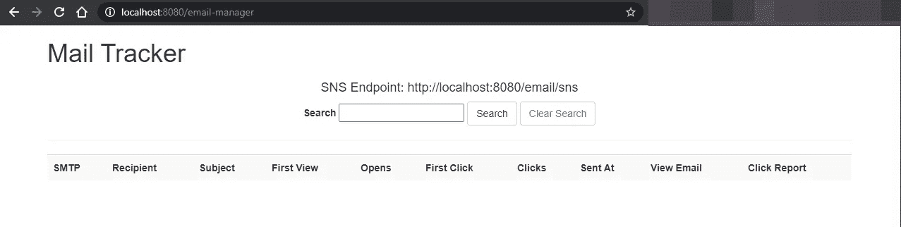

# Laravel 数据驱动策略#5:邮件跟踪，他们读过你的邮件吗？

> 原文：<https://blog.devgenius.io/laravel-data-driven-strategies-5-email-tracking-did-they-read-your-emails-da86da049ec6?source=collection_archive---------1----------------------->


照片由[索伦·费伊萨](https://unsplash.com/@solenfeyissa?utm_source=medium&utm_medium=referral)在 [Unsplash](https://unsplash.com?utm_source=medium&utm_medium=referral) 拍摄

> “电子邮件有一种许多渠道没有的能力:大规模地创造有价值的、个性化的接触”~戴维·纽曼

电子邮件是一种与你的受众联系的神奇方式，很多时候是一个企业与客户联系的关键。电子邮件是定制的，是彩色的，是强大的，是专业的，有时甚至是情绪化的。但是……你想过如果你读了吗？

许多人依赖于托管电子邮件服务，这些服务可以为你提供关于你的电子邮件的所有统计数据，但很多时候，这些都是付费服务，要建立一个小型服务，你的预算可能不符合你的需求。

因此，在本文中，我们将为您的 laravel 项目构建一个电子邮件跟踪器！

# 装置

我尝试了许多软件包，我擅长的是*[*jdavidbakr/mail-tracker*](https://github.com/jdavidbakr/mail-tracker)。*

> *“MailTracker 会连接到 Laravel 发出的所有电子邮件，并在其中注入一个跟踪代码。它还会将呈现的电子邮件存储在数据库中。还有查看已发邮件的界面。”~邮件跟踪器*

*要开始，只需:*

```
*composer require jdavidbakr/mail-tracker*
```

*拉弗尔会发现这个包裹:*

```
*Discovered Package: **jdavidbakr/mail-tracker***
```

*现在发布与该包相关的所有内容*

```
*> **php artisan vendor:publish --provider="jdavidbakr\MailTracker\MailTrackerServiceProvider"**Copied File [/vendor/jdavidbakr/mail-tracker/config/mail-tracker.php] To [/config/mail-tracker.php]
Copied Directory [/vendor/jdavidbakr/mail-tracker/src/views] To [/resources/views/vendor/emailTrakingViews]
*Publishing complete.**
```

*这将发布配置文件和默认视图(我们将在后面得到这些)。*

*这个包需要在数据库中存储东西，所以我们应该执行它的迁移*

```
*> **php artisan migrate** *Migrating: 2016_03_01_193027_create_sent_emails_table
Migrated:  2016_03_01_193027_create_sent_emails_table (22.75ms)
Migrating: 2016_09_07_193027_create_sent_emails_Url_Clicked_table
Migrated:  2016_09_07_193027_create_sent_emails_Url_Clicked_table (40.97ms)
Migrating: 2016_11_10_213551_add-message-id-to-sent-emails-table
Migrated:  2016_11_10_213551_add-message-id-to-sent-emails-table (3.18ms)
Migrating: 2020_04_15_112152_add_message_id_index_to_sent_emails_table
Migrated:  2020_04_15_112152_add_message_id_index_to_sent_emails_table (6.74ms)
Migrating: 2021_02_10_083945_add_sender_email_and_name_to_sent_emails_table
Migrated:  2021_02_10_083945_add_sender_email_and_name_to_sent_emails_table (3.95ms)
Migrating: 2021_02_10_095634_add_first_open_and_first_click_columns
Migrated:  2021_02_10_095634_add_first_open_and_first_click_columns (4.72ms)**
```

*为了证明这一点非常简单，它已经准备好了！*

*该包将注册以下路由*

```
*GET|HEAD  email-manager ................. mailTracker_Index
GET|HEAD  email-manager/clear-search .... mailTracker_ClearSearch
POST      email-manager/search .......... mailTracker_Search
GET|HEAD  email-manager/show-email/{id} . mailTracker_ShowEmail
GET|HEAD  email-manager/smtp-detail/{id}. mailTracker_SmtpDetail
GET|HEAD  email-manager/url-detail/{id} . mailTracker_UrlDetail
GET|HEAD  email/l/{url}/{hash} .......... mailTracker_l
GET|HEAD  email/n ....................... mailTracker_n
POST      email/sns ..................... mailTracker_SNS
GET|HEAD  email/t/{hash} ................ mailTracker_t*
```

*要访问管理器，您应该注册一个名为`see-sent-emails`的门。出于测试目的，我只允许`AuthServiceProvider`中的每个人:*

```
*Gate::define('see-sent-emails', function ($user) {
    **return true;**
});*
```

*很明显，你会放一些自定义规则，比如`return **$user->is_admin**;`或者类似的东西。*

*然后访问`/email-manager`你就会明白了*

**

*邮件跟踪器*

# *你好世界*

*最简单的方法是在某个地方设置一个只显示“Hello world”的视图。*

```
*Mail::*send*('**mails.test**', [], *function* ($mail) {
    $mail->to('thisisa@test.com')->subject('Does this work?');
});*
```

*我目前正在使用 Mailhog，所以我看到了这封邮件*

**

*邮件猪*

*刷新追踪器，你会看到这封邮件有 0 次打开和 0 次点击*

**

*邮件跟踪器*

*现在，回到 mailhog，打开电子邮件，刷新跟踪器，你就可以做到这一点*

**

*他们已经看过邮件了！*

*用户看到了电子邮件，你会看到他第一次看到电子邮件的时间，如果有些东西是可点击的，比如行动号召，你会看到用户什么时候到达那个行动号召。*

# *但是…怎么做？*

*让我们看看邮件的来源*

```
*Hello World *****
```

*刀片刚刚有一个“Hello World”，img 标签发挥了神奇的作用，因为图像实际上总是加载在电子邮件中(如果它们不被视为垃圾邮件并被提前阻止)。*

*如果您访问该 URL，您会看到一个 1x1px 的图像:*

**

*神奇的图像*

*你会注意到你的邮件中有一个死角吗？*

# *那么…他们看了你的邮件吗？*

*邮件真的很强大。当我收到一封为我设计的、包含我喜欢接收的内容的邮件时，我会花上几分钟，因为我认为它是值得的，即使它背后隐藏着一种算法，所以如果你是手动、编程或以任何其他方式创建电子邮件，请确保它们是值得的！*

*现在该由你来创造伟大的东西了！🥂*

*请继续关注其他数据驱动的策略，如果你愿意，花一点时间️️to 留下评论，谈谈你如何做出由工具支持的数据驱动的决策！☕️*