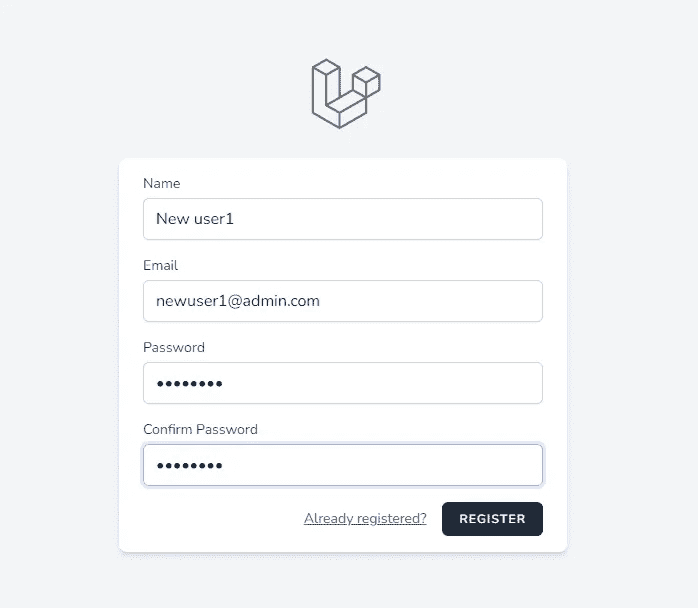
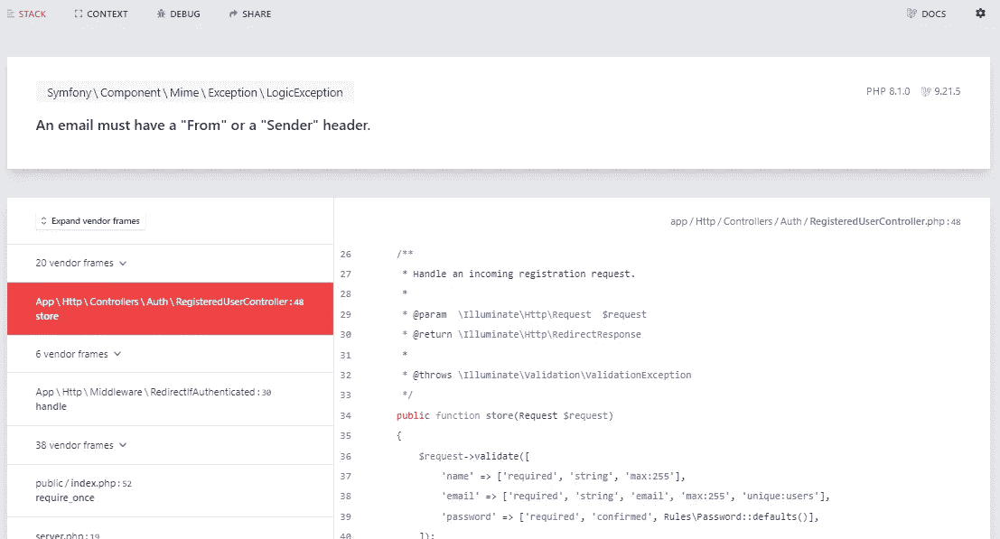
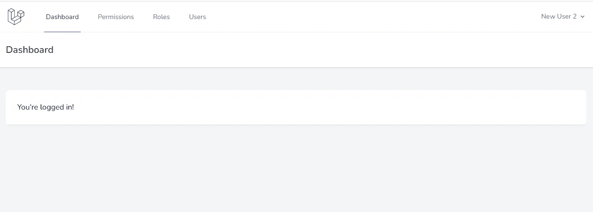
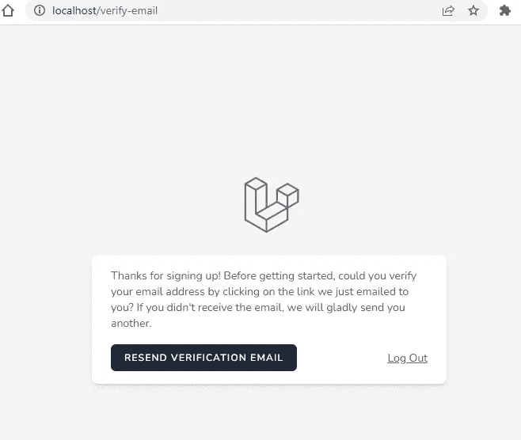
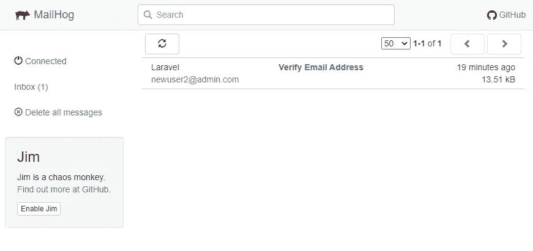
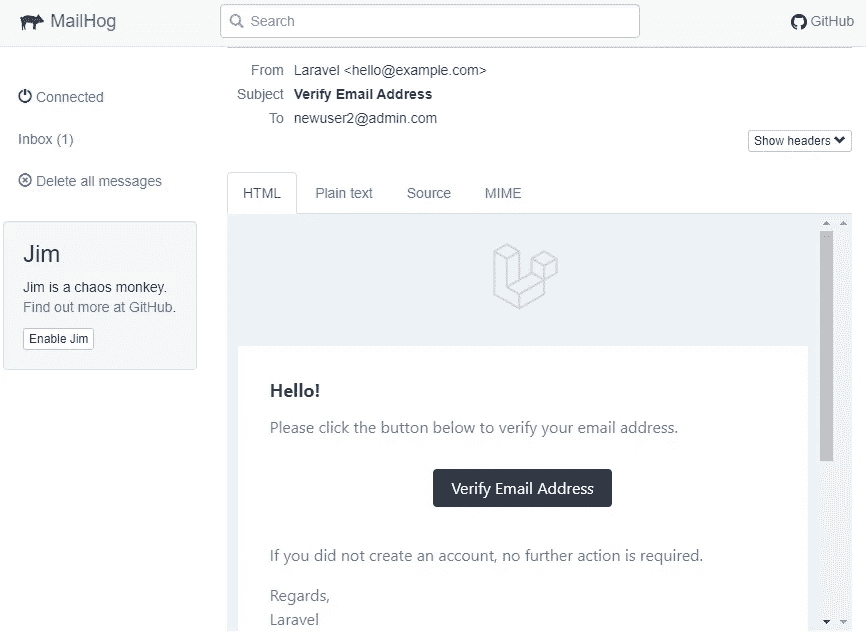
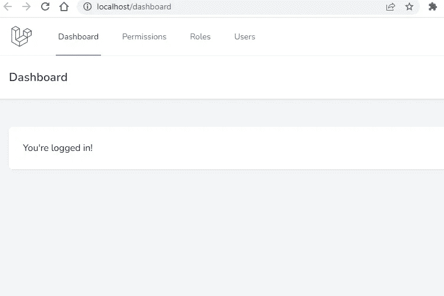

# 如何启用 Laravel 电子邮件验证和自定义电子邮件模板

> 原文：<https://blog.devgenius.io/laravel-enable-user-registration-email-verification-and-customize-email-templates-b994299ab27d?source=collection_archive---------1----------------------->

## Laravel 从头开始创建管理面板——第 15 部分

在的[基本 Laravel 管理面板](https://github.com/balajidharma/basic-laravel-admin-panel)中，我们实现了大部分基本功能。在这篇文章中，我们将启用电子邮件验证和电子邮件模板定制。

Laravel 提供用户注册后发送和验证邮件验证的内置服务。

*   1.配置邮件
*   2.在模型中启用电子邮件验证
*   3.添加`verified`中间件
*   4.使用 **MailHog** 进行电子邮件验证
*   5.电子邮件内容定制
*   6.自定义电子邮件模板

## 1.配置邮件

Laravel 邮件配置在`config/mail.php`路径中可用。Laravel 提供了一个干净、简单的电子邮件 API，由流行的 Symfony Mailer 组件提供支持。

通常，我们为每个环境使用不同的邮件服务。因此，在。环境文件

```
MAIL_MAILER=smtp
MAIL_HOST=mailhog
MAIL_PORT=1025
MAIL_USERNAME=null
MAIL_PASSWORD=null
MAIL_ENCRYPTION=null
MAIL_FROM_ADDRESS=null
MAIL_FROM_NAME="${APP_NAME}"
```

在[中，幼帆](https://laravel.com/docs/9.x/sail#previewing-emails)配置有麦猪。我们将在电子邮件验证设置后看到邮件猪。

## 2.在模型中启用电子邮件验证

为了启用电子邮件验证，我们需要在我们的用户模型中实现`Illuminate\Contracts\Auth\MustVerifyEmail`

`app/Models/User.php`

```
<?phpnamespace App\Models;use Illuminate\Contracts\Auth\MustVerifyEmail;
use Illuminate\Database\Eloquent\Factories\HasFactory;
use Illuminate\Foundation\Auth\User as Authenticatable;
use Illuminate\Notifications\Notifiable;
use Laravel\Sanctum\HasApiTokens;
use Spatie\Permission\Traits\HasRoles;class User extends Authenticatable implements MustVerifyEmail
{
    use HasApiTokens, HasFactory, Notifiable, HasRoles;

    // ...
```

现在注册成为新用户



注册后，我得到了以下错误



这个问题是由于`MAIL_FROM_ADDRESS`是空的。因为我们把我们的 Laravel 8 升级到了 Laravel 9。在 Laravel 9 中，这个`MAIL_FROM_ADDRESS`不应该为空。所以在。包封/包围（动词 envelop 的简写）

```
MAIL_FROM_ADDRESS="hello@example.com"
```

更新后，我可以注册并重定向到仪表板。



但是用户没有被限制在没有电子邮件验证的情况下查看页面。下一步我们解决这个问题。

## 3.添加`verified`中间件

现在，我们将向所有经过认证的路由添加`verified`中间件

`routes/web.php`

```
Route::get('/dashboard', function () {
    return view('dashboard');
})->middleware(['auth', 'verified'])->name('dashboard');
```

`routes/admin.php`

```
<?phpRoute::group([
    'namespace' => 'App\Http\Controllers\Admin',
    'prefix' => 'admin',
    'middleware' => ['auth', 'verified'],
], function () { //.....
```

添加中间件后，用户被重定向到电子邮件验证待定页面。此外，该页面还提供了重新发送验证电子邮件的选项。



## 4.与 **MailHog** 的邮件验证



当 Sail 运行时，在 [http://localhost:8025/](http://localhost:8025/) 上访问您的 MailHog

T4 邮件猪是一款针对本地环境下的开发者的电子邮件测试工具。

在 MailHog 中检查收到的电子邮件。现在，单击电子邮件验证链接。验证后用户被允许进入`verified`页面。



## 5.电子邮件内容定制

Laravel 提供了修改[验证邮件内容](https://laravel.com/docs/9.x/verification#verification-email-customization)的选项。在`App\Providers\AuthServiceProvider`中需要从 boot 方法中调用`toMailUsing`方法。

```
use Illuminate\Auth\Notifications\VerifyEmail;
use Illuminate\Notifications\Messages\MailMessage;

/**
 * Register any authentication / authorization services.
 *
 * @return void
 */
public function boot()
{
    // ...

    VerifyEmail::toMailUsing(function ($notifiable, $url) {
        return (new MailMessage)
            ->subject('Verify Email Address')
            ->line('Click the button below to verify your email address.')
            ->action('Verify Email Address', $url);
    });
}
```

## 6.自定义电子邮件模板

您可以通过发布通知包的资源来修改 HTML 和纯文本模板。运行以下命令将模板复制到您的视图中。

```
php artisan vendor:publish --tag=laravel-notifications
```

邮件通知模板将被复制到`resources/views/vendor/notifications`文件夹。

Laravel 管理面板在[https://github.com/balajidharma/basic-laravel-admin-panel](https://github.com/balajidharma/basic-laravel-admin-panel)上可用。安装管理面板并分享您的反馈。

感谢您的阅读。

敬请关注更多内容！

*跟我来*[***balajidharma.medium.com***](https://balajidharma.medium.com/)。

上一部分—第 14 部分:[从 Laravel Mix 迁移到 Vite](https://balajidharma.medium.com/how-to-migrating-from-laravel-mix-to-vite-fbb912237844)

下一部分—第 16 部分:[如何使用 Laravel Debugbar](/how-to-debug-laravel-app-using-laravel-debugbar-ec51a8587786) 调试 Laravel App